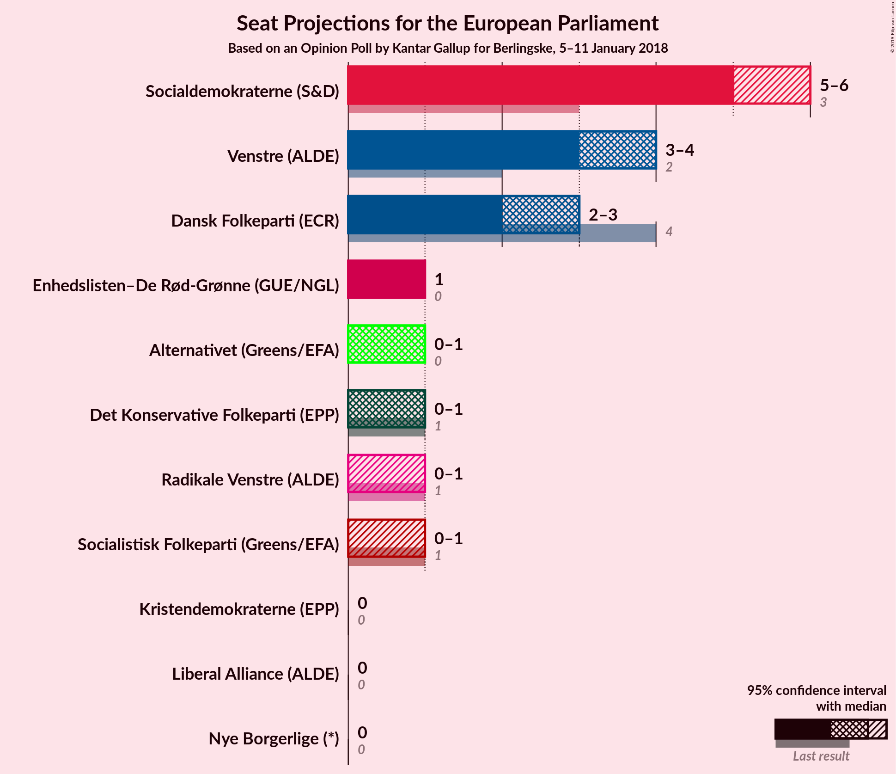
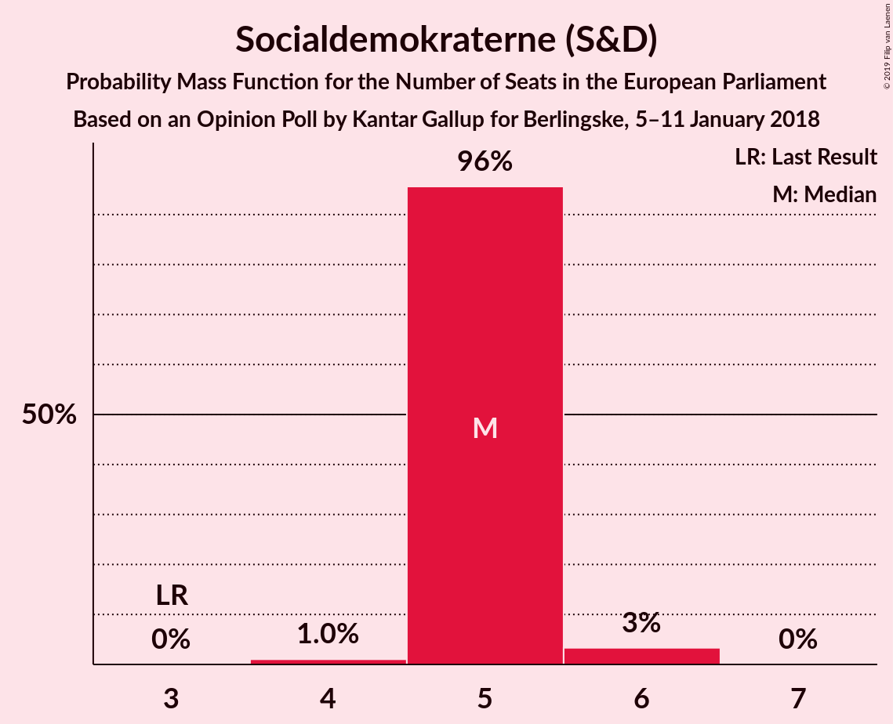
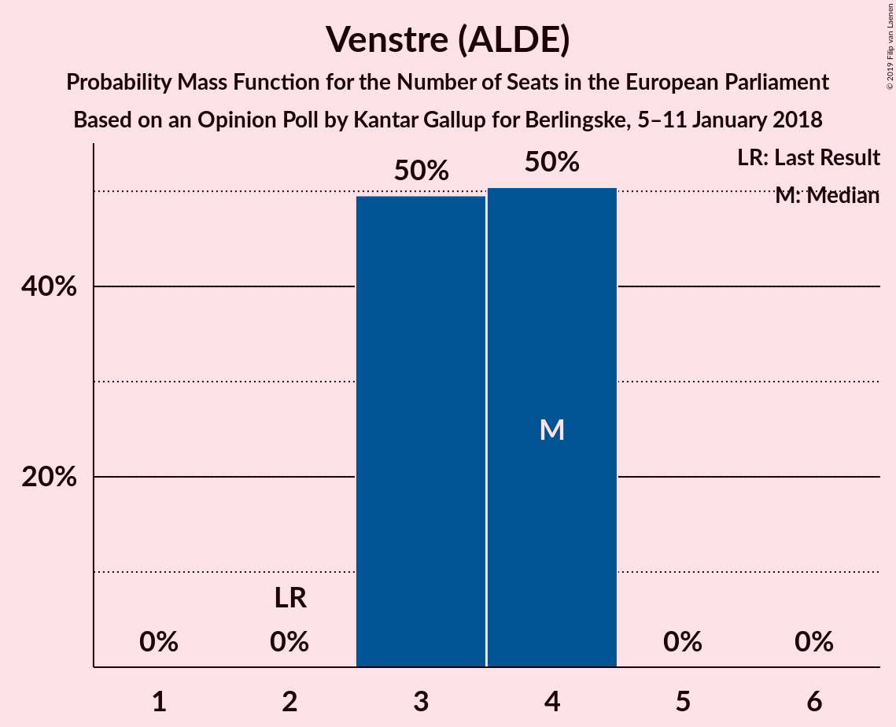
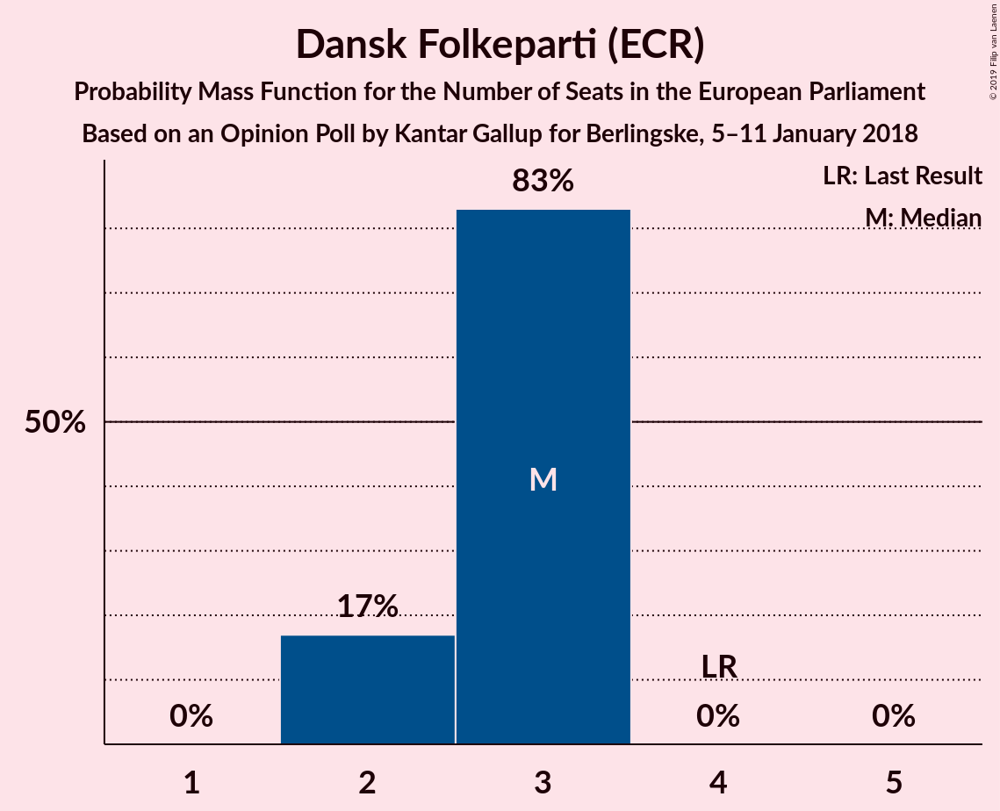
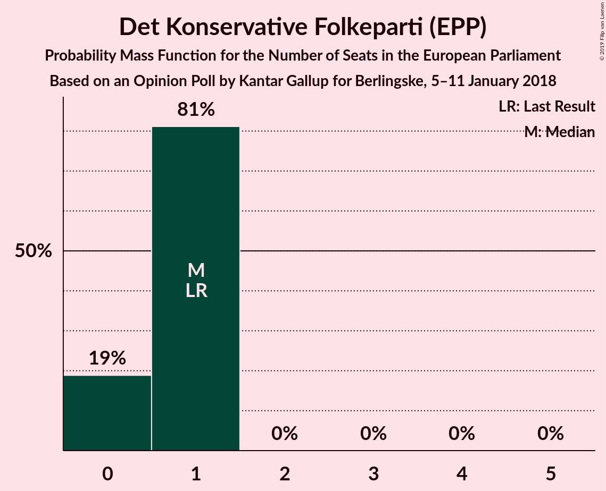
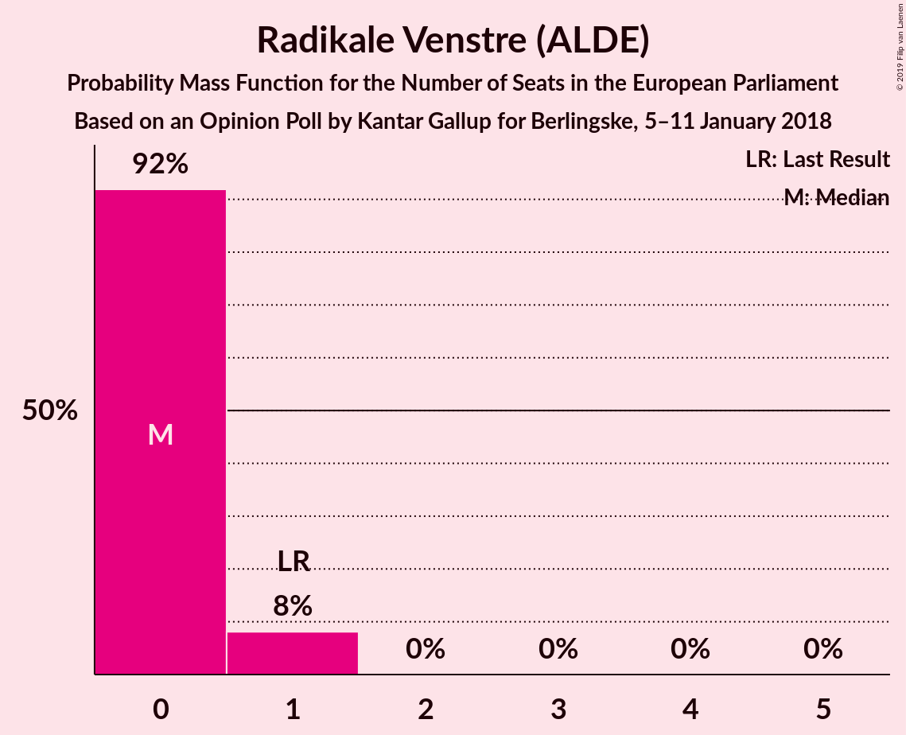
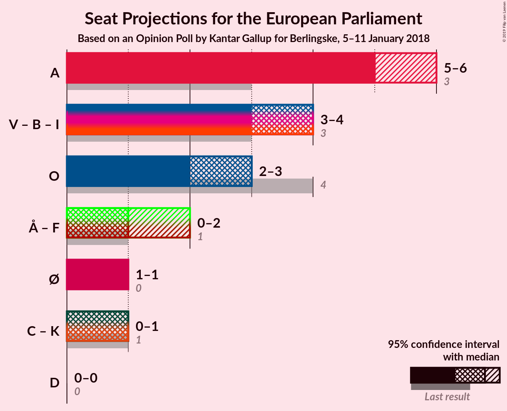

# Opinion Poll by Kantar Gallup for Berlingske, 5–11 January 2018

<a href="#voting-intentions">Voting Intentions</a> | <a href="#seats">Seats</a> | <a href="#coalitions">Coalitions</a> | <a href="#technical-information">Technical Information</a>

## Voting Intentions

### Confidence Intervals

| Party | Last Result | Poll Result | 80% Confidence Interval | 90% Confidence Interval | 95% Confidence Interval | 99% Confidence Interval |
|:-----:|:-----------:|:-----------:|:-----------------------:|:-----------------------:|:-----------------------:|:-----------------------:|
| Socialdemokraterne (S&D) | 19.1% | 28.5% | 27.0–30.0% |26.6–30.4% |26.3–30.8% |25.6–31.5% |
| Venstre (ALDE) | 16.7% | 21.5% | 20.2–22.9% |19.8–23.3% |19.5–23.6% |18.9–24.3% |
| Dansk Folkeparti (ECR) | 26.6% | 15.9% | 14.8–17.1% |14.4–17.5% |14.1–17.8% |13.6–18.4% |
| Enhedslisten–De Rød-Grønne (GUE/NGL) | 0.0% | 8.3% | 7.4–9.3% |7.2–9.5% |7.0–9.8% |6.6–10.3% |
| Det Konservative Folkeparti (EPP) | 9.1% | 5.9% | 5.2–6.8% |5.0–7.0% |4.8–7.2% |4.5–7.7% |
| Alternativet (Greens/EFA) | 0.0% | 5.1% | 4.4–5.9% |4.2–6.1% |4.1–6.3% |3.8–6.7% |
| Socialistisk Folkeparti (Greens/EFA) | 10.9% | 4.7% | 4.1–5.5% |3.9–5.7% |3.7–5.9% |3.5–6.3% |
| Radikale Venstre (ALDE) | 6.5% | 4.4% | 3.8–5.2% |3.6–5.4% |3.5–5.6% |3.2–6.0% |
| Liberal Alliance (ALDE) | 2.9% | 3.4% | 2.9–4.1% |2.7–4.3% |2.6–4.4% |2.4–4.8% |
| Nye Borgerlige (*) | 0.0% | 1.5% | 1.2–2.0% |1.1–2.1% |1.0–2.2% |0.9–2.5% |
| Kristendemokraterne (EPP) | 0.0% | 0.7% | 0.5–1.1% |0.4–1.2% |0.4–1.3% |0.3–1.5% |

*Note:* The poll result column reflects the actual value used in the calculations. Published results may vary slightly, and in addition be rounded to fewer digits.

## Seats

### Confidence Intervals

| Party | Last Result | Median | 80% Confidence Interval | 90% Confidence Interval | 95% Confidence Interval | 99% Confidence Interval |
|:-----:|:-----------:|:------:|:-----------------------:|:-----------------------:|:-----------------------:|:-----------------------:|
| <a href="#socialdemokraterne-(s&d)">Socialdemokraterne (S&D)</a> | 3 | 4 | 4–6 |4–6 |4–6 |4–6 |
| <a href="#venstre-(alde)">Venstre (ALDE)</a> | 2 | 4 | 4 |4 |4 |3–4 |
| <a href="#dansk-folkeparti-(ecr)">Dansk Folkeparti (ECR)</a> | 4 | 3 | 2–3 |2–3 |2–3 |2–3 |
| <a href="#enhedslisten–de-rød-grønne-(gue/ngl)">Enhedslisten–De Rød-Grønne (GUE/NGL)</a> | 0 | 1 | 1 |1 |1–2 |1–2 |
| <a href="#det-konservative-folkeparti-(epp)">Det Konservative Folkeparti (EPP)</a> | 1 | 1 | 0–1 |0–1 |0–1 |0–1 |
| <a href="#alternativet-(greens/efa)">Alternativet (Greens/EFA)</a> | 0 | 1 | 0–1 |0–1 |0–1 |0–1 |
| <a href="#socialistisk-folkeparti-(greens/efa)">Socialistisk Folkeparti (Greens/EFA)</a> | 1 | 0 | 0 |0 |0 |0 |
| <a href="#radikale-venstre-(alde)">Radikale Venstre (ALDE)</a> | 1 | 0 | 0 |0–1 |0–1 |0–1 |
| <a href="#liberal-alliance-(alde)">Liberal Alliance (ALDE)</a> | 0 | 0 | 0 |0 |0 |0 |
| <a href="#nye-borgerlige-(*)">Nye Borgerlige (*)</a> | 0 | 0 | 0 |0 |0 |0 |
| <a href="#kristendemokraterne-(epp)">Kristendemokraterne (EPP)</a> | 0 | 0 | 0 |0 |0 |0 |

### Socialdemokraterne (S&D)

*For a full overview of the results for this party, see the [Socialdemokraterne (S&D)](party-socialdemokraternesd.html) page.*

| Number of Seats | Probability | Accumulated | Special Marks |
|:---------------:|:-----------:|:-----------:|:-------------:|
| 3 | 0% | 100% | Last Result |
| 4 | 67% | 100% | Median |
| 5 | 15% | 33% |  |
| 6 | 18% | 18% |  |
| 7 | 0% | 0% |  |

### Venstre (ALDE)

*For a full overview of the results for this party, see the [Venstre (ALDE)](party-venstrealde.html) page.*

| Number of Seats | Probability | Accumulated | Special Marks |
|:---------------:|:-----------:|:-----------:|:-------------:|
| 2 | 0% | 100% | Last Result |
| 3 | 0.5% | 100% |  |
| 4 | 99.5% | 99.5% | Median |
| 5 | 0% | 0% |  |

### Dansk Folkeparti (ECR)

*For a full overview of the results for this party, see the [Dansk Folkeparti (ECR)](party-danskfolkepartiecr.html) page.*

| Number of Seats | Probability | Accumulated | Special Marks |
|:---------------:|:-----------:|:-----------:|:-------------:|
| 2 | 22% | 100% |  |
| 3 | 78% | 78% | Median |
| 4 | 0% | 0% | Last Result |

### Enhedslisten–De Rød-Grønne (GUE/NGL)

*For a full overview of the results for this party, see the [Enhedslisten–De Rød-Grønne (GUE/NGL)](party-enhedslisten–derød-grønneguengl.html) page.*

| Number of Seats | Probability | Accumulated | Special Marks |
|:---------------:|:-----------:|:-----------:|:-------------:|
| 0 | 0% | 100% | Last Result |
| 1 | 96% | 100% | Median |
| 2 | 4% | 4% |  |
| 3 | 0% | 0% |  |

### Det Konservative Folkeparti (EPP)

*For a full overview of the results for this party, see the [Det Konservative Folkeparti (EPP)](party-detkonservativefolkepartiepp.html) page.*

| Number of Seats | Probability | Accumulated | Special Marks |
|:---------------:|:-----------:|:-----------:|:-------------:|
| 0 | 28% | 100% |  |
| 1 | 72% | 72% | Last Result, Median |
| 2 | 0% | 0% |  |

### Alternativet (Greens/EFA)

*For a full overview of the results for this party, see the [Alternativet (Greens/EFA)](party-alternativetgreensefa.html) page.*

| Number of Seats | Probability | Accumulated | Special Marks |
|:---------------:|:-----------:|:-----------:|:-------------:|
| 0 | 14% | 100% | Last Result |
| 1 | 86% | 86% | Median |
| 2 | 0% | 0% |  |

### Socialistisk Folkeparti (Greens/EFA)

*For a full overview of the results for this party, see the [Socialistisk Folkeparti (Greens/EFA)](party-socialistiskfolkepartigreensefa.html) page.*

| Number of Seats | Probability | Accumulated | Special Marks |
|:---------------:|:-----------:|:-----------:|:-------------:|
| 0 | 99.8% | 100% | Median |
| 1 | 0.2% | 0.2% | Last Result |
| 2 | 0% | 0% |  |

### Radikale Venstre (ALDE)

*For a full overview of the results for this party, see the [Radikale Venstre (ALDE)](party-radikalevenstrealde.html) page.*

| Number of Seats | Probability | Accumulated | Special Marks |
|:---------------:|:-----------:|:-----------:|:-------------:|
| 0 | 91% | 100% | Median |
| 1 | 9% | 9% | Last Result |
| 2 | 0% | 0% |  |

### Liberal Alliance (ALDE)

*For a full overview of the results for this party, see the [Liberal Alliance (ALDE)](party-liberalalliancealde.html) page.*

| Number of Seats | Probability | Accumulated | Special Marks |
|:---------------:|:-----------:|:-----------:|:-------------:|
| 0 | 99.9% | 100% | Last Result, Median |
| 1 | 0.1% | 0.1% |  |
| 2 | 0% | 0% |  |

### Nye Borgerlige (*)

*For a full overview of the results for this party, see the [Nye Borgerlige (*)](party-nyeborgerlige.html) page.*

| Number of Seats | Probability | Accumulated | Special Marks |
|:---------------:|:-----------:|:-----------:|:-------------:|
| 0 | 100% | 100% | Last Result, Median |

### Kristendemokraterne (EPP)

*For a full overview of the results for this party, see the [Kristendemokraterne (EPP)](party-kristendemokraterneepp.html) page.*

| Number of Seats | Probability | Accumulated | Special Marks |
|:---------------:|:-----------:|:-----------:|:-------------:|
| 0 | 100% | 100% | Last Result, Median |

## Coalitions

### Confidence Intervals

| Coalition | Last Result | Median | Majority? | 80% Confidence Interval | 90% Confidence Interval | 95% Confidence Interval | 99% Confidence Interval |
|:---------:|:-----------:|:------:|:---------:|:-----------------------:|:-----------------------:|:-----------------------:|:-----------------------:|
| Socialdemokraterne (S&D) | 3 | 4 | 0% | 4–6 | 4–6 | 4–6 | 4–6 |
| Venstre (ALDE) – Radikale Venstre (ALDE) – Liberal Alliance (ALDE) | 3 | 4 | 0% | 4 | 4–5 | 4–5 | 4–5 |
| Dansk Folkeparti (ECR) | 4 | 3 | 0% | 2–3 | 2–3 | 2–3 | 2–3 |
| Enhedslisten–De Rød-Grønne (GUE/NGL) | 0 | 1 | 0% | 1 | 1 | 1–2 | 1–2 |
| Alternativet (Greens/EFA) – Socialistisk Folkeparti (Greens/EFA) | 1 | 1 | 0% | 0–1 | 0–1 | 0–1 | 0–1 |
| Det Konservative Folkeparti (EPP) – Kristendemokraterne (EPP) | 1 | 1 | 0% | 0–1 | 0–1 | 0–1 | 0–1 |
| Nye Borgerlige (*) | 0 | 0 | 0% | 0 | 0 | 0 | 0 |

### Socialdemokraterne (S&D)

| Number of Seats | Probability | Accumulated | Special Marks |
|:---------------:|:-----------:|:-----------:|:-------------:|
| 3 | 0% | 100% | Last Result |
| 4 | 67% | 100% | Median |
| 5 | 15% | 33% |  |
| 6 | 18% | 18% |  |
| 7 | 0% | 0% |  |

### Venstre (ALDE) – Radikale Venstre (ALDE) – Liberal Alliance (ALDE)

| Number of Seats | Probability | Accumulated | Special Marks |
|:---------------:|:-----------:|:-----------:|:-------------:|
| 3 | 0.5% | 100% | Last Result |
| 4 | 90% | 99.5% | Median |
| 5 | 9% | 9% |  |
| 6 | 0% | 0% |  |

### Dansk Folkeparti (ECR)

| Number of Seats | Probability | Accumulated | Special Marks |
|:---------------:|:-----------:|:-----------:|:-------------:|
| 2 | 22% | 100% |  |
| 3 | 78% | 78% | Median |
| 4 | 0% | 0% | Last Result |

### Enhedslisten–De Rød-Grønne (GUE/NGL)

| Number of Seats | Probability | Accumulated | Special Marks |
|:---------------:|:-----------:|:-----------:|:-------------:|
| 0 | 0% | 100% | Last Result |
| 1 | 96% | 100% | Median |
| 2 | 4% | 4% |  |
| 3 | 0% | 0% |  |

### Alternativet (Greens/EFA) – Socialistisk Folkeparti (Greens/EFA)

| Number of Seats | Probability | Accumulated | Special Marks |
|:---------------:|:-----------:|:-----------:|:-------------:|
| 0 | 14% | 100% |  |
| 1 | 86% | 86% | Last Result, Median |
| 2 | 0.2% | 0.2% |  |
| 3 | 0% | 0% |  |

### Det Konservative Folkeparti (EPP) – Kristendemokraterne (EPP)

| Number of Seats | Probability | Accumulated | Special Marks |
|:---------------:|:-----------:|:-----------:|:-------------:|
| 0 | 28% | 100% |  |
| 1 | 72% | 72% | Last Result, Median |
| 2 | 0% | 0% |  |

### Nye Borgerlige (*)

| Number of Seats | Probability | Accumulated | Special Marks |
|:---------------:|:-----------:|:-----------:|:-------------:|
| 0 | 100% | 100% | Last Result, Median |

## Technical Information

### Opinion Poll

+ **Polling firm:** Kantar Gallup
+ **Commissioner(s):** Berlingske
+ **Fieldwork period:** 5–11 January 2018

### Calculations

+ **Sample size:** 1535
+ **Simulations done:** 1,024
+ **Error estimate:** 4.95%

