# Opinion Poll by Voxmeter for Ritzau, 15–21 January 2018

<a href="#voting-intentions">Voting Intentions</a> | <a href="#seats">Seats</a> | <a href="#coalitions">Coalitions</a> | <a href="#technical-information">Technical Information</a>

## Voting Intentions

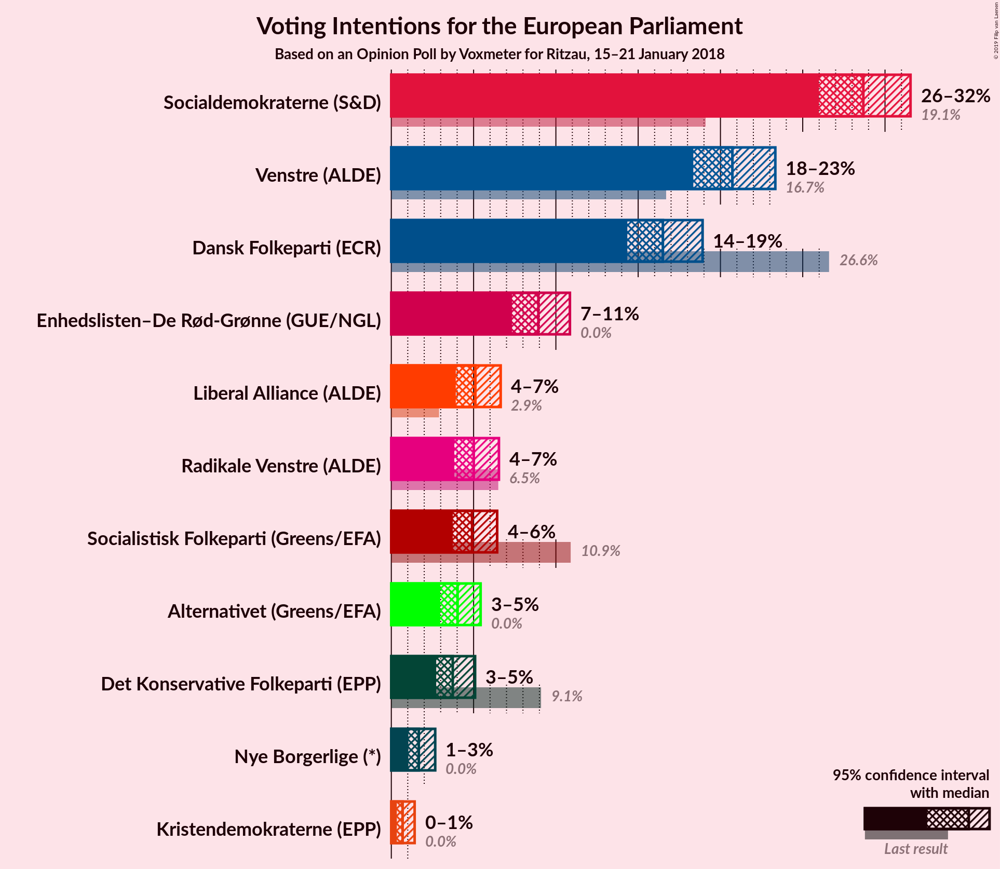

### Confidence Intervals

| Party | Last Result | Poll Result | 80% Confidence Interval | 90% Confidence Interval | 95% Confidence Interval | 99% Confidence Interval |
|:-----:|:-----------:|:-----------:|:-----------------------:|:-----------------------:|:-----------------------:|:-----------------------:|
| Socialdemokraterne (S&D) | 19.1% | 28.7% | 26.9–30.6% |26.4–31.1% |26.0–31.6% |25.1–32.4% |
| Venstre (ALDE) | 16.7% | 20.7% | 19.2–22.4% |18.7–22.9% |18.4–23.3% |17.6–24.2% |
| Dansk Folkeparti (ECR) | 26.6% | 16.5% | 15.1–18.1% |14.7–18.5% |14.3–18.9% |13.7–19.7% |
| Enhedslisten–De Rød-Grønne (GUE/NGL) | 0.0% | 8.9% | 7.9–10.2% |7.6–10.5% |7.3–10.9% |6.9–11.5% |
| Liberal Alliance (ALDE) | 2.9% | 5.1% | 4.3–6.1% |4.1–6.4% |3.9–6.6% |3.6–7.1% |
| Radikale Venstre (ALDE) | 6.5% | 5.0% | 4.2–6.0% |4.0–6.3% |3.8–6.5% |3.5–7.0% |
| Socialistisk Folkeparti (Greens/EFA) | 10.9% | 4.9% | 4.1–5.9% |3.9–6.2% |3.7–6.4% |3.4–6.9% |
| Alternativet (Greens/EFA) | 0.0% | 4.0% | 3.3–4.9% |3.1–5.2% |3.0–5.4% |2.7–5.9% |
| Det Konservative Folkeparti (EPP) | 9.1% | 3.7% | 3.1–4.6% |2.9–4.9% |2.7–5.1% |2.4–5.5% |
| Nye Borgerlige (*) | 0.0% | 1.7% | 1.2–2.3% |1.1–2.5% |1.0–2.7% |0.9–3.0% |
| Kristendemokraterne (EPP) | 0.0% | 0.7% | 0.5–1.2% |0.4–1.3% |0.3–1.4% |0.2–1.7% |

*Note:* The poll result column reflects the actual value used in the calculations. Published results may vary slightly, and in addition be rounded to fewer digits.

## Seats

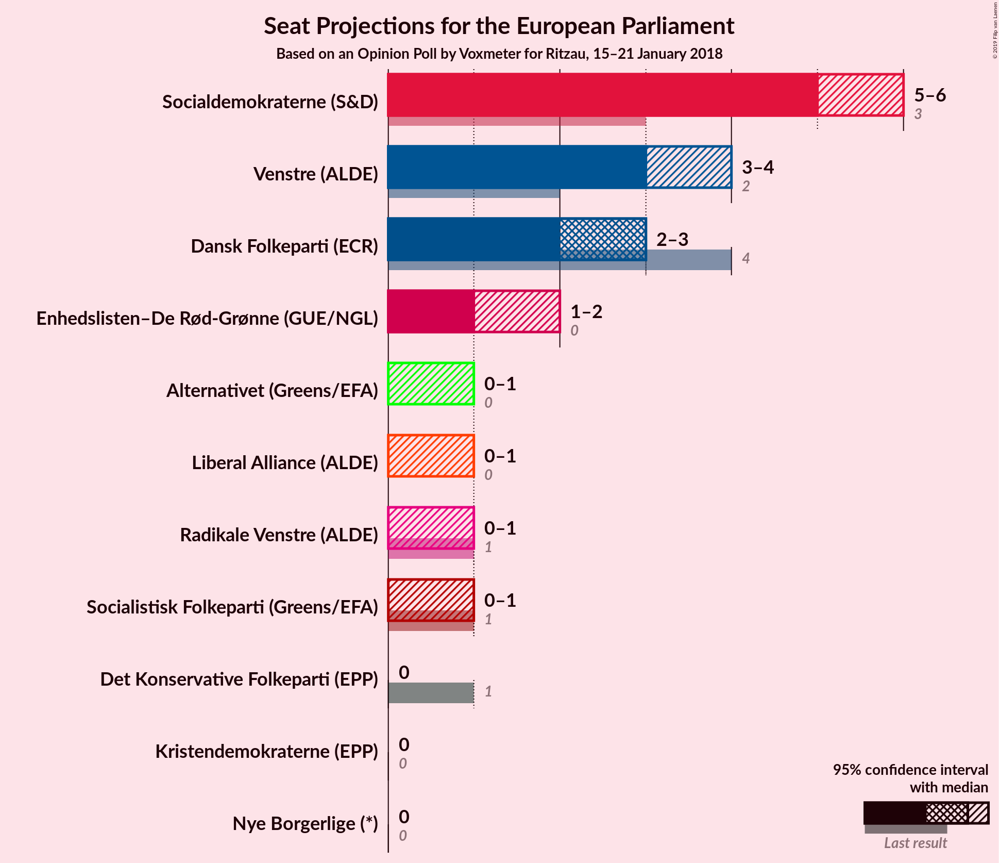

### Confidence Intervals

| Party | Last Result | Median | 80% Confidence Interval | 90% Confidence Interval | 95% Confidence Interval | 99% Confidence Interval |
|:-----:|:-----------:|:------:|:-----------------------:|:-----------------------:|:-----------------------:|:-----------------------:|
| <a href="#socialdemokraterne-(s&d)">Socialdemokraterne (S&D)</a> | 3 | 5 | 5–6 |5–6 |5–6 |4–6 |
| <a href="#venstre-(alde)">Venstre (ALDE)</a> | 2 | 3 | 3–4 |3–4 |3–4 |3–4 |
| <a href="#dansk-folkeparti-(ecr)">Dansk Folkeparti (ECR)</a> | 4 | 3 | 2–3 |2–3 |2–3 |2–3 |
| <a href="#enhedslisten–de-rød-grønne-(gue/ngl)">Enhedslisten–De Rød-Grønne (GUE/NGL)</a> | 0 | 1 | 1–2 |1–2 |1–2 |1–2 |
| <a href="#liberal-alliance-(alde)">Liberal Alliance (ALDE)</a> | 0 | 0 | 0–1 |0–1 |0–1 |0–1 |
| <a href="#radikale-venstre-(alde)">Radikale Venstre (ALDE)</a> | 1 | 0 | 0–1 |0–1 |0–1 |0–1 |
| <a href="#socialistisk-folkeparti-(greens/efa)">Socialistisk Folkeparti (Greens/EFA)</a> | 1 | 0 | 0–1 |0–1 |0–1 |0–1 |
| <a href="#alternativet-(greens/efa)">Alternativet (Greens/EFA)</a> | 0 | 0 | 0 |0–1 |0–1 |0–1 |
| <a href="#det-konservative-folkeparti-(epp)">Det Konservative Folkeparti (EPP)</a> | 1 | 0 | 0 |0 |0 |0–1 |
| <a href="#nye-borgerlige-(*)">Nye Borgerlige (*)</a> | 0 | 0 | 0 |0 |0 |0 |
| <a href="#kristendemokraterne-(epp)">Kristendemokraterne (EPP)</a> | 0 | 0 | 0 |0 |0 |0 |

### Socialdemokraterne (S&D)

*For a full overview of the results for this party, see the [Socialdemokraterne (S&D)](party-socialdemokraternesd.html) page.*

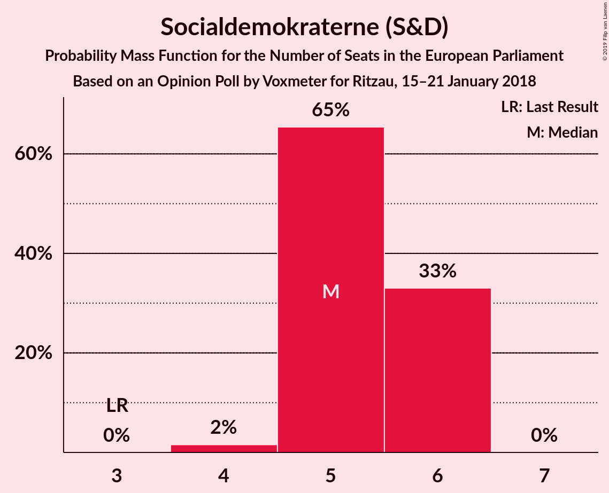

| Number of Seats | Probability | Accumulated | Special Marks |
|:---------------:|:-----------:|:-----------:|:-------------:|
| 3 | 0% | 100% | Last Result |
| 4 | 2% | 100% |  |
| 5 | 65% | 98% | Median |
| 6 | 33% | 33% |  |
| 7 | 0% | 0% |  |

### Venstre (ALDE)

*For a full overview of the results for this party, see the [Venstre (ALDE)](party-venstrealde.html) page.*

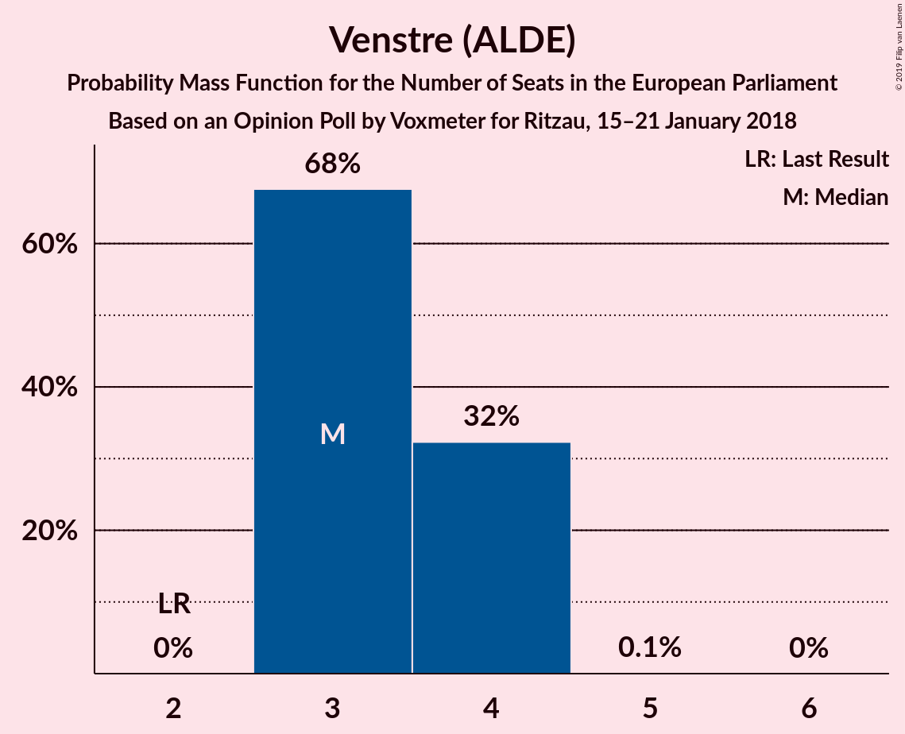

| Number of Seats | Probability | Accumulated | Special Marks |
|:---------------:|:-----------:|:-----------:|:-------------:|
| 2 | 0% | 100% | Last Result |
| 3 | 68% | 100% | Median |
| 4 | 32% | 32% |  |
| 5 | 0.1% | 0.1% |  |
| 6 | 0% | 0% |  |

### Dansk Folkeparti (ECR)

*For a full overview of the results for this party, see the [Dansk Folkeparti (ECR)](party-danskfolkepartiecr.html) page.*

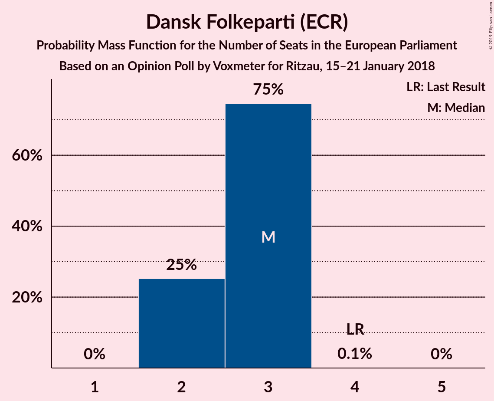

| Number of Seats | Probability | Accumulated | Special Marks |
|:---------------:|:-----------:|:-----------:|:-------------:|
| 2 | 25% | 100% |  |
| 3 | 75% | 75% | Median |
| 4 | 0.1% | 0.1% | Last Result |
| 5 | 0% | 0% |  |

### Enhedslisten–De Rød-Grønne (GUE/NGL)

*For a full overview of the results for this party, see the [Enhedslisten–De Rød-Grønne (GUE/NGL)](party-enhedslisten–derød-grønneguengl.html) page.*

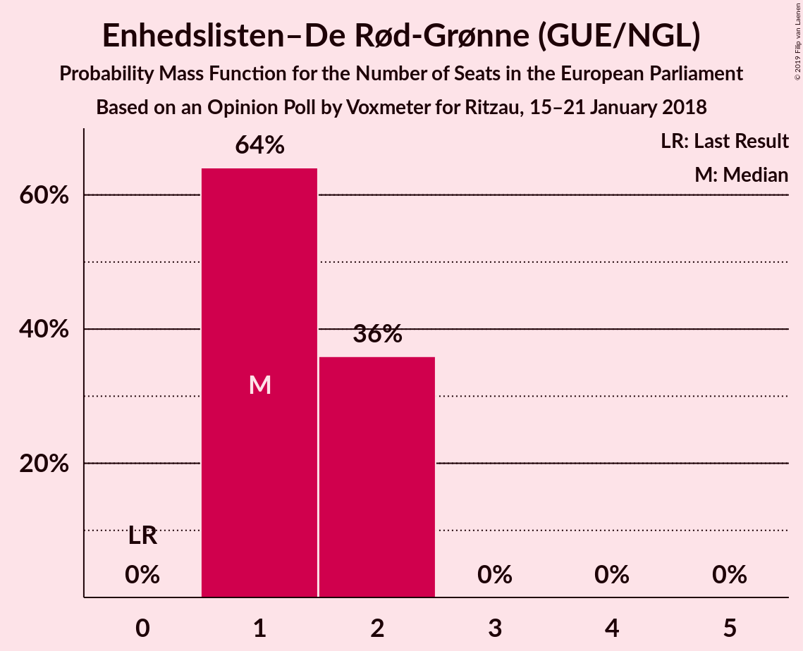

| Number of Seats | Probability | Accumulated | Special Marks |
|:---------------:|:-----------:|:-----------:|:-------------:|
| 0 | 0% | 100% | Last Result |
| 1 | 64% | 100% | Median |
| 2 | 36% | 36% |  |
| 3 | 0% | 0% |  |

### Liberal Alliance (ALDE)

*For a full overview of the results for this party, see the [Liberal Alliance (ALDE)](party-liberalalliancealde.html) page.*

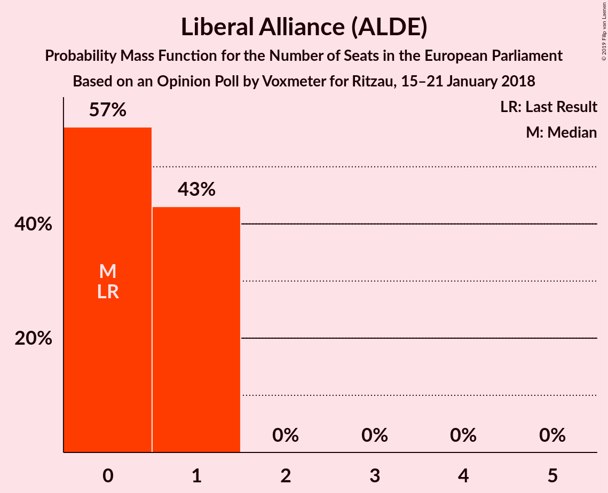

| Number of Seats | Probability | Accumulated | Special Marks |
|:---------------:|:-----------:|:-----------:|:-------------:|
| 0 | 57% | 100% | Last Result, Median |
| 1 | 43% | 43% |  |
| 2 | 0% | 0% |  |

### Radikale Venstre (ALDE)

*For a full overview of the results for this party, see the [Radikale Venstre (ALDE)](party-radikalevenstrealde.html) page.*

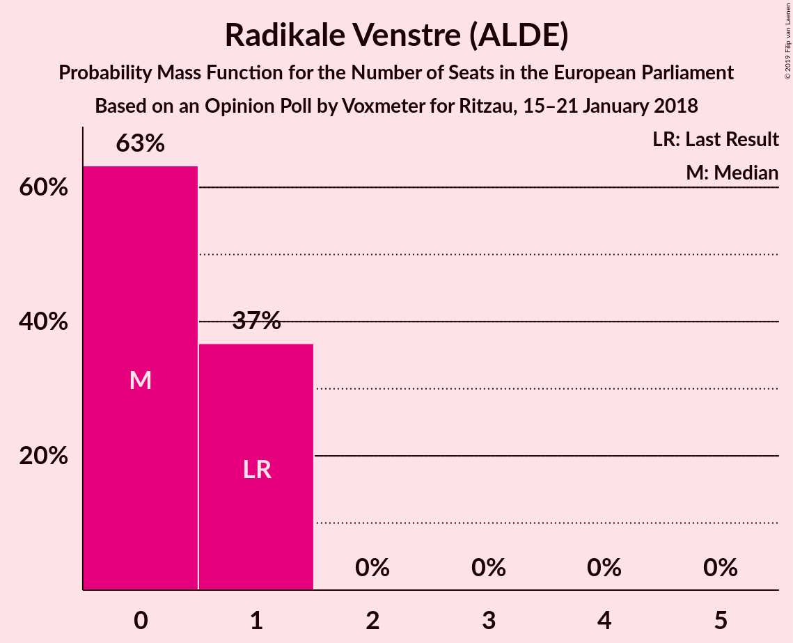

| Number of Seats | Probability | Accumulated | Special Marks |
|:---------------:|:-----------:|:-----------:|:-------------:|
| 0 | 63% | 100% | Median |
| 1 | 37% | 37% | Last Result |
| 2 | 0% | 0% |  |

### Socialistisk Folkeparti (Greens/EFA)

*For a full overview of the results for this party, see the [Socialistisk Folkeparti (Greens/EFA)](party-socialistiskfolkepartigreensefa.html) page.*

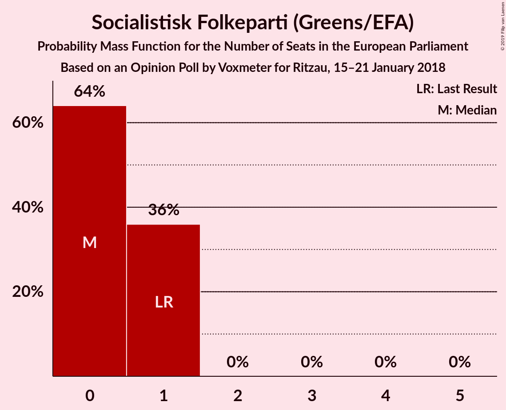

| Number of Seats | Probability | Accumulated | Special Marks |
|:---------------:|:-----------:|:-----------:|:-------------:|
| 0 | 64% | 100% | Median |
| 1 | 36% | 36% | Last Result |
| 2 | 0% | 0% |  |

### Alternativet (Greens/EFA)

*For a full overview of the results for this party, see the [Alternativet (Greens/EFA)](party-alternativetgreensefa.html) page.*

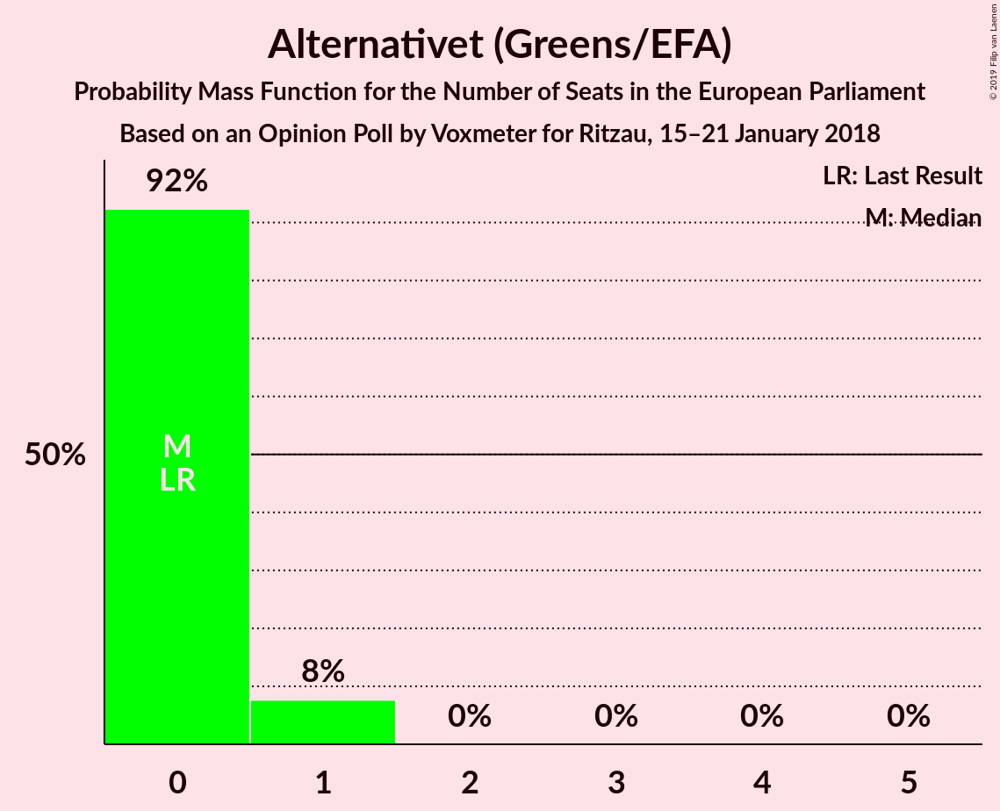

| Number of Seats | Probability | Accumulated | Special Marks |
|:---------------:|:-----------:|:-----------:|:-------------:|
| 0 | 92% | 100% | Last Result, Median |
| 1 | 8% | 8% |  |
| 2 | 0% | 0% |  |

### Det Konservative Folkeparti (EPP)

*For a full overview of the results for this party, see the [Det Konservative Folkeparti (EPP)](party-detkonservativefolkepartiepp.html) page.*

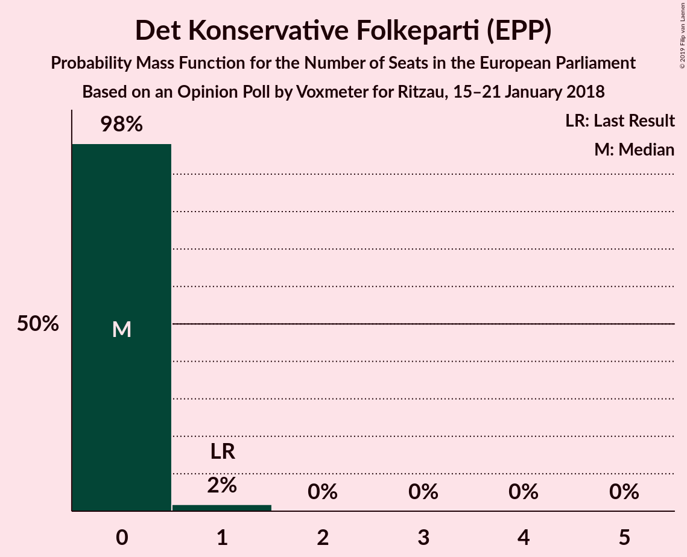

| Number of Seats | Probability | Accumulated | Special Marks |
|:---------------:|:-----------:|:-----------:|:-------------:|
| 0 | 98% | 100% | Median |
| 1 | 2% | 2% | Last Result |
| 2 | 0% | 0% |  |

### Nye Borgerlige (*)

*For a full overview of the results for this party, see the [Nye Borgerlige (*)](party-nyeborgerlige.html) page.*

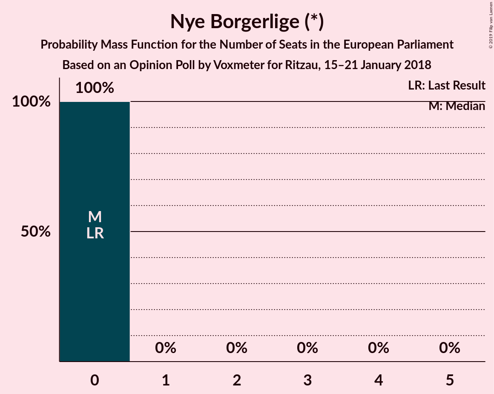

| Number of Seats | Probability | Accumulated | Special Marks |
|:---------------:|:-----------:|:-----------:|:-------------:|
| 0 | 100% | 100% | Last Result, Median |

### Kristendemokraterne (EPP)

*For a full overview of the results for this party, see the [Kristendemokraterne (EPP)](party-kristendemokraterneepp.html) page.*

| Number of Seats | Probability | Accumulated | Special Marks |
|:---------------:|:-----------:|:-----------:|:-------------:|
| 0 | 100% | 100% | Last Result, Median |

## Coalitions

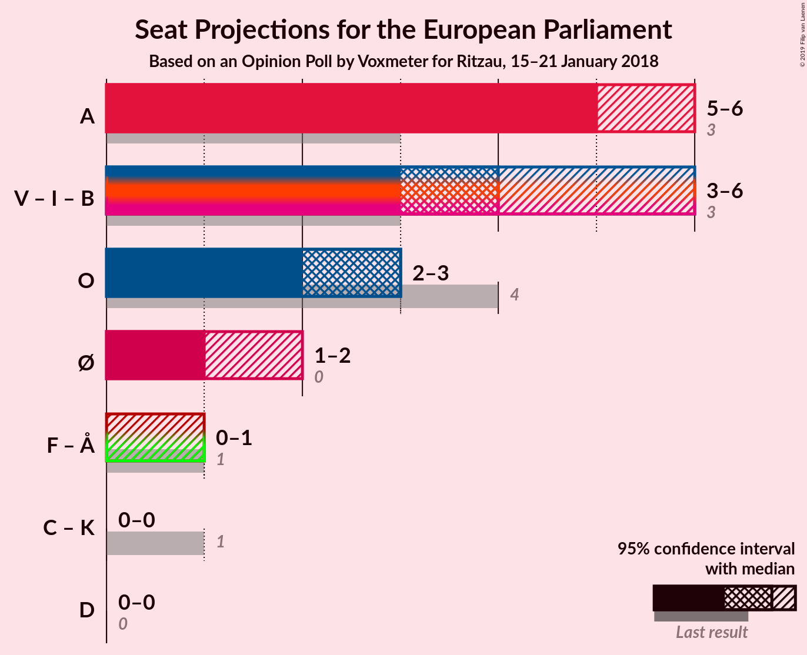

### Confidence Intervals

| Coalition | Last Result | Median | Majority? | 80% Confidence Interval | 90% Confidence Interval | 95% Confidence Interval | 99% Confidence Interval |
|:---------:|:-----------:|:------:|:---------:|:-----------------------:|:-----------------------:|:-----------------------:|:-----------------------:|
| Socialdemokraterne (S&D) | 3 | 5 | 0% | 5–6 | 5–6 | 5–6 | 4–6 |
| Venstre (ALDE) – Liberal Alliance (ALDE) – Radikale Venstre (ALDE) | 3 | 4 | 0% | 3–5 | 3–6 | 3–6 | 3–6 |
| Dansk Folkeparti (ECR) | 4 | 3 | 0% | 2–3 | 2–3 | 2–3 | 2–3 |
| Enhedslisten–De Rød-Grønne (GUE/NGL) | 0 | 1 | 0% | 1–2 | 1–2 | 1–2 | 1–2 |
| Socialistisk Folkeparti (Greens/EFA) – Alternativet (Greens/EFA) | 1 | 0 | 0% | 0–1 | 0–1 | 0–1 | 0–2 |
| Det Konservative Folkeparti (EPP) – Kristendemokraterne (EPP) | 1 | 0 | 0% | 0 | 0 | 0 | 0–1 |
| Nye Borgerlige (*) | 0 | 0 | 0% | 0 | 0 | 0 | 0 |

### Socialdemokraterne (S&D)

| Number of Seats | Probability | Accumulated | Special Marks |
|:---------------:|:-----------:|:-----------:|:-------------:|
| 3 | 0% | 100% | Last Result |
| 4 | 2% | 100% |  |
| 5 | 65% | 98% | Median |
| 6 | 33% | 33% |  |
| 7 | 0% | 0% |  |

### Venstre (ALDE) – Liberal Alliance (ALDE) – Radikale Venstre (ALDE)

| Number of Seats | Probability | Accumulated | Special Marks |
|:---------------:|:-----------:|:-----------:|:-------------:|
| 3 | 30% | 100% | Last Result, Median |
| 4 | 35% | 70% |  |
| 5 | 27% | 34% |  |
| 6 | 8% | 8% |  |
| 7 | 0% | 0% |  |

### Dansk Folkeparti (ECR)

| Number of Seats | Probability | Accumulated | Special Marks |
|:---------------:|:-----------:|:-----------:|:-------------:|
| 2 | 25% | 100% |  |
| 3 | 75% | 75% | Median |
| 4 | 0.1% | 0.1% | Last Result |
| 5 | 0% | 0% |  |

### Enhedslisten–De Rød-Grønne (GUE/NGL)

| Number of Seats | Probability | Accumulated | Special Marks |
|:---------------:|:-----------:|:-----------:|:-------------:|
| 0 | 0% | 100% | Last Result |
| 1 | 64% | 100% | Median |
| 2 | 36% | 36% |  |
| 3 | 0% | 0% |  |

### Socialistisk Folkeparti (Greens/EFA) – Alternativet (Greens/EFA)

| Number of Seats | Probability | Accumulated | Special Marks |
|:---------------:|:-----------:|:-----------:|:-------------:|
| 0 | 57% | 100% | Median |
| 1 | 42% | 43% | Last Result |
| 2 | 0.6% | 0.6% |  |
| 3 | 0% | 0% |  |

### Det Konservative Folkeparti (EPP) – Kristendemokraterne (EPP)

| Number of Seats | Probability | Accumulated | Special Marks |
|:---------------:|:-----------:|:-----------:|:-------------:|
| 0 | 98% | 100% | Median |
| 1 | 2% | 2% | Last Result |
| 2 | 0% | 0% |  |

### Nye Borgerlige (*)

| Number of Seats | Probability | Accumulated | Special Marks |
|:---------------:|:-----------:|:-----------:|:-------------:|
| 0 | 100% | 100% | Last Result, Median |

## Technical Information

### Opinion Poll

+ **Polling firm:** Voxmeter
+ **Commissioner(s):** Ritzau
+ **Fieldwork period:** 15–21 January 2018

### Calculations

+ **Sample size:** 1018
+ **Simulations done:** 1,048,576
+ **Error estimate:** 1.69%

