# Opinion Poll by YouGov, 19–22 January 2018

<a href="#voting-intentions">Voting Intentions</a> | <a href="#seats">Seats</a> | <a href="#coalitions">Coalitions</a> | <a href="#technical-information">Technical Information</a>

## Voting Intentions

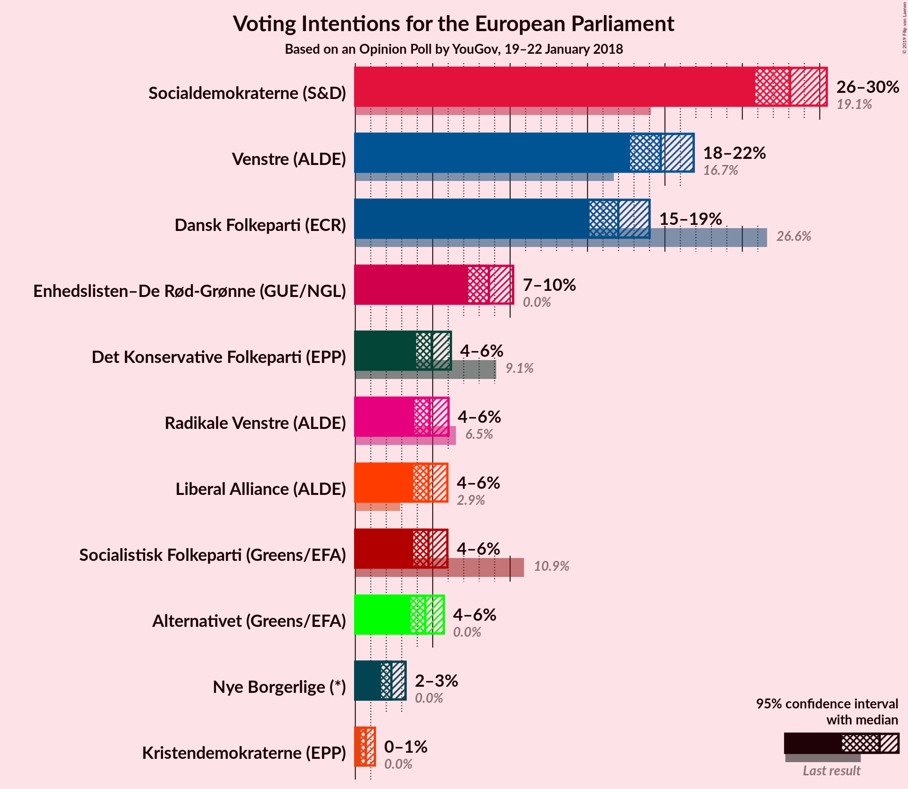

### Confidence Intervals

| Party | Last Result | Poll Result | 80% Confidence Interval | 90% Confidence Interval | 95% Confidence Interval | 99% Confidence Interval |
|:-----:|:-----------:|:-----------:|:-----------------------:|:-----------------------:|:-----------------------:|:-----------------------:|
| Socialdemokraterne (S&D) | 19.1% | 28.1% | 26.6–29.6% |26.2–30.1% |25.8–30.5% |25.1–31.2% |
| Venstre (ALDE) | 16.7% | 19.7% | 18.4–21.1% |18.1–21.5% |17.8–21.9% |17.2–22.5% |
| Dansk Folkeparti (ECR) | 26.6% | 17.0% | 15.8–18.3% |15.4–18.7% |15.1–19.0% |14.6–19.6% |
| Enhedslisten–De Rød-Grønne (GUE/NGL) | 0.0% | 8.6% | 7.7–9.6% |7.5–9.9% |7.3–10.2% |6.9–10.7% |
| Det Konservative Folkeparti (EPP) | 9.1% | 4.9% | 4.3–5.7% |4.1–6.0% |3.9–6.2% |3.6–6.6% |
| Radikale Venstre (ALDE) | 6.5% | 4.8% | 4.1–5.6% |4.0–5.8% |3.8–6.0% |3.5–6.4% |
| Liberal Alliance (ALDE) | 2.9% | 4.7% | 4.1–5.5% |3.9–5.7% |3.7–5.9% |3.5–6.3% |
| Socialistisk Folkeparti (Greens/EFA) | 10.9% | 4.7% | 4.1–5.5% |3.9–5.7% |3.7–5.9% |3.5–6.3% |
| Alternativet (Greens/EFA) | 0.0% | 4.5% | 3.9–5.3% |3.7–5.5% |3.6–5.7% |3.3–6.1% |
| Nye Borgerlige (*) | 0.0% | 2.3% | 1.9–2.9% |1.8–3.1% |1.7–3.2% |1.5–3.6% |
| Kristendemokraterne (EPP) | 0.0% | 0.7% | 0.5–1.1% |0.4–1.2% |0.4–1.3% |0.3–1.5% |

*Note:* The poll result column reflects the actual value used in the calculations. Published results may vary slightly, and in addition be rounded to fewer digits.

## Seats

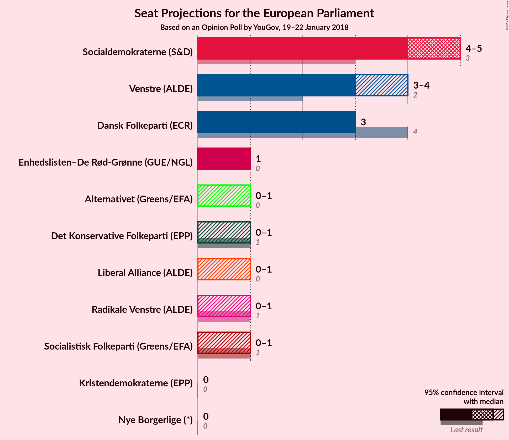

### Confidence Intervals

| Party | Last Result | Median | 80% Confidence Interval | 90% Confidence Interval | 95% Confidence Interval | 99% Confidence Interval |
|:-----:|:-----------:|:------:|:-----------------------:|:-----------------------:|:-----------------------:|:-----------------------:|
| <a href="#socialdemokraterne-(s&d)">Socialdemokraterne (S&D)</a> | 3 | 5 | 5 |5 |5 |4–5 |
| <a href="#venstre-(alde)">Venstre (ALDE)</a> | 2 | 4 | 4 |4 |4 |3–4 |
| <a href="#dansk-folkeparti-(ecr)">Dansk Folkeparti (ECR)</a> | 4 | 3 | 3 |3 |3 |3 |
| <a href="#enhedslisten–de-rød-grønne-(gue/ngl)">Enhedslisten–De Rød-Grønne (GUE/NGL)</a> | 0 | 1 | 1 |1 |1 |1 |
| <a href="#det-konservative-folkeparti-(epp)">Det Konservative Folkeparti (EPP)</a> | 1 | 0 | 0–1 |0–1 |0–1 |0–1 |
| <a href="#radikale-venstre-(alde)">Radikale Venstre (ALDE)</a> | 1 | 0 | 0 |0 |0 |0–1 |
| <a href="#liberal-alliance-(alde)">Liberal Alliance (ALDE)</a> | 0 | 0 | 0 |0 |0 |0 |
| <a href="#socialistisk-folkeparti-(greens/efa)">Socialistisk Folkeparti (Greens/EFA)</a> | 1 | 1 | 0–1 |0–1 |0–1 |0–1 |
| <a href="#alternativet-(greens/efa)">Alternativet (Greens/EFA)</a> | 0 | 0 | 0 |0 |0 |0 |
| <a href="#nye-borgerlige-(*)">Nye Borgerlige (*)</a> | 0 | 0 | 0 |0 |0 |0 |
| <a href="#kristendemokraterne-(epp)">Kristendemokraterne (EPP)</a> | 0 | 0 | 0 |0 |0 |0 |

### Socialdemokraterne (S&D)

*For a full overview of the results for this party, see the [Socialdemokraterne (S&D)](party-socialdemokraternesd.html) page.*

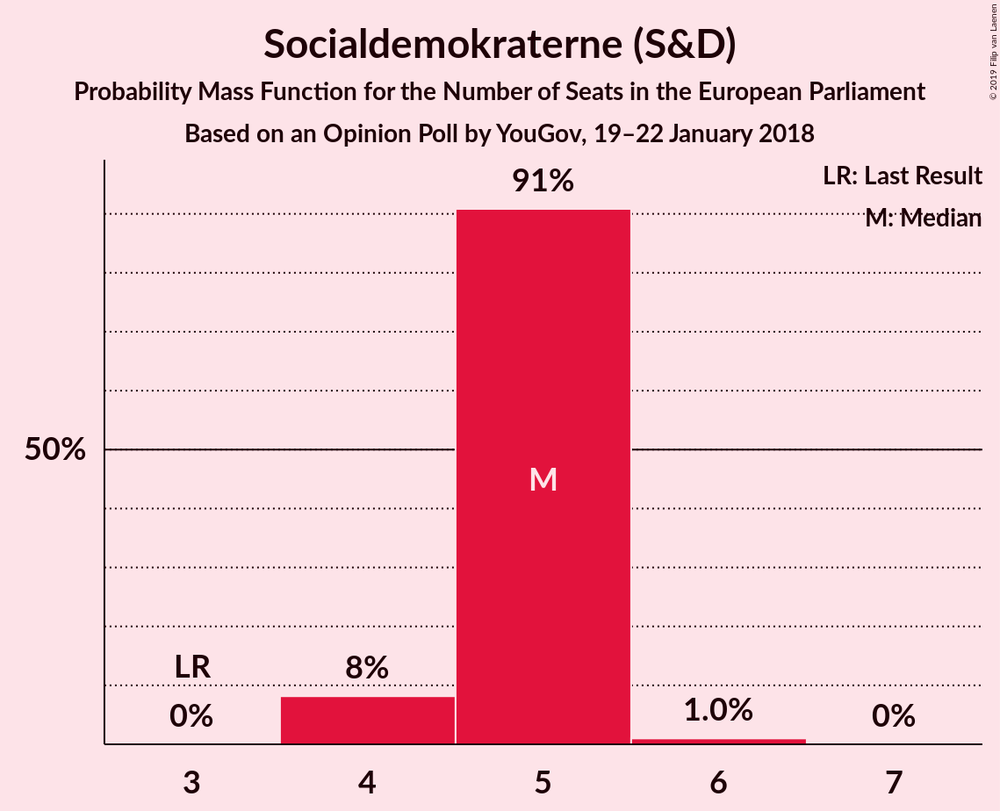

| Number of Seats | Probability | Accumulated | Special Marks |
|:---------------:|:-----------:|:-----------:|:-------------:|
| 3 | 0% | 100% | Last Result |
| 4 | 0.6% | 100% |  |
| 5 | 99.4% | 99.4% | Median |
| 6 | 0% | 0% |  |

### Venstre (ALDE)

*For a full overview of the results for this party, see the [Venstre (ALDE)](party-venstrealde.html) page.*

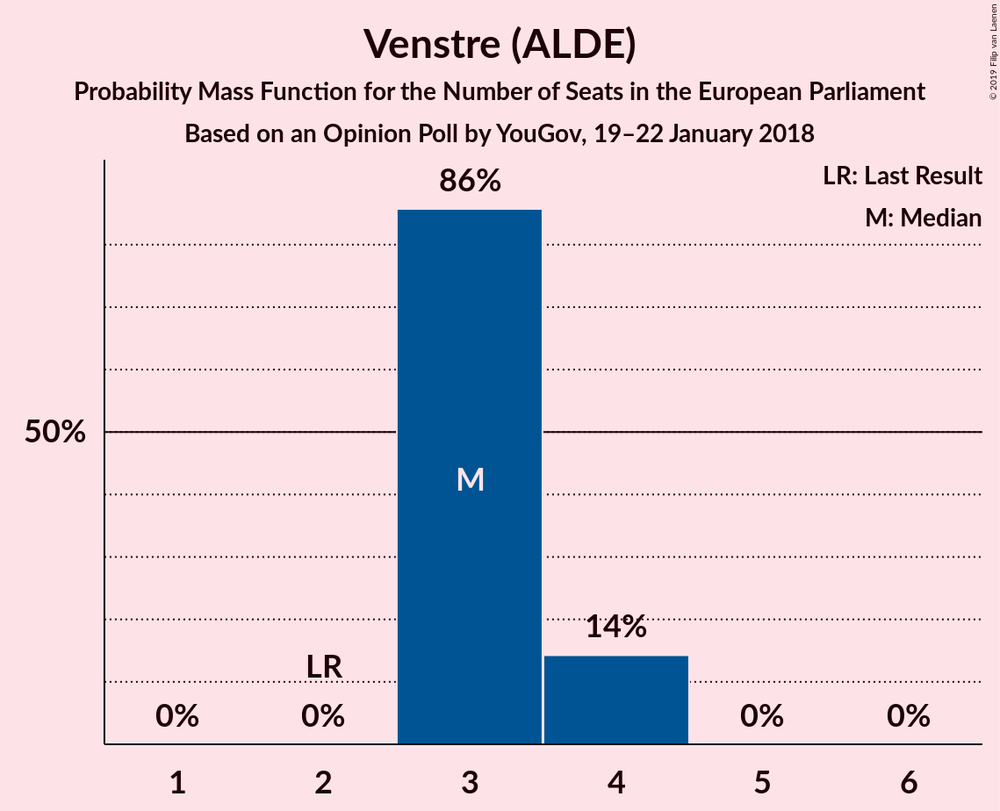

| Number of Seats | Probability | Accumulated | Special Marks |
|:---------------:|:-----------:|:-----------:|:-------------:|
| 2 | 0% | 100% | Last Result |
| 3 | 0.6% | 100% |  |
| 4 | 99.4% | 99.4% | Median |
| 5 | 0% | 0% |  |

### Dansk Folkeparti (ECR)

*For a full overview of the results for this party, see the [Dansk Folkeparti (ECR)](party-danskfolkepartiecr.html) page.*

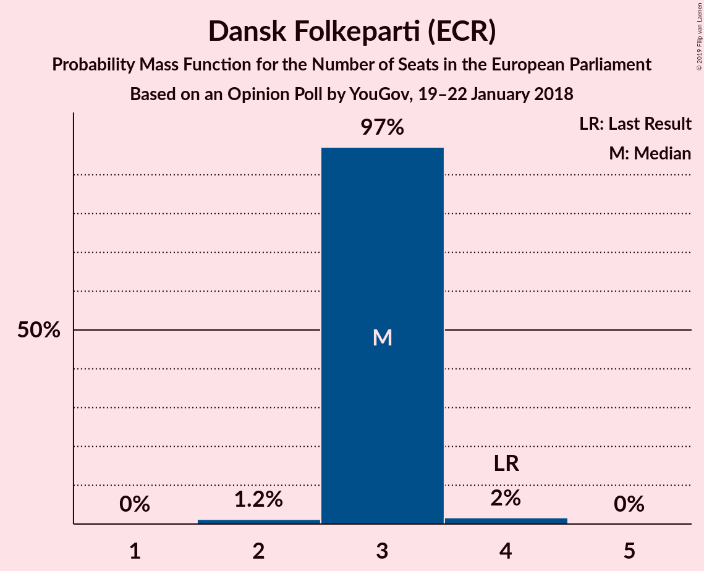

| Number of Seats | Probability | Accumulated | Special Marks |
|:---------------:|:-----------:|:-----------:|:-------------:|
| 3 | 100% | 100% | Median |
| 4 | 0% | 0% | Last Result |

### Enhedslisten–De Rød-Grønne (GUE/NGL)

*For a full overview of the results for this party, see the [Enhedslisten–De Rød-Grønne (GUE/NGL)](party-enhedslisten–derød-grønneguengl.html) page.*

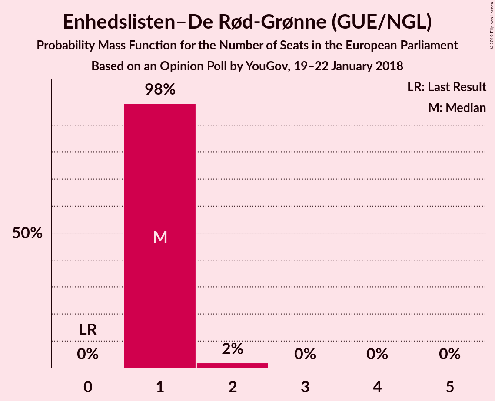

| Number of Seats | Probability | Accumulated | Special Marks |
|:---------------:|:-----------:|:-----------:|:-------------:|
| 0 | 0% | 100% | Last Result |
| 1 | 99.9% | 100% | Median |
| 2 | 0.1% | 0.1% |  |
| 3 | 0% | 0% |  |

### Det Konservative Folkeparti (EPP)

*For a full overview of the results for this party, see the [Det Konservative Folkeparti (EPP)](party-detkonservativefolkepartiepp.html) page.*

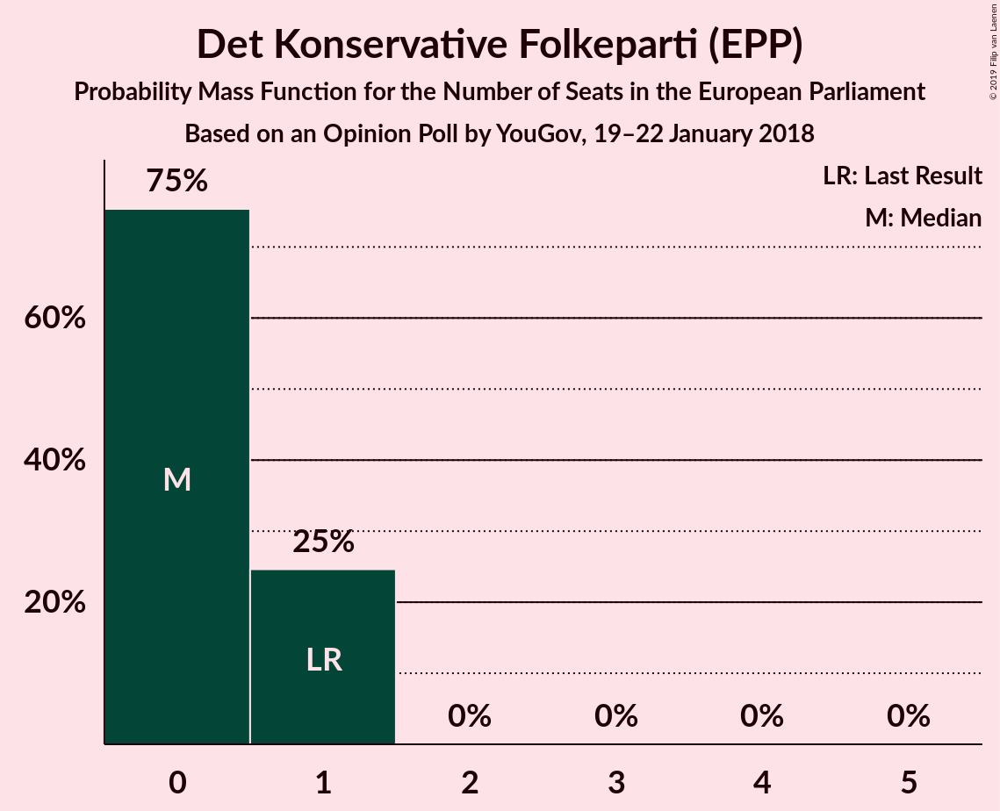

| Number of Seats | Probability | Accumulated | Special Marks |
|:---------------:|:-----------:|:-----------:|:-------------:|
| 0 | 67% | 100% | Median |
| 1 | 33% | 33% | Last Result |
| 2 | 0% | 0% |  |

### Radikale Venstre (ALDE)

*For a full overview of the results for this party, see the [Radikale Venstre (ALDE)](party-radikalevenstrealde.html) page.*

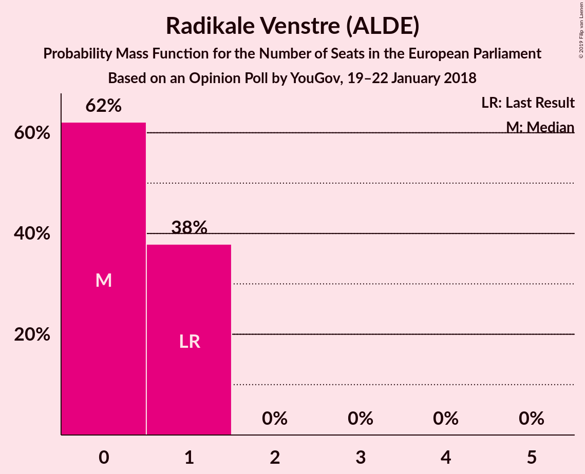

| Number of Seats | Probability | Accumulated | Special Marks |
|:---------------:|:-----------:|:-----------:|:-------------:|
| 0 | 99.5% | 100% | Median |
| 1 | 0.5% | 0.5% | Last Result |
| 2 | 0% | 0% |  |

### Liberal Alliance (ALDE)

*For a full overview of the results for this party, see the [Liberal Alliance (ALDE)](party-liberalalliancealde.html) page.*

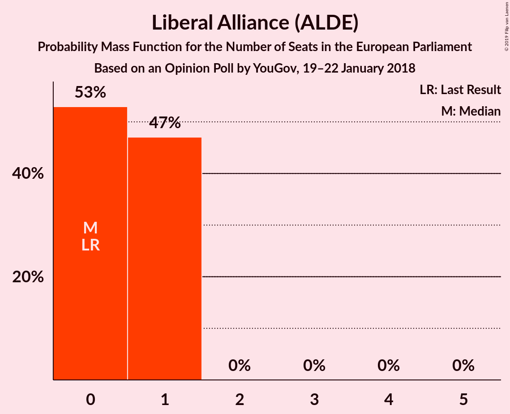

| Number of Seats | Probability | Accumulated | Special Marks |
|:---------------:|:-----------:|:-----------:|:-------------:|
| 0 | 99.5% | 100% | Last Result, Median |
| 1 | 0.5% | 0.5% |  |
| 2 | 0% | 0% |  |

### Socialistisk Folkeparti (Greens/EFA)

*For a full overview of the results for this party, see the [Socialistisk Folkeparti (Greens/EFA)](party-socialistiskfolkepartigreensefa.html) page.*

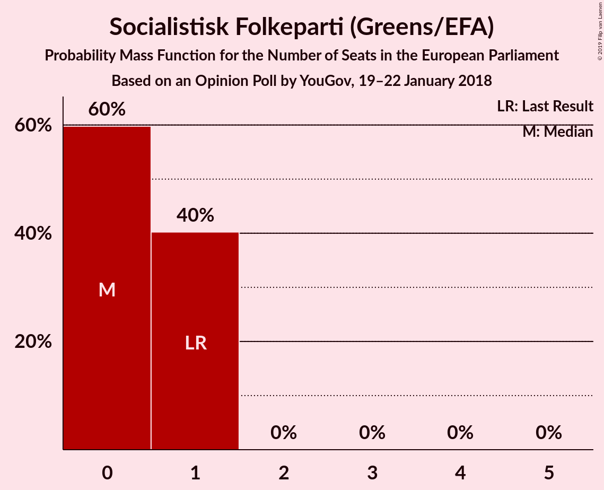

| Number of Seats | Probability | Accumulated | Special Marks |
|:---------------:|:-----------:|:-----------:|:-------------:|
| 0 | 33% | 100% |  |
| 1 | 67% | 67% | Last Result, Median |
| 2 | 0% | 0% |  |

### Alternativet (Greens/EFA)

*For a full overview of the results for this party, see the [Alternativet (Greens/EFA)](party-alternativetgreensefa.html) page.*

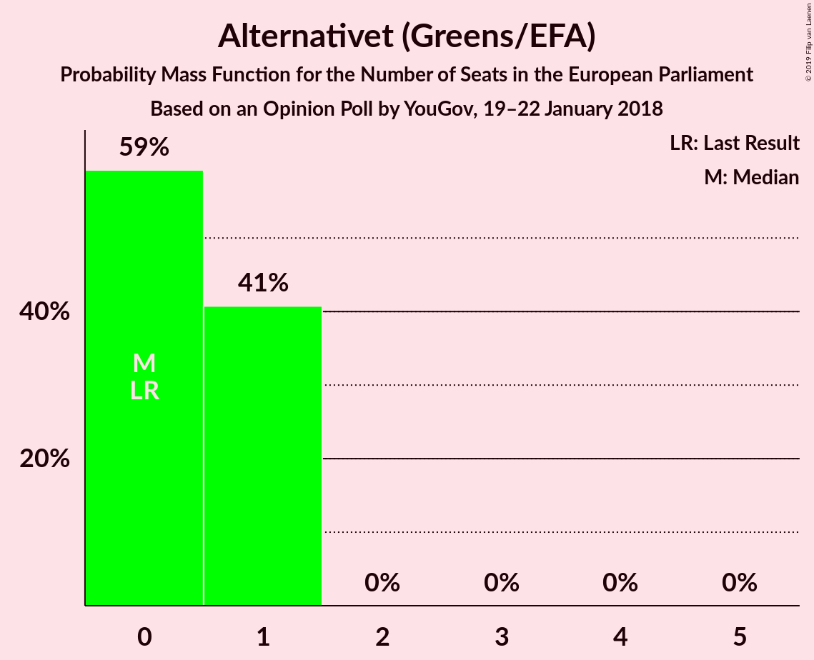

| Number of Seats | Probability | Accumulated | Special Marks |
|:---------------:|:-----------:|:-----------:|:-------------:|
| 0 | 99.9% | 100% | Last Result, Median |
| 1 | 0.1% | 0.1% |  |
| 2 | 0% | 0% |  |

### Nye Borgerlige (*)

*For a full overview of the results for this party, see the [Nye Borgerlige (*)](party-nyeborgerlige.html) page.*

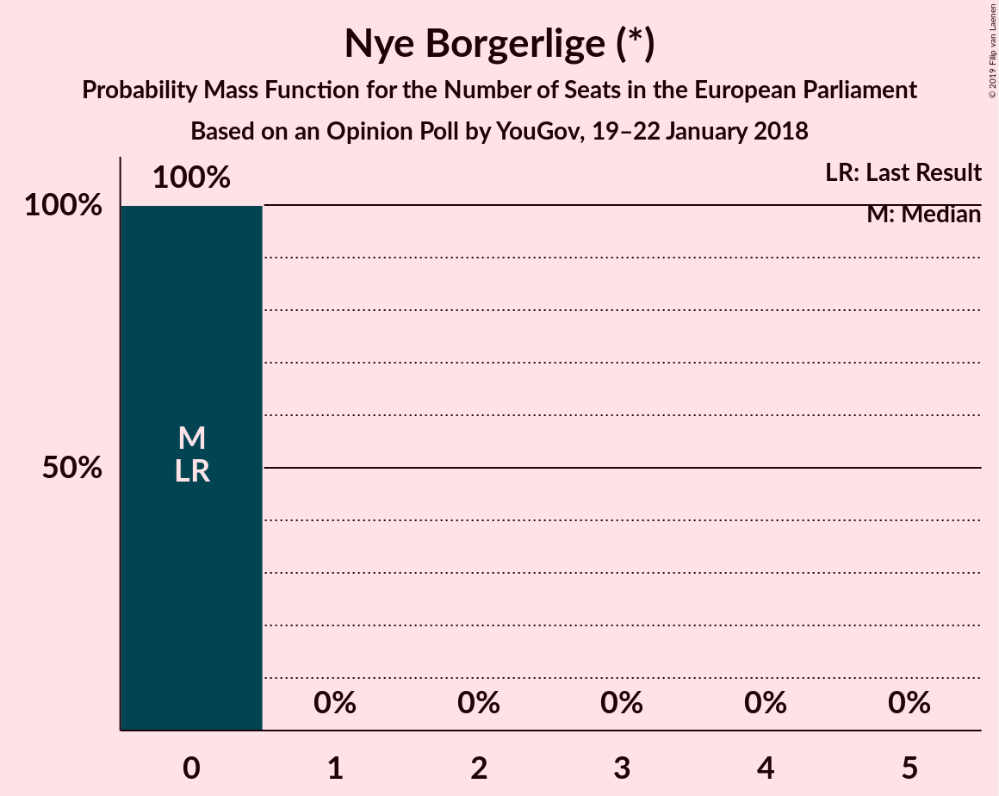

| Number of Seats | Probability | Accumulated | Special Marks |
|:---------------:|:-----------:|:-----------:|:-------------:|
| 0 | 100% | 100% | Last Result, Median |

### Kristendemokraterne (EPP)

*For a full overview of the results for this party, see the [Kristendemokraterne (EPP)](party-kristendemokraterneepp.html) page.*

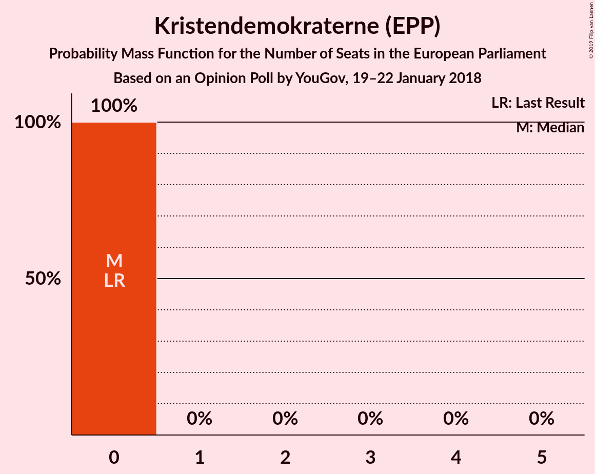

| Number of Seats | Probability | Accumulated | Special Marks |
|:---------------:|:-----------:|:-----------:|:-------------:|
| 0 | 100% | 100% | Last Result, Median |

## Coalitions

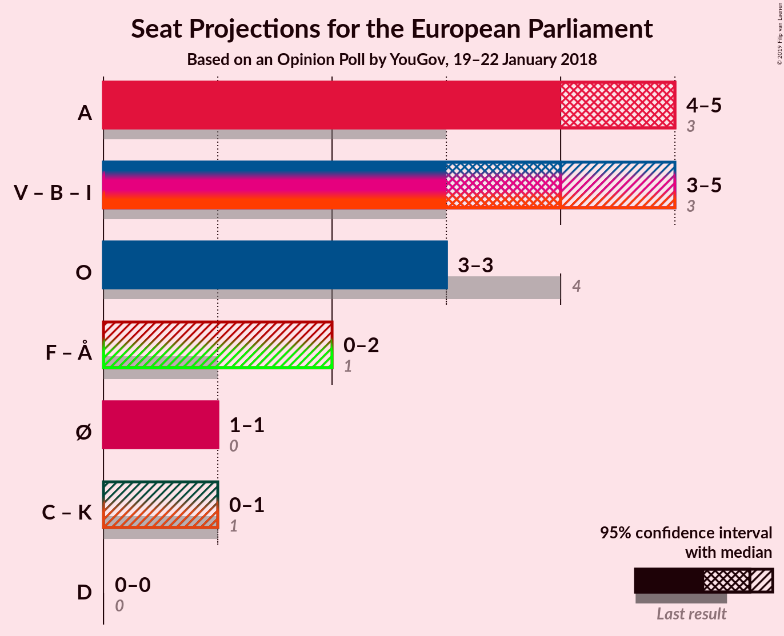

### Confidence Intervals

| Coalition | Last Result | Median | Majority? | 80% Confidence Interval | 90% Confidence Interval | 95% Confidence Interval | 99% Confidence Interval |
|:---------:|:-----------:|:------:|:---------:|:-----------------------:|:-----------------------:|:-----------------------:|:-----------------------:|
| Socialdemokraterne (S&D) | 3 | 5 | 0% | 5 | 5 | 5 | 4–5 |
| Venstre (ALDE) – Radikale Venstre (ALDE) – Liberal Alliance (ALDE) | 3 | 4 | 0% | 4 | 4 | 4 | 4 |
| Dansk Folkeparti (ECR) | 4 | 3 | 0% | 3 | 3 | 3 | 3 |
| Enhedslisten–De Rød-Grønne (GUE/NGL) | 0 | 1 | 0% | 1 | 1 | 1 | 1 |
| Socialistisk Folkeparti (Greens/EFA) – Alternativet (Greens/EFA) | 1 | 1 | 0% | 0–1 | 0–1 | 0–1 | 0–1 |
| Det Konservative Folkeparti (EPP) – Kristendemokraterne (EPP) | 1 | 0 | 0% | 0–1 | 0–1 | 0–1 | 0–1 |
| Nye Borgerlige (*) | 0 | 0 | 0% | 0 | 0 | 0 | 0 |

### Socialdemokraterne (S&D)

| Number of Seats | Probability | Accumulated | Special Marks |
|:---------------:|:-----------:|:-----------:|:-------------:|
| 3 | 0% | 100% | Last Result |
| 4 | 0.6% | 100% |  |
| 5 | 99.4% | 99.4% | Median |
| 6 | 0% | 0% |  |

### Venstre (ALDE) – Radikale Venstre (ALDE) – Liberal Alliance (ALDE)

| Number of Seats | Probability | Accumulated | Special Marks |
|:---------------:|:-----------:|:-----------:|:-------------:|
| 3 | 0.1% | 100% | Last Result |
| 4 | 99.4% | 99.9% | Median |
| 5 | 0.5% | 0.5% |  |
| 6 | 0% | 0% |  |

### Dansk Folkeparti (ECR)

| Number of Seats | Probability | Accumulated | Special Marks |
|:---------------:|:-----------:|:-----------:|:-------------:|
| 3 | 100% | 100% | Median |
| 4 | 0% | 0% | Last Result |

### Enhedslisten–De Rød-Grønne (GUE/NGL)

| Number of Seats | Probability | Accumulated | Special Marks |
|:---------------:|:-----------:|:-----------:|:-------------:|
| 0 | 0% | 100% | Last Result |
| 1 | 99.9% | 100% | Median |
| 2 | 0.1% | 0.1% |  |
| 3 | 0% | 0% |  |

### Socialistisk Folkeparti (Greens/EFA) – Alternativet (Greens/EFA)

| Number of Seats | Probability | Accumulated | Special Marks |
|:---------------:|:-----------:|:-----------:|:-------------:|
| 0 | 33% | 100% |  |
| 1 | 67% | 67% | Last Result, Median |
| 2 | 0% | 0% |  |

### Det Konservative Folkeparti (EPP) – Kristendemokraterne (EPP)

| Number of Seats | Probability | Accumulated | Special Marks |
|:---------------:|:-----------:|:-----------:|:-------------:|
| 0 | 67% | 100% | Median |
| 1 | 33% | 33% | Last Result |
| 2 | 0% | 0% |  |

### Nye Borgerlige (*)

| Number of Seats | Probability | Accumulated | Special Marks |
|:---------------:|:-----------:|:-----------:|:-------------:|
| 0 | 100% | 100% | Last Result, Median |

## Technical Information

### Opinion Poll

+ **Polling firm:** YouGov
+ **Commissioner(s):** —
+ **Fieldwork period:** 19–22 January 2018

### Calculations

+ **Sample size:** 1460
+ **Simulations done:** 1,024
+ **Error estimate:** 3.28%

