# Opinion Poll by Megafon for Politiken and TV 2, 22–25 January 2018

<a href="#voting-intentions">Voting Intentions</a> | <a href="#seats">Seats</a> | <a href="#coalitions">Coalitions</a> | <a href="#technical-information">Technical Information</a>

## Voting Intentions

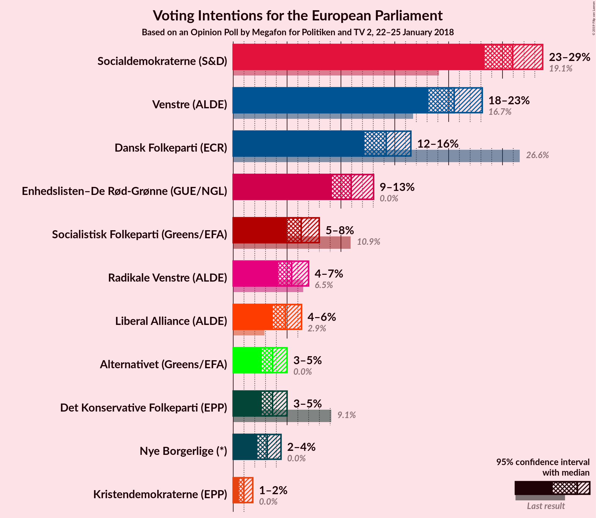

### Confidence Intervals

| Party | Last Result | Poll Result | 80% Confidence Interval | 90% Confidence Interval | 95% Confidence Interval | 99% Confidence Interval |
|:-----:|:-----------:|:-----------:|:-----------------------:|:-----------------------:|:-----------------------:|:-----------------------:|
| Socialdemokraterne (S&D) | 19.1% | 25.9% | 24.2–27.8% |23.7–28.3% |23.3–28.7% |22.5–29.6% |
| Venstre (ALDE) | 16.7% | 20.5% | 18.9–22.2% |18.5–22.7% |18.1–23.1% |17.4–23.9% |
| Dansk Folkeparti (ECR) | 26.6% | 14.2% | 12.9–15.7% |12.5–16.1% |12.2–16.5% |11.6–17.2% |
| Enhedslisten–De Rød-Grønne (GUE/NGL) | 0.0% | 10.9% | 9.8–12.3% |9.4–12.7% |9.2–13.0% |8.6–13.7% |
| Socialistisk Folkeparti (Greens/EFA) | 10.9% | 6.3% | 5.4–7.4% |5.2–7.7% |5.0–8.0% |4.6–8.5% |
| Radikale Venstre (ALDE) | 6.5% | 5.4% | 4.6–6.4% |4.4–6.7% |4.2–7.0% |3.8–7.5% |
| Liberal Alliance (ALDE) | 2.9% | 4.8% | 4.1–5.8% |3.9–6.1% |3.7–6.3% |3.3–6.8% |
| Alternativet (Greens/EFA) | 0.0% | 3.6% | 3.0–4.5% |2.8–4.8% |2.7–5.0% |2.4–5.4% |
| Det Konservative Folkeparti (EPP) | 9.1% | 3.6% | 3.0–4.5% |2.8–4.8% |2.7–5.0% |2.4–5.4% |
| Nye Borgerlige (*) | 0.0% | 3.2% | 2.5–4.0% |2.4–4.2% |2.2–4.4% |2.0–4.9% |
| Kristendemokraterne (EPP) | 0.0% | 1.0% | 0.7–1.5% |0.6–1.7% |0.5–1.8% |0.4–2.1% |

*Note:* The poll result column reflects the actual value used in the calculations. Published results may vary slightly, and in addition be rounded to fewer digits.

## Seats

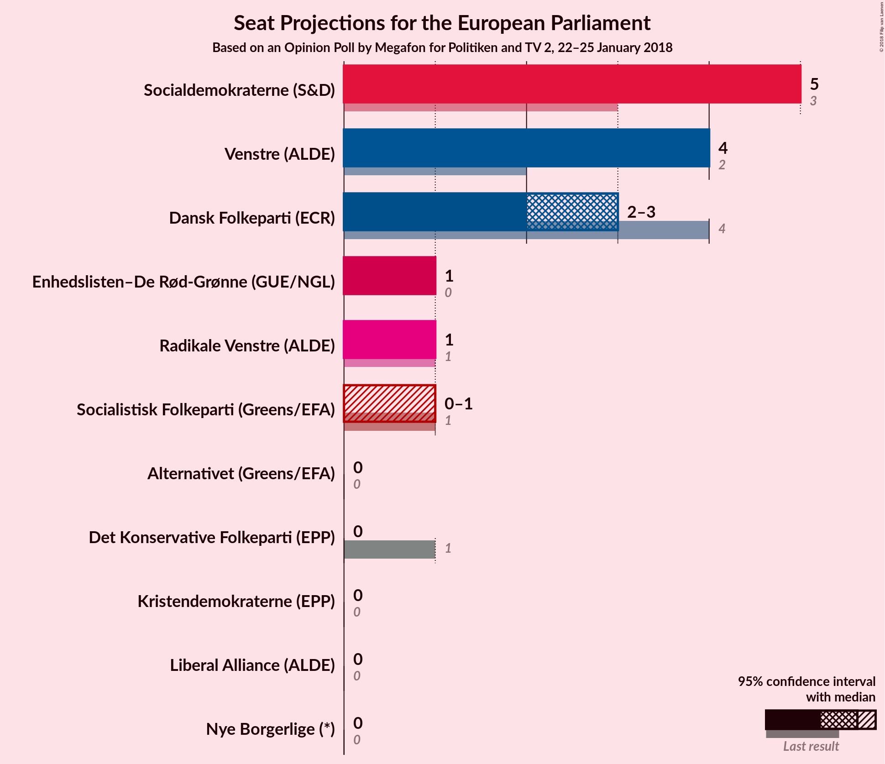

### Confidence Intervals

| Party | Last Result | Median | 80% Confidence Interval | 90% Confidence Interval | 95% Confidence Interval | 99% Confidence Interval |
|:-----:|:-----------:|:------:|:-----------------------:|:-----------------------:|:-----------------------:|:-----------------------:|
| <a href="#socialdemokraterne-(s&d)">Socialdemokraterne (S&D)</a> | 3 | 5 | 5 |5 |5 |4–5 |
| <a href="#venstre-(alde)">Venstre (ALDE)</a> | 2 | 4 | 4 |4 |4 |3–4 |
| <a href="#dansk-folkeparti-(ecr)">Dansk Folkeparti (ECR)</a> | 4 | 3 | 3 |3 |2–3 |2–3 |
| <a href="#enhedslisten–de-rød-grønne-(gue/ngl)">Enhedslisten–De Rød-Grønne (GUE/NGL)</a> | 0 | 1 | 1 |1 |1 |1–2 |
| <a href="#socialistisk-folkeparti-(greens/efa)">Socialistisk Folkeparti (Greens/EFA)</a> | 1 | 0 | 0 |0 |0–1 |0–1 |
| <a href="#radikale-venstre-(alde)">Radikale Venstre (ALDE)</a> | 1 | 1 | 1 |1 |1 |0–1 |
| <a href="#liberal-alliance-(alde)">Liberal Alliance (ALDE)</a> | 0 | 0 | 0 |0 |0 |0–1 |
| <a href="#alternativet-(greens/efa)">Alternativet (Greens/EFA)</a> | 0 | 0 | 0 |0 |0 |0 |
| <a href="#det-konservative-folkeparti-(epp)">Det Konservative Folkeparti (EPP)</a> | 1 | 0 | 0 |0 |0 |0 |
| <a href="#nye-borgerlige-(*)">Nye Borgerlige (*)</a> | 0 | 0 | 0 |0 |0 |0 |
| <a href="#kristendemokraterne-(epp)">Kristendemokraterne (EPP)</a> | 0 | 0 | 0 |0 |0 |0 |

### Socialdemokraterne (S&D)

*For a full overview of the results for this party, see the [Socialdemokraterne (S&D)](party-socialdemokraternesd.html) page.*

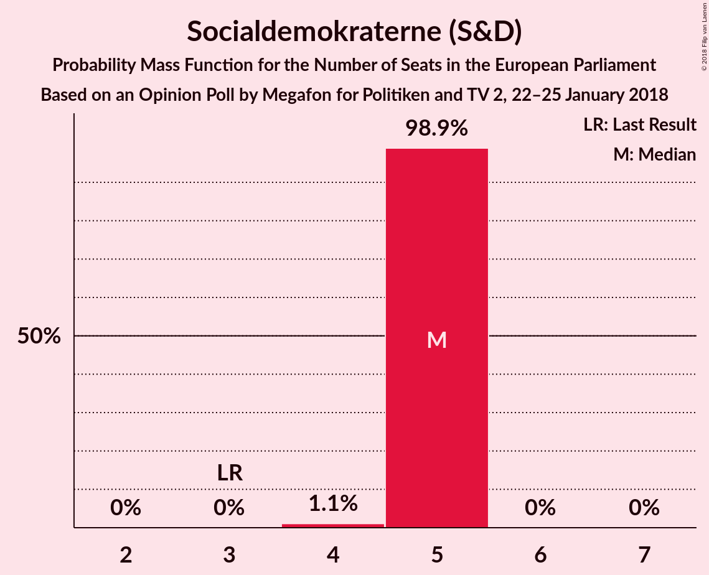

| Number of Seats | Probability | Accumulated | Special Marks |
|:---------------:|:-----------:|:-----------:|:-------------:|
| 3 | 0% | 100% | Last Result |
| 4 | 1.1% | 100% |  |
| 5 | 98.9% | 98.9% | Median |
| 6 | 0% | 0% |  |

### Venstre (ALDE)

*For a full overview of the results for this party, see the [Venstre (ALDE)](party-venstrealde.html) page.*

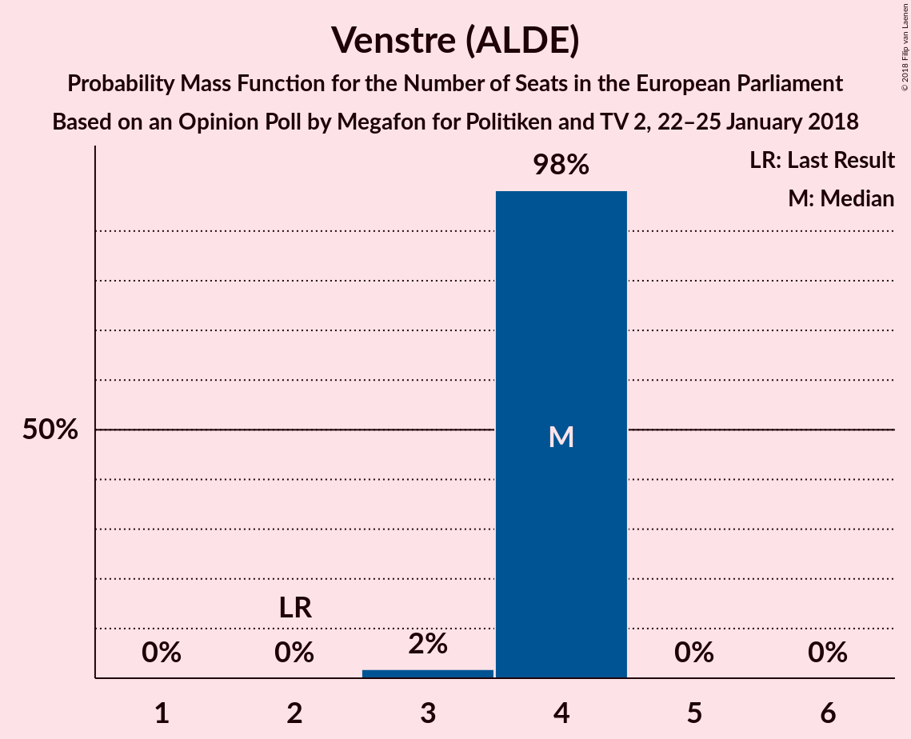

| Number of Seats | Probability | Accumulated | Special Marks |
|:---------------:|:-----------:|:-----------:|:-------------:|
| 2 | 0% | 100% | Last Result |
| 3 | 2% | 100% |  |
| 4 | 98% | 98% | Median |
| 5 | 0% | 0% |  |

### Dansk Folkeparti (ECR)

*For a full overview of the results for this party, see the [Dansk Folkeparti (ECR)](party-danskfolkepartiecr.html) page.*

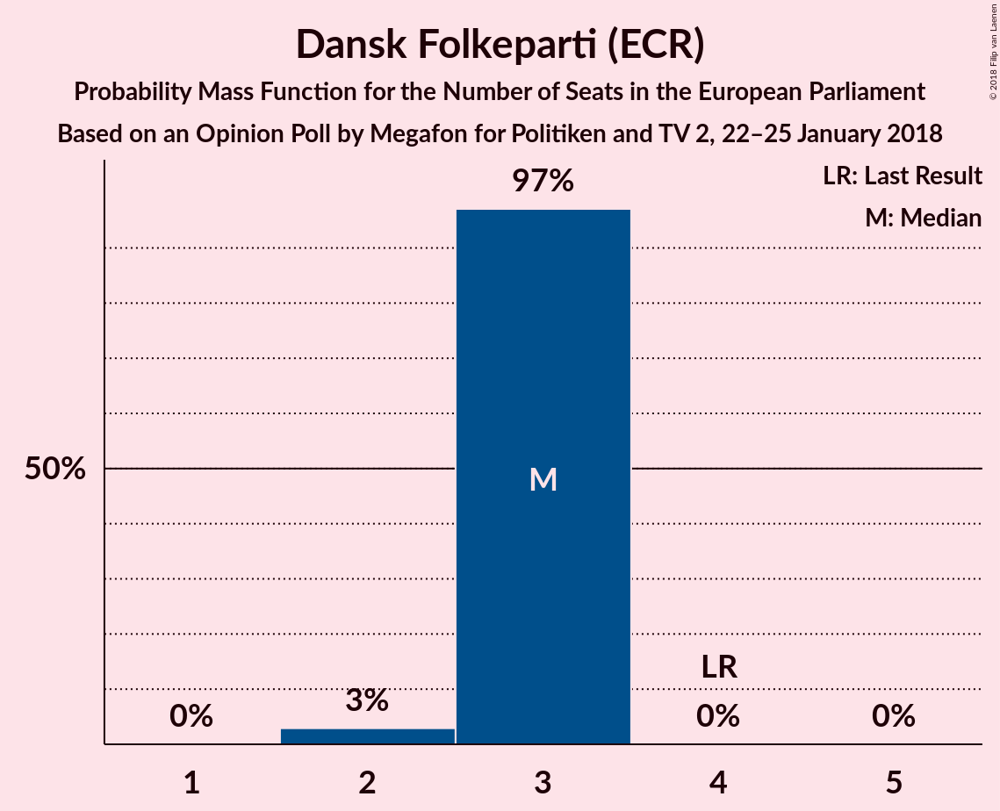

| Number of Seats | Probability | Accumulated | Special Marks |
|:---------------:|:-----------:|:-----------:|:-------------:|
| 2 | 3% | 100% |  |
| 3 | 97% | 97% | Median |
| 4 | 0% | 0% | Last Result |

### Enhedslisten–De Rød-Grønne (GUE/NGL)

*For a full overview of the results for this party, see the [Enhedslisten–De Rød-Grønne (GUE/NGL)](party-enhedslisten–derød-grønneguengl.html) page.*

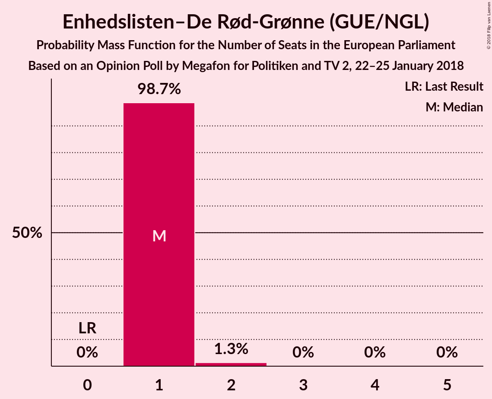

| Number of Seats | Probability | Accumulated | Special Marks |
|:---------------:|:-----------:|:-----------:|:-------------:|
| 0 | 0% | 100% | Last Result |
| 1 | 98.7% | 100% | Median |
| 2 | 1.3% | 1.3% |  |
| 3 | 0% | 0% |  |

### Socialistisk Folkeparti (Greens/EFA)

*For a full overview of the results for this party, see the [Socialistisk Folkeparti (Greens/EFA)](party-socialistiskfolkepartigreensefa.html) page.*

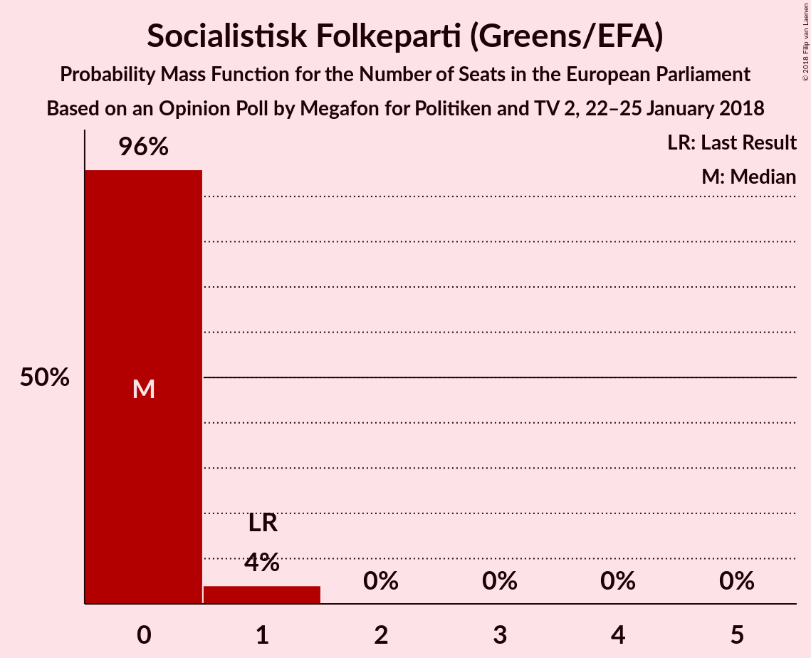

| Number of Seats | Probability | Accumulated | Special Marks |
|:---------------:|:-----------:|:-----------:|:-------------:|
| 0 | 96% | 100% | Median |
| 1 | 4% | 4% | Last Result |
| 2 | 0% | 0% |  |

### Radikale Venstre (ALDE)

*For a full overview of the results for this party, see the [Radikale Venstre (ALDE)](party-radikalevenstrealde.html) page.*

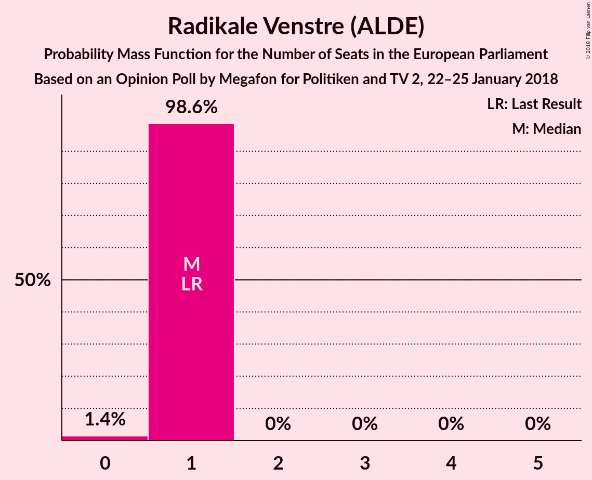

| Number of Seats | Probability | Accumulated | Special Marks |
|:---------------:|:-----------:|:-----------:|:-------------:|
| 0 | 1.4% | 100% |  |
| 1 | 98.6% | 98.6% | Last Result, Median |
| 2 | 0% | 0% |  |

### Liberal Alliance (ALDE)

*For a full overview of the results for this party, see the [Liberal Alliance (ALDE)](party-liberalalliancealde.html) page.*

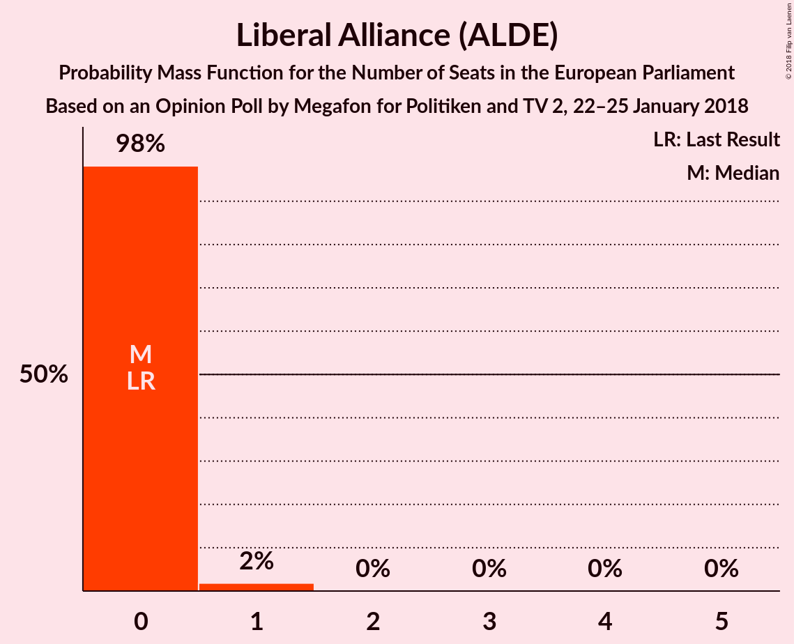

| Number of Seats | Probability | Accumulated | Special Marks |
|:---------------:|:-----------:|:-----------:|:-------------:|
| 0 | 98% | 100% | Last Result, Median |
| 1 | 2% | 2% |  |
| 2 | 0% | 0% |  |

### Alternativet (Greens/EFA)

*For a full overview of the results for this party, see the [Alternativet (Greens/EFA)](party-alternativetgreensefa.html) page.*

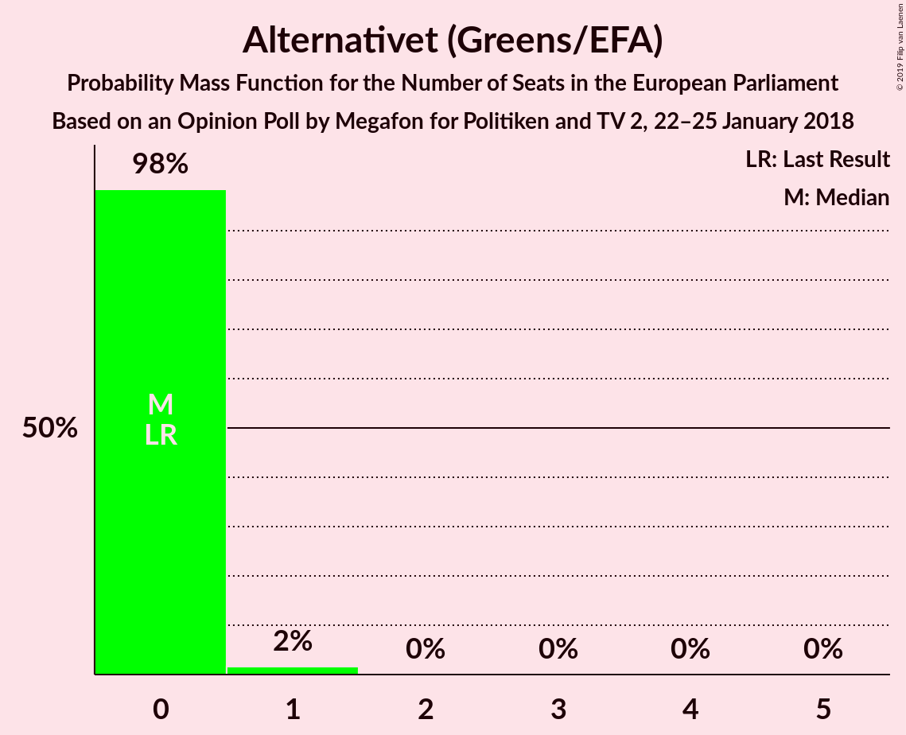

| Number of Seats | Probability | Accumulated | Special Marks |
|:---------------:|:-----------:|:-----------:|:-------------:|
| 0 | 100% | 100% | Last Result, Median |

### Det Konservative Folkeparti (EPP)

*For a full overview of the results for this party, see the [Det Konservative Folkeparti (EPP)](party-detkonservativefolkepartiepp.html) page.*

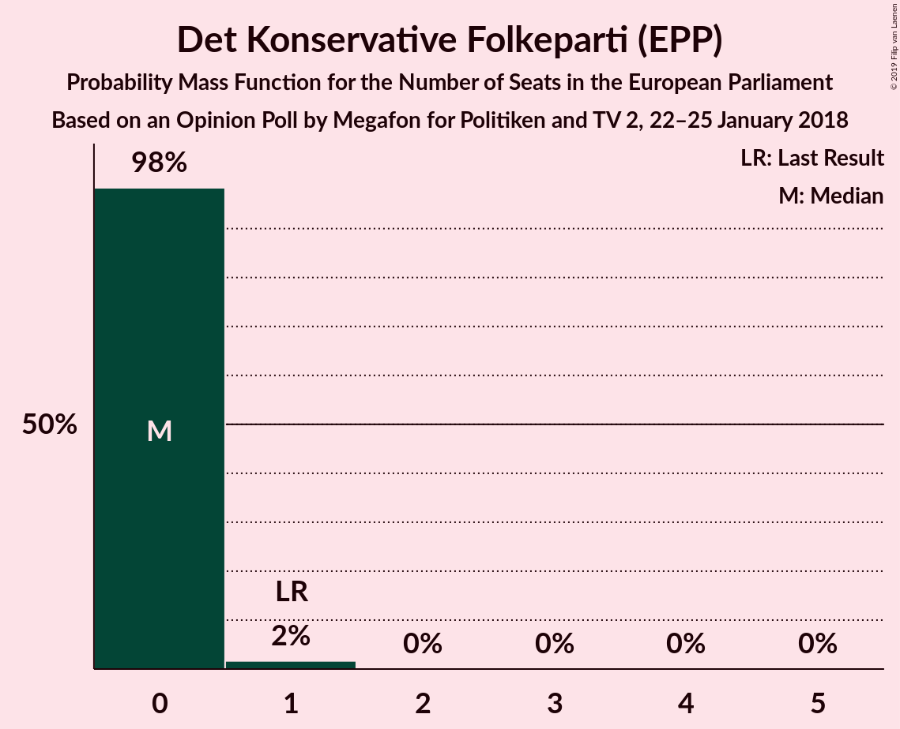

| Number of Seats | Probability | Accumulated | Special Marks |
|:---------------:|:-----------:|:-----------:|:-------------:|
| 0 | 100% | 100% | Median |
| 1 | 0% | 0% | Last Result |

### Nye Borgerlige (*)

*For a full overview of the results for this party, see the [Nye Borgerlige (*)](party-nyeborgerlige.html) page.*

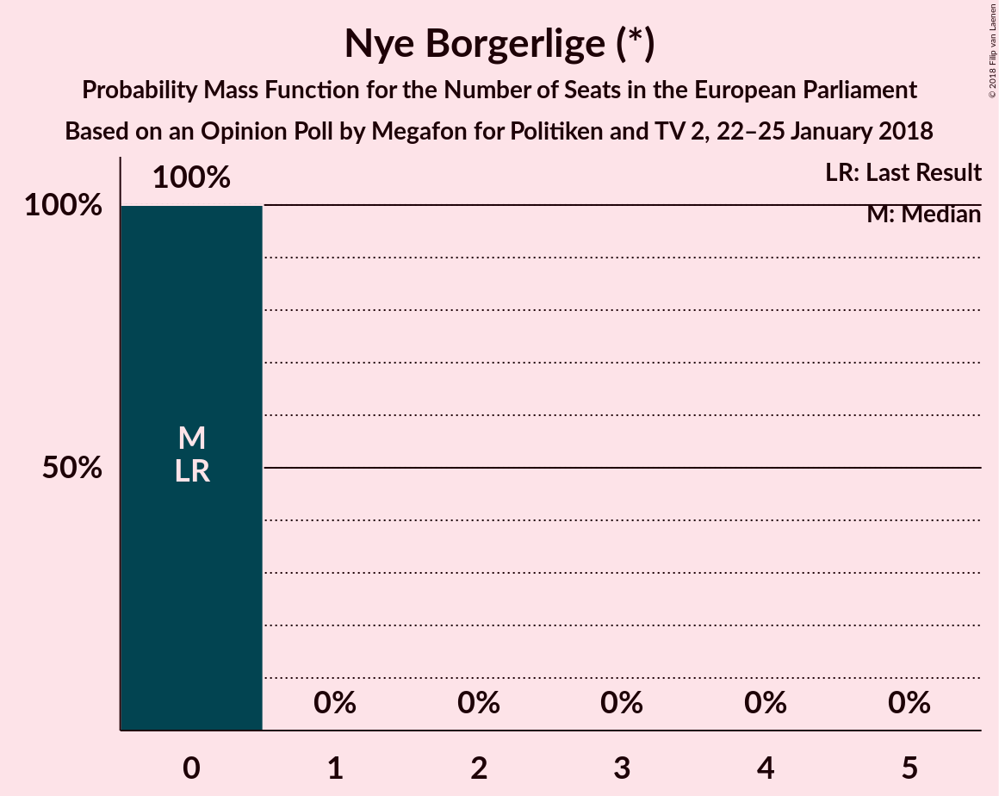

| Number of Seats | Probability | Accumulated | Special Marks |
|:---------------:|:-----------:|:-----------:|:-------------:|
| 0 | 100% | 100% | Last Result, Median |

### Kristendemokraterne (EPP)

*For a full overview of the results for this party, see the [Kristendemokraterne (EPP)](party-kristendemokraterneepp.html) page.*

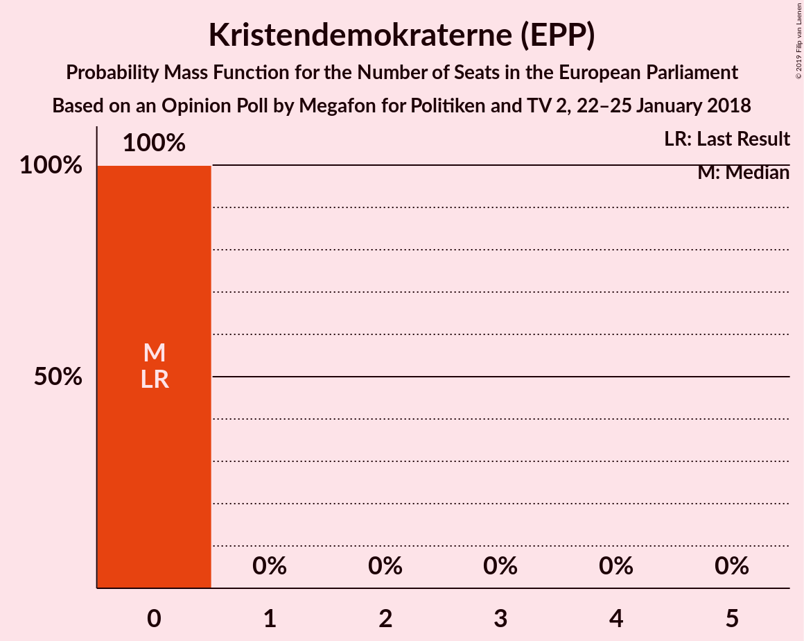

| Number of Seats | Probability | Accumulated | Special Marks |
|:---------------:|:-----------:|:-----------:|:-------------:|
| 0 | 100% | 100% | Last Result, Median |

## Coalitions

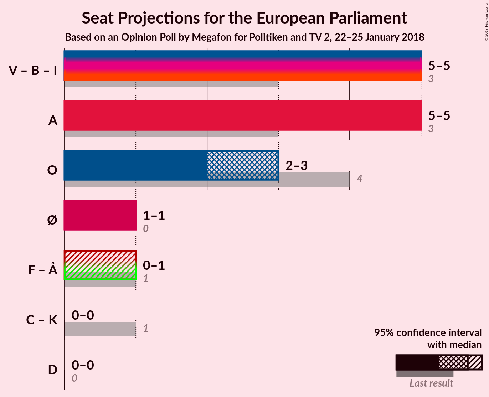

### Confidence Intervals

| Coalition | Last Result | Median | Majority? | 80% Confidence Interval | 90% Confidence Interval | 95% Confidence Interval | 99% Confidence Interval |
|:---------:|:-----------:|:------:|:---------:|:-----------------------:|:-----------------------:|:-----------------------:|:-----------------------:|
| Venstre (ALDE) – Radikale Venstre (ALDE) – Liberal Alliance (ALDE) | 3 | 5 | 0% | 5 | 5 | 5 | 4–5 |
| Socialdemokraterne (S&D) | 3 | 5 | 0% | 5 | 5 | 5 | 4–5 |
| Dansk Folkeparti (ECR) | 4 | 3 | 0% | 3 | 3 | 2–3 | 2–3 |
| Enhedslisten–De Rød-Grønne (GUE/NGL) | 0 | 1 | 0% | 1 | 1 | 1 | 1–2 |
| Socialistisk Folkeparti (Greens/EFA) – Alternativet (Greens/EFA) | 1 | 0 | 0% | 0 | 0 | 0–1 | 0–1 |
| Det Konservative Folkeparti (EPP) – Kristendemokraterne (EPP) | 1 | 0 | 0% | 0 | 0 | 0 | 0 |
| Nye Borgerlige (*) | 0 | 0 | 0% | 0 | 0 | 0 | 0 |

### Venstre (ALDE) – Radikale Venstre (ALDE) – Liberal Alliance (ALDE)

| Number of Seats | Probability | Accumulated | Special Marks |
|:---------------:|:-----------:|:-----------:|:-------------:|
| 3 | 0% | 100% | Last Result |
| 4 | 1.4% | 100% |  |
| 5 | 98.6% | 98.6% | Median |
| 6 | 0% | 0% |  |

### Socialdemokraterne (S&D)

| Number of Seats | Probability | Accumulated | Special Marks |
|:---------------:|:-----------:|:-----------:|:-------------:|
| 3 | 0% | 100% | Last Result |
| 4 | 1.1% | 100% |  |
| 5 | 98.9% | 98.9% | Median |
| 6 | 0% | 0% |  |

### Dansk Folkeparti (ECR)

| Number of Seats | Probability | Accumulated | Special Marks |
|:---------------:|:-----------:|:-----------:|:-------------:|
| 2 | 3% | 100% |  |
| 3 | 97% | 97% | Median |
| 4 | 0% | 0% | Last Result |

### Enhedslisten–De Rød-Grønne (GUE/NGL)

| Number of Seats | Probability | Accumulated | Special Marks |
|:---------------:|:-----------:|:-----------:|:-------------:|
| 0 | 0% | 100% | Last Result |
| 1 | 98.7% | 100% | Median |
| 2 | 1.3% | 1.3% |  |
| 3 | 0% | 0% |  |

### Socialistisk Folkeparti (Greens/EFA) – Alternativet (Greens/EFA)

| Number of Seats | Probability | Accumulated | Special Marks |
|:---------------:|:-----------:|:-----------:|:-------------:|
| 0 | 96% | 100% | Median |
| 1 | 4% | 4% | Last Result |
| 2 | 0% | 0% |  |

### Det Konservative Folkeparti (EPP) – Kristendemokraterne (EPP)

| Number of Seats | Probability | Accumulated | Special Marks |
|:---------------:|:-----------:|:-----------:|:-------------:|
| 0 | 100% | 100% | Median |
| 1 | 0% | 0% | Last Result |

### Nye Borgerlige (*)

| Number of Seats | Probability | Accumulated | Special Marks |
|:---------------:|:-----------:|:-----------:|:-------------:|
| 0 | 100% | 100% | Last Result, Median |

## Technical Information

### Opinion Poll

+ **Polling firm:** Megafon
+ **Commissioner(s):** Politiken and TV 2
+ **Fieldwork period:** 22–25 January 2018

### Calculations

+ **Sample size:** 1014
+ **Simulations done:** 1,024
+ **Error estimate:** 2.91%

