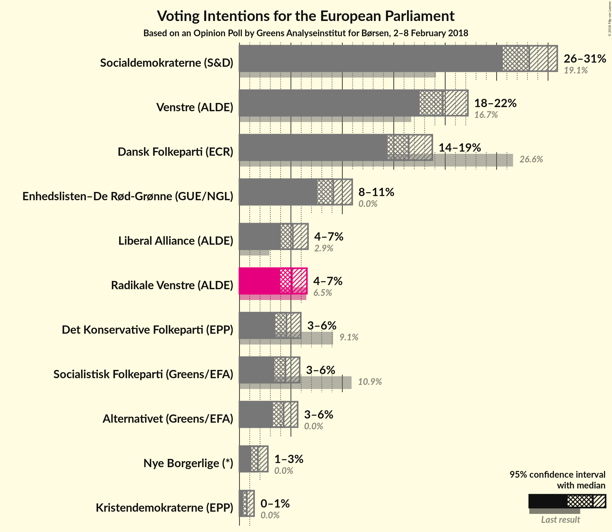
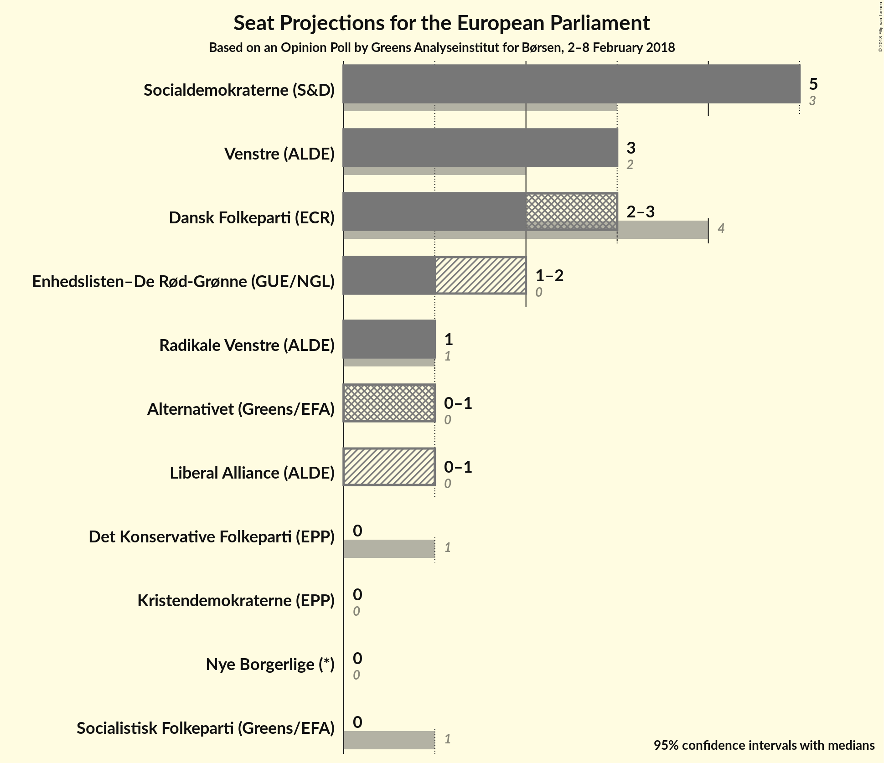

# Opinion Poll by Greens Analyseinstitut for Børsen, 2–8 February 2018

<a href="#voting-intentions">Voting Intentions</a> | <a href="#seats">Seats</a> | <a href="#coalitions">Coalitions</a> | <a href="#technical-information">Technical Information</a>

## Voting Intentions

### Confidence Intervals

| Party | Last Result | Poll Result | 80% Confidence Interval | 90% Confidence Interval | 95% Confidence Interval | 99% Confidence Interval |
|:-----:|:-----------:|:-----------:|:-----------------------:|:-----------------------:|:-----------------------:|:-----------------------:|
| Socialdemokraterne (S&D) | 19.1% | 28.2% | 26.5–29.9% |26.0–30.5% |25.6–30.9% |24.8–31.7% |
| Venstre (ALDE) | 16.7% | 19.8% | 18.3–21.4% |17.9–21.8% |17.5–22.2% |16.9–23.0% |
| Dansk Folkeparti (ECR) | 26.6% | 16.5% | 15.1–18.0% |14.7–18.4% |14.4–18.7% |13.8–19.5% |
| Enhedslisten–De Rød-Grønne (GUE/NGL) | 0.0% | 9.1% | 8.1–10.3% |7.8–10.7% |7.6–11.0% |7.1–11.6% |
| Liberal Alliance (ALDE) | 2.9% | 5.2% | 4.4–6.1% |4.2–6.4% |4.0–6.7% |3.7–7.1% |
| Radikale Venstre (ALDE) | 6.5% | 5.1% | 4.3–6.1% |4.1–6.3% |3.9–6.6% |3.6–7.0% |
| Det Konservative Folkeparti (EPP) | 9.1% | 4.6% | 3.9–5.5% |3.6–5.7% |3.5–6.0% |3.2–6.4% |
| Socialistisk Folkeparti (Greens/EFA) | 10.9% | 4.5% | 3.8–5.4% |3.6–5.6% |3.4–5.9% |3.1–6.3% |
| Alternativet (Greens/EFA) | 0.0% | 4.3% | N/A |N/A |N/A |N/A |
| Nye Borgerlige (*) | 0.0% | 1.8% | N/A |N/A |N/A |N/A |
| Kristendemokraterne (EPP) | 0.0% | 0.7% | 0.5–1.2% |0.4–1.3% |0.4–1.4% |0.3–1.7% |

*Note:* The poll result column reflects the actual value used in the calculations. Published results may vary slightly, and in addition be rounded to fewer digits.

## Seats

### Confidence Intervals

| Party | Last Result | Median | 80% Confidence Interval | 90% Confidence Interval | 95% Confidence Interval | 99% Confidence Interval |
|:-----:|:-----------:|:------:|:-----------------------:|:-----------------------:|:-----------------------:|:-----------------------:|
| <a href="#socialdemokraterne-(s&d)">Socialdemokraterne (S&D)</a> | 3 | 5 | 4–5 |4–5 |4–6 |4–6 |
| <a href="#venstre-(alde)">Venstre (ALDE)</a> | 2 | 3 | 3–4 |3–4 |3–4 |3–4 |
| <a href="#dansk-folkeparti-(ecr)">Dansk Folkeparti (ECR)</a> | 4 | 3 | 3 |2–3 |2–3 |2–3 |
| <a href="#enhedslisten–de-rød-grønne-(gue/ngl)">Enhedslisten–De Rød-Grønne (GUE/NGL)</a> | 0 | 1 | 1–2 |1–2 |1–2 |1–2 |
| <a href="#liberal-alliance-(alde)">Liberal Alliance (ALDE)</a> | 0 | 1 | 0–1 |0–1 |0–1 |0–1 |
| <a href="#radikale-venstre-(alde)">Radikale Venstre (ALDE)</a> | 1 | 0 | 0–1 |0–1 |0–1 |0–1 |
| <a href="#det-konservative-folkeparti-(epp)">Det Konservative Folkeparti (EPP)</a> | 1 | 0 | 0–1 |0–1 |0–1 |0–1 |
| <a href="#socialistisk-folkeparti-(greens/efa)">Socialistisk Folkeparti (Greens/EFA)</a> | 1 | 0 | 0–1 |0–1 |0–1 |0–1 |
| <a href="#alternativet-(greens/efa)">Alternativet (Greens/EFA)</a> | 0 | N/A | N/A |N/A |N/A |N/A |
| <a href="#nye-borgerlige-(*)">Nye Borgerlige (*)</a> | 0 | N/A | N/A |N/A |N/A |N/A |
| <a href="#kristendemokraterne-(epp)">Kristendemokraterne (EPP)</a> | 0 | 0 | 0 |0 |0 |0 |

