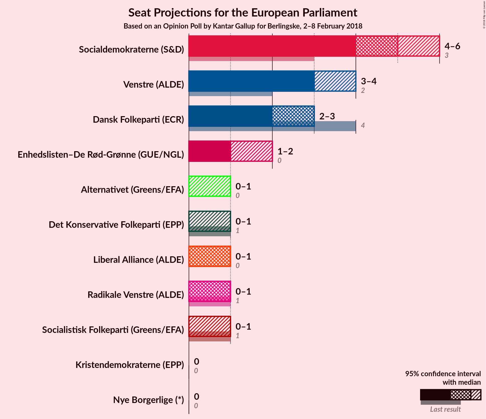

# Opinion Poll by Kantar Gallup for Berlingske, 2–8 February 2018

<a href="#voting-intentions">Voting Intentions</a> | <a href="#seats">Seats</a> | <a href="#coalitions">Coalitions</a> | <a href="#technical-information">Technical Information</a>

## Voting Intentions

### Confidence Intervals

| Party | Last Result | Poll Result | 80% Confidence Interval | 90% Confidence Interval | 95% Confidence Interval | 99% Confidence Interval |
|:-----:|:-----------:|:-----------:|:-----------------------:|:-----------------------:|:-----------------------:|:-----------------------:|
| Socialdemokraterne (S&D) | 19.1% | 29.0% | 27.5–30.5% |27.1–31.0% |26.7–31.3% |26.1–32.1% |
| Venstre (ALDE) | 16.7% | 19.4% | 18.1–20.7% |17.8–21.1% |17.5–21.4% |16.9–22.1% |
| Dansk Folkeparti (ECR) | 26.6% | 15.5% | 14.3–16.7% |14.0–17.1% |13.7–17.4% |13.2–18.0% |
| Enhedslisten–De Rød-Grønne (GUE/NGL) | 0.0% | 9.1% | 8.2–10.1% |8.0–10.4% |7.7–10.7% |7.3–11.2% |
| Liberal Alliance (ALDE) | 2.9% | 5.2% | 4.5–6.0% |4.3–6.2% |4.2–6.4% |3.9–6.9% |
| Radikale Venstre (ALDE) | 6.5% | 5.2% | 4.5–6.0% |4.3–6.2% |4.2–6.4% |3.9–6.9% |
| Socialistisk Folkeparti (Greens/EFA) | 10.9% | 4.9% | 4.2–5.7% |4.1–5.9% |3.9–6.1% |3.6–6.5% |
| Det Konservative Folkeparti (EPP) | 9.1% | 4.8% | 4.2–5.6% |4.0–5.8% |3.8–6.0% |3.6–6.4% |
| Alternativet (Greens/EFA) | 0.0% | 4.3% | N/A |N/A |N/A |N/A |
| Nye Borgerlige (*) | 0.0% | 1.5% | N/A |N/A |N/A |N/A |
| Kristendemokraterne (EPP) | 0.0% | 0.9% | 0.7–1.3% |0.6–1.4% |0.5–1.6% |0.4–1.8% |

*Note:* The poll result column reflects the actual value used in the calculations. Published results may vary slightly, and in addition be rounded to fewer digits.

## Seats

### Confidence Intervals

| Party | Last Result | Median | 80% Confidence Interval | 90% Confidence Interval | 95% Confidence Interval | 99% Confidence Interval |
|:-----:|:-----------:|:------:|:-----------------------:|:-----------------------:|:-----------------------:|:-----------------------:|
| <a href="#socialdemokraterne-(s&d)">Socialdemokraterne (S&D)</a> | 3 | 5 | 5 |5–6 |4–6 |4–6 |
| <a href="#venstre-(alde)">Venstre (ALDE)</a> | 2 | 3 | 3–4 |3–4 |3–4 |3–4 |
| <a href="#dansk-folkeparti-(ecr)">Dansk Folkeparti (ECR)</a> | 4 | 3 | 2–3 |2–3 |2–3 |2–3 |
| <a href="#enhedslisten–de-rød-grønne-(gue/ngl)">Enhedslisten–De Rød-Grønne (GUE/NGL)</a> | 0 | 1 | 1 |1 |1–2 |1–2 |
| <a href="#liberal-alliance-(alde)">Liberal Alliance (ALDE)</a> | 0 | 1 | 0–1 |0–1 |0–1 |0–1 |
| <a href="#radikale-venstre-(alde)">Radikale Venstre (ALDE)</a> | 1 | 1 | 0–1 |0–1 |0–1 |0–1 |
| <a href="#socialistisk-folkeparti-(greens/efa)">Socialistisk Folkeparti (Greens/EFA)</a> | 1 | 0 | 0–1 |0–1 |0–1 |0–1 |
| <a href="#det-konservative-folkeparti-(epp)">Det Konservative Folkeparti (EPP)</a> | 1 | 0 | 0–1 |0–1 |0–1 |0–1 |
| <a href="#alternativet-(greens/efa)">Alternativet (Greens/EFA)</a> | 0 | N/A | N/A |N/A |N/A |N/A |
| <a href="#nye-borgerlige-(*)">Nye Borgerlige (*)</a> | 0 | N/A | N/A |N/A |N/A |N/A |
| <a href="#kristendemokraterne-(epp)">Kristendemokraterne (EPP)</a> | 0 | 0 | 0 |0 |0 |0 |

