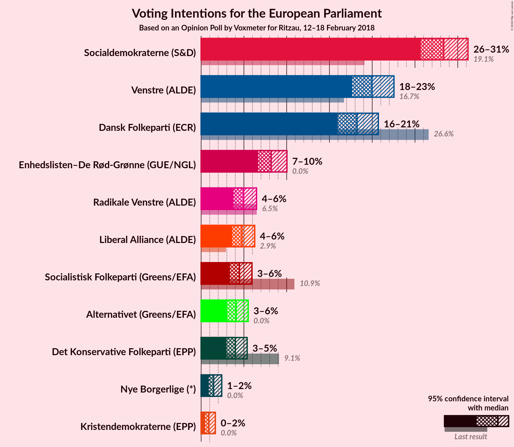
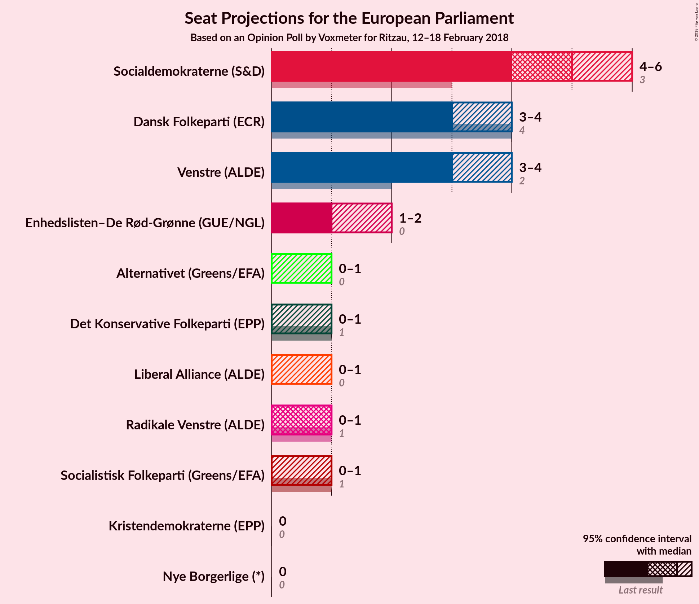
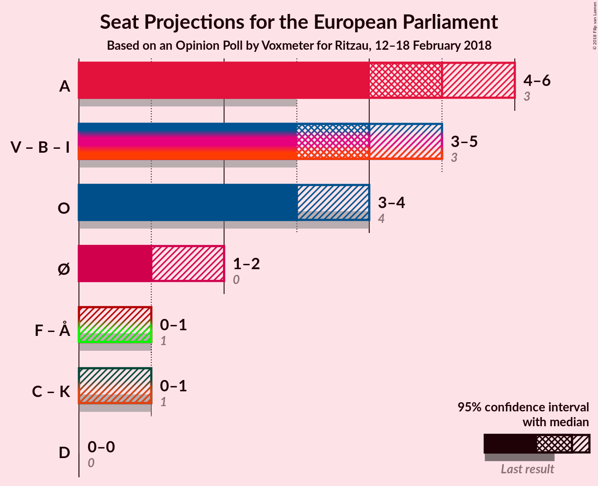

# Opinion Poll by Voxmeter for Ritzau, 12–18 February 2018

<a href="#voting-intentions">Voting Intentions</a> | <a href="#seats">Seats</a> | <a href="#coalitions">Coalitions</a> | <a href="#technical-information">Technical Information</a>

## Voting Intentions

### Confidence Intervals

| Party | Last Result | Poll Result | 80% Confidence Interval | 90% Confidence Interval | 95% Confidence Interval | 99% Confidence Interval |
|:-----:|:-----------:|:-----------:|:-----------------------:|:-----------------------:|:-----------------------:|:-----------------------:|
| Socialdemokraterne (S&D) | 19.1% | 28.4% | N/A |N/A |N/A |N/A |
| Venstre (ALDE) | 16.7% | 20.0% | N/A |N/A |N/A |N/A |
| Dansk Folkeparti (ECR) | 26.6% | 18.2% | N/A |N/A |N/A |N/A |
| Enhedslisten–De Rød-Grønne (GUE/NGL) | 0.0% | 8.2% | N/A |N/A |N/A |N/A |
| Radikale Venstre (ALDE) | 6.5% | 5.0% | N/A |N/A |N/A |N/A |
| Liberal Alliance (ALDE) | 2.9% | 4.8% | N/A |N/A |N/A |N/A |
| Socialistisk Folkeparti (Greens/EFA) | 10.9% | 4.5% | N/A |N/A |N/A |N/A |
| Alternativet (—) | 0.0% | 4.1% | N/A |N/A |N/A |N/A |
| Det Konservative Folkeparti (EPP) | 9.1% | 4.0% | N/A |N/A |N/A |N/A |
| Nye Borgerlige (—) | 0.0% | 1.5% | N/A |N/A |N/A |N/A |
| Kristendemokraterne (EPP) | 0.0% | 0.9% | N/A |N/A |N/A |N/A |

*Note:* The poll result column reflects the actual value used in the calculations. Published results may vary slightly, and in addition be rounded to fewer digits.

## Seats

### Confidence Intervals

| Party | Last Result | Median | 80% Confidence Interval | 90% Confidence Interval | 95% Confidence Interval | 99% Confidence Interval |
|:-----:|:-----------:|:------:|:-----------------------:|:-----------------------:|:-----------------------:|:-----------------------:|
| <a href="#socialdemokraterne-(s&d)">Socialdemokraterne (S&D)</a> | 3 | N/A | N/A |N/A |N/A |N/A |
| <a href="#venstre-(alde)">Venstre (ALDE)</a> | 2 | N/A | N/A |N/A |N/A |N/A |
| <a href="#dansk-folkeparti-(ecr)">Dansk Folkeparti (ECR)</a> | 4 | N/A | N/A |N/A |N/A |N/A |
| <a href="#enhedslisten–de-rød-grønne-(gue/ngl)">Enhedslisten–De Rød-Grønne (GUE/NGL)</a> | 0 | N/A | N/A |N/A |N/A |N/A |
| <a href="#radikale-venstre-(alde)">Radikale Venstre (ALDE)</a> | 1 | N/A | N/A |N/A |N/A |N/A |
| <a href="#liberal-alliance-(alde)">Liberal Alliance (ALDE)</a> | 0 | N/A | N/A |N/A |N/A |N/A |
| <a href="#socialistisk-folkeparti-(greens/efa)">Socialistisk Folkeparti (Greens/EFA)</a> | 1 | N/A | N/A |N/A |N/A |N/A |
| <a href="#alternativet-(—)">Alternativet (—)</a> | 0 | N/A | N/A |N/A |N/A |N/A |
| <a href="#det-konservative-folkeparti-(epp)">Det Konservative Folkeparti (EPP)</a> | 1 | N/A | N/A |N/A |N/A |N/A |
| <a href="#nye-borgerlige-(—)">Nye Borgerlige (—)</a> | 0 | N/A | N/A |N/A |N/A |N/A |
| <a href="#kristendemokraterne-(epp)">Kristendemokraterne (EPP)</a> | 0 | N/A | N/A |N/A |N/A |N/A |

## Coalitions

## Technical Information

### Opinion Poll

+ **Polling firm:** Voxmeter
+ **Commissioner(s):** Ritzau
+ **Fieldwork period:** 12–18 February 2018

### Calculations

+ **Sample size:** 1026
+ **Simulations done:** 0
+ **Error estimate:** 100.00%

