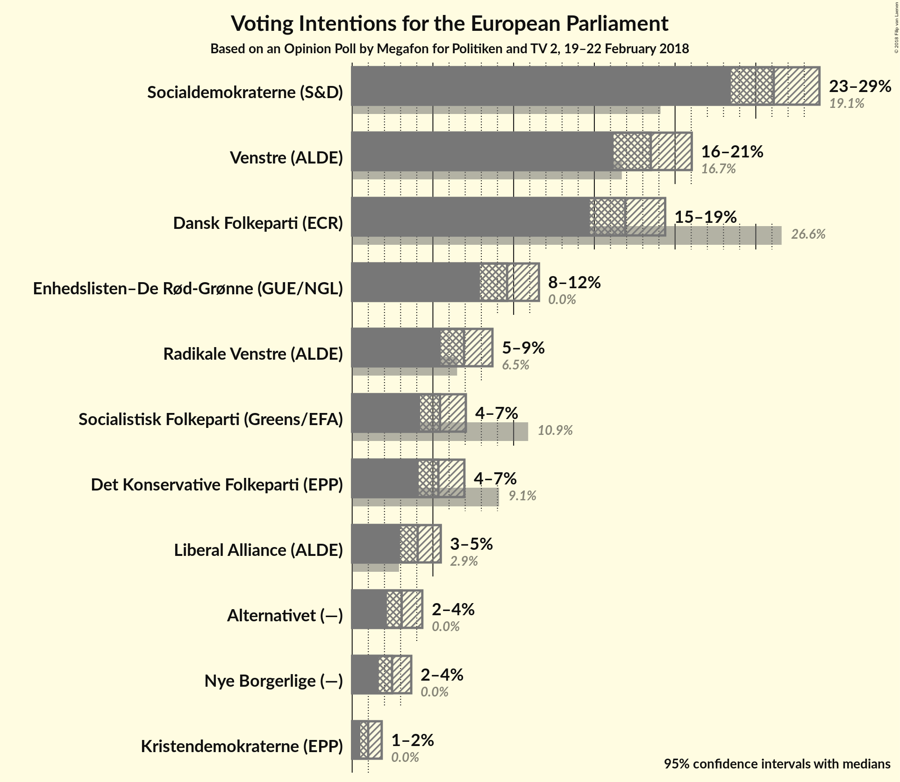
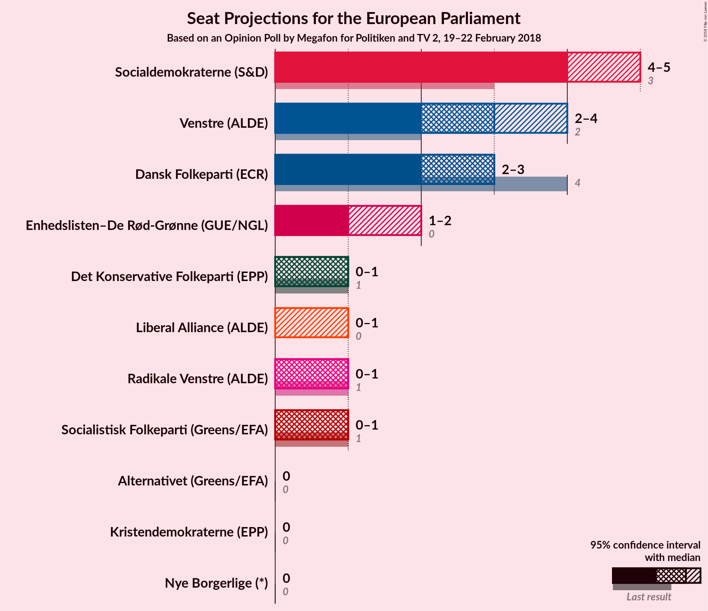

# Opinion Poll by Megafon for Politiken and TV 2, 19–22 February 2018

<a href="#voting-intentions">Voting Intentions</a> | <a href="#seats">Seats</a> | <a href="#coalitions">Coalitions</a> | <a href="#technical-information">Technical Information</a>

## Voting Intentions

### Confidence Intervals

| Party | Last Result | Poll Result | 80% Confidence Interval | 90% Confidence Interval | 95% Confidence Interval | 99% Confidence Interval |
|:-----:|:-----------:|:-----------:|:-----------------------:|:-----------------------:|:-----------------------:|:-----------------------:|
| Socialdemokraterne (S&D) | 19.1% | 26.1% | 24.4–28.0% |23.9–28.5% |23.5–28.9% |22.7–29.8% |
| Venstre (ALDE) | 16.7% | 18.5% | 17.0–20.2% |16.6–20.6% |16.2–21.0% |15.5–21.9% |
| Dansk Folkeparti (ECR) | 26.6% | 16.9% | 15.5–18.5% |15.0–19.0% |14.7–19.4% |14.0–20.2% |
| Enhedslisten–De Rød-Grønne (GUE/NGL) | 0.0% | 9.6% | 8.5–10.9% |8.2–11.2% |7.9–11.6% |7.4–12.3% |
| Radikale Venstre (ALDE) | 6.5% | 6.9% | 6.0–8.1% |5.7–8.4% |5.5–8.7% |5.1–9.2% |
| Socialistisk Folkeparti (Greens/EFA) | 10.9% | 5.4% | 4.6–6.5% |4.4–6.8% |4.2–7.0% |3.8–7.5% |
| Det Konservative Folkeparti (EPP) | 9.1% | 5.3% | 4.5–6.4% |4.3–6.7% |4.1–7.0% |3.7–7.5% |
| Liberal Alliance (ALDE) | 2.9% | 4.1% | 3.3–5.0% |3.2–5.3% |3.0–5.5% |2.7–5.9% |
| Alternativet (—) | 0.0% | 3.1% | 2.5–3.9% |2.3–4.1% |2.1–4.3% |1.9–4.8% |
| Nye Borgerlige (—) | 0.0% | 2.5% | 1.9–3.2% |1.8–3.5% |1.6–3.7% |1.5–4.0% |
| Kristendemokraterne (EPP) | 0.0% | 1.0% | 0.7–1.6% |0.6–1.7% |0.5–1.8% |0.4–2.1% |

*Note:* The poll result column reflects the actual value used in the calculations. Published results may vary slightly, and in addition be rounded to fewer digits.

## Seats

### Confidence Intervals

| Party | Last Result | Median | 80% Confidence Interval | 90% Confidence Interval | 95% Confidence Interval | 99% Confidence Interval |
|:-----:|:-----------:|:------:|:-----------------------:|:-----------------------:|:-----------------------:|:-----------------------:|
| <a href="#socialdemokraterne-(s&d)">Socialdemokraterne (S&D)</a> | 3 | N/A | N/A |N/A |N/A |N/A |
| <a href="#venstre-(alde)">Venstre (ALDE)</a> | 2 | N/A | N/A |N/A |N/A |N/A |
| <a href="#dansk-folkeparti-(ecr)">Dansk Folkeparti (ECR)</a> | 4 | N/A | N/A |N/A |N/A |N/A |
| <a href="#enhedslisten–de-rød-grønne-(gue/ngl)">Enhedslisten–De Rød-Grønne (GUE/NGL)</a> | 0 | N/A | N/A |N/A |N/A |N/A |
| <a href="#radikale-venstre-(alde)">Radikale Venstre (ALDE)</a> | 1 | N/A | N/A |N/A |N/A |N/A |
| <a href="#socialistisk-folkeparti-(greens/efa)">Socialistisk Folkeparti (Greens/EFA)</a> | 1 | N/A | N/A |N/A |N/A |N/A |
| <a href="#det-konservative-folkeparti-(epp)">Det Konservative Folkeparti (EPP)</a> | 1 | N/A | N/A |N/A |N/A |N/A |
| <a href="#liberal-alliance-(alde)">Liberal Alliance (ALDE)</a> | 0 | N/A | N/A |N/A |N/A |N/A |
| <a href="#alternativet-(—)">Alternativet (—)</a> | 0 | N/A | N/A |N/A |N/A |N/A |
| <a href="#nye-borgerlige-(—)">Nye Borgerlige (—)</a> | 0 | N/A | N/A |N/A |N/A |N/A |
| <a href="#kristendemokraterne-(epp)">Kristendemokraterne (EPP)</a> | 0 | N/A | N/A |N/A |N/A |N/A |

## Coalitions

## Technical Information

### Opinion Poll

+ **Polling firm:** Megafon
+ **Commissioner(s):** Politiken and TV 2
+ **Fieldwork period:** 19–22 February 2018

### Calculations

+ **Sample size:** 1011
+ **Simulations done:** 0
+ **Error estimate:** 100.00%

