# Poll Average

<a href="#voting-intentions">Voting Intentions</a> | <a href="#seats">Seats</a> | <a href="#coalitions">Coalitions</a> | <a href="#technical-information">Technical Information</a>

## Summary

The table below lists the polls on which the average is based. They are the most recent polls (less than 90 days old) registered and analyzed so far.

| Period     | Polling firm/Commissioner(s) | O | A | V | F | C | B | I | Å | Ø | K | D | E | P |
|:----------:|:----------------------------:|:--:|:--:|:--:|:--:|:--:|:--:|:--:|:--:|:--:|:--:|:--:|:--:|:--:|
| 25 May 2014 | General Election | 26.6%   4 | 19.1%   3 | 16.7%   2 | 10.9%   1 | 9.1%   1 | 6.5%   1 | 2.9%   0 | 0.0%   0 | 0.0%   0 | 0.0%   0 | 0.0%   0 | 0.0%   0 | 0.0%   0 |
| N/A | Poll Average | 10–15%   1–2 | 23–30%   4–5 | 16–21%   3–4 | 6–9%   1 | 3–6%   0–1 | 5–10%   0–1 | 2–6%   0 | 2–5%   0 | 7–12%   1–2 | 0–2%   0 | 1–5%   0–1 | 0–2%   0 | 2–5%   0–1 |
| [7–11 May 2019](2019-05-11-YouGov.html) | YouGov | 10–14%   1–2 | 25–30%   4–5 | 15–20%   2–3 | 6–9%   1 | 4–7%   0–1 | 4–7%   0–1 | 2–4%   0 | 3–6%   0 | 6–9%   1 | 0–1%   0 | 3–6%   0–1 | 0–1%   0 | 3–5%   0–1 |
| [9–11 May 2019](2019-05-11-Voxmeter.html) | Voxmeter   Ritzau | 10–14%   2 | 26–31%   4–5 | 17–22%   3–4 | 5–8%   1 | 4–6%   0–1 | 5–9%   1 | 2–5%   0 | 2–5%   0 | 8–12%   1–2 | 1–3%   0 | 1–2%   0 | 0–1%   0 | 2–3%   0 |
| [8–10 May 2019](2019-05-10-Megafon.html) | Megafon   Politiken and TV 2 | 9–13%   1–2 | 22–27%   4–5 | 17–22%   3–4 | 6–10%   1 | 4–6%   0–1 | 7–10%   1–2 | 3–5%   0–1 | 2–4%   0 | 8–11%   1–2 | 1–2%   0 | 2–4%   0 | 0–1%   0 | 2–4%   0 |
| [2–8 May 2019](2019-05-08-Norstat.html) | Norstat   Altinget and Jyllands-Posten | 11–15%   2 | 26–31%   5 | 15–20%   3 | 6–8%   1 | 3–6%   0 | 5–8%   1 | 3–5%   0 | 3–5%   0 | 8–11%   1 | 1–2%   0 | 1–3%   0 | 0–1%   0 | 3–5%   0 |
| [8 May 2019](2019-05-08-KantarGallup.html) | Kantar Gallup   Berlingske | 11–14%   2–3 | 22–26%   4–5 | 16–20%   3 | 6–9%   1 | 4–6%   0–1 | 7–10%   1–2 | 3–5%   0 | 2–4%   0 | 8–11%   1–2 | 1–2%   0 | 2–4%   0 | 1–2%   0 | 3–4%   0 |
| [7 May 2019](2019-05-07-GreensAnalyseinstitut.html) | Greens Analyseinstitut   Børsen | 10–14%   1–2 | 25–30%   4–5 | 17–22%   3–4 | 5–8%   1 | 3–5%   0 | 6–9%   1 | 4–6%   0 | 2–4%   0 | 9–12%   1–2 | 1–2%   0 | 1–2%   0 | 0–1%   0 | 2–4%   0 |
| [7 May 2019](2019-05-07-Epinion.html) | Epinion   DR | 12–16%   2 | 26–30%   5 | 16–19%   2–3 | 6–8%   1 | 4–6%   0–1 | 4–7%   0–1 | 3–5%   0 | 3–5%   0 | 8–10%   1 | 0–1%   0 | 2–4%   0 | 0–1%   0 | 2–4%   0 |
| 25 May 2014 | General Election | 26.6%   4 | 19.1%   3 | 16.7%   2 | 10.9%   1 | 9.1%   1 | 6.5%   1 | 2.9%   0 | 0.0%   0 | 0.0%   0 | 0.0%   0 | 0.0%   0 | 0.0%   0 | 0.0%   0 |

Only polls for which at least the sample size has been published are included in the table above.

**Legend:**
+ **Top half of each row:** Voting intentions (95% confidence interval)
+ **Bottom half of each row:** Seat projections for the European Parliament (95% confidence interval)
+ **O:** Dansk Folkeparti (EAPN)
+ **A:** Socialdemokraterne (S&D)
+ **V:** Venstre (ALDE)
+ **F:** Socialistisk Folkeparti (Greens/EFA)
+ **C:** Det Konservative Folkeparti (EPP)
+ **B:** Radikale Venstre (ALDE)
+ **I:** Liberal Alliance (ALDE)
+ **Å:** Alternativet (Greens/EFA)
+ **Ø:** Enhedslisten–De Rød-Grønne (GUE/NGL)
+ **K:** Kristendemokraterne (EPP)
+ **D:** Nye Borgerlige (*)
+ **E:** Klaus Riskær Pedersen (*)
+ **P:** Stram Kurs (*)
+ **N/A (single party):** Party not included the published results
+ **N/A (entire row):** Calculation for this opinion poll not started yet

## Voting Intentions

### Confidence Intervals

| Party | Last Result | Median | 80% Confidence Interval | 90% Confidence Interval | 95% Confidence Interval | 99% Confidence Interval |
|:-----:|:-----------:|:------:|:-----------------------:|:-----------------------:|:-----------------------:|:-----------------------:|
| <a href="#dansk-folkeparti-(eapn)">Dansk Folkeparti (EAPN)</a> | 26.6% | 12.4% | 10.7–14.0% |10.2–14.5% | 9.8–14.9% | 9.1–15.6% |
| <a href="#socialdemokraterne-(s&d)">Socialdemokraterne (S&D)</a> | 19.1% | 27.3% | 24.1–29.4% |23.4–30.0% | 22.9–30.4% | 22.1–31.4% |
| <a href="#venstre-(alde)">Venstre (ALDE)</a> | 16.7% | 18.2% | 16.6–20.2% |16.1–20.8% | 15.8–21.3% | 15.1–22.2% |
| <a href="#socialistisk-folkeparti-(greens/efa)">Socialistisk Folkeparti (Greens/EFA)</a> | 10.9% | 7.2% | 6.1–8.3% |5.8–8.7% | 5.6–9.1% | 5.2–9.8% |
| <a href="#det-konservative-folkeparti-(epp)">Det Konservative Folkeparti (EPP)</a> | 9.1% | 4.8% | 3.7–5.9% |3.3–6.2% | 3.1–6.5% | 2.6–7.1% |
| <a href="#radikale-venstre-(alde)">Radikale Venstre (ALDE)</a> | 6.5% | 6.9% | 5.3–8.8% |5.1–9.2% | 4.8–9.6% | 4.4–10.2% |
| <a href="#liberal-alliance-(alde)">Liberal Alliance (ALDE)</a> | 2.9% | 3.8% | 2.9–4.9% |2.6–5.2% | 2.4–5.6% | 2.1–6.2% |
| <a href="#alternativet-(greens/efa)">Alternativet (Greens/EFA)</a> | 0.0% | 3.6% | 2.7–4.7% |2.5–5.0% | 2.3–5.2% | 2.0–5.7% |
| <a href="#enhedslisten–de-rød-grønne-(gue/ngl)">Enhedslisten–De Rød-Grønne (GUE/NGL)</a> | 0.0% | 9.3% | 7.8–10.7% |7.3–11.2% | 6.9–11.6% | 6.2–12.4% |
| <a href="#kristendemokraterne-(epp)">Kristendemokraterne (EPP)</a> | 0.0% | 1.2% | 0.4–1.8% |0.3–2.0% | 0.3–2.2% | 0.2–2.6% |
| <a href="#nye-borgerlige-(*)">Nye Borgerlige (*)</a> | 0.0% | 2.5% | 1.1–4.0% |0.9–4.5% | 0.7–4.9% | 0.5–5.5% |
| <a href="#klaus-riskær-pedersen-(*)">Klaus Riskær Pedersen (*)</a> | 0.0% | 0.4% | 0.2–1.1% |0.1–1.3% | 0.1–1.5% | 0.1–1.7% |
| <a href="#stram-kurs-(*)">Stram Kurs (*)</a> | 0.0% | 3.0% | 2.1–4.1% |1.9–4.5% | 1.8–4.7% | 1.5–5.3% |

### Dansk Folkeparti (EAPN)

*For a full overview of the results for this party, see the [Dansk Folkeparti (EAPN)](party-danskfolkepartieapn.html) page.*

| Voting Intentions | Probability | Accumulated | Special Marks |
|:-----------------:|:-----------:|:-----------:|:-------------:|
| 6.5–7.5% | 0% | 100% |  |
| 7.5–8.5% | 0.1% | 100% |  |
| 8.5–9.5% | 1.3% | 99.9% |  |
| 9.5–10.5% | 7% | 98.6% |  |
| 10.5–11.5% | 19% | 92% |  |
| 11.5–12.5% | 29% | 73% | Median |
| 12.5–13.5% | 26% | 44% |  |
| 13.5–14.5% | 13% | 18% |  |
| 14.5–15.5% | 4% | 4% |  |
| 15.5–16.5% | 0.5% | 0.5% |  |
| 16.5–17.5% | 0% | 0% |  |
| 17.5–18.5% | 0% | 0% |  |
| 18.5–19.5% | 0% | 0% |  |
| 19.5–20.5% | 0% | 0% |  |
| 20.5–21.5% | 0% | 0% |  |
| 21.5–22.5% | 0% | 0% |  |
| 22.5–23.5% | 0% | 0% |  |
| 23.5–24.5% | 0% | 0% |  |
| 24.5–25.5% | 0% | 0% |  |
| 25.5–26.5% | 0% | 0% |  |
| 26.5–27.5% | 0% | 0% | Last Result |

### Socialdemokraterne (S&D)

*For a full overview of the results for this party, see the [Socialdemokraterne (S&D)](party-socialdemokraternesd.html) page.*

| Voting Intentions | Probability | Accumulated | Special Marks |
|:-----------------:|:-----------:|:-----------:|:-------------:|
| 18.5–19.5% | 0% | 100% | Last Result |
| 19.5–20.5% | 0% | 100% |  |
| 20.5–21.5% | 0.1% | 100% |  |
| 21.5–22.5% | 1.1% | 99.8% |  |
| 22.5–23.5% | 5% | 98.7% |  |
| 23.5–24.5% | 9% | 94% |  |
| 24.5–25.5% | 10% | 85% |  |
| 25.5–26.5% | 12% | 75% |  |
| 26.5–27.5% | 18% | 62% | Median |
| 27.5–28.5% | 21% | 44% |  |
| 28.5–29.5% | 15% | 24% |  |
| 29.5–30.5% | 6% | 9% |  |
| 30.5–31.5% | 2% | 2% |  |
| 31.5–32.5% | 0.3% | 0.3% |  |
| 32.5–33.5% | 0% | 0% |  |

### Venstre (ALDE)

*For a full overview of the results for this party, see the [Venstre (ALDE)](party-venstrealde.html) page.*

| Voting Intentions | Probability | Accumulated | Special Marks |
|:-----------------:|:-----------:|:-----------:|:-------------:|
| 12.5–13.5% | 0% | 100% |  |
| 13.5–14.5% | 0.1% | 100% |  |
| 14.5–15.5% | 1.4% | 99.9% |  |
| 15.5–16.5% | 8% | 98% |  |
| 16.5–17.5% | 21% | 90% | Last Result |
| 17.5–18.5% | 28% | 69% | Median |
| 18.5–19.5% | 22% | 42% |  |
| 19.5–20.5% | 13% | 20% |  |
| 20.5–21.5% | 5% | 7% |  |
| 21.5–22.5% | 1.4% | 2% |  |
| 22.5–23.5% | 0.2% | 0.2% |  |
| 23.5–24.5% | 0% | 0% |  |

### Socialistisk Folkeparti (Greens/EFA)

*For a full overview of the results for this party, see the [Socialistisk Folkeparti (Greens/EFA)](party-socialistiskfolkepartigreensefa.html) page.*

| Voting Intentions | Probability | Accumulated | Special Marks |
|:-----------------:|:-----------:|:-----------:|:-------------:|
| 3.5–4.5% | 0% | 100% |  |
| 4.5–5.5% | 2% | 100% |  |
| 5.5–6.5% | 21% | 98% |  |
| 6.5–7.5% | 44% | 77% | Median |
| 7.5–8.5% | 26% | 33% |  |
| 8.5–9.5% | 6% | 7% |  |
| 9.5–10.5% | 0.8% | 0.9% |  |
| 10.5–11.5% | 0.1% | 0.1% | Last Result |
| 11.5–12.5% | 0% | 0% |  |

### Det Konservative Folkeparti (EPP)

*For a full overview of the results for this party, see the [Det Konservative Folkeparti (EPP)](party-detkonservativefolkepartiepp.html) page.*

| Voting Intentions | Probability | Accumulated | Special Marks |
|:-----------------:|:-----------:|:-----------:|:-------------:|
| 0.5–1.5% | 0% | 100% |  |
| 1.5–2.5% | 0.3% | 100% |  |
| 2.5–3.5% | 8% | 99.7% |  |
| 3.5–4.5% | 30% | 92% |  |
| 4.5–5.5% | 43% | 62% | Median |
| 5.5–6.5% | 17% | 19% |  |
| 6.5–7.5% | 2% | 2% |  |
| 7.5–8.5% | 0.1% | 0.1% |  |
| 8.5–9.5% | 0% | 0% | Last Result |

### Radikale Venstre (ALDE)

*For a full overview of the results for this party, see the [Radikale Venstre (ALDE)](party-radikalevenstrealde.html) page.*

| Voting Intentions | Probability | Accumulated | Special Marks |
|:-----------------:|:-----------:|:-----------:|:-------------:|
| 2.5–3.5% | 0% | 100% |  |
| 3.5–4.5% | 0.9% | 100% |  |
| 4.5–5.5% | 14% | 99.1% |  |
| 5.5–6.5% | 27% | 85% |  |
| 6.5–7.5% | 24% | 58% | Last Result, Median |
| 7.5–8.5% | 20% | 34% |  |
| 8.5–9.5% | 11% | 14% |  |
| 9.5–10.5% | 2% | 3% |  |
| 10.5–11.5% | 0.2% | 0.2% |  |
| 11.5–12.5% | 0% | 0% |  |

### Liberal Alliance (ALDE)

*For a full overview of the results for this party, see the [Liberal Alliance (ALDE)](party-liberalalliancealde.html) page.*

| Voting Intentions | Probability | Accumulated | Special Marks |
|:-----------------:|:-----------:|:-----------:|:-------------:|
| 0.5–1.5% | 0% | 100% |  |
| 1.5–2.5% | 4% | 100% |  |
| 2.5–3.5% | 34% | 96% | Last Result |
| 3.5–4.5% | 45% | 62% | Median |
| 4.5–5.5% | 14% | 17% |  |
| 5.5–6.5% | 2% | 3% |  |
| 6.5–7.5% | 0.1% | 0.1% |  |
| 7.5–8.5% | 0% | 0% |  |

### Enhedslisten–De Rød-Grønne (GUE/NGL)

*For a full overview of the results for this party, see the [Enhedslisten–De Rød-Grønne (GUE/NGL)](party-enhedslisten–derød-grønneguengl.html) page.*

| Voting Intentions | Probability | Accumulated | Special Marks |
|:-----------------:|:-----------:|:-----------:|:-------------:|
| 0.0–0.5% | 0% | 100% | Last Result |
| 0.5–1.5% | 0% | 100% |  |
| 1.5–2.5% | 0% | 100% |  |
| 2.5–3.5% | 0% | 100% |  |
| 3.5–4.5% | 0% | 100% |  |
| 4.5–5.5% | 0% | 100% |  |
| 5.5–6.5% | 1.2% | 100% |  |
| 6.5–7.5% | 6% | 98.8% |  |
| 7.5–8.5% | 18% | 93% |  |
| 8.5–9.5% | 35% | 75% | Median |
| 9.5–10.5% | 26% | 39% |  |
| 10.5–11.5% | 10% | 13% |  |
| 11.5–12.5% | 2% | 3% |  |
| 12.5–13.5% | 0.3% | 0.3% |  |
| 13.5–14.5% | 0% | 0% |  |

### Alternativet (Greens/EFA)

*For a full overview of the results for this party, see the [Alternativet (Greens/EFA)](party-alternativetgreensefa.html) page.*

| Voting Intentions | Probability | Accumulated | Special Marks |
|:-----------------:|:-----------:|:-----------:|:-------------:|
| 0.0–0.5% | 0% | 100% | Last Result |
| 0.5–1.5% | 0% | 100% |  |
| 1.5–2.5% | 6% | 100% |  |
| 2.5–3.5% | 42% | 94% |  |
| 3.5–4.5% | 39% | 52% | Median |
| 4.5–5.5% | 12% | 13% |  |
| 5.5–6.5% | 0.8% | 0.9% |  |
| 6.5–7.5% | 0% | 0% |  |

### Kristendemokraterne (EPP)

*For a full overview of the results for this party, see the [Kristendemokraterne (EPP)](party-kristendemokraterneepp.html) page.*

| Voting Intentions | Probability | Accumulated | Special Marks |
|:-----------------:|:-----------:|:-----------:|:-------------:|
| 0.0–0.5% | 15% | 100% | Last Result |
| 0.5–1.5% | 63% | 85% | Median |
| 1.5–2.5% | 22% | 23% |  |
| 2.5–3.5% | 0.6% | 0.6% |  |
| 3.5–4.5% | 0% | 0% |  |

### Nye Borgerlige (*)

*For a full overview of the results for this party, see the [Nye Borgerlige (*)](party-nyeborgerlige.html) page.*

| Voting Intentions | Probability | Accumulated | Special Marks |
|:-----------------:|:-----------:|:-----------:|:-------------:|
| 0.0–0.5% | 0.6% | 100% | Last Result |
| 0.5–1.5% | 21% | 99.4% |  |
| 1.5–2.5% | 29% | 78% |  |
| 2.5–3.5% | 33% | 49% | Median |
| 3.5–4.5% | 11% | 16% |  |
| 4.5–5.5% | 4% | 5% |  |
| 5.5–6.5% | 0.4% | 0.5% |  |
| 6.5–7.5% | 0% | 0% |  |

### Klaus Riskær Pedersen (*)

*For a full overview of the results for this party, see the [Klaus Riskær Pedersen (*)](party-klausriskærpedersen.html) page.*

| Voting Intentions | Probability | Accumulated | Special Marks |
|:-----------------:|:-----------:|:-----------:|:-------------:|
| 0.0–0.5% | 60% | 100% | Last Result, Median |
| 0.5–1.5% | 39% | 40% |  |
| 1.5–2.5% | 1.4% | 1.4% |  |
| 2.5–3.5% | 0% | 0% |  |

### Stram Kurs (*)

*For a full overview of the results for this party, see the [Stram Kurs (*)](party-stramkurs.html) page.*

| Voting Intentions | Probability | Accumulated | Special Marks |
|:-----------------:|:-----------:|:-----------:|:-------------:|
| 0.0–0.5% | 0% | 100% | Last Result |
| 0.5–1.5% | 0.6% | 100% |  |
| 1.5–2.5% | 27% | 99.4% |  |
| 2.5–3.5% | 47% | 72% | Median |
| 3.5–4.5% | 22% | 26% |  |
| 4.5–5.5% | 4% | 4% |  |
| 5.5–6.5% | 0.2% | 0.2% |  |
| 6.5–7.5% | 0% | 0% |  |

## Seats

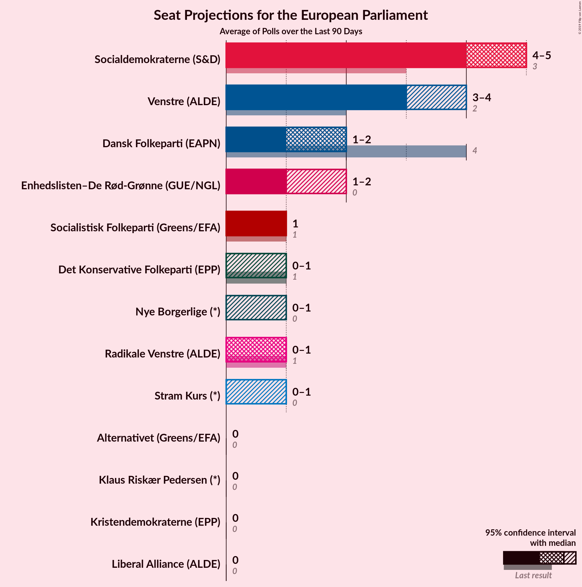

### Confidence Intervals

| Party | Last Result | Median | 80% Confidence Interval | 90% Confidence Interval | 95% Confidence Interval | 99% Confidence Interval |
|:-----:|:-----------:|:------:|:-----------------------:|:-----------------------:|:-----------------------:|:-----------------------:|
| <a href="#dansk-folkeparti-(eapn)">Dansk Folkeparti (EAPN)</a> | 4 | 2 | 1–2 |1–2 | 1–2 | 1–3 |
| <a href="#socialdemokraterne-(s&d)">Socialdemokraterne (S&D)</a> | 3 | 5 | 4–5 |4–5 | 4–5 | 4–5 |
| <a href="#venstre-(alde)">Venstre (ALDE)</a> | 2 | 3 | 3 |3 | 3–4 | 2–4 |
| <a href="#socialistisk-folkeparti-(greens/efa)">Socialistisk Folkeparti (Greens/EFA)</a> | 1 | 1 | 1 |1 | 1 | 1 |
| <a href="#det-konservative-folkeparti-(epp)">Det Konservative Folkeparti (EPP)</a> | 1 | 0 | 0–1 |0–1 | 0–1 | 0–1 |
| <a href="#radikale-venstre-(alde)">Radikale Venstre (ALDE)</a> | 1 | 1 | 0–1 |0–1 | 0–1 | 0–2 |
| <a href="#liberal-alliance-(alde)">Liberal Alliance (ALDE)</a> | 0 | 0 | 0 |0 | 0 | 0–1 |
| <a href="#alternativet-(greens/efa)">Alternativet (Greens/EFA)</a> | 0 | 0 | 0 |0 | 0 | 0 |
| <a href="#enhedslisten–de-rød-grønne-(gue/ngl)">Enhedslisten–De Rød-Grønne (GUE/NGL)</a> | 0 | 1 | 1–2 |1–2 | 1–2 | 1–2 |
| <a href="#kristendemokraterne-(epp)">Kristendemokraterne (EPP)</a> | 0 | 0 | 0 |0 | 0 | 0 |
| <a href="#nye-borgerlige-(*)">Nye Borgerlige (*)</a> | 0 | 0 | 0 |0–1 | 0–1 | 0–1 |
| <a href="#klaus-riskær-pedersen-(*)">Klaus Riskær Pedersen (*)</a> | 0 | 0 | 0 |0 | 0 | 0 |
| <a href="#stram-kurs-(*)">Stram Kurs (*)</a> | 0 | 0 | 0 |0–1 | 0–1 | 0–1 |

### Dansk Folkeparti (EAPN)

*For a full overview of the results for this party, see the [Dansk Folkeparti (EAPN)](party-danskfolkepartieapn.html) page.*

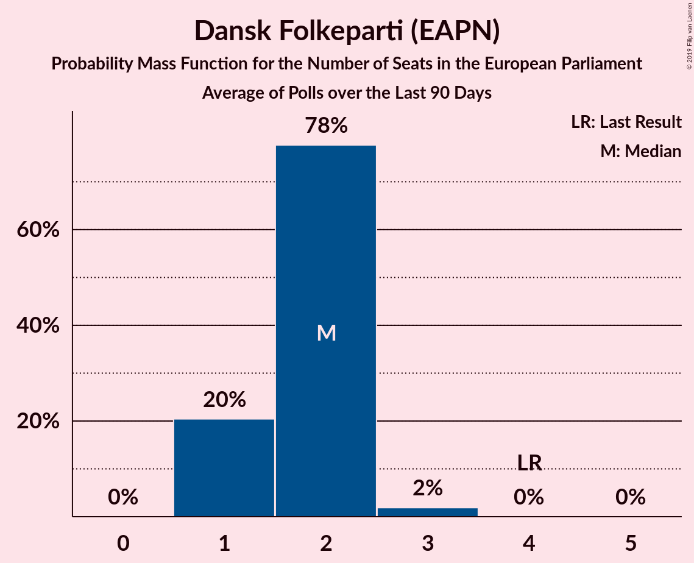

| Number of Seats | Probability | Accumulated | Special Marks |
|:---------------:|:-----------:|:-----------:|:-------------:|
| 1 | 20% | 100% |  |
| 2 | 78% | 80% | Median |
| 3 | 2% | 2% |  |
| 4 | 0% | 0% | Last Result |

### Socialdemokraterne (S&D)

*For a full overview of the results for this party, see the [Socialdemokraterne (S&D)](party-socialdemokraternesd.html) page.*

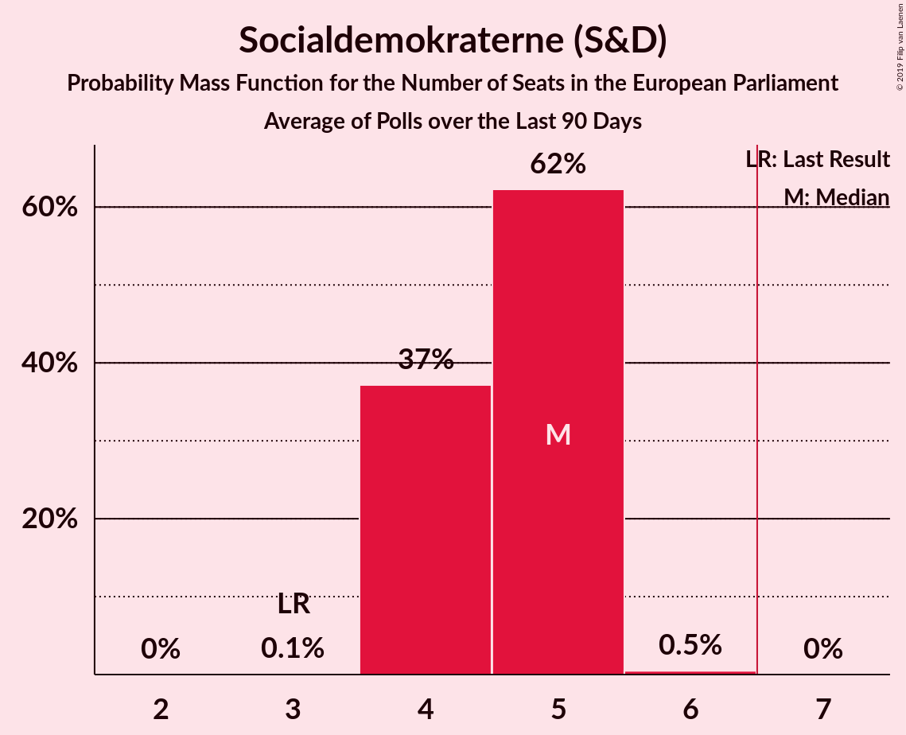

| Number of Seats | Probability | Accumulated | Special Marks |
|:---------------:|:-----------:|:-----------:|:-------------:|
| 3 | 0.1% | 100% | Last Result |
| 4 | 37% | 99.9% |  |
| 5 | 62% | 63% | Median |
| 6 | 0.5% | 0.5% |  |
| 7 | 0% | 0% | Majority |

### Venstre (ALDE)

*For a full overview of the results for this party, see the [Venstre (ALDE)](party-venstrealde.html) page.*

| Number of Seats | Probability | Accumulated | Special Marks |
|:---------------:|:-----------:|:-----------:|:-------------:|
| 2 | 2% | 100% | Last Result |
| 3 | 95% | 98% | Median |
| 4 | 3% | 3% |  |
| 5 | 0% | 0% |  |

### Socialistisk Folkeparti (Greens/EFA)

*For a full overview of the results for this party, see the [Socialistisk Folkeparti (Greens/EFA)](party-socialistiskfolkepartigreensefa.html) page.*

| Number of Seats | Probability | Accumulated | Special Marks |
|:---------------:|:-----------:|:-----------:|:-------------:|
| 0 | 0.3% | 100% |  |
| 1 | 99.6% | 99.7% | Last Result, Median |
| 2 | 0.1% | 0.1% |  |
| 3 | 0% | 0% |  |

### Det Konservative Folkeparti (EPP)

*For a full overview of the results for this party, see the [Det Konservative Folkeparti (EPP)](party-detkonservativefolkepartiepp.html) page.*

| Number of Seats | Probability | Accumulated | Special Marks |
|:---------------:|:-----------:|:-----------:|:-------------:|
| 0 | 72% | 100% | Median |
| 1 | 28% | 28% | Last Result |
| 2 | 0% | 0% |  |

### Radikale Venstre (ALDE)

*For a full overview of the results for this party, see the [Radikale Venstre (ALDE)](party-radikalevenstrealde.html) page.*

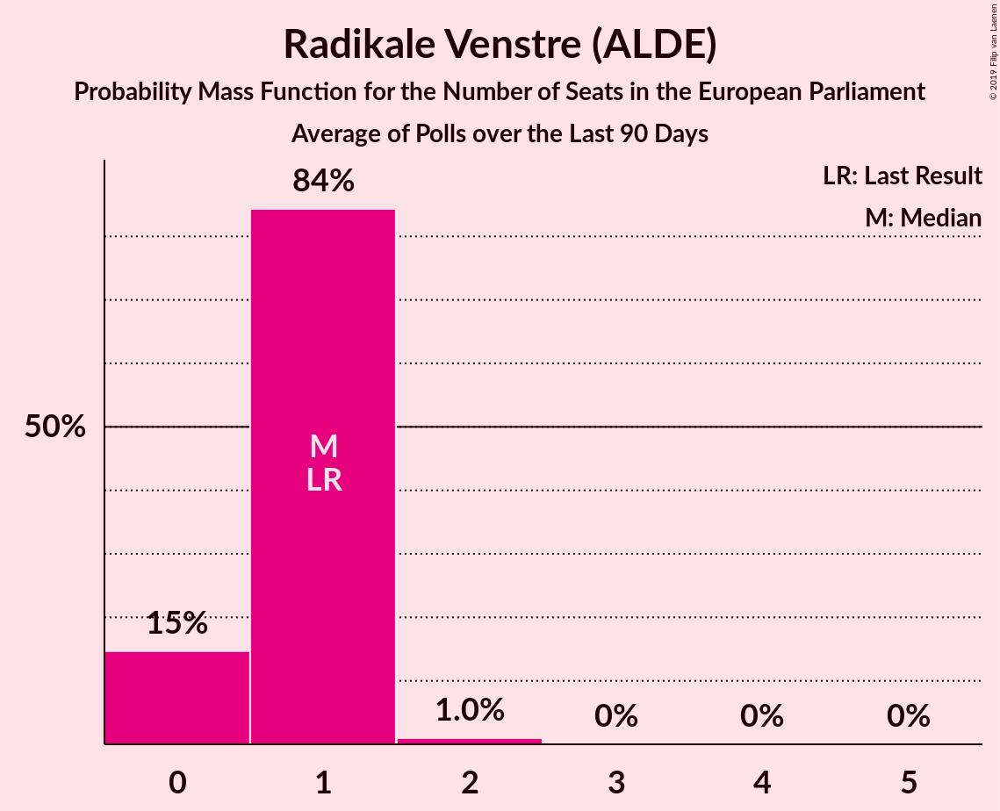

| Number of Seats | Probability | Accumulated | Special Marks |
|:---------------:|:-----------:|:-----------:|:-------------:|
| 0 | 15% | 100% |  |
| 1 | 84% | 85% | Last Result, Median |
| 2 | 1.0% | 1.0% |  |
| 3 | 0% | 0% |  |

### Liberal Alliance (ALDE)

*For a full overview of the results for this party, see the [Liberal Alliance (ALDE)](party-liberalalliancealde.html) page.*

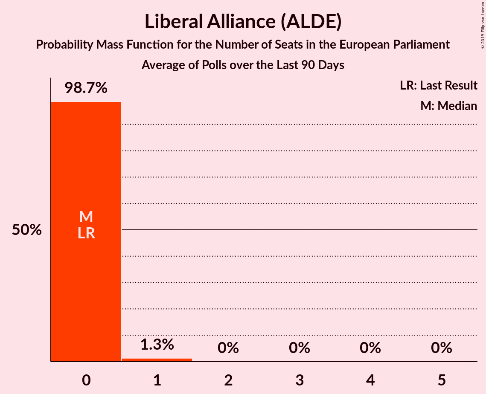

| Number of Seats | Probability | Accumulated | Special Marks |
|:---------------:|:-----------:|:-----------:|:-------------:|
| 0 | 98.7% | 100% | Last Result, Median |
| 1 | 1.3% | 1.3% |  |
| 2 | 0% | 0% |  |

### Enhedslisten–De Rød-Grønne (GUE/NGL)

*For a full overview of the results for this party, see the [Enhedslisten–De Rød-Grønne (GUE/NGL)](party-enhedslisten–derød-grønneguengl.html) page.*

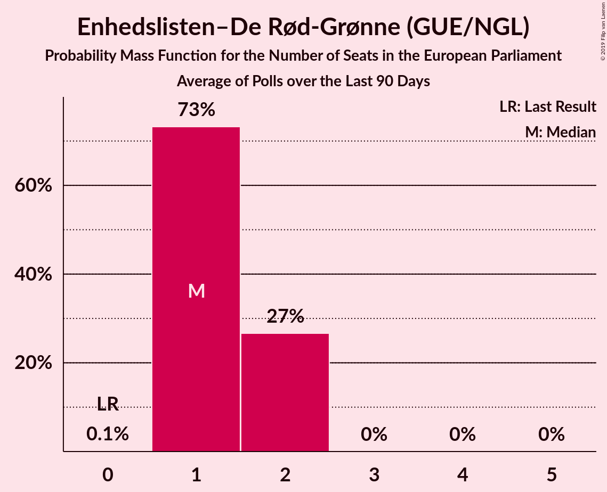

| Number of Seats | Probability | Accumulated | Special Marks |
|:---------------:|:-----------:|:-----------:|:-------------:|
| 0 | 0.1% | 100% | Last Result |
| 1 | 73% | 99.9% | Median |
| 2 | 27% | 27% |  |
| 3 | 0% | 0% |  |

### Alternativet (Greens/EFA)

*For a full overview of the results for this party, see the [Alternativet (Greens/EFA)](party-alternativetgreensefa.html) page.*

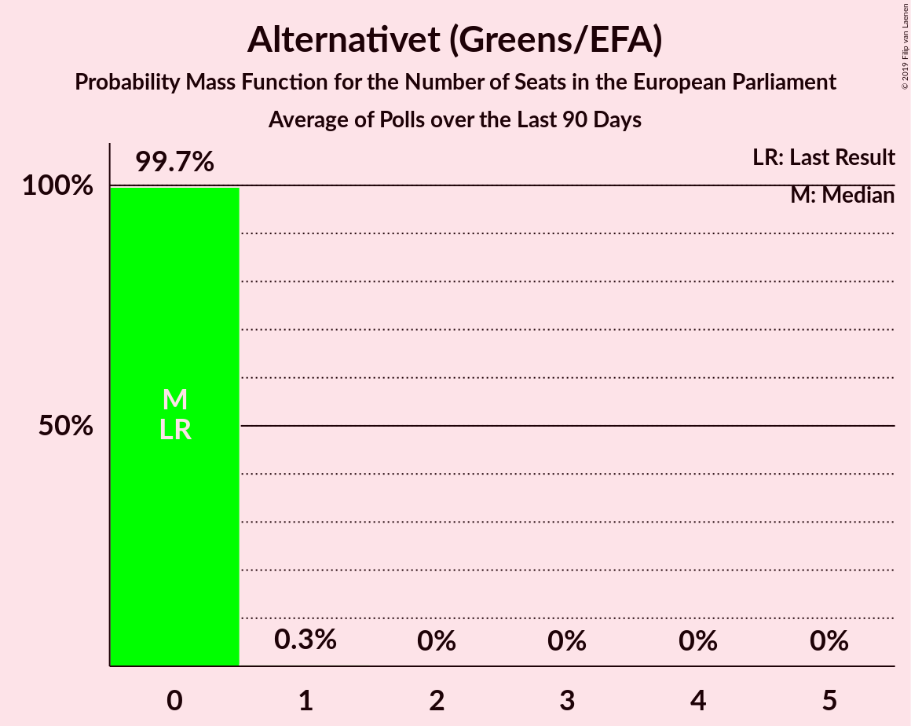

| Number of Seats | Probability | Accumulated | Special Marks |
|:---------------:|:-----------:|:-----------:|:-------------:|
| 0 | 99.7% | 100% | Last Result, Median |
| 1 | 0.3% | 0.3% |  |
| 2 | 0% | 0% |  |

### Kristendemokraterne (EPP)

*For a full overview of the results for this party, see the [Kristendemokraterne (EPP)](party-kristendemokraterneepp.html) page.*

| Number of Seats | Probability | Accumulated | Special Marks |
|:---------------:|:-----------:|:-----------:|:-------------:|
| 0 | 100% | 100% | Last Result, Median |

### Nye Borgerlige (*)

*For a full overview of the results for this party, see the [Nye Borgerlige (*)](party-nyeborgerlige.html) page.*

| Number of Seats | Probability | Accumulated | Special Marks |
|:---------------:|:-----------:|:-----------:|:-------------:|
| 0 | 95% | 100% | Last Result, Median |
| 1 | 5% | 5% |  |
| 2 | 0% | 0% |  |

### Klaus Riskær Pedersen (*)

*For a full overview of the results for this party, see the [Klaus Riskær Pedersen (*)](party-klausriskærpedersen.html) page.*

| Number of Seats | Probability | Accumulated | Special Marks |
|:---------------:|:-----------:|:-----------:|:-------------:|
| 0 | 100% | 100% | Last Result, Median |

### Stram Kurs (*)

*For a full overview of the results for this party, see the [Stram Kurs (*)](party-stramkurs.html) page.*

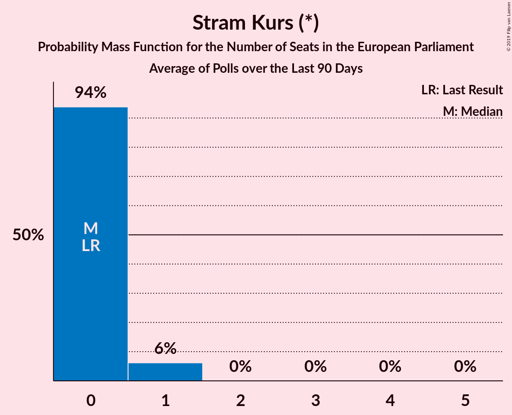

| Number of Seats | Probability | Accumulated | Special Marks |
|:---------------:|:-----------:|:-----------:|:-------------:|
| 0 | 94% | 100% | Last Result, Median |
| 1 | 6% | 6% |  |
| 2 | 0% | 0% |  |

## Coalitions

### Confidence Intervals

| Coalition | Last Result | Median | Majority? | 80% Confidence Interval | 90% Confidence Interval | 95% Confidence Interval | 99% Confidence Interval |
|:---------:|:-----------:|:------:|:---------:|:-----------------------:|:-----------------------:|:-----------------------:|:-----------------------:|
| Socialdemokraterne (S&D) | 3 | 5 | 0% | 4–5 | 4–5 | 4–5 | 4–5 |
| Venstre (ALDE) – Radikale Venstre (ALDE) – Liberal Alliance (ALDE) | 3 | 4 | 0% | 3–4 | 3–5 | 3–5 | 3–5 |
| Dansk Folkeparti (EAPN) | 4 | 2 | 0% | 1–2 | 1–2 | 1–2 | 1–3 |
| Enhedslisten–De Rød-Grønne (GUE/NGL) | 0 | 1 | 0% | 1–2 | 1–2 | 1–2 | 1–2 |
| Socialistisk Folkeparti (Greens/EFA) – Alternativet (Greens/EFA) | 1 | 1 | 0% | 1 | 1 | 1 | 1 |
| Det Konservative Folkeparti (EPP) – Kristendemokraterne (EPP) | 1 | 0 | 0% | 0–1 | 0–1 | 0–1 | 0–1 |
| Klaus Riskær Pedersen (*) – Nye Borgerlige (*) – Stram Kurs (*) | 0 | 0 | 0% | 0–1 | 0–1 | 0–1 | 0–1 |

### Socialdemokraterne (S&D)

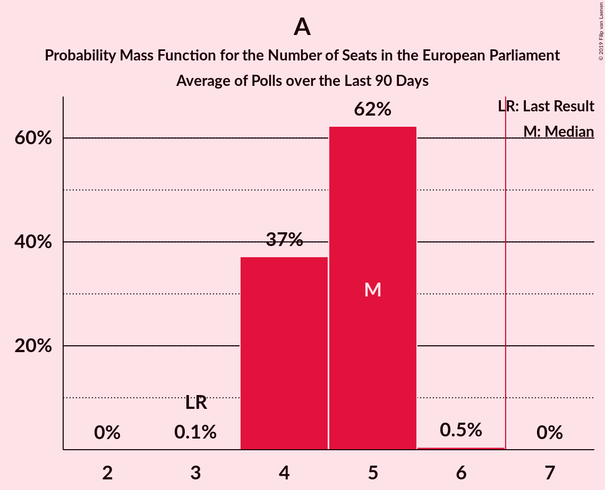

| Number of Seats | Probability | Accumulated | Special Marks |
|:---------------:|:-----------:|:-----------:|:-------------:|
| 3 | 0.1% | 100% | Last Result |
| 4 | 37% | 99.9% |  |
| 5 | 62% | 63% | Median |
| 6 | 0.5% | 0.5% |  |
| 7 | 0% | 0% | Majority |

### Venstre (ALDE) – Radikale Venstre (ALDE) – Liberal Alliance (ALDE)

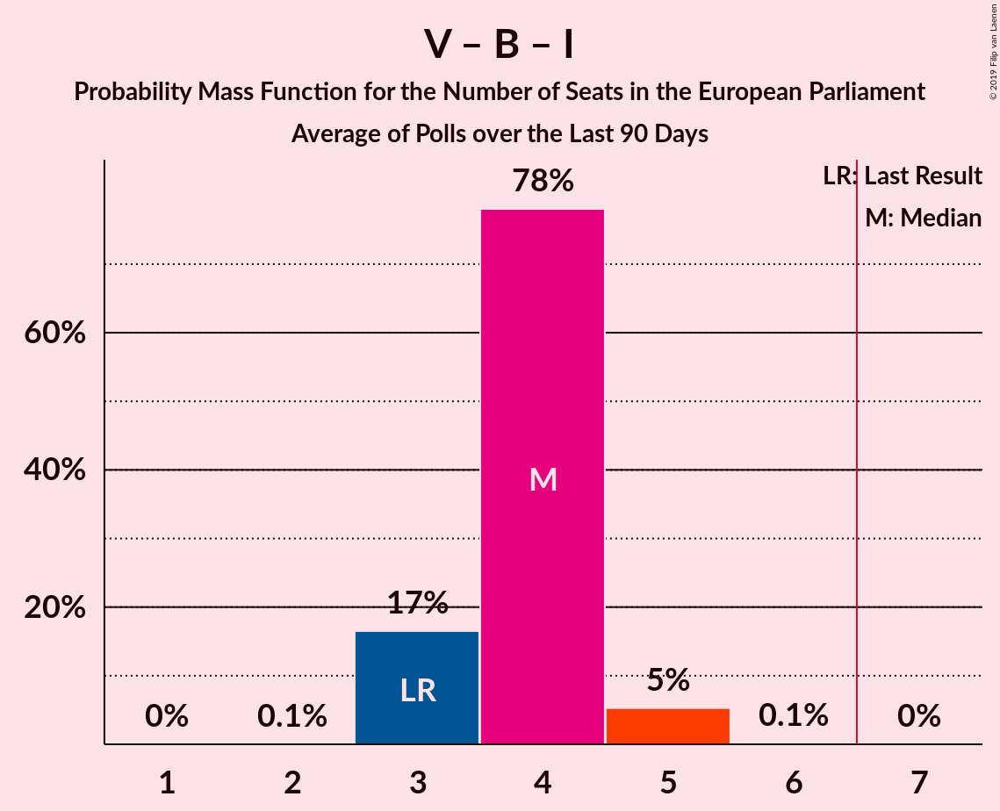

| Number of Seats | Probability | Accumulated | Special Marks |
|:---------------:|:-----------:|:-----------:|:-------------:|
| 2 | 0.1% | 100% |  |
| 3 | 17% | 99.9% | Last Result |
| 4 | 78% | 83% | Median |
| 5 | 5% | 5% |  |
| 6 | 0.1% | 0.1% |  |
| 7 | 0% | 0% | Majority |

### Dansk Folkeparti (EAPN)

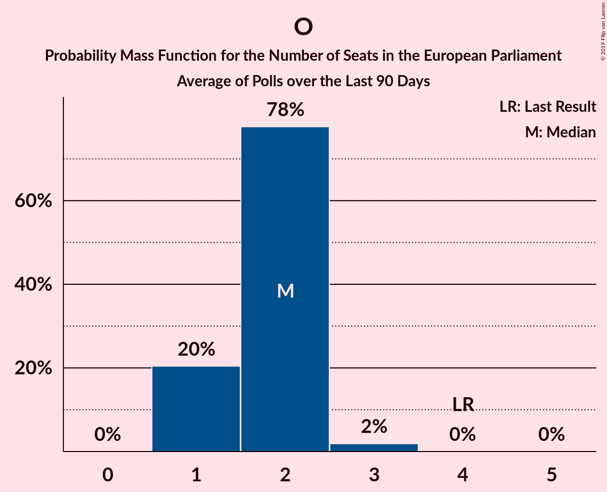

| Number of Seats | Probability | Accumulated | Special Marks |
|:---------------:|:-----------:|:-----------:|:-------------:|
| 1 | 20% | 100% |  |
| 2 | 78% | 80% | Median |
| 3 | 2% | 2% |  |
| 4 | 0% | 0% | Last Result |

### Enhedslisten–De Rød-Grønne (GUE/NGL)

| Number of Seats | Probability | Accumulated | Special Marks |
|:---------------:|:-----------:|:-----------:|:-------------:|
| 0 | 0.1% | 100% | Last Result |
| 1 | 73% | 99.9% | Median |
| 2 | 27% | 27% |  |
| 3 | 0% | 0% |  |

### Socialistisk Folkeparti (Greens/EFA) – Alternativet (Greens/EFA)

| Number of Seats | Probability | Accumulated | Special Marks |
|:---------------:|:-----------:|:-----------:|:-------------:|
| 0 | 0.3% | 100% |  |
| 1 | 99.3% | 99.7% | Last Result, Median |
| 2 | 0.4% | 0.4% |  |
| 3 | 0% | 0% |  |

### Det Konservative Folkeparti (EPP) – Kristendemokraterne (EPP)

| Number of Seats | Probability | Accumulated | Special Marks |
|:---------------:|:-----------:|:-----------:|:-------------:|
| 0 | 72% | 100% | Median |
| 1 | 28% | 28% | Last Result |
| 2 | 0% | 0% |  |

### Klaus Riskær Pedersen (*) – Nye Borgerlige (*) – Stram Kurs (*)

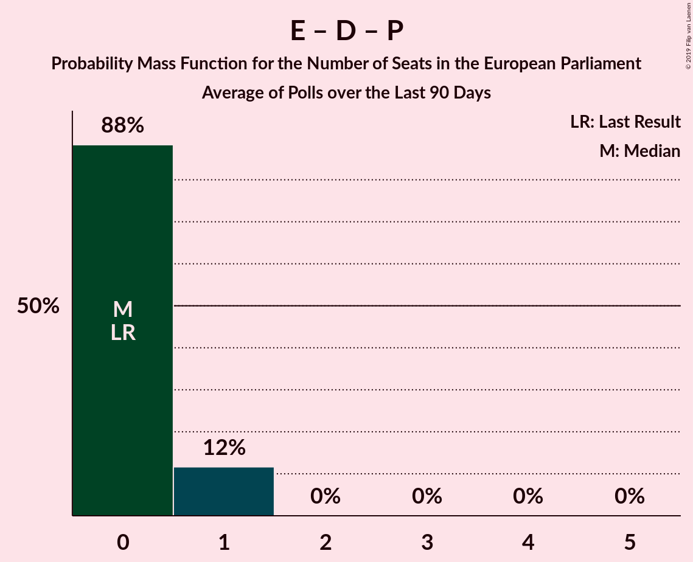

| Number of Seats | Probability | Accumulated | Special Marks |
|:---------------:|:-----------:|:-----------:|:-------------:|
| 0 | 88% | 100% | Last Result, Median |
| 1 | 12% | 12% |  |
| 2 | 0% | 0% |  |

## Technical Information

+ **Number of polls included in this average:** 7
+ **Lowest number of simulations done in a poll included in this average:** 1,048,576
+ **Total number of simulations done in the polls included in this average:** 7,340,032
+ **Error estimate:** 4.60%
