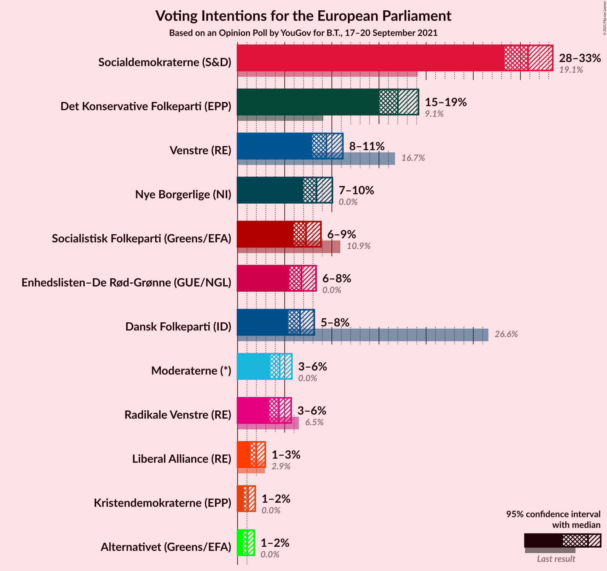
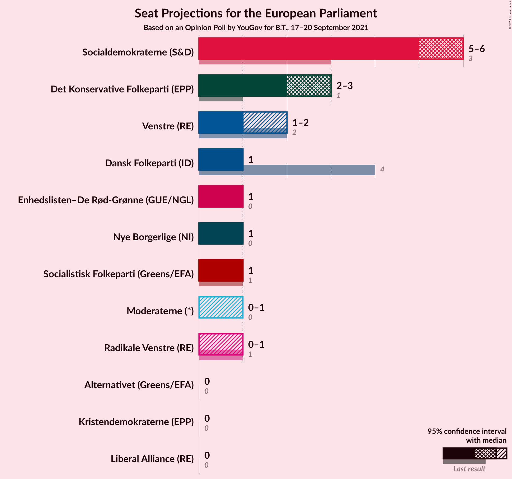
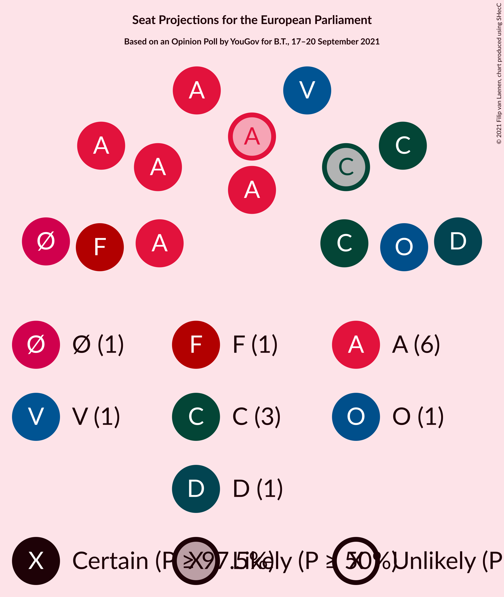

# Opinion Poll by YouGov for B.T., 17–20 September 2021

<a href="#voting-intentions">Voting Intentions</a> | <a href="#seats">Seats</a> | <a href="#coalitions">Coalitions</a> | <a href="#technical-information">Technical Information</a>

## Voting Intentions

### Confidence Intervals

| Party | Last Result | Poll Result | 80% Confidence Interval | 90% Confidence Interval | 95% Confidence Interval | 99% Confidence Interval |
|:-----:|:-----------:|:-----------:|:-----------------------:|:-----------------------:|:-----------------------:|:-----------------------:|
| Socialdemokraterne (S&D) | 19.1% | 30.8% | 29.2–32.5% |28.7–33.0% |28.3–33.4% |27.5–34.2% |
| Det Konservative Folkeparti (EPP) | 9.1% | 17.0% | 15.7–18.4% |15.3–18.8% |15.0–19.2% |14.4–19.9% |
| Venstre (RE) | 16.7% | 9.4% | 8.4–10.6% |8.2–10.9% |7.9–11.2% |7.5–11.7% |
| Nye Borgerlige (NI) | 0.0% | 8.4% | 7.5–9.5% |7.2–9.8% |7.0–10.1% |6.5–10.6% |
| Socialistisk Folkeparti (Greens/EFA) | 10.9% | 7.3% | 6.4–8.3% |6.2–8.6% |5.9–8.8% |5.6–9.4% |
| Enhedslisten–De Rød-Grønne (GUE/NGL) | 0.0% | 6.8% | 5.9–7.8% |5.7–8.1% |5.5–8.3% |5.1–8.8% |
| Dansk Folkeparti (ID) | 26.6% | 6.6% | 5.8–7.6% |5.6–7.9% |5.4–8.1% |5.0–8.6% |
| Moderaterne (*) | N/A | 4.5% | 3.8–5.3% |3.6–5.5% |3.5–5.8% |3.2–6.2% |
| Radikale Venstre (RE) | 6.5% | 4.4% | 3.7–5.2% |3.5–5.5% |3.4–5.7% |3.1–6.1% |
| Liberal Alliance (RE) | 2.9% | 2.0% | 1.6–2.6% |1.4–2.8% |1.4–2.9% |1.2–3.3% |
| Kristendemokraterne (EPP) | 0.0% | 1.1% | 0.8–1.6% |0.7–1.8% |0.7–1.9% |0.5–2.1% |
| Alternativet (Greens/EFA) | 0.0% | 1.0% | 0.7–1.5% |0.7–1.6% |0.6–1.8% |0.5–2.0% |

*Note:* The poll result column reflects the actual value used in the calculations. Published results may vary slightly, and in addition be rounded to fewer digits.

## Seats

### Confidence Intervals

| Party | Last Result | Median | 80% Confidence Interval | 90% Confidence Interval | 95% Confidence Interval | 99% Confidence Interval |
|:-----:|:-----------:|:------:|:-----------------------:|:-----------------------:|:-----------------------:|:-----------------------:|
| <a href="#socialdemokraterne-(s&d)">Socialdemokraterne (S&D)</a> | 3 | 6 | 5–6 |5–6 |5–6 |5–6 |
| <a href="#det-konservative-folkeparti-(epp)">Det Konservative Folkeparti (EPP)</a> | 1 | 3 | 3 |3 |2–3 |2–3 |
| <a href="#venstre-(re)">Venstre (RE)</a> | 2 | 1 | 1 |1–2 |1–2 |1–2 |
| <a href="#nye-borgerlige-(ni)">Nye Borgerlige (NI)</a> | 0 | 1 | 1 |1 |1 |1–2 |
| <a href="#socialistisk-folkeparti-(greens/efa)">Socialistisk Folkeparti (Greens/EFA)</a> | 1 | 1 | 1 |1 |1 |1 |
| <a href="#enhedslisten–de-rød-grønne-(gue/ngl)">Enhedslisten–De Rød-Grønne (GUE/NGL)</a> | 0 | 1 | 1 |1 |1 |1 |
| <a href="#dansk-folkeparti-(id)">Dansk Folkeparti (ID)</a> | 4 | 1 | 1 |1 |1 |1 |
| <a href="#moderaterne-(*)">Moderaterne (*)</a> | N/A | 0 | 0–1 |0–1 |0–1 |0–1 |
| <a href="#radikale-venstre-(re)">Radikale Venstre (RE)</a> | 1 | 0 | 0–1 |0–1 |0–1 |0–1 |
| <a href="#liberal-alliance-(re)">Liberal Alliance (RE)</a> | 0 | 0 | 0 |0 |0 |0 |
| <a href="#kristendemokraterne-(epp)">Kristendemokraterne (EPP)</a> | 0 | 0 | 0 |0 |0 |0 |
| <a href="#alternativet-(greens/efa)">Alternativet (Greens/EFA)</a> | 0 | 0 | 0 |0 |0 |0 |

