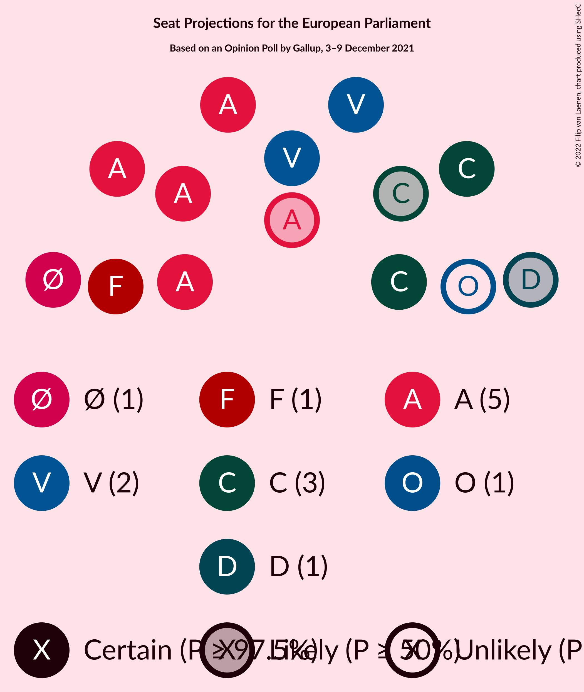

# Opinion Poll by Gallup, 3–9 December 2021

<a href="#voting-intentions">Voting Intentions</a> | <a href="#seats">Seats</a> | <a href="#coalitions">Coalitions</a> | <a href="#technical-information">Technical Information</a>

## Voting Intentions

### Confidence Intervals

| Party | Last Result | Poll Result | 80% Confidence Interval | 90% Confidence Interval | 95% Confidence Interval | 99% Confidence Interval |
|:-----:|:-----------:|:-----------:|:-----------------------:|:-----------------------:|:-----------------------:|:-----------------------:|
| Socialdemokraterne (S&D) | 19.1% | 26.7% | 25.4–28.2% |25.0–28.6% |24.6–29.0% |24.0–29.7% |
| Det Konservative Folkeparti (EPP) | 9.1% | 16.4% | 15.3–17.7% |15.0–18.0% |14.7–18.3% |14.2–18.9% |
| Venstre (RE) | 16.7% | 15.3% | 14.2–16.5% |13.8–16.8% |13.6–17.1% |13.1–17.7% |
| Enhedslisten–De Rød-Grønne (GUE/NGL) | 0.0% | 9.4% | 8.5–10.4% |8.3–10.7% |8.1–10.9% |7.7–11.4% |
| Socialistisk Folkeparti (Greens/EFA) | 10.9% | 7.3% | 6.5–8.2% |6.3–8.4% |6.1–8.7% |5.8–9.1% |
| Nye Borgerlige (NI) | 0.0% | 6.0% | 5.3–6.8% |5.1–7.1% |4.9–7.3% |4.6–7.7% |
| Radikale Venstre (RE) | 6.5% | 5.4% | 4.8–6.2% |4.6–6.5% |4.4–6.7% |4.1–7.1% |
| Dansk Folkeparti (ID) | 26.6% | 5.3% | 4.6–6.1% |4.5–6.3% |4.3–6.5% |4.0–6.9% |
| Liberal Alliance (RE) | 2.9% | 3.6% | 3.0–4.3% |2.9–4.5% |2.8–4.6% |2.5–5.0% |
| Kristendemokraterne (EPP) | 0.0% | 1.7% | 1.4–2.2% |1.3–2.4% |1.2–2.5% |1.1–2.8% |
| Moderaterne (*) | N/A | 1.7% | 1.4–2.2% |1.3–2.4% |1.2–2.5% |1.1–2.8% |
| Alternativet (Greens/EFA) | 0.0% | 0.6% | 0.4–1.0% |0.4–1.1% |0.3–1.1% |0.3–1.3% |
| Veganerpartiet (*) | 0.0% | 0.2% | 0.1–0.4% |0.1–0.5% |0.1–0.5% |0.0–0.7% |

*Note:* The poll result column reflects the actual value used in the calculations. Published results may vary slightly, and in addition be rounded to fewer digits.

## Seats

### Confidence Intervals

| Party | Last Result | Median | 80% Confidence Interval | 90% Confidence Interval | 95% Confidence Interval | 99% Confidence Interval |
|:-----:|:-----------:|:------:|:-----------------------:|:-----------------------:|:-----------------------:|:-----------------------:|
| <a href="#socialdemokraterne-(s&d)">Socialdemokraterne (S&D)</a> | 3 | 5 | 4–5 |4–5 |4–5 |4–6 |
| <a href="#det-konservative-folkeparti-(epp)">Det Konservative Folkeparti (EPP)</a> | 1 | 3 | 3 |2–3 |2–3 |2–3 |
| <a href="#venstre-(re)">Venstre (RE)</a> | 2 | 2 | 2 |2–3 |2–3 |2–3 |
| <a href="#enhedslisten–de-rød-grønne-(gue/ngl)">Enhedslisten–De Rød-Grønne (GUE/NGL)</a> | 0 | 1 | 1 |1 |1 |1–2 |
| <a href="#socialistisk-folkeparti-(greens/efa)">Socialistisk Folkeparti (Greens/EFA)</a> | 1 | 1 | 1 |1 |1 |1 |
| <a href="#nye-borgerlige-(ni)">Nye Borgerlige (NI)</a> | 0 | 1 | 1 |1 |1 |0–1 |
| <a href="#radikale-venstre-(re)">Radikale Venstre (RE)</a> | 1 | 1 | 1 |1 |1 |0–1 |
| <a href="#dansk-folkeparti-(id)">Dansk Folkeparti (ID)</a> | 4 | 0 | 0–1 |0–1 |0–1 |0–1 |
| <a href="#liberal-alliance-(re)">Liberal Alliance (RE)</a> | 0 | 0 | 0 |0 |0 |0 |
| <a href="#kristendemokraterne-(epp)">Kristendemokraterne (EPP)</a> | 0 | 0 | 0 |0 |0 |0 |
| <a href="#moderaterne-(*)">Moderaterne (*)</a> | N/A | 0 | 0 |0 |0 |0 |
| <a href="#alternativet-(greens/efa)">Alternativet (Greens/EFA)</a> | 0 | 0 | 0 |0 |0 |0 |
| <a href="#veganerpartiet-(*)">Veganerpartiet (*)</a> | 0 | 0 | 0 |0 |0 |0 |

