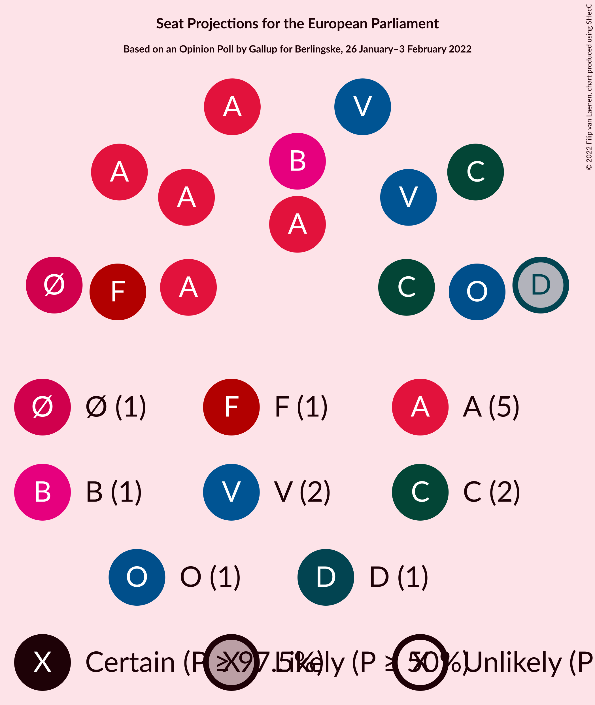

# Opinion Poll by Gallup for Berlingske, 26 January–3 February 2022

<a href="#voting-intentions">Voting Intentions</a> | <a href="#seats">Seats</a> | <a href="#coalitions">Coalitions</a> | <a href="#technical-information">Technical Information</a>

## Voting Intentions

### Confidence Intervals

| Party | Last Result | Poll Result | 80% Confidence Interval | 90% Confidence Interval | 95% Confidence Interval | 99% Confidence Interval |
|:-----:|:-----------:|:-----------:|:-----------------------:|:-----------------------:|:-----------------------:|:-----------------------:|
| Socialdemokraterne (S&D) | 19.1% | 27.5% | 26.1–28.9% |25.7–29.3% |25.4–29.7% |24.7–30.4% |
| Det Konservative Folkeparti (EPP) | 9.1% | 15.3% | 14.2–16.5% |13.9–16.8% |13.7–17.1% |13.2–17.7% |
| Venstre (RE) | 16.7% | 13.8% | 12.8–15.0% |12.5–15.3% |12.2–15.6% |11.7–16.1% |
| Enhedslisten–De Rød-Grønne (GUE/NGL) | 0.0% | 9.8% | 8.9–10.8% |8.7–11.1% |8.5–11.3% |8.0–11.8% |
| Socialistisk Folkeparti (Greens/EFA) | 10.9% | 8.1% | 7.3–9.0% |7.1–9.3% |6.9–9.5% |6.5–10.0% |
| Dansk Folkeparti (ID) | 26.6% | 6.0% | 5.3–6.8% |5.1–7.0% |4.9–7.3% |4.6–7.7% |
| Radikale Venstre (RE) | 6.5% | 5.8% | 5.1–6.6% |4.9–6.9% |4.8–7.1% |4.5–7.5% |
| Nye Borgerlige (NI) | 0.0% | 5.6% | 5.0–6.4% |4.8–6.7% |4.6–6.9% |4.3–7.3% |
| Moderaterne (*) | N/A | 2.5% | 2.1–3.0% |1.9–3.2% |1.8–3.4% |1.6–3.6% |
| Liberal Alliance (RE) | 2.9% | 2.1% | 1.7–2.7% |1.6–2.8% |1.5–2.9% |1.4–3.2% |
| Kristendemokraterne (EPP) | 0.0% | 1.5% | 1.2–2.0% |1.1–2.1% |1.0–2.2% |0.9–2.5% |
| Alternativet (Greens/EFA) | 0.0% | 0.6% | 0.4–0.9% |0.4–1.0% |0.3–1.1% |0.3–1.3% |
| Frie Grønne (*) | 0.0% | 0.5% | 0.3–0.8% |0.3–0.9% |0.2–1.0% |0.2–1.1% |
| Veganerpartiet (*) | 0.0% | 0.1% | 0.1–0.3% |0.0–0.4% |0.0–0.4% |0.0–0.6% |

*Note:* The poll result column reflects the actual value used in the calculations. Published results may vary slightly, and in addition be rounded to fewer digits.

## Seats

### Confidence Intervals

| Party | Last Result | Median | 80% Confidence Interval | 90% Confidence Interval | 95% Confidence Interval | 99% Confidence Interval |
|:-----:|:-----------:|:------:|:-----------------------:|:-----------------------:|:-----------------------:|:-----------------------:|
| <a href="#socialdemokraterne-(s&d)">Socialdemokraterne (S&D)</a> | 3 | 5 | 5 |5 |5 |4–5 |
| <a href="#det-konservative-folkeparti-(epp)">Det Konservative Folkeparti (EPP)</a> | 1 | 2 | 2 |2 |2–3 |2–3 |
| <a href="#venstre-(re)">Venstre (RE)</a> | 2 | 2 | 2 |2 |2 |2–3 |
| <a href="#enhedslisten–de-rød-grønne-(gue/ngl)">Enhedslisten–De Rød-Grønne (GUE/NGL)</a> | 0 | 1 | 1 |1 |1 |1–2 |
| <a href="#socialistisk-folkeparti-(greens/efa)">Socialistisk Folkeparti (Greens/EFA)</a> | 1 | 1 | 1 |1 |1 |1 |
| <a href="#dansk-folkeparti-(id)">Dansk Folkeparti (ID)</a> | 4 | 1 | 1 |1 |1 |0–1 |
| <a href="#radikale-venstre-(re)">Radikale Venstre (RE)</a> | 1 | 1 | 1 |1 |1 |0–1 |
| <a href="#nye-borgerlige-(ni)">Nye Borgerlige (NI)</a> | 0 | 1 | 1 |1 |0–1 |0–1 |
| <a href="#moderaterne-(*)">Moderaterne (*)</a> | N/A | 0 | 0 |0 |0 |0 |
| <a href="#liberal-alliance-(re)">Liberal Alliance (RE)</a> | 0 | 0 | 0 |0 |0 |0 |
| <a href="#kristendemokraterne-(epp)">Kristendemokraterne (EPP)</a> | 0 | 0 | 0 |0 |0 |0 |
| <a href="#alternativet-(greens/efa)">Alternativet (Greens/EFA)</a> | 0 | 0 | 0 |0 |0 |0 |
| <a href="#frie-grønne-(*)">Frie Grønne (*)</a> | 0 | 0 | 0 |0 |0 |0 |
| <a href="#veganerpartiet-(*)">Veganerpartiet (*)</a> | 0 | 0 | 0 |0 |0 |0 |

