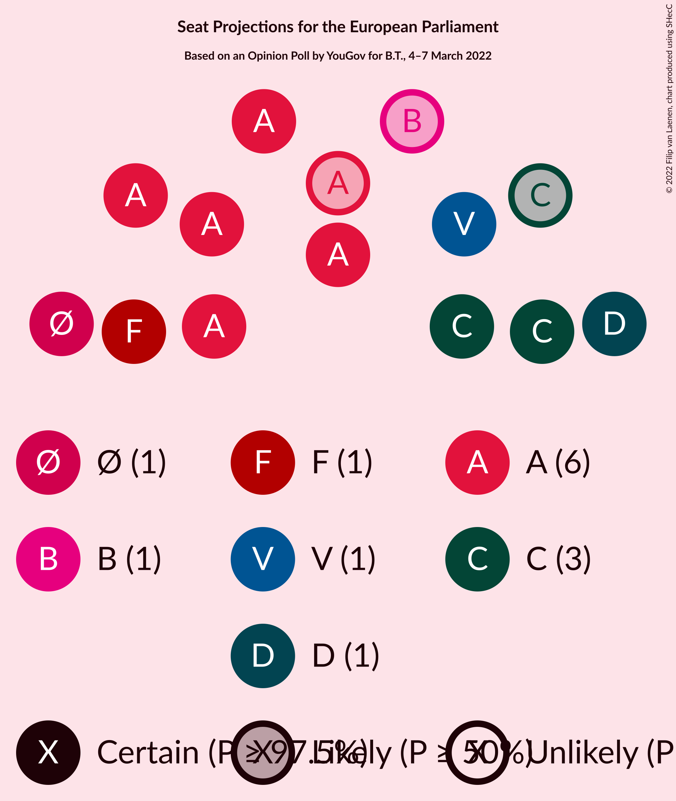

# Opinion Poll by YouGov for B.T., 4–7 March 2022

<a href="#voting-intentions">Voting Intentions</a> | <a href="#seats">Seats</a> | <a href="#coalitions">Coalitions</a> | <a href="#technical-information">Technical Information</a>

## Voting Intentions

### Confidence Intervals

| Party | Last Result | Poll Result | 80% Confidence Interval | 90% Confidence Interval | 95% Confidence Interval | 99% Confidence Interval |
|:-----:|:-----------:|:-----------:|:-----------------------:|:-----------------------:|:-----------------------:|:-----------------------:|
| Socialdemokraterne (S&D) | 19.1% | 30.5% | 28.8–32.2% |28.4–32.7% |28.0–33.1% |27.2–33.9% |
| Det Konservative Folkeparti (EPP) | 9.1% | 16.6% | 15.3–18.1% |15.0–18.5% |14.7–18.8% |14.1–19.5% |
| Nye Borgerlige (NI) | 0.0% | 9.1% | 8.2–10.3% |7.9–10.6% |7.6–10.9% |7.2–11.4% |
| Venstre (RE) | 16.7% | 8.7% | 7.8–9.8% |7.5–10.2% |7.3–10.4% |6.8–11.0% |
| Enhedslisten–De Rød-Grønne (GUE/NGL) | 0.0% | 7.9% | 7.0–9.0% |6.8–9.3% |6.5–9.6% |6.1–10.1% |
| Socialistisk Folkeparti (Greens/EFA) | 10.9% | 7.1% | 6.3–8.1% |6.0–8.4% |5.8–8.7% |5.4–9.2% |
| Radikale Venstre (RE) | 6.5% | 5.5% | 4.8–6.4% |4.6–6.7% |4.4–6.9% |4.0–7.4% |
| Dansk Folkeparti (ID) | 26.6% | 5.0% | 4.3–5.8% |4.1–6.1% |3.9–6.3% |3.6–6.8% |
| Moderaterne (*) | N/A | 4.8% | 4.1–5.7% |3.9–5.9% |3.7–6.1% |3.4–6.6% |
| Liberal Alliance (RE) | 2.9% | 2.4% | 1.9–3.1% |1.8–3.2% |1.7–3.4% |1.5–3.7% |
| Kristendemokraterne (EPP) | 0.0% | 0.9% | 0.6–1.3% |0.5–1.5% |0.5–1.6% |0.4–1.8% |
| Alternativet (Greens/EFA) | 0.0% | 0.6% | 0.4–0.9% |0.3–1.1% |0.3–1.2% |0.2–1.4% |
| Veganerpartiet (*) | 0.0% | 0.6% | 0.4–0.9% |0.3–1.1% |0.3–1.2% |0.2–1.4% |
| Frie Grønne (*) | 0.0% | 0.3% | 0.2–0.6% |0.2–0.7% |0.1–0.8% |0.1–1.0% |

*Note:* The poll result column reflects the actual value used in the calculations. Published results may vary slightly, and in addition be rounded to fewer digits.

## Seats

### Confidence Intervals

| Party | Last Result | Median | 80% Confidence Interval | 90% Confidence Interval | 95% Confidence Interval | 99% Confidence Interval |
|:-----:|:-----------:|:------:|:-----------------------:|:-----------------------:|:-----------------------:|:-----------------------:|
| <a href="#socialdemokraterne-(s&d)">Socialdemokraterne (S&D)</a> | 3 | 6 | 5–6 |5–6 |5–6 |5–6 |
| <a href="#det-konservative-folkeparti-(epp)">Det Konservative Folkeparti (EPP)</a> | 1 | 3 | 2–3 |2–3 |2–3 |2–4 |
| <a href="#nye-borgerlige-(ni)">Nye Borgerlige (NI)</a> | 0 | 1 | 1 |1–2 |1–2 |1–2 |
| <a href="#venstre-(re)">Venstre (RE)</a> | 2 | 1 | 1 |1 |1–2 |1–2 |
| <a href="#enhedslisten–de-rød-grønne-(gue/ngl)">Enhedslisten–De Rød-Grønne (GUE/NGL)</a> | 0 | 1 | 1 |1 |1 |1–2 |
| <a href="#socialistisk-folkeparti-(greens/efa)">Socialistisk Folkeparti (Greens/EFA)</a> | 1 | 1 | 1 |1 |1 |1 |
| <a href="#radikale-venstre-(re)">Radikale Venstre (RE)</a> | 1 | 1 | 0–1 |0–1 |0–1 |0–1 |
| <a href="#dansk-folkeparti-(id)">Dansk Folkeparti (ID)</a> | 4 | 0 | 0–1 |0–1 |0–1 |0–1 |
| <a href="#moderaterne-(*)">Moderaterne (*)</a> | N/A | 0 | 0–1 |0–1 |0–1 |0–1 |
| <a href="#liberal-alliance-(re)">Liberal Alliance (RE)</a> | 0 | 0 | 0 |0 |0 |0 |
| <a href="#kristendemokraterne-(epp)">Kristendemokraterne (EPP)</a> | 0 | 0 | 0 |0 |0 |0 |
| <a href="#alternativet-(greens/efa)">Alternativet (Greens/EFA)</a> | 0 | 0 | 0 |0 |0 |0 |
| <a href="#veganerpartiet-(*)">Veganerpartiet (*)</a> | 0 | 0 | 0 |0 |0 |0 |
| <a href="#frie-grønne-(*)">Frie Grønne (*)</a> | 0 | 0 | 0 |0 |0 |0 |

