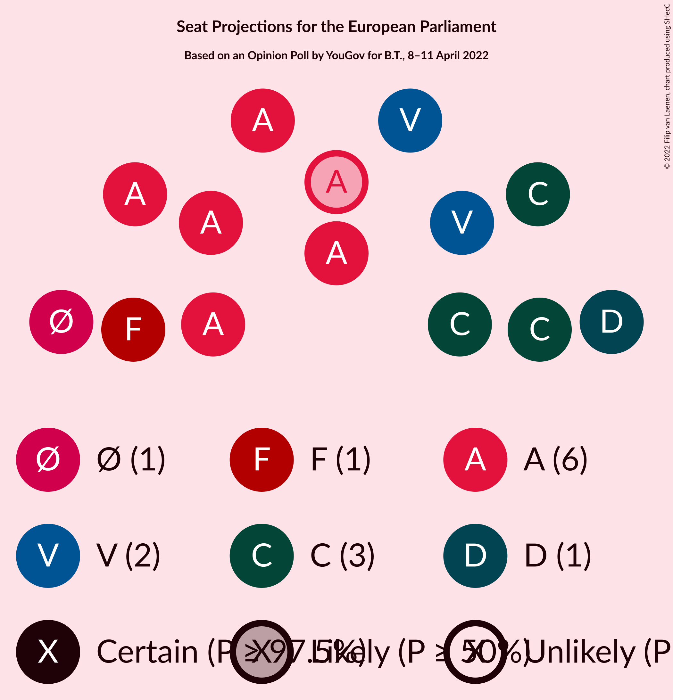

# Opinion Poll by YouGov for B.T., 8–11 April 2022

<a href="#voting-intentions">Voting Intentions</a> | <a href="#seats">Seats</a> | <a href="#coalitions">Coalitions</a> | <a href="#technical-information">Technical Information</a>

## Voting Intentions

### Confidence Intervals

| Party | Last Result | Poll Result | 80% Confidence Interval | 90% Confidence Interval | 95% Confidence Interval | 99% Confidence Interval |
|:-----:|:-----------:|:-----------:|:-----------------------:|:-----------------------:|:-----------------------:|:-----------------------:|
| Socialdemokraterne (S&D) | 19.1% | 29.1% | 27.5–30.8% |27.0–31.2% |26.6–31.7% |25.8–32.5% |
| Det Konservative Folkeparti (EPP) | 9.1% | 17.1% | 15.8–18.5% |15.4–19.0% |15.1–19.3% |14.5–20.0% |
| Venstre (RE) | 16.7% | 11.1% | 10.0–12.3% |9.7–12.7% |9.4–13.0% |9.0–13.6% |
| Nye Borgerlige (NI) | 0.0% | 9.4% | 8.4–10.5% |8.1–10.9% |7.9–11.2% |7.4–11.7% |
| Socialistisk Folkeparti (Greens/EFA) | 10.9% | 8.1% | 7.2–9.2% |6.9–9.5% |6.7–9.8% |6.3–10.3% |
| Enhedslisten–De Rød-Grønne (GUE/NGL) | 0.0% | 6.3% | 5.5–7.2% |5.2–7.5% |5.0–7.8% |4.7–8.2% |
| Moderaterne (*) | N/A | 4.8% | 4.1–5.7% |3.9–5.9% |3.8–6.2% |3.4–6.6% |
| Dansk Folkeparti (ID) | 26.6% | 4.5% | 3.8–5.3% |3.6–5.6% |3.5–5.8% |3.2–6.2% |
| Radikale Venstre (RE) | 6.5% | 3.2% | 2.7–4.0% |2.5–4.2% |2.4–4.4% |2.1–4.7% |
| Liberal Alliance (RE) | 2.9% | 3.1% | 2.5–3.8% |2.3–4.0% |2.2–4.2% |2.0–4.5% |
| Kristendemokraterne (EPP) | 0.0% | 1.1% | 0.8–1.6% |0.7–1.8% |0.7–1.9% |0.5–2.1% |
| Frie Grønne (*) | 0.0% | 1.0% | 0.7–1.4% |0.6–1.6% |0.5–1.7% |0.4–1.9% |
| Veganerpartiet (*) | 0.0% | 0.8% | 0.6–1.2% |0.5–1.4% |0.4–1.5% |0.3–1.7% |
| Alternativet (Greens/EFA) | 0.0% | 0.5% | 0.3–0.9% |0.3–1.0% |0.2–1.1% |0.2–1.3% |

*Note:* The poll result column reflects the actual value used in the calculations. Published results may vary slightly, and in addition be rounded to fewer digits.

## Seats

### Confidence Intervals

| Party | Last Result | Median | 80% Confidence Interval | 90% Confidence Interval | 95% Confidence Interval | 99% Confidence Interval |
|:-----:|:-----------:|:------:|:-----------------------:|:-----------------------:|:-----------------------:|:-----------------------:|
| <a href="#socialdemokraterne-(s&d)">Socialdemokraterne (S&D)</a> | 3 | 6 | 5–6 |5–6 |5–6 |5–6 |
| <a href="#det-konservative-folkeparti-(epp)">Det Konservative Folkeparti (EPP)</a> | 1 | 3 | 3 |3–4 |3–4 |3–4 |
| <a href="#venstre-(re)">Venstre (RE)</a> | 2 | 2 | 2 |2 |2 |1–2 |
| <a href="#nye-borgerlige-(ni)">Nye Borgerlige (NI)</a> | 0 | 1 | 1–2 |1–2 |1–2 |1–2 |
| <a href="#socialistisk-folkeparti-(greens/efa)">Socialistisk Folkeparti (Greens/EFA)</a> | 1 | 1 | 1 |1 |1 |1 |
| <a href="#enhedslisten–de-rød-grønne-(gue/ngl)">Enhedslisten–De Rød-Grønne (GUE/NGL)</a> | 0 | 1 | 1 |1 |1 |1 |
| <a href="#moderaterne-(*)">Moderaterne (*)</a> | N/A | 0 | 0 |0 |0–1 |0–1 |
| <a href="#dansk-folkeparti-(id)">Dansk Folkeparti (ID)</a> | 4 | 0 | 0 |0 |0 |0–1 |
| <a href="#radikale-venstre-(re)">Radikale Venstre (RE)</a> | 1 | 0 | 0 |0 |0 |0 |
| <a href="#liberal-alliance-(re)">Liberal Alliance (RE)</a> | 0 | 0 | 0 |0 |0 |0 |
| <a href="#kristendemokraterne-(epp)">Kristendemokraterne (EPP)</a> | 0 | 0 | 0 |0 |0 |0 |
| <a href="#frie-grønne-(*)">Frie Grønne (*)</a> | 0 | 0 | 0 |0 |0 |0 |
| <a href="#veganerpartiet-(*)">Veganerpartiet (*)</a> | 0 | 0 | 0 |0 |0 |0 |
| <a href="#alternativet-(greens/efa)">Alternativet (Greens/EFA)</a> | 0 | 0 | 0 |0 |0 |0 |

