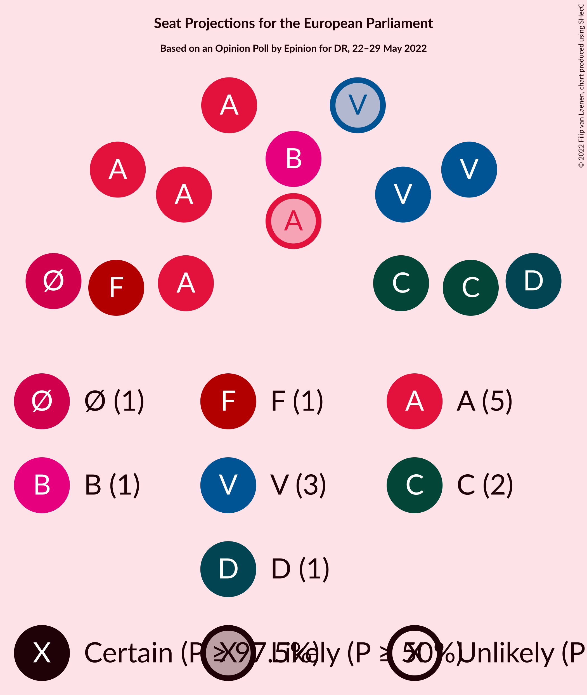

# Opinion Poll by Epinion for DR, 22–29 May 2022

<a href="#voting-intentions">Voting Intentions</a> | <a href="#seats">Seats</a> | <a href="#coalitions">Coalitions</a> | <a href="#technical-information">Technical Information</a>

## Voting Intentions

### Confidence Intervals

| Party | Last Result | Poll Result | 80% Confidence Interval | 90% Confidence Interval | 95% Confidence Interval | 99% Confidence Interval |
|:-----:|:-----------:|:-----------:|:-----------------------:|:-----------------------:|:-----------------------:|:-----------------------:|
| Socialdemokraterne (S&D) | 19.1% | 27.2% | 26.0–28.5% |25.6–28.8% |25.3–29.1% |24.8–29.8% |
| Venstre (RE) | 16.7% | 15.7% | 14.7–16.8% |14.4–17.1% |14.2–17.3% |13.7–17.8% |
| Det Konservative Folkeparti (EPP) | 9.1% | 13.0% | 12.1–14.0% |11.8–14.3% |11.6–14.5% |11.2–15.0% |
| Socialistisk Folkeparti (Greens/EFA) | 10.9% | 8.4% | 7.7–9.2% |7.5–9.5% |7.3–9.7% |6.9–10.1% |
| Nye Borgerlige (NI) | 0.0% | 7.0% | 6.3–7.8% |6.2–8.0% |6.0–8.2% |5.7–8.6% |
| Enhedslisten–De Rød-Grønne (GUE/NGL) | 0.0% | 6.5% | 5.8–7.2% |5.7–7.5% |5.5–7.6% |5.2–8.0% |
| Radikale Venstre (RE) | 6.5% | 6.1% | 5.5–6.8% |5.3–7.0% |5.2–7.2% |4.9–7.6% |
| Dansk Folkeparti (ID) | 26.6% | 5.3% | 4.7–6.0% |4.5–6.2% |4.4–6.3% |4.1–6.7% |
| Liberal Alliance (RE) | 2.9% | 3.9% | 3.4–4.5% |3.3–4.7% |3.2–4.8% |2.9–5.1% |
| Moderaterne (*) | N/A | 1.9% | 1.6–2.4% |1.5–2.5% |1.4–2.6% |1.2–2.8% |
| Frie Grønne (*) | 0.0% | 1.6% | 1.3–2.0% |1.2–2.2% |1.2–2.3% |1.0–2.5% |
| Alternativet (Greens/EFA) | 0.0% | 1.0% | 0.8–1.4% |0.7–1.4% |0.7–1.5% |0.5–1.7% |
| Kristendemokraterne (EPP) | 0.0% | 0.6% | 0.4–0.9% |0.4–1.0% |0.4–1.1% |0.3–1.2% |
| Veganerpartiet (*) | 0.0% | 0.5% | 0.3–0.7% |0.3–0.8% |0.3–0.9% |0.2–1.0% |

*Note:* The poll result column reflects the actual value used in the calculations. Published results may vary slightly, and in addition be rounded to fewer digits.

## Seats

### Confidence Intervals

| Party | Last Result | Median | 80% Confidence Interval | 90% Confidence Interval | 95% Confidence Interval | 99% Confidence Interval |
|:-----:|:-----------:|:------:|:-----------------------:|:-----------------------:|:-----------------------:|:-----------------------:|
| <a href="#socialdemokraterne-(s&d)">Socialdemokraterne (S&D)</a> | 3 | 5 | 5 |4–6 |4–6 |4–6 |
| <a href="#venstre-(re)">Venstre (RE)</a> | 2 | 3 | 2–3 |2–3 |2–3 |2–3 |
| <a href="#det-konservative-folkeparti-(epp)">Det Konservative Folkeparti (EPP)</a> | 1 | 2 | 2 |2 |2 |2 |
| <a href="#socialistisk-folkeparti-(greens/efa)">Socialistisk Folkeparti (Greens/EFA)</a> | 1 | 1 | 1 |1 |1 |1 |
| <a href="#nye-borgerlige-(ni)">Nye Borgerlige (NI)</a> | 0 | 1 | 1 |1 |1 |1 |
| <a href="#enhedslisten–de-rød-grønne-(gue/ngl)">Enhedslisten–De Rød-Grønne (GUE/NGL)</a> | 0 | 1 | 1 |1 |1 |1 |
| <a href="#radikale-venstre-(re)">Radikale Venstre (RE)</a> | 1 | 1 | 1 |1 |1 |0–1 |
| <a href="#dansk-folkeparti-(id)">Dansk Folkeparti (ID)</a> | 4 | 0 | 0–1 |0–1 |0–1 |0–1 |
| <a href="#liberal-alliance-(re)">Liberal Alliance (RE)</a> | 0 | 0 | 0 |0 |0 |0 |
| <a href="#moderaterne-(*)">Moderaterne (*)</a> | N/A | 0 | 0 |0 |0 |0 |
| <a href="#frie-grønne-(*)">Frie Grønne (*)</a> | 0 | 0 | 0 |0 |0 |0 |
| <a href="#alternativet-(greens/efa)">Alternativet (Greens/EFA)</a> | 0 | 0 | 0 |0 |0 |0 |
| <a href="#kristendemokraterne-(epp)">Kristendemokraterne (EPP)</a> | 0 | 0 | 0 |0 |0 |0 |
| <a href="#veganerpartiet-(*)">Veganerpartiet (*)</a> | 0 | 0 | 0 |0 |0 |0 |

