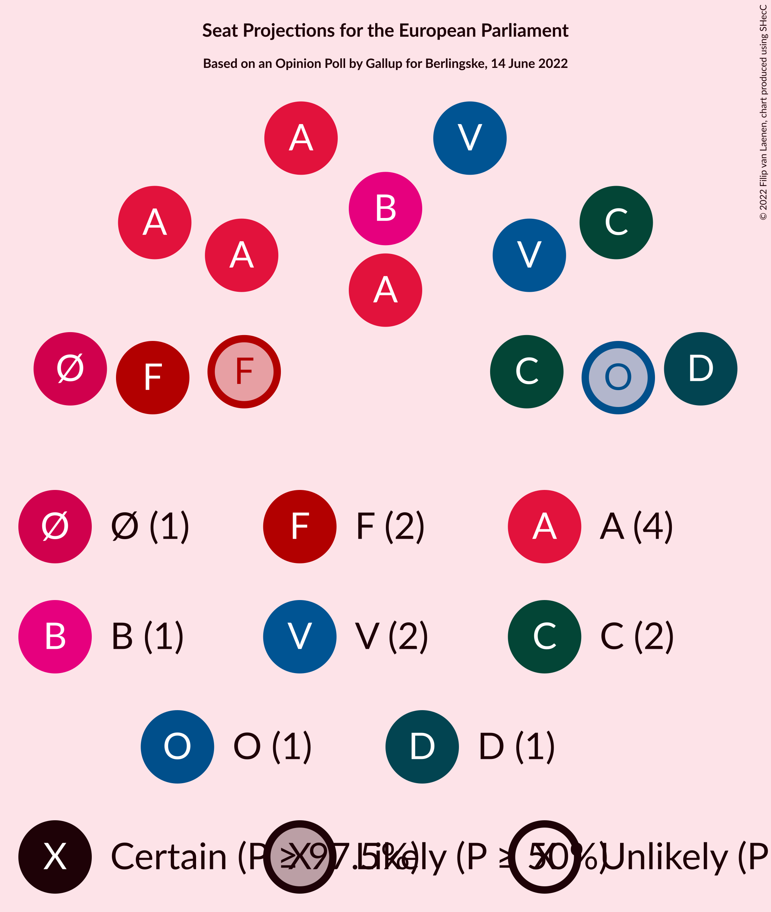

# Opinion Poll by Gallup for Berlingske, 14 June 2022

<a href="#voting-intentions">Voting Intentions</a> | <a href="#seats">Seats</a> | <a href="#coalitions">Coalitions</a> | <a href="#technical-information">Technical Information</a>

## Voting Intentions

### Confidence Intervals

| Party | Last Result | Poll Result | 80% Confidence Interval | 90% Confidence Interval | 95% Confidence Interval | 99% Confidence Interval |
|:-----:|:-----------:|:-----------:|:-----------------------:|:-----------------------:|:-----------------------:|:-----------------------:|
| Socialdemokraterne (S&D) | 19.1% | 25.4% | 24.0–26.9% |23.6–27.3% |23.3–27.6% |22.6–28.3% |
| Venstre (RE) | 16.7% | 14.6% | 13.5–15.8% |13.2–16.1% |12.9–16.4% |12.4–17.0% |
| Det Konservative Folkeparti (EPP) | 9.1% | 13.8% | 12.7–15.0% |12.4–15.3% |12.2–15.6% |11.7–16.2% |
| Socialistisk Folkeparti (Greens/EFA) | 10.9% | 9.8% | 8.9–10.8% |8.6–11.1% |8.4–11.4% |8.0–11.9% |
| Enhedslisten–De Rød-Grønne (GUE/NGL) | 0.0% | 7.8% | 7.0–8.7% |6.7–9.0% |6.5–9.2% |6.2–9.7% |
| Radikale Venstre (RE) | 6.5% | 6.3% | 5.5–7.1% |5.3–7.4% |5.2–7.6% |4.8–8.0% |
| Nye Borgerlige (NI) | 0.0% | 6.1% | 5.4–7.0% |5.2–7.2% |5.0–7.4% |4.7–7.8% |
| Dansk Folkeparti (ID) | 26.6% | 5.3% | 4.6–6.1% |4.5–6.4% |4.3–6.6% |4.0–7.0% |
| Liberal Alliance (RE) | 2.9% | 3.6% | 3.1–4.3% |2.9–4.5% |2.8–4.7% |2.6–5.0% |
| Moderaterne (*) | N/A | 3.6% | 3.1–4.3% |2.9–4.5% |2.8–4.7% |2.6–5.0% |
| Kristendemokraterne (EPP) | 0.0% | 1.4% | 1.1–1.9% |1.0–2.0% |0.9–2.1% |0.8–2.4% |
| Alternativet (Greens/EFA) | 0.0% | 1.0% | 0.7–1.4% |0.6–1.5% |0.6–1.6% |0.5–1.8% |
| Frie Grønne (*) | 0.0% | 0.5% | 0.4–0.9% |0.3–0.9% |0.3–1.0% |0.2–1.2% |
| Veganerpartiet (*) | 0.0% | 0.3% | 0.2–0.6% |0.2–0.7% |0.1–0.8% |0.1–0.9% |

*Note:* The poll result column reflects the actual value used in the calculations. Published results may vary slightly, and in addition be rounded to fewer digits.

## Seats

### Confidence Intervals

| Party | Last Result | Median | 80% Confidence Interval | 90% Confidence Interval | 95% Confidence Interval | 99% Confidence Interval |
|:-----:|:-----------:|:------:|:-----------------------:|:-----------------------:|:-----------------------:|:-----------------------:|
| <a href="#socialdemokraterne-(s&d)">Socialdemokraterne (S&D)</a> | 3 | 4 | 4 |4–5 |4–5 |4–5 |
| <a href="#venstre-(re)">Venstre (RE)</a> | 2 | 2 | 2 |2–3 |2–3 |2–3 |
| <a href="#det-konservative-folkeparti-(epp)">Det Konservative Folkeparti (EPP)</a> | 1 | 2 | 2 |2 |2–3 |2–3 |
| <a href="#socialistisk-folkeparti-(greens/efa)">Socialistisk Folkeparti (Greens/EFA)</a> | 1 | 2 | 1–2 |1–2 |1–2 |1–2 |
| <a href="#enhedslisten–de-rød-grønne-(gue/ngl)">Enhedslisten–De Rød-Grønne (GUE/NGL)</a> | 0 | 1 | 1 |1 |1 |1 |
| <a href="#radikale-venstre-(re)">Radikale Venstre (RE)</a> | 1 | 1 | 1 |1 |1 |0–1 |
| <a href="#nye-borgerlige-(ni)">Nye Borgerlige (NI)</a> | 0 | 1 | 1 |1 |1 |0–1 |
| <a href="#dansk-folkeparti-(id)">Dansk Folkeparti (ID)</a> | 4 | 1 | 1 |0–1 |0–1 |0–1 |
| <a href="#liberal-alliance-(re)">Liberal Alliance (RE)</a> | 0 | 0 | 0 |0 |0 |0–1 |
| <a href="#moderaterne-(*)">Moderaterne (*)</a> | N/A | 0 | 0 |0 |0 |0 |
| <a href="#kristendemokraterne-(epp)">Kristendemokraterne (EPP)</a> | 0 | 0 | 0 |0 |0 |0 |
| <a href="#alternativet-(greens/efa)">Alternativet (Greens/EFA)</a> | 0 | 0 | 0 |0 |0 |0 |
| <a href="#frie-grønne-(*)">Frie Grønne (*)</a> | 0 | 0 | 0 |0 |0 |0 |
| <a href="#veganerpartiet-(*)">Veganerpartiet (*)</a> | 0 | 0 | 0 |0 |0 |0 |

