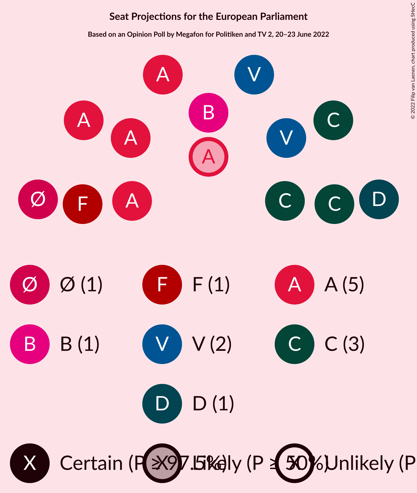

# Opinion Poll by Megafon for Politiken and TV 2, 20–23 June 2022

<a href="#voting-intentions">Voting Intentions</a> | <a href="#seats">Seats</a> | <a href="#coalitions">Coalitions</a> | <a href="#technical-information">Technical Information</a>

## Voting Intentions

### Confidence Intervals

| Party | Last Result | Poll Result | 80% Confidence Interval | 90% Confidence Interval | 95% Confidence Interval | 99% Confidence Interval |
|:-----:|:-----------:|:-----------:|:-----------------------:|:-----------------------:|:-----------------------:|:-----------------------:|
| Socialdemokraterne (S&D) | 19.1% | 24.6% | 23.0–26.3% |22.6–26.8% |22.2–27.2% |21.5–28.0% |
| Det Konservative Folkeparti (EPP) | 9.1% | 17.1% | 15.7–18.6% |15.3–19.0% |15.0–19.4% |14.4–20.1% |
| Venstre (RE) | 16.7% | 13.0% | 11.8–14.3% |11.4–14.7% |11.1–15.1% |10.6–15.7% |
| Socialistisk Folkeparti (Greens/EFA) | 10.9% | 8.6% | 7.6–9.8% |7.3–10.1% |7.1–10.4% |6.6–10.9% |
| Nye Borgerlige (NI) | 0.0% | 8.5% | 7.5–9.7% |7.3–10.0% |7.0–10.3% |6.6–10.9% |
| Enhedslisten–De Rød-Grønne (GUE/NGL) | 0.0% | 7.5% | 6.6–8.6% |6.4–8.9% |6.1–9.2% |5.7–9.8% |
| Radikale Venstre (RE) | 6.5% | 6.5% | 5.6–7.5% |5.4–7.8% |5.2–8.1% |4.8–8.6% |
| Liberal Alliance (RE) | 2.9% | 4.3% | 3.6–5.2% |3.4–5.4% |3.3–5.6% |3.0–6.1% |
| Moderaterne (*) | N/A | 3.5% | 2.9–4.3% |2.7–4.5% |2.6–4.7% |2.3–5.2% |
| Dansk Folkeparti (ID) | 26.6% | 3.2% | 2.7–4.0% |2.5–4.3% |2.4–4.5% |2.1–4.8% |
| Alternativet (Greens/EFA) | 0.0% | 0.6% | 0.4–1.0% |0.3–1.2% |0.3–1.3% |0.2–1.5% |
| Frie Grønne (*) | 0.0% | 0.6% | 0.4–1.0% |0.3–1.2% |0.3–1.3% |0.2–1.5% |
| Kristendemokraterne (EPP) | 0.0% | 0.5% | 0.3–0.9% |0.3–1.0% |0.2–1.1% |0.2–1.4% |
| Veganerpartiet (*) | 0.0% | 0.3% | 0.2–0.6% |0.1–0.7% |0.1–0.8% |0.0–1.0% |

*Note:* The poll result column reflects the actual value used in the calculations. Published results may vary slightly, and in addition be rounded to fewer digits.

## Seats

### Confidence Intervals

| Party | Last Result | Median | 80% Confidence Interval | 90% Confidence Interval | 95% Confidence Interval | 99% Confidence Interval |
|:-----:|:-----------:|:------:|:-----------------------:|:-----------------------:|:-----------------------:|:-----------------------:|
| <a href="#socialdemokraterne-(s&d)">Socialdemokraterne (S&D)</a> | 3 | 5 | 5 |4–5 |4–5 |4–5 |
| <a href="#det-konservative-folkeparti-(epp)">Det Konservative Folkeparti (EPP)</a> | 1 | 3 | 3 |3 |3 |3–4 |
| <a href="#venstre-(re)">Venstre (RE)</a> | 2 | 2 | 2 |2 |2 |2–3 |
| <a href="#socialistisk-folkeparti-(greens/efa)">Socialistisk Folkeparti (Greens/EFA)</a> | 1 | 1 | 1 |1 |1–2 |1–2 |
| <a href="#nye-borgerlige-(ni)">Nye Borgerlige (NI)</a> | 0 | 1 | 1 |1 |1 |1–2 |
| <a href="#enhedslisten–de-rød-grønne-(gue/ngl)">Enhedslisten–De Rød-Grønne (GUE/NGL)</a> | 0 | 1 | 1 |1 |1 |1 |
| <a href="#radikale-venstre-(re)">Radikale Venstre (RE)</a> | 1 | 1 | 1 |1 |1 |1 |
| <a href="#liberal-alliance-(re)">Liberal Alliance (RE)</a> | 0 | 0 | 0 |0 |0 |0–1 |
| <a href="#moderaterne-(*)">Moderaterne (*)</a> | N/A | 0 | 0 |0 |0 |0 |
| <a href="#dansk-folkeparti-(id)">Dansk Folkeparti (ID)</a> | 4 | 0 | 0 |0 |0 |0 |
| <a href="#alternativet-(greens/efa)">Alternativet (Greens/EFA)</a> | 0 | 0 | 0 |0 |0 |0 |
| <a href="#frie-grønne-(*)">Frie Grønne (*)</a> | 0 | 0 | 0 |0 |0 |0 |
| <a href="#kristendemokraterne-(epp)">Kristendemokraterne (EPP)</a> | 0 | 0 | 0 |0 |0 |0 |
| <a href="#veganerpartiet-(*)">Veganerpartiet (*)</a> | 0 | 0 | 0 |0 |0 |0 |

