# Poll Average

<a href="#voting-intentions">Voting Intentions</a> | <a href="#seats">Seats</a> | <a href="#coalitions">Coalitions</a> | <a href="#technical-information">Technical Information</a>

## Summary

The table below lists the polls on which the average is based. They are the most recent polls (less than 30 days old) registered and analyzed so far.

| Period     | Polling firm/Commissioner(s) | O | A | V | F | C | B | I | Å | Ø | K | D | E | P | G | Q | Æ | M | A |
|:----------:|:----------------------------:|:--:|:--:|:--:|:--:|:--:|:--:|:--:|:--:|:--:|:--:|:--:|:--:|:--:|:--:|:--:|:--:|:--:|:--:|
| 26 May 2019 | General Election | 26.6%   4 | 19.1%   3 | 16.7%   2 | 10.9%   1 | 9.1%   1 | 6.5%   1 | 2.9%   0 | 0.0%   0 | 0.0%   0 | 0.0%   0 | 0.0%   0 | 0.0%   0 | 0.0%   0 | 0.0%   0 | 0.0%   0 | 0.0%   0 | 0.0%   0 | 0.0%   0 |
| N/A | Poll Average | 2–8%   0–1 | N/A   N/A | 6–12%   1–2 | N/A   N/A | 4–8%   0–1 | 3–6%   0–1 | 8–14%   1–2 | N/A   N/A | 6–9%   1 | N/A   N/A | 2–4%   0 | N/A   N/A | N/A   N/A | N/A   N/A | 0–1%   0 | 7–11%   1–2 | 6–9%   1 | 36–41%   6–8 |
| [11–17 September 2023](2023-09-17-Voxmeter.html) | Voxmeter | 2–4%   0 | N/A   N/A | 8–12%   1–2 | N/A   N/A | 4–6%   0–1 | 4–6%   0–1 | 11–15%   2–3 | N/A   N/A | 6–9%   1 | N/A   N/A | 2–4%   0 | N/A   N/A | N/A   N/A | N/A   N/A | N/A   N/A | 7–10%   1–2 | 6–9%   1 | 36–42%   6–8 |
| [7–11 September 2023](2023-09-11-YouGov.html) | YouGov   B.T. | 5–8%   1 | N/A   N/A | 6–9%   1 | N/A   N/A | 5–8%   1 | 3–5%   0–1 | 8–12%   1–2 | N/A   N/A | 6–9%   1 | N/A   N/A | 2–4%   0 | N/A   N/A | N/A   N/A | N/A   N/A | N/A   N/A | 8–12%   1–2 | 5–8%   1 | 35–41%   6–8 |
| [14–23 August 2023](2023-08-23-Epinion.html) | Epinion   DR | 3–4%   0 | N/A   N/A | 8–11%   1–2 | N/A   N/A | 4–7%   0–1 | 4–6%   0–1 | 10–12%   1–2 | N/A   N/A | 6–9%   1 | N/A   N/A | 2–4%   0 | N/A   N/A | N/A   N/A | N/A   N/A | N/A   N/A | 8–10%   1–2 | 6–8%   1 | 36–41%   7–8 |
| [16–22 August 2023](2023-08-22-Gallup.html) | Gallup   Berlingske | 3–5%   0–1 | N/A   N/A | 10–13%   2 | N/A   N/A | 6–8%   1 | 3–5%   0 | 7–10%   1–2 | N/A   N/A | 5–8%   1 | N/A   N/A | 2–4%   0 | N/A   N/A | N/A   N/A | N/A   N/A | 0–1%   0 | 8–10%   1–2 | 7–9%   1 | 36–40%   7–8 |
| 26 May 2019 | General Election | 26.6%   4 | 19.1%   3 | 16.7%   2 | 10.9%   1 | 9.1%   1 | 6.5%   1 | 2.9%   0 | 0.0%   0 | 0.0%   0 | 0.0%   0 | 0.0%   0 | 0.0%   0 | 0.0%   0 | 0.0%   0 | 0.0%   0 | 0.0%   0 | 0.0%   0 | 0.0%   0 |

Only polls for which at least the sample size has been published are included in the table above.

**Legend:**
+ **Top half of each row:** Voting intentions (95% confidence interval)
+ **Bottom half of each row:** Seat projections for the European Parliament (95% confidence interval)
+ **O:** Dansk Folkeparti (ID)
+ **A:** Socialdemokraterne (S&D)
+ **V:** Venstre (RE)
+ **F:** Socialistisk Folkeparti (Greens/EFA)
+ **C:** Det Konservative Folkeparti (EPP)
+ **B:** Radikale Venstre (RE)
+ **I:** Liberal Alliance (RE)
+ **Å:** Alternativet (Greens/EFA)
+ **Ø:** Enhedslisten–De Rød-Grønne (GUE/NGL)
+ **K:** Kristendemokraterne (EPP)
+ **D:** Nye Borgerlige (NI)
+ **E:** Borgerlisten (*)
+ **P:** Stram Kurs (*)
+ **G:** Veganerpartiet (*)
+ **Q:** Frie Grønne (*)
+ **Æ:** Danmarksdemokraterne (NI)
+ **M:** Moderaterne (RE)
+ **A:** Socialdemokraterne–Socialistisk Folkeparti–Alternativet (S&D)
+ **N/A (single party):** Party not included the published results
+ **N/A (entire row):** Calculation for this opinion poll not started yet

## Voting Intentions

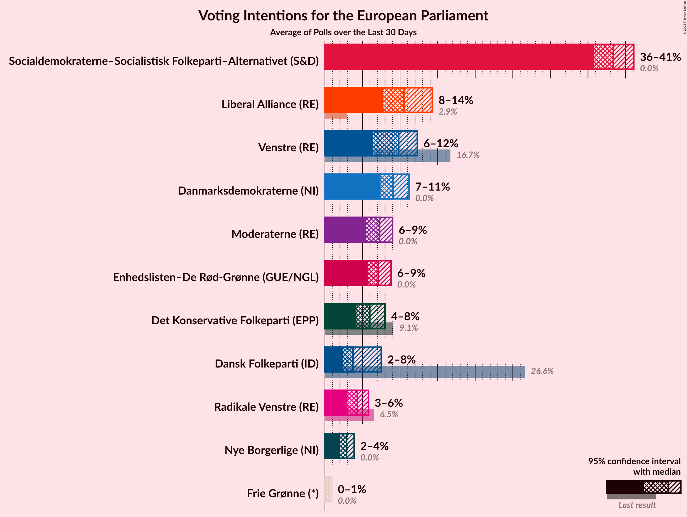

### Confidence Intervals

| Party | Last Result | Median | 80% Confidence Interval | 90% Confidence Interval | 95% Confidence Interval | 99% Confidence Interval |
|:-----:|:-----------:|:------:|:-----------------------:|:-----------------------:|:-----------------------:|:-----------------------:|
| <a href="#dansk-folkeparti-(id)">Dansk Folkeparti (ID)</a> | 26.6% | 3.7% | 2.8–6.7% |2.6–7.2% | 2.4–7.5% | 2.1–8.2% |
| <a href="#socialdemokraterne-(s&d)">Socialdemokraterne (S&D)</a> | 19.1% | N/A | N/A |N/A | N/A | N/A |
| <a href="#venstre-(re)">Venstre (RE)</a> | 16.7% | 9.8% | 7.2–11.6% |6.7–12.0% | 6.4–12.3% | 5.8–12.9% |
| <a href="#socialistisk-folkeparti-(greens/efa)">Socialistisk Folkeparti (Greens/EFA)</a> | 10.9% | N/A | N/A |N/A | N/A | N/A |
| <a href="#det-konservative-folkeparti-(epp)">Det Konservative Folkeparti (EPP)</a> | 9.1% | 6.0% | 4.7–7.4% |4.4–7.8% | 4.2–8.0% | 3.8–8.5% |
| <a href="#radikale-venstre-(re)">Radikale Venstre (RE)</a> | 6.5% | 4.3% | 3.4–5.3% |3.2–5.6% | 3.0–5.8% | 2.8–6.3% |
| <a href="#liberal-alliance-(re)">Liberal Alliance (RE)</a> | 2.9% | 10.5% | 8.3–13.2% |8.0–13.8% | 7.7–14.3% | 7.3–15.1% |
| <a href="#alternativet-(greens/efa)">Alternativet (Greens/EFA)</a> | 0.0% | N/A | N/A |N/A | N/A | N/A |
| <a href="#enhedslisten–de-rød-grønne-(gue/ngl)">Enhedslisten–De Rød-Grønne (GUE/NGL)</a> | 0.0% | 7.1% | 6.1–8.2% |5.9–8.5% | 5.7–8.8% | 5.3–9.4% |
| <a href="#kristendemokraterne-(epp)">Kristendemokraterne (EPP)</a> | 0.0% | N/A | N/A |N/A | N/A | N/A |
| <a href="#nye-borgerlige-(ni)">Nye Borgerlige (NI)</a> | 0.0% | 2.9% | 2.3–3.5% |2.1–3.7% | 2.0–3.9% | 1.8–4.3% |
| <a href="#borgerlisten-(*)">Borgerlisten (*)</a> | 0.0% | N/A | N/A |N/A | N/A | N/A |
| <a href="#stram-kurs-(*)">Stram Kurs (*)</a> | 0.0% | N/A | N/A |N/A | N/A | N/A |
| <a href="#veganerpartiet-(*)">Veganerpartiet (*)</a> | 0.0% | N/A | N/A |N/A | N/A | N/A |
| <a href="#frie-grønne-(*)">Frie Grønne (*)</a> | 0.0% | 0.5% | 0.3–0.8% |0.3–0.8% | 0.3–0.9% | 0.2–1.1% |
| <a href="#danmarksdemokraterne-(ni)">Danmarksdemokraterne (NI)</a> | 0.0% | 9.1% | 8.0–10.3% |7.6–10.8% | 7.4–11.2% | 6.8–11.9% |
| <a href="#moderaterne-(re)">Moderaterne (RE)</a> | 0.0% | 7.3% | 6.1–8.4% |5.8–8.7% | 5.5–9.0% | 5.1–9.5% |
| <a href="#socialdemokraterne–socialistisk-folkeparti–alternativet-(s&d)">Socialdemokraterne–Socialistisk Folkeparti–Alternativet (S&D)</a> | 0.0% | 38.4% | 36.7–40.1% |36.2–40.7% | 35.8–41.1% | 35.0–42.1% |

### Dansk Folkeparti (ID)

*For a full overview of the results for this party, see the [Dansk Folkeparti (ID)](party-danskfolkepartiid.html) page.*

| Voting Intentions | Probability | Accumulated | Special Marks |
|:-----------------:|:-----------:|:-----------:|:-------------:|
| 0.5–1.5% | 0% | 100% |  |
| 1.5–2.5% | 4% | 100% |  |
| 2.5–3.5% | 37% | 96% |  |
| 3.5–4.5% | 31% | 58% | Median |
| 4.5–5.5% | 4% | 27% |  |
| 5.5–6.5% | 11% | 23% |  |
| 6.5–7.5% | 10% | 12% |  |
| 7.5–8.5% | 2% | 2% |  |
| 8.5–9.5% | 0.2% | 0.2% |  |
| 9.5–10.5% | 0% | 0% |  |
| 10.5–11.5% | 0% | 0% |  |
| 11.5–12.5% | 0% | 0% |  |
| 12.5–13.5% | 0% | 0% |  |
| 13.5–14.5% | 0% | 0% |  |
| 14.5–15.5% | 0% | 0% |  |
| 15.5–16.5% | 0% | 0% |  |
| 16.5–17.5% | 0% | 0% |  |
| 17.5–18.5% | 0% | 0% |  |
| 18.5–19.5% | 0% | 0% |  |
| 19.5–20.5% | 0% | 0% |  |
| 20.5–21.5% | 0% | 0% |  |
| 21.5–22.5% | 0% | 0% |  |
| 22.5–23.5% | 0% | 0% |  |
| 23.5–24.5% | 0% | 0% |  |
| 24.5–25.5% | 0% | 0% |  |
| 25.5–26.5% | 0% | 0% |  |
| 26.5–27.5% | 0% | 0% | Last Result |

### Venstre (RE)

*For a full overview of the results for this party, see the [Venstre (RE)](party-venstrere.html) page.*

| Voting Intentions | Probability | Accumulated | Special Marks |
|:-----------------:|:-----------:|:-----------:|:-------------:|
| 3.5–4.5% | 0% | 100% |  |
| 4.5–5.5% | 0.2% | 100% |  |
| 5.5–6.5% | 4% | 99.8% |  |
| 6.5–7.5% | 11% | 96% |  |
| 7.5–8.5% | 11% | 85% |  |
| 8.5–9.5% | 18% | 75% |  |
| 9.5–10.5% | 25% | 57% | Median |
| 10.5–11.5% | 20% | 31% |  |
| 11.5–12.5% | 9% | 11% |  |
| 12.5–13.5% | 1.4% | 1.4% |  |
| 13.5–14.5% | 0.1% | 0.1% |  |
| 14.5–15.5% | 0% | 0% |  |
| 15.5–16.5% | 0% | 0% |  |
| 16.5–17.5% | 0% | 0% | Last Result |

### Det Konservative Folkeparti (EPP)

*For a full overview of the results for this party, see the [Det Konservative Folkeparti (EPP)](party-detkonservativefolkepartiepp.html) page.*

| Voting Intentions | Probability | Accumulated | Special Marks |
|:-----------------:|:-----------:|:-----------:|:-------------:|
| 1.5–2.5% | 0% | 100% |  |
| 2.5–3.5% | 0.2% | 100% |  |
| 3.5–4.5% | 7% | 99.8% |  |
| 4.5–5.5% | 29% | 93% |  |
| 5.5–6.5% | 30% | 64% | Median |
| 6.5–7.5% | 26% | 34% |  |
| 7.5–8.5% | 8% | 8% |  |
| 8.5–9.5% | 0.4% | 0.4% | Last Result |
| 9.5–10.5% | 0% | 0% |  |

### Radikale Venstre (RE)

*For a full overview of the results for this party, see the [Radikale Venstre (RE)](party-radikalevenstrere.html) page.*

| Voting Intentions | Probability | Accumulated | Special Marks |
|:-----------------:|:-----------:|:-----------:|:-------------:|
| 1.5–2.5% | 0.1% | 100% |  |
| 2.5–3.5% | 15% | 99.9% |  |
| 3.5–4.5% | 47% | 84% | Median |
| 4.5–5.5% | 33% | 38% |  |
| 5.5–6.5% | 5% | 5% |  |
| 6.5–7.5% | 0.2% | 0.2% | Last Result |
| 7.5–8.5% | 0% | 0% |  |

### Liberal Alliance (RE)

*For a full overview of the results for this party, see the [Liberal Alliance (RE)](party-liberalalliancere.html) page.*

| Voting Intentions | Probability | Accumulated | Special Marks |
|:-----------------:|:-----------:|:-----------:|:-------------:|
| 2.5–3.5% | 0% | 100% | Last Result |
| 3.5–4.5% | 0% | 100% |  |
| 4.5–5.5% | 0% | 100% |  |
| 5.5–6.5% | 0% | 100% |  |
| 6.5–7.5% | 1.4% | 100% |  |
| 7.5–8.5% | 12% | 98.6% |  |
| 8.5–9.5% | 18% | 86% |  |
| 9.5–10.5% | 19% | 68% |  |
| 10.5–11.5% | 20% | 49% | Median |
| 11.5–12.5% | 13% | 29% |  |
| 12.5–13.5% | 10% | 17% |  |
| 13.5–14.5% | 5% | 7% |  |
| 14.5–15.5% | 1.4% | 2% |  |
| 15.5–16.5% | 0.2% | 0.2% |  |
| 16.5–17.5% | 0% | 0% |  |

### Moderaterne (RE)

*For a full overview of the results for this party, see the [Moderaterne (RE)](party-moderaternere.html) page.*

| Voting Intentions | Probability | Accumulated | Special Marks |
|:-----------------:|:-----------:|:-----------:|:-------------:|
| 0.0–0.5% | 0% | 100% | Last Result |
| 0.5–1.5% | 0% | 100% |  |
| 1.5–2.5% | 0% | 100% |  |
| 2.5–3.5% | 0% | 100% |  |
| 3.5–4.5% | 0.1% | 100% |  |
| 4.5–5.5% | 3% | 99.9% |  |
| 5.5–6.5% | 19% | 97% |  |
| 6.5–7.5% | 41% | 79% | Median |
| 7.5–8.5% | 31% | 38% |  |
| 8.5–9.5% | 7% | 7% |  |
| 9.5–10.5% | 0.4% | 0.4% |  |
| 10.5–11.5% | 0% | 0% |  |

### Enhedslisten–De Rød-Grønne (GUE/NGL)

*For a full overview of the results for this party, see the [Enhedslisten–De Rød-Grønne (GUE/NGL)](party-enhedslisten–derød-grønneguengl.html) page.*

| Voting Intentions | Probability | Accumulated | Special Marks |
|:-----------------:|:-----------:|:-----------:|:-------------:|
| 0.0–0.5% | 0% | 100% | Last Result |
| 0.5–1.5% | 0% | 100% |  |
| 1.5–2.5% | 0% | 100% |  |
| 2.5–3.5% | 0% | 100% |  |
| 3.5–4.5% | 0% | 100% |  |
| 4.5–5.5% | 2% | 100% |  |
| 5.5–6.5% | 23% | 98% |  |
| 6.5–7.5% | 45% | 76% | Median |
| 7.5–8.5% | 26% | 31% |  |
| 8.5–9.5% | 5% | 5% |  |
| 9.5–10.5% | 0.3% | 0.3% |  |
| 10.5–11.5% | 0% | 0% |  |

### Nye Borgerlige (NI)

*For a full overview of the results for this party, see the [Nye Borgerlige (NI)](party-nyeborgerligeni.html) page.*

| Voting Intentions | Probability | Accumulated | Special Marks |
|:-----------------:|:-----------:|:-----------:|:-------------:|
| 0.0–0.5% | 0% | 100% | Last Result |
| 0.5–1.5% | 0.1% | 100% |  |
| 1.5–2.5% | 23% | 99.9% |  |
| 2.5–3.5% | 67% | 77% | Median |
| 3.5–4.5% | 9% | 10% |  |
| 4.5–5.5% | 0.1% | 0.1% |  |
| 5.5–6.5% | 0% | 0% |  |

### Socialdemokraterne–Socialistisk Folkeparti–Alternativet (S&D)

*For a full overview of the results for this party, see the [Socialdemokraterne–Socialistisk Folkeparti–Alternativet (S&D)](party-socialdemokraterne–socialistiskfolkeparti–alternativetsd.html) page.*

| Voting Intentions | Probability | Accumulated | Special Marks |
|:-----------------:|:-----------:|:-----------:|:-------------:|
| 0.0–0.5% | 0% | 100% | Last Result |
| 0.5–1.5% | 0% | 100% |  |
| 1.5–2.5% | 0% | 100% |  |
| 2.5–3.5% | 0% | 100% |  |
| 3.5–4.5% | 0% | 100% |  |
| 4.5–5.5% | 0% | 100% |  |
| 5.5–6.5% | 0% | 100% |  |
| 6.5–7.5% | 0% | 100% |  |
| 7.5–8.5% | 0% | 100% |  |
| 8.5–9.5% | 0% | 100% |  |
| 9.5–10.5% | 0% | 100% |  |
| 10.5–11.5% | 0% | 100% |  |
| 11.5–12.5% | 0% | 100% |  |
| 12.5–13.5% | 0% | 100% |  |
| 13.5–14.5% | 0% | 100% |  |
| 14.5–15.5% | 0% | 100% |  |
| 15.5–16.5% | 0% | 100% |  |
| 16.5–17.5% | 0% | 100% |  |
| 17.5–18.5% | 0% | 100% |  |
| 18.5–19.5% | 0% | 100% |  |
| 19.5–20.5% | 0% | 100% |  |
| 20.5–21.5% | 0% | 100% |  |
| 21.5–22.5% | 0% | 100% |  |
| 22.5–23.5% | 0% | 100% |  |
| 23.5–24.5% | 0% | 100% |  |
| 24.5–25.5% | 0% | 100% |  |
| 25.5–26.5% | 0% | 100% |  |
| 26.5–27.5% | 0% | 100% |  |
| 27.5–28.5% | 0% | 100% |  |
| 28.5–29.5% | 0% | 100% |  |
| 29.5–30.5% | 0% | 100% |  |
| 30.5–31.5% | 0% | 100% |  |
| 31.5–32.5% | 0% | 100% |  |
| 32.5–33.5% | 0% | 100% |  |
| 33.5–34.5% | 0.2% | 100% |  |
| 34.5–35.5% | 1.3% | 99.8% |  |
| 35.5–36.5% | 6% | 98% |  |
| 36.5–37.5% | 18% | 92% |  |
| 37.5–38.5% | 29% | 74% | Median |
| 38.5–39.5% | 26% | 45% |  |
| 39.5–40.5% | 13% | 19% |  |
| 40.5–41.5% | 5% | 6% |  |
| 41.5–42.5% | 1.1% | 1.3% |  |
| 42.5–43.5% | 0.2% | 0.2% |  |
| 43.5–44.5% | 0% | 0% |  |

### Danmarksdemokraterne (NI)

*For a full overview of the results for this party, see the [Danmarksdemokraterne (NI)](party-danmarksdemokraterneni.html) page.*

| Voting Intentions | Probability | Accumulated | Special Marks |
|:-----------------:|:-----------:|:-----------:|:-------------:|
| 0.0–0.5% | 0% | 100% | Last Result |
| 0.5–1.5% | 0% | 100% |  |
| 1.5–2.5% | 0% | 100% |  |
| 2.5–3.5% | 0% | 100% |  |
| 3.5–4.5% | 0% | 100% |  |
| 4.5–5.5% | 0% | 100% |  |
| 5.5–6.5% | 0.2% | 100% |  |
| 6.5–7.5% | 4% | 99.8% |  |
| 7.5–8.5% | 24% | 96% |  |
| 8.5–9.5% | 43% | 72% | Median |
| 9.5–10.5% | 22% | 29% |  |
| 10.5–11.5% | 6% | 7% |  |
| 11.5–12.5% | 1.1% | 1.2% |  |
| 12.5–13.5% | 0.1% | 0.1% |  |
| 13.5–14.5% | 0% | 0% |  |

### Frie Grønne (*)

*For a full overview of the results for this party, see the [Frie Grønne (*)](party-friegrønne.html) page.*

| Voting Intentions | Probability | Accumulated | Special Marks |
|:-----------------:|:-----------:|:-----------:|:-------------:|
| 0.0–0.5% | 56% | 100% | Last Result |
| 0.5–1.5% | 44% | 44% | Median |
| 1.5–2.5% | 0% | 0% |  |

## Seats

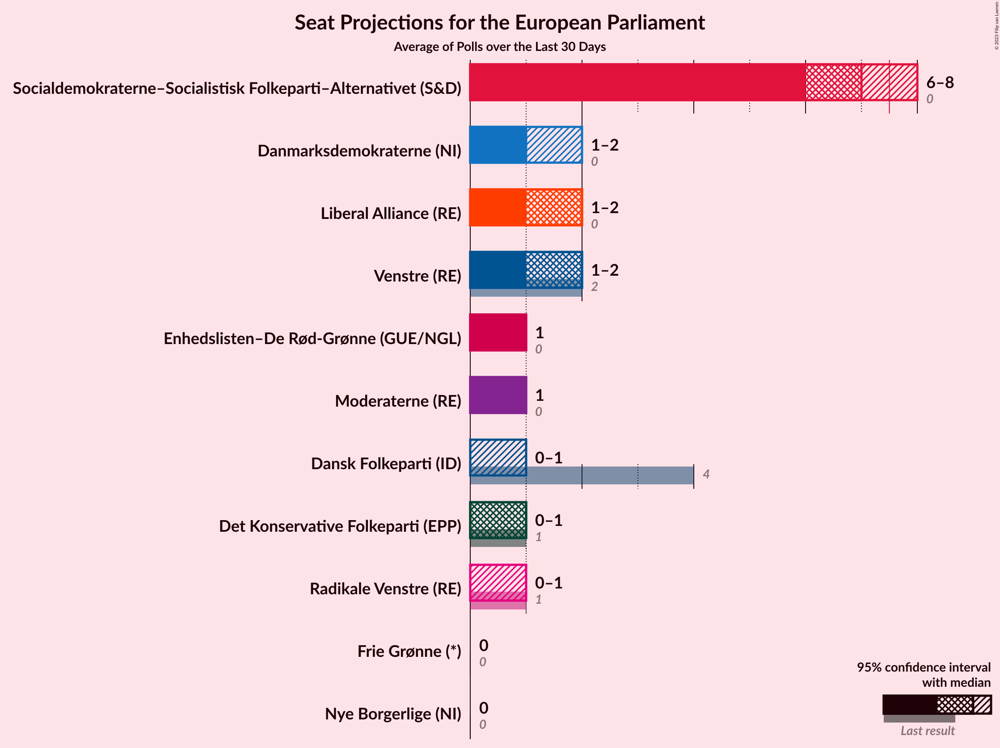

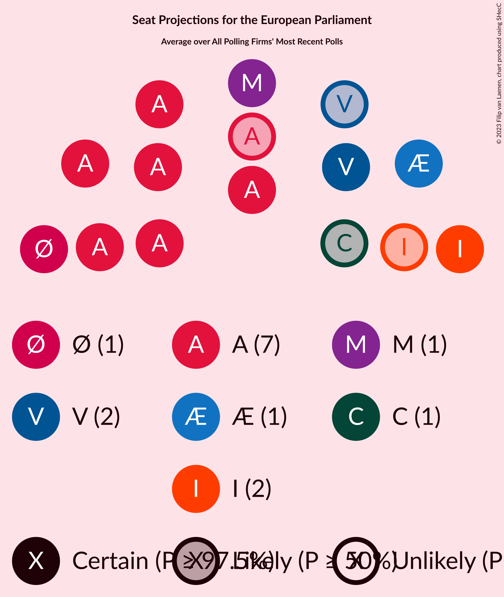

### Confidence Intervals

| Party | Last Result | Median | 80% Confidence Interval | 90% Confidence Interval | 95% Confidence Interval | 99% Confidence Interval |
|:-----:|:-----------:|:------:|:-----------------------:|:-----------------------:|:-----------------------:|:-----------------------:|
| <a href="#dansk-folkeparti-(id)">Dansk Folkeparti (ID)</a> | 4 | 0 | 0–1 |0–1 | 0–1 | 0–1 |
| <a href="#socialdemokraterne-(s&d)">Socialdemokraterne (S&D)</a> | 3 | N/A | N/A |N/A | N/A | N/A |
| <a href="#venstre-(re)">Venstre (RE)</a> | 2 | 2 | 1–2 |1–2 | 1–2 | 1–2 |
| <a href="#socialistisk-folkeparti-(greens/efa)">Socialistisk Folkeparti (Greens/EFA)</a> | 1 | N/A | N/A |N/A | N/A | N/A |
| <a href="#det-konservative-folkeparti-(epp)">Det Konservative Folkeparti (EPP)</a> | 1 | 1 | 0–1 |0–1 | 0–1 | 0–1 |
| <a href="#radikale-venstre-(re)">Radikale Venstre (RE)</a> | 1 | 0 | 0–1 |0–1 | 0–1 | 0–1 |
| <a href="#liberal-alliance-(re)">Liberal Alliance (RE)</a> | 0 | 2 | 1–2 |1–2 | 1–2 | 1–3 |
| <a href="#alternativet-(greens/efa)">Alternativet (Greens/EFA)</a> | 0 | N/A | N/A |N/A | N/A | N/A |
| <a href="#enhedslisten–de-rød-grønne-(gue/ngl)">Enhedslisten–De Rød-Grønne (GUE/NGL)</a> | 0 | 1 | 1 |1 | 1 | 1 |
| <a href="#kristendemokraterne-(epp)">Kristendemokraterne (EPP)</a> | 0 | N/A | N/A |N/A | N/A | N/A |
| <a href="#nye-borgerlige-(ni)">Nye Borgerlige (NI)</a> | 0 | 0 | 0 |0 | 0 | 0 |
| <a href="#borgerlisten-(*)">Borgerlisten (*)</a> | 0 | N/A | N/A |N/A | N/A | N/A |
| <a href="#stram-kurs-(*)">Stram Kurs (*)</a> | 0 | N/A | N/A |N/A | N/A | N/A |
| <a href="#veganerpartiet-(*)">Veganerpartiet (*)</a> | 0 | N/A | N/A |N/A | N/A | N/A |
| <a href="#frie-grønne-(*)">Frie Grønne (*)</a> | 0 | 0 | 0 |0 | 0 | 0 |
| <a href="#danmarksdemokraterne-(ni)">Danmarksdemokraterne (NI)</a> | 0 | 1 | 1–2 |1–2 | 1–2 | 1–2 |
| <a href="#moderaterne-(re)">Moderaterne (RE)</a> | 0 | 1 | 1 |1 | 1 | 1 |
| <a href="#socialdemokraterne–socialistisk-folkeparti–alternativet-(s&d)">Socialdemokraterne–Socialistisk Folkeparti–Alternativet (S&D)</a> | 0 | 7 | 7–8 |7–8 | 6–8 | 6–8 |

### Dansk Folkeparti (ID)

*For a full overview of the results for this party, see the [Dansk Folkeparti (ID)](party-danskfolkepartiid.html) page.*

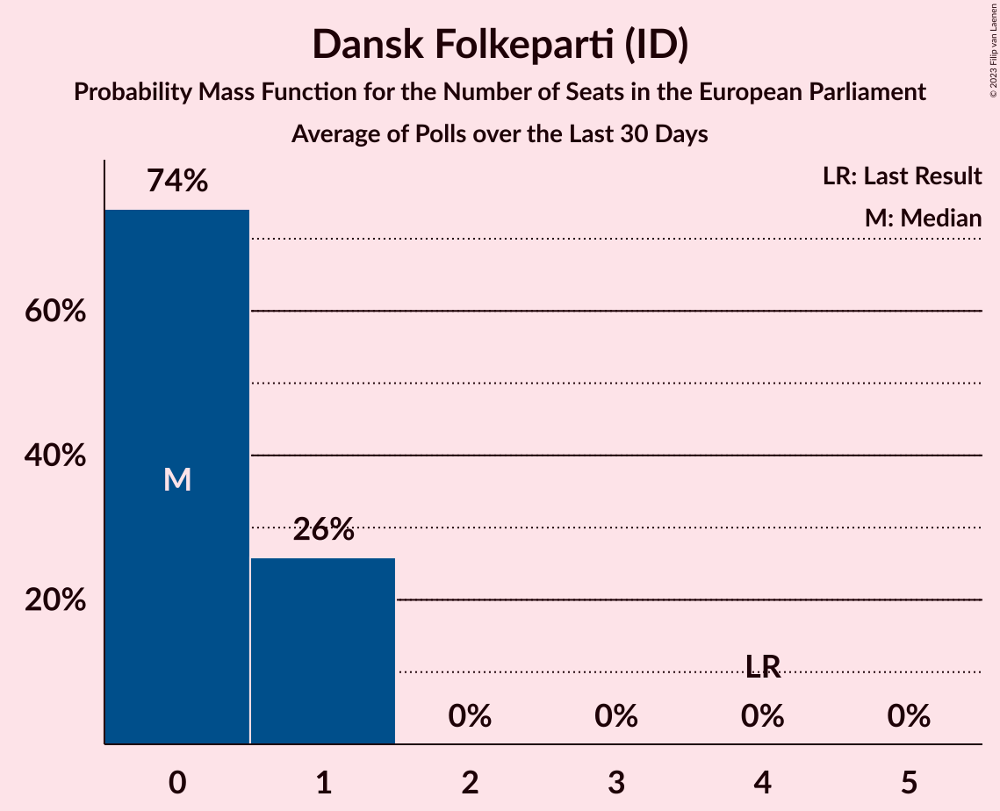

| Number of Seats | Probability | Accumulated | Special Marks |
|:---------------:|:-----------:|:-----------:|:-------------:|
| 0 | 74% | 100% | Median |
| 1 | 26% | 26% |  |
| 2 | 0% | 0% |  |
| 3 | 0% | 0% |  |
| 4 | 0% | 0% | Last Result |

### Socialdemokraterne (S&D)

*For a full overview of the results for this party, see the [Socialdemokraterne (S&D)](party-socialdemokraternesd.html) page.*

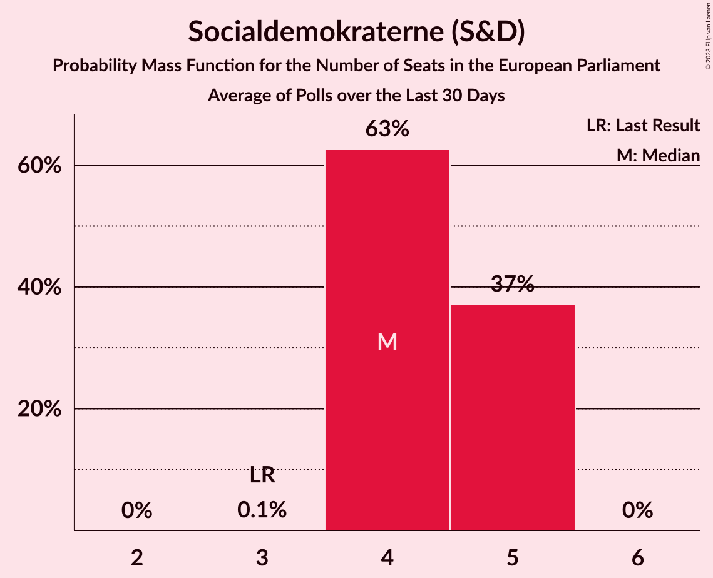

### Venstre (RE)

*For a full overview of the results for this party, see the [Venstre (RE)](party-venstrere.html) page.*

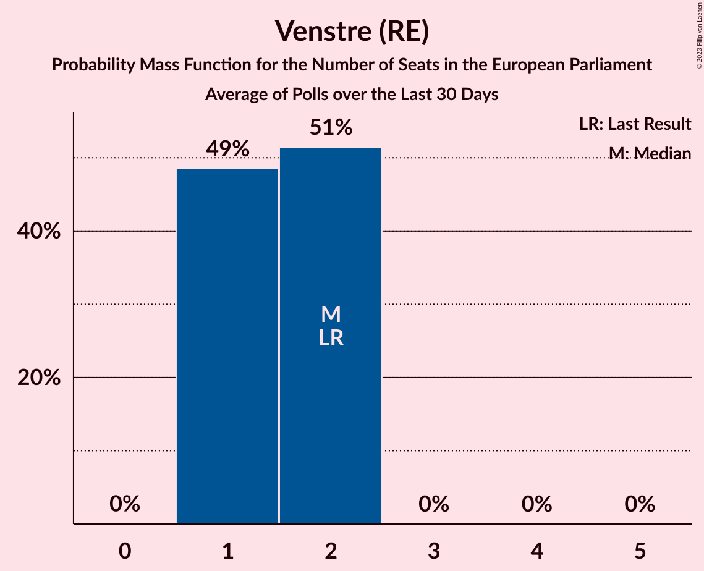

| Number of Seats | Probability | Accumulated | Special Marks |
|:---------------:|:-----------:|:-----------:|:-------------:|
| 1 | 49% | 100% |  |
| 2 | 51% | 51% | Last Result, Median |
| 3 | 0% | 0% |  |

### Socialistisk Folkeparti (Greens/EFA)

*For a full overview of the results for this party, see the [Socialistisk Folkeparti (Greens/EFA)](party-socialistiskfolkepartigreensefa.html) page.*

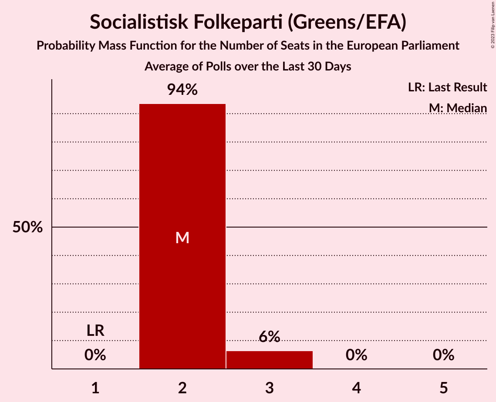

### Det Konservative Folkeparti (EPP)

*For a full overview of the results for this party, see the [Det Konservative Folkeparti (EPP)](party-detkonservativefolkepartiepp.html) page.*

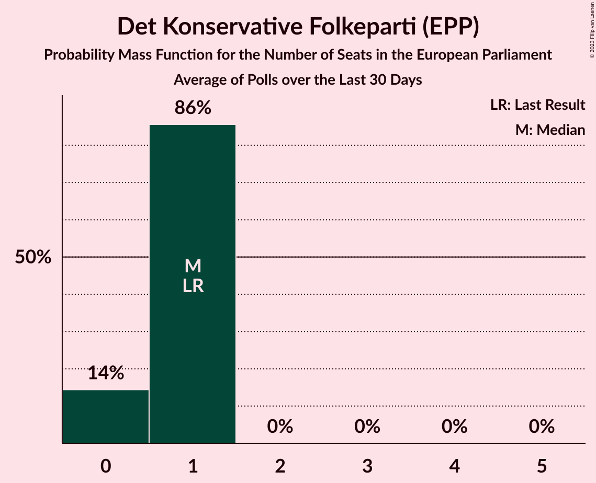

| Number of Seats | Probability | Accumulated | Special Marks |
|:---------------:|:-----------:|:-----------:|:-------------:|
| 0 | 14% | 100% |  |
| 1 | 86% | 86% | Last Result, Median |
| 2 | 0% | 0% |  |

### Radikale Venstre (RE)

*For a full overview of the results for this party, see the [Radikale Venstre (RE)](party-radikalevenstrere.html) page.*

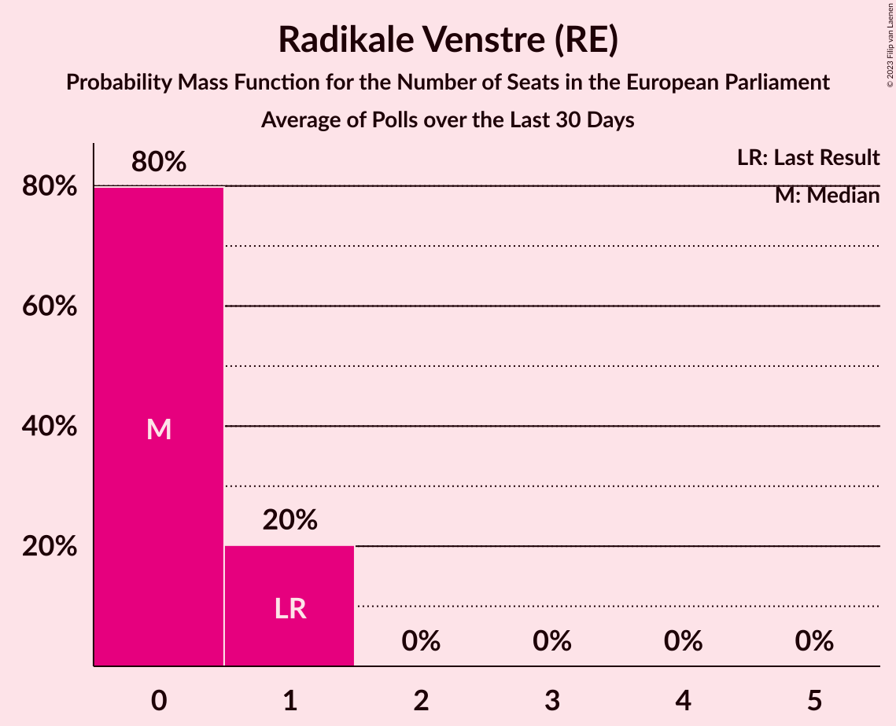

| Number of Seats | Probability | Accumulated | Special Marks |
|:---------------:|:-----------:|:-----------:|:-------------:|
| 0 | 80% | 100% | Median |
| 1 | 20% | 20% | Last Result |
| 2 | 0% | 0% |  |

### Liberal Alliance (RE)

*For a full overview of the results for this party, see the [Liberal Alliance (RE)](party-liberalalliancere.html) page.*

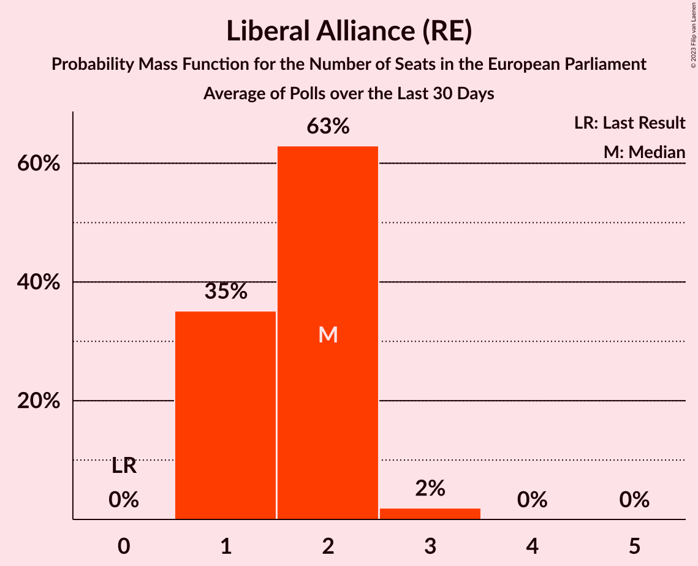

| Number of Seats | Probability | Accumulated | Special Marks |
|:---------------:|:-----------:|:-----------:|:-------------:|
| 0 | 0% | 100% | Last Result |
| 1 | 35% | 100% |  |
| 2 | 63% | 65% | Median |
| 3 | 2% | 2% |  |
| 4 | 0% | 0% |  |

### Alternativet (Greens/EFA)

*For a full overview of the results for this party, see the [Alternativet (Greens/EFA)](party-alternativetgreensefa.html) page.*

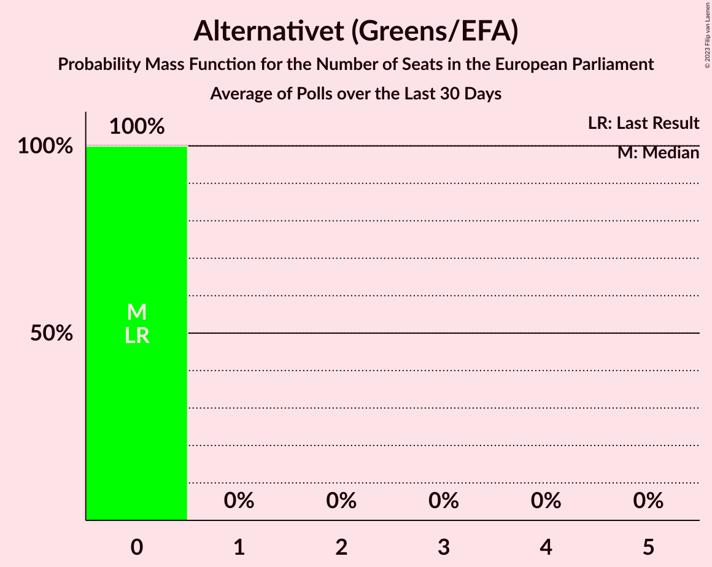

### Enhedslisten–De Rød-Grønne (GUE/NGL)

*For a full overview of the results for this party, see the [Enhedslisten–De Rød-Grønne (GUE/NGL)](party-enhedslisten–derød-grønneguengl.html) page.*

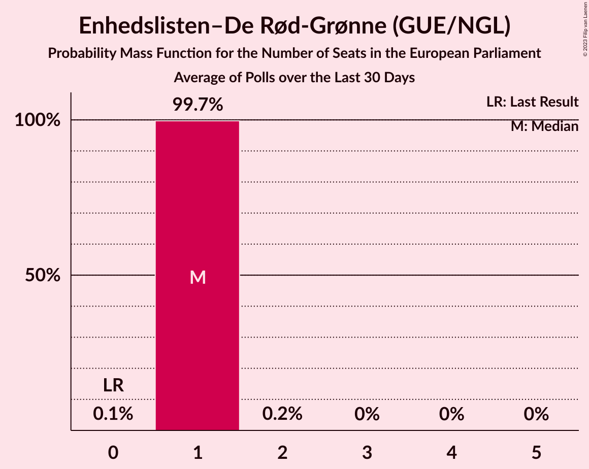

| Number of Seats | Probability | Accumulated | Special Marks |
|:---------------:|:-----------:|:-----------:|:-------------:|
| 0 | 0.1% | 100% | Last Result |
| 1 | 99.7% | 99.9% | Median |
| 2 | 0.2% | 0.2% |  |
| 3 | 0% | 0% |  |

### Kristendemokraterne (EPP)

*For a full overview of the results for this party, see the [Kristendemokraterne (EPP)](party-kristendemokraterneepp.html) page.*

### Nye Borgerlige (NI)

*For a full overview of the results for this party, see the [Nye Borgerlige (NI)](party-nyeborgerligeni.html) page.*

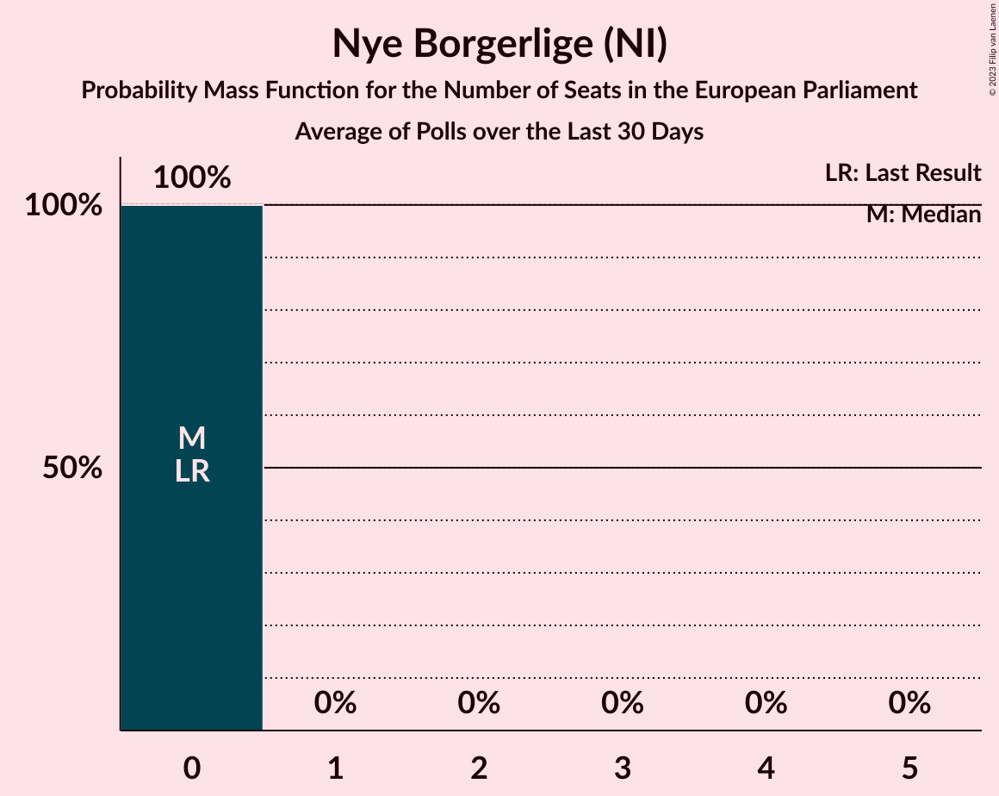

| Number of Seats | Probability | Accumulated | Special Marks |
|:---------------:|:-----------:|:-----------:|:-------------:|
| 0 | 100% | 100% | Last Result, Median |

### Borgerlisten (*)

*For a full overview of the results for this party, see the [Borgerlisten (*)](party-borgerlisten.html) page.*

### Stram Kurs (*)

*For a full overview of the results for this party, see the [Stram Kurs (*)](party-stramkurs.html) page.*

### Veganerpartiet (*)

*For a full overview of the results for this party, see the [Veganerpartiet (*)](party-veganerpartiet.html) page.*

### Frie Grønne (*)

*For a full overview of the results for this party, see the [Frie Grønne (*)](party-friegrønne.html) page.*

| Number of Seats | Probability | Accumulated | Special Marks |
|:---------------:|:-----------:|:-----------:|:-------------:|
| 0 | 100% | 100% | Last Result, Median |

### Danmarksdemokraterne (NI)

*For a full overview of the results for this party, see the [Danmarksdemokraterne (NI)](party-danmarksdemokraterneni.html) page.*

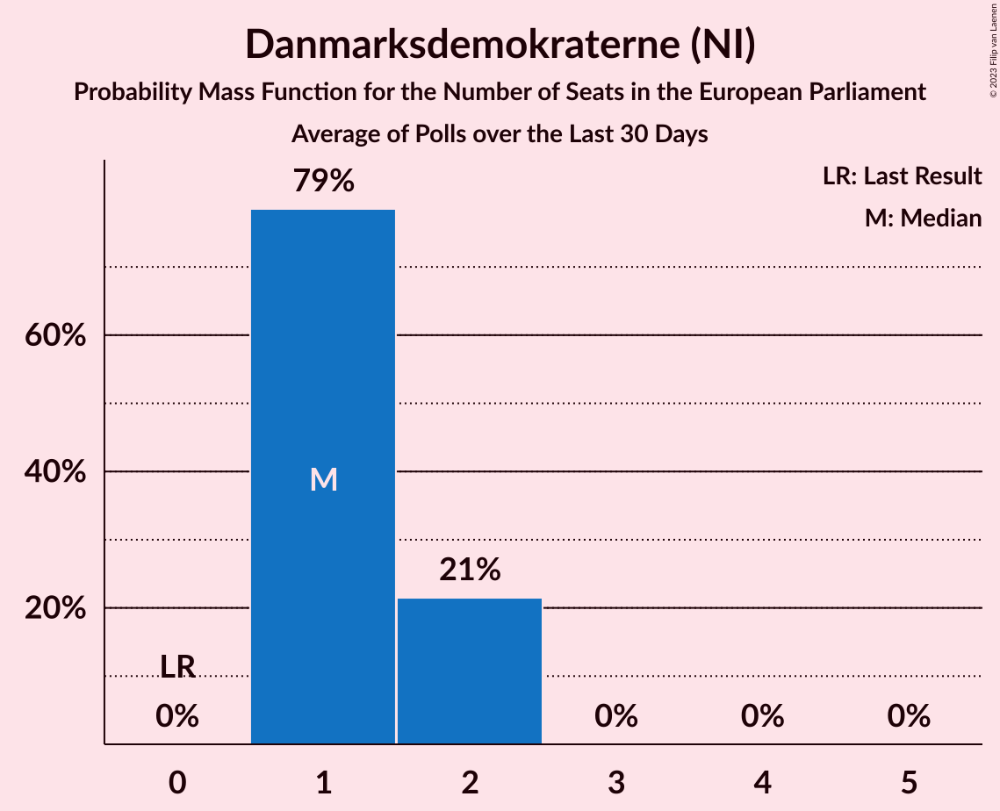

| Number of Seats | Probability | Accumulated | Special Marks |
|:---------------:|:-----------:|:-----------:|:-------------:|
| 0 | 0% | 100% | Last Result |
| 1 | 79% | 100% | Median |
| 2 | 21% | 21% |  |
| 3 | 0% | 0% |  |

### Moderaterne (RE)

*For a full overview of the results for this party, see the [Moderaterne (RE)](party-moderaternere.html) page.*

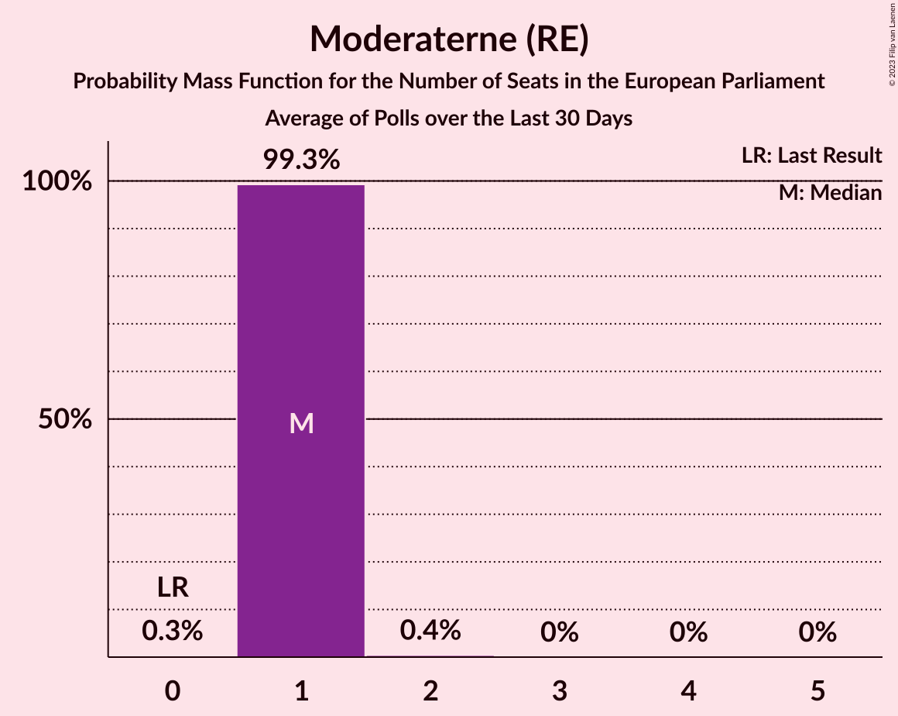

| Number of Seats | Probability | Accumulated | Special Marks |
|:---------------:|:-----------:|:-----------:|:-------------:|
| 0 | 0.3% | 100% | Last Result |
| 1 | 99.3% | 99.7% | Median |
| 2 | 0.4% | 0.4% |  |
| 3 | 0% | 0% |  |

### Socialdemokraterne–Socialistisk Folkeparti–Alternativet (S&D)

*For a full overview of the results for this party, see the [Socialdemokraterne–Socialistisk Folkeparti–Alternativet (S&D)](party-socialdemokraterne–socialistiskfolkeparti–alternativetsd.html) page.*

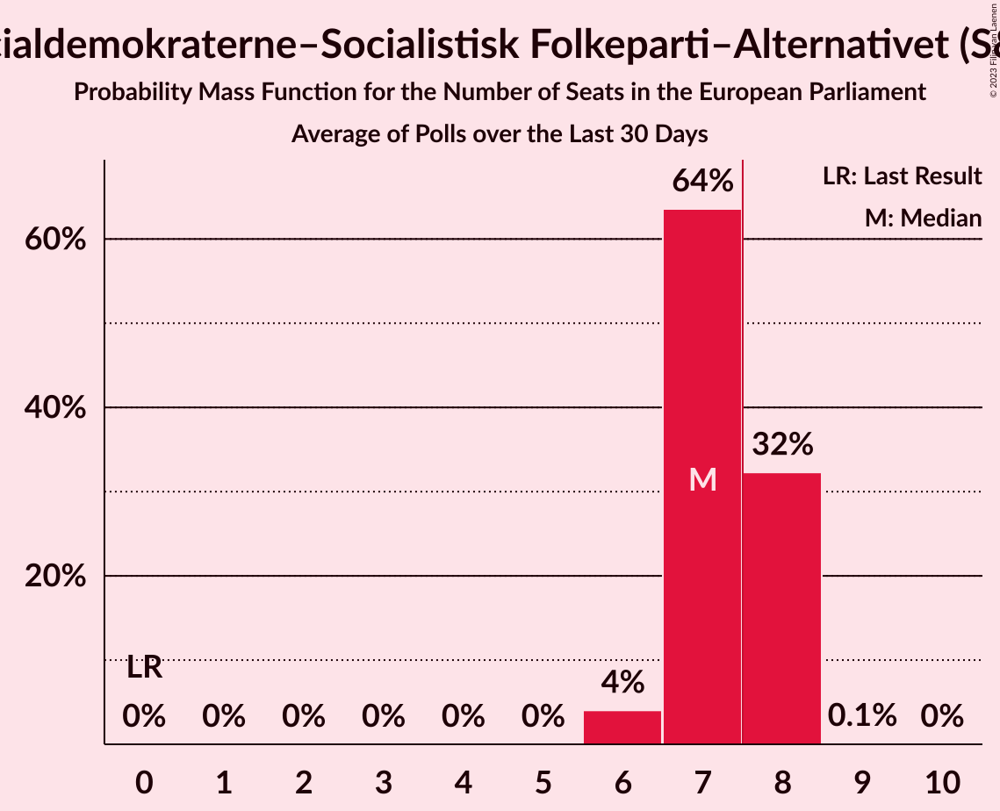

| Number of Seats | Probability | Accumulated | Special Marks |
|:---------------:|:-----------:|:-----------:|:-------------:|
| 0 | 0% | 100% | Last Result |
| 1 | 0% | 100% |  |
| 2 | 0% | 100% |  |
| 3 | 0% | 100% |  |
| 4 | 0% | 100% |  |
| 5 | 0% | 100% |  |
| 6 | 4% | 100% |  |
| 7 | 64% | 96% | Median |
| 8 | 32% | 32% | Majority |
| 9 | 0.1% | 0.1% |  |
| 10 | 0% | 0% |  |

## Coalitions

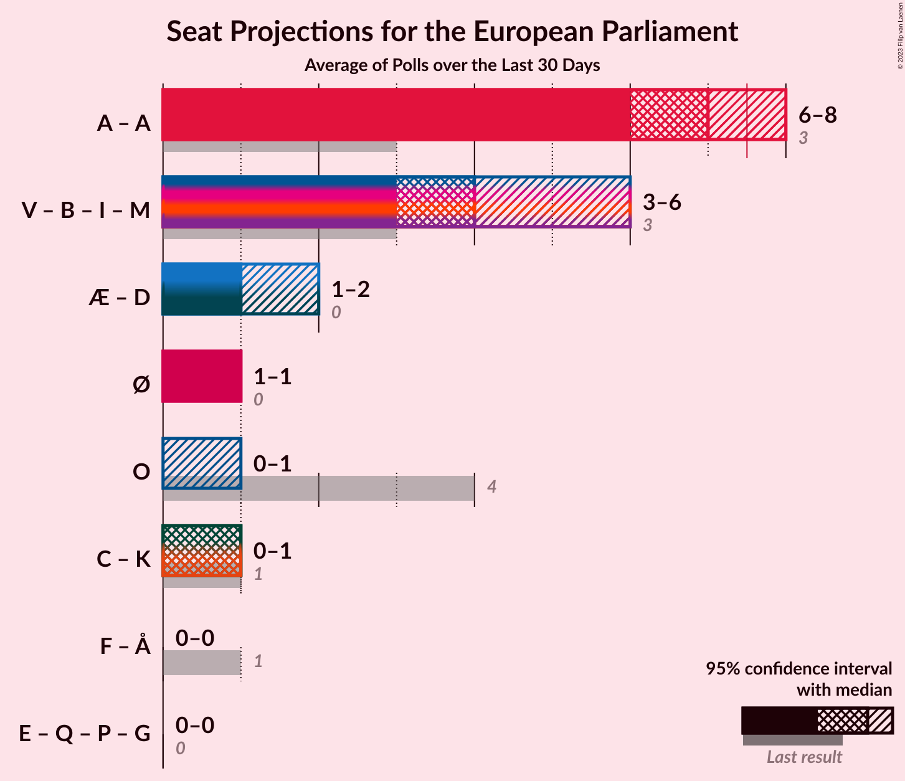

### Confidence Intervals

| Coalition | Last Result | Median | Majority? | 80% Confidence Interval | 90% Confidence Interval | 95% Confidence Interval | 99% Confidence Interval |
|:---------:|:-----------:|:------:|:---------:|:-----------------------:|:-----------------------:|:-----------------------:|:-----------------------:|
| Socialdemokraterne (S&D) – Socialdemokraterne–Socialistisk Folkeparti–Alternativet (S&D) | 3 | 7 | 32% | 7–8 | 7–8 | 6–8 | 6–8 |
| Venstre (RE) – Radikale Venstre (RE) – Liberal Alliance (RE) – Moderaterne (RE) | 3 | 4 | 0% | 3–5 | 3–6 | 3–6 | 3–6 |
| Danmarksdemokraterne (NI) – Nye Borgerlige (NI) | 0 | 1 | 0% | 1–2 | 1–2 | 1–2 | 1–2 |
| Enhedslisten–De Rød-Grønne (GUE/NGL) | 0 | 1 | 0% | 1 | 1 | 1 | 1 |
| Dansk Folkeparti (ID) | 4 | 0 | 0% | 0–1 | 0–1 | 0–1 | 0–1 |
| Det Konservative Folkeparti (EPP) – Kristendemokraterne (EPP) | 1 | 1 | 0% | 0–1 | 0–1 | 0–1 | 0–1 |
| Socialistisk Folkeparti (Greens/EFA) – Alternativet (Greens/EFA) | 1 | 0 | 0% | 0 | 0 | 0 | 0 |
| Borgerlisten (*) – Frie Grønne (*) – Stram Kurs (*) – Veganerpartiet (*) | 0 | 0 | 0% | 0 | 0 | 0 | 0 |

### Socialdemokraterne (S&D) – Socialdemokraterne–Socialistisk Folkeparti–Alternativet (S&D)

| Number of Seats | Probability | Accumulated | Special Marks |
|:---------------:|:-----------:|:-----------:|:-------------:|
| 3 | 0% | 100% | Last Result |
| 4 | 0% | 100% |  |
| 5 | 0% | 100% |  |
| 6 | 4% | 100% |  |
| 7 | 64% | 96% | Median |
| 8 | 32% | 32% | Majority |
| 9 | 0.1% | 0.1% |  |
| 10 | 0% | 0% |  |

### Venstre (RE) – Radikale Venstre (RE) – Liberal Alliance (RE) – Moderaterne (RE)

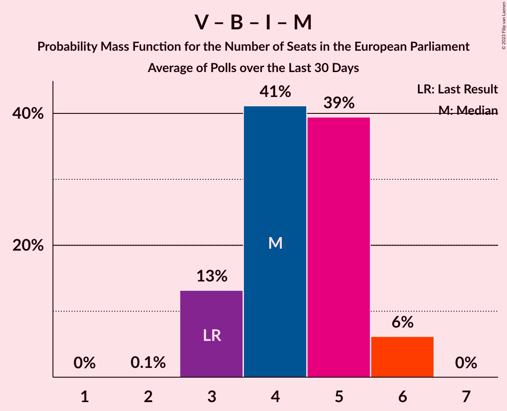

| Number of Seats | Probability | Accumulated | Special Marks |
|:---------------:|:-----------:|:-----------:|:-------------:|
| 2 | 0.1% | 100% |  |
| 3 | 13% | 99.9% | Last Result |
| 4 | 41% | 87% |  |
| 5 | 39% | 46% | Median |
| 6 | 6% | 6% |  |
| 7 | 0% | 0% |  |

### Danmarksdemokraterne (NI) – Nye Borgerlige (NI)

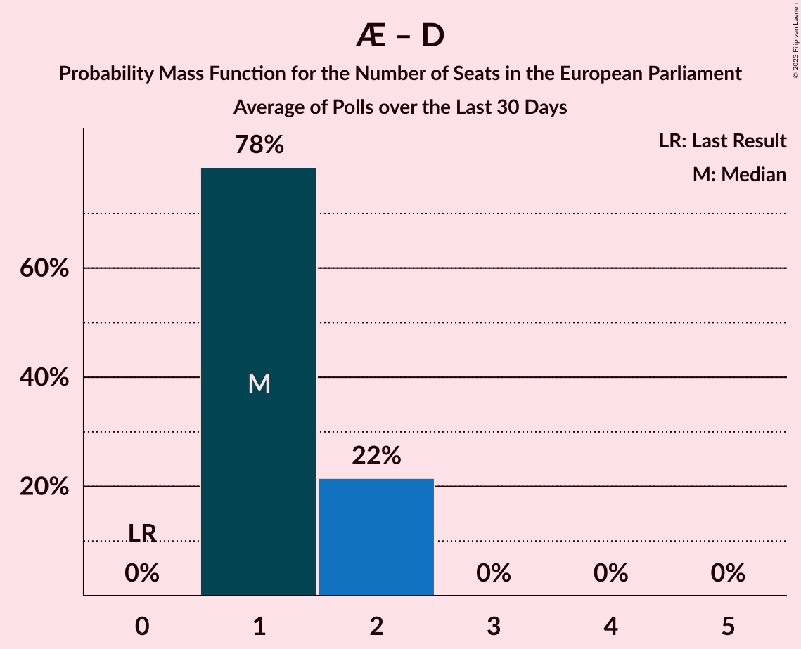

| Number of Seats | Probability | Accumulated | Special Marks |
|:---------------:|:-----------:|:-----------:|:-------------:|
| 0 | 0% | 100% | Last Result |
| 1 | 78% | 100% | Median |
| 2 | 22% | 22% |  |
| 3 | 0% | 0% |  |

### Enhedslisten–De Rød-Grønne (GUE/NGL)

| Number of Seats | Probability | Accumulated | Special Marks |
|:---------------:|:-----------:|:-----------:|:-------------:|
| 0 | 0.1% | 100% | Last Result |
| 1 | 99.7% | 99.9% | Median |
| 2 | 0.2% | 0.2% |  |
| 3 | 0% | 0% |  |

### Dansk Folkeparti (ID)

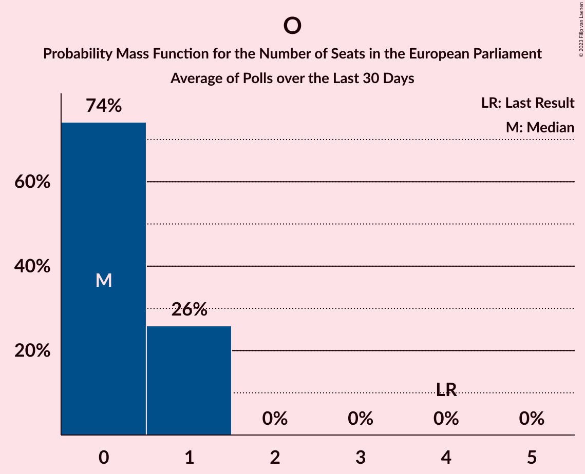

| Number of Seats | Probability | Accumulated | Special Marks |
|:---------------:|:-----------:|:-----------:|:-------------:|
| 0 | 74% | 100% | Median |
| 1 | 26% | 26% |  |
| 2 | 0% | 0% |  |
| 3 | 0% | 0% |  |
| 4 | 0% | 0% | Last Result |

### Det Konservative Folkeparti (EPP) – Kristendemokraterne (EPP)

| Number of Seats | Probability | Accumulated | Special Marks |
|:---------------:|:-----------:|:-----------:|:-------------:|
| 0 | 14% | 100% |  |
| 1 | 86% | 86% | Last Result, Median |
| 2 | 0% | 0% |  |

### Socialistisk Folkeparti (Greens/EFA) – Alternativet (Greens/EFA)

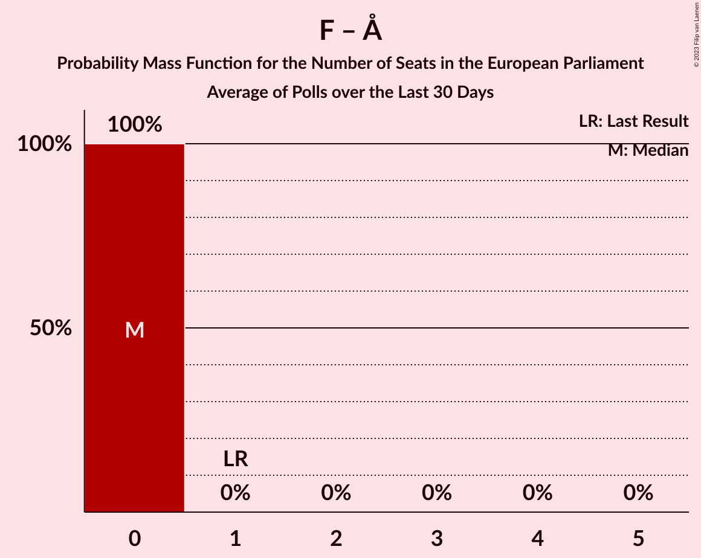

| Number of Seats | Probability | Accumulated | Special Marks |
|:---------------:|:-----------:|:-----------:|:-------------:|
| 0 | 100% | 100% | Median |
| 1 | 0% | 0% | Last Result |

### Borgerlisten (*) – Frie Grønne (*) – Stram Kurs (*) – Veganerpartiet (*)

| Number of Seats | Probability | Accumulated | Special Marks |
|:---------------:|:-----------:|:-----------:|:-------------:|
| 0 | 100% | 100% | Last Result, Median |

## Technical Information

+ **Number of polls included in this average:** 4
+ **Lowest number of simulations done in a poll included in this average:** 1,048,576
+ **Total number of simulations done in the polls included in this average:** 4,194,304
+ **Error estimate:** 3.99%
