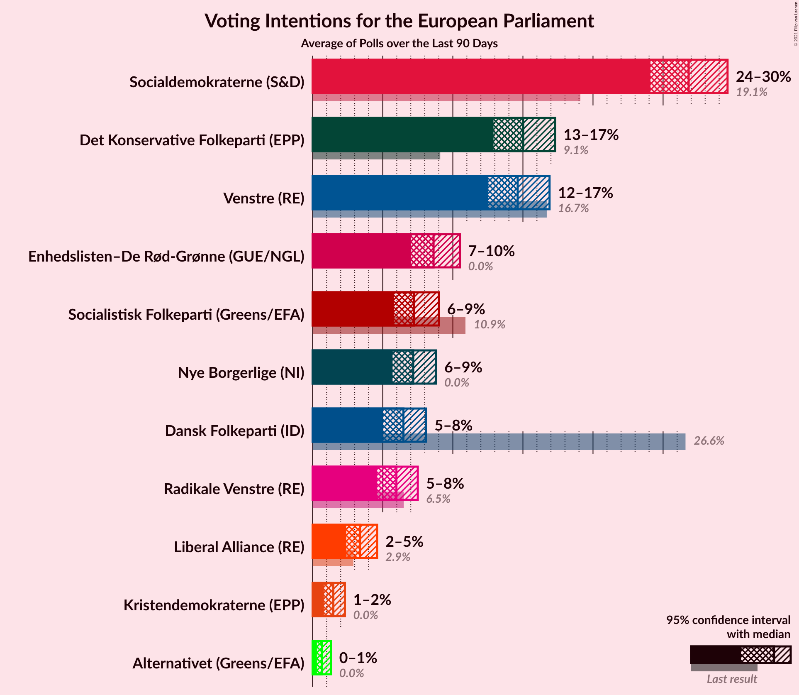

# Poll Average

<a href="#voting-intentions">Voting Intentions</a> | <a href="#seats">Seats</a> | <a href="#coalitions">Coalitions</a> | <a href="#technical-information">Technical Information</a>

## Summary

The table below lists the polls on which the average is based. They are the most recent polls (less than 90 days old) registered and analyzed so far.

| Period     | Polling firm/Commissioner(s) | O | A | V | F | C | B | I | Å | Ø | K | D | E | P | G |
|:----------:|:----------------------------:|:--:|:--:|:--:|:--:|:--:|:--:|:--:|:--:|:--:|:--:|:--:|:--:|:--:|:--:|
| 26 May 2019 | General Election | 26.6%   4 | 19.1%   3 | 16.7%   2 | 10.9%   1 | 9.1%   1 | 6.5%   1 | 2.9%   0 | 0.0%   0 | 0.0%   0 | 0.0%   0 | 0.0%   0 | 0.0%   0 | 0.0%   0 | 0.0%   0 |
| N/A | Poll Average | 4–8%   0–1 | 23–32%   4–6 | 8–19%   1–3 | 6–10%   1 | 13–20%   2–3 | 4–7%   0–1 | 2–4%   0 | 1–2%   0 | 6–10%   1 | 1–2%   0 | 5–9%   0–1 | N/A   N/A | N/A   N/A | 0–1%   0 |
| [15–21 November 2021](2021-11-21-Voxmeter.html) | Voxmeter | 5–7%   0–1 | 23–28%   4–5 | 16–20%   3 | 7–10%   1 | 13–17%   2–3 | 4–7%   0–1 | 2–4%   0 | 1–2%   0 | 7–10%   1–2 | 1–3%   0 | 5–8%   0–1 | N/A   N/A | N/A   N/A | 0%   0 |
| [8–10 November 2021](2021-11-10-Megafon.html) | Megafon | 4–7%   0–1 | 22–28%   4–5 | 12–16%   2–3 | 7–11%   1–2 | 16–21%   3–4 | 4–7%   0–1 | 2–4%   0 | 0–2%   0 | 7–11%   1–2 | 1–3%   0 | 6–9%   1 | N/A   N/A | N/A   N/A | 0–1%   0 |
| [29 October–4 November 2021](2021-11-04-Gallup.html) | Gallup | 6–8%   1 | 24–29%   4–5 | 14–18%   2–3 | 7–10%   1 | 13–17%   2–3 | 5–7%   0–1 | 2–3%   0 | 0–1%   0 | 7–10%   1 | 1–2%   0 | 6–8%   0–1 | N/A   N/A | N/A   N/A | N/A   N/A |
| [14–21 October 2021](2021-10-21-Epinion.html) | Epinion | 5–7%   0–1 | 26–30%   4–5 | 14–18%   2–3 | 7–9%   1 | 12–15%   2 | 5–7%   0–1 | 2–4%   0 | 1–2%   0 | 7–9%   1 | 1–2%   0 | 5–7%   0–1 | N/A   N/A | N/A   N/A | 0–1%   0 |
| [17–20 September 2021](2021-09-20-YouGov.html) | YouGov   B.T. | 5–8%   1 | 28–33%   5–6 | 8–11%   1–2 | 6–9%   1 | 15–19%   2–3 | 3–6%   0–1 | 1–3%   0 | 1–2%   0 | 6–8%   1 | 1–2%   0 | 7–10%   1 | N/A   N/A | N/A   N/A | N/A   N/A |
| 26 May 2019 | General Election | 26.6%   4 | 19.1%   3 | 16.7%   2 | 10.9%   1 | 9.1%   1 | 6.5%   1 | 2.9%   0 | 0.0%   0 | 0.0%   0 | 0.0%   0 | 0.0%   0 | 0.0%   0 | 0.0%   0 | 0.0%   0 |

Only polls for which at least the sample size has been published are included in the table above.

**Legend:**
+ **Top half of each row:** Voting intentions (95% confidence interval)
+ **Bottom half of each row:** Seat projections for the European Parliament (95% confidence interval)
+ **O:** Dansk Folkeparti (ID)
+ **A:** Socialdemokraterne (S&D)
+ **V:** Venstre (RE)
+ **F:** Socialistisk Folkeparti (Greens/EFA)
+ **C:** Det Konservative Folkeparti (EPP)
+ **B:** Radikale Venstre (RE)
+ **I:** Liberal Alliance (RE)
+ **Å:** Alternativet (Greens/EFA)
+ **Ø:** Enhedslisten–De Rød-Grønne (GUE/NGL)
+ **K:** Kristendemokraterne (EPP)
+ **D:** Nye Borgerlige (NI)
+ **E:** Borgerlisten (*)
+ **P:** Stram Kurs (*)
+ **G:** Veganerpartiet (*)
+ **N/A (single party):** Party not included the published results
+ **N/A (entire row):** Calculation for this opinion poll not started yet

## Voting Intentions

### Confidence Intervals

| Party | Last Result | Median | 80% Confidence Interval | 90% Confidence Interval | 95% Confidence Interval | 99% Confidence Interval |
|:-----:|:-----------:|:------:|:-----------------------:|:-----------------------:|:-----------------------:|:-----------------------:|
| <a href="#dansk-folkeparti-(id)">Dansk Folkeparti (ID)</a> | 26.6% | 6.1% | 5.0–7.2% |4.7–7.5% | 4.4–7.8% | 3.9–8.3% |
| <a href="#socialdemokraterne-(s&d)">Socialdemokraterne (S&D)</a> | 19.1% | 26.9% | 24.3–30.8% |23.6–31.7% | 23.0–32.3% | 22.0–33.4% |
| <a href="#venstre-(re)">Venstre (RE)</a> | 16.7% | 15.5% | 9.5–17.7% |8.9–18.3% | 8.5–18.8% | 7.9–19.7% |
| <a href="#socialistisk-folkeparti-(greens/efa)">Socialistisk Folkeparti (Greens/EFA)</a> | 10.9% | 8.1% | 7.0–9.4% |6.7–9.7% | 6.4–10.1% | 5.9–10.8% |
| <a href="#det-konservative-folkeparti-(epp)">Det Konservative Folkeparti (EPP)</a> | 9.1% | 15.4% | 13.3–18.5% |12.9–19.3% | 12.6–19.9% | 11.9–21.0% |
| <a href="#radikale-venstre-(re)">Radikale Venstre (RE)</a> | 6.5% | 5.4% | 4.3–6.5% |4.0–6.7% | 3.8–7.0% | 3.4–7.5% |
| <a href="#liberal-alliance-(re)">Liberal Alliance (RE)</a> | 2.9% | 2.7% | 1.9–3.5% |1.8–3.7% | 1.6–3.9% | 1.3–4.3% |
| <a href="#alternativet-(greens/efa)">Alternativet (Greens/EFA)</a> | 0.0% | 1.2% | 0.7–1.8% |0.6–1.9% | 0.6–2.1% | 0.4–2.4% |
| <a href="#enhedslisten–de-rød-grønne-(gue/ngl)">Enhedslisten–De Rød-Grønne (GUE/NGL)</a> | 0.0% | 8.2% | 6.7–9.5% |6.3–9.8% | 6.0–10.2% | 5.5–10.8% |
| <a href="#kristendemokraterne-(epp)">Kristendemokraterne (EPP)</a> | 0.0% | 1.5% | 1.1–2.1% |0.9–2.2% | 0.8–2.4% | 0.7–2.8% |
| <a href="#nye-borgerlige-(ni)">Nye Borgerlige (NI)</a> | 0.0% | 6.8% | 5.6–8.6% |5.3–9.1% | 5.1–9.4% | 4.7–10.1% |
| <a href="#borgerlisten-(*)">Borgerlisten (*)</a> | 0.0% | N/A | N/A |N/A | N/A | N/A |
| <a href="#stram-kurs-(*)">Stram Kurs (*)</a> | 0.0% | N/A | N/A |N/A | N/A | N/A |
| <a href="#veganerpartiet-(*)">Veganerpartiet (*)</a> | 0.0% | 0.3% | 0.1–0.8% |0.1–1.0% | 0.0–1.1% | 0.0–1.3% |

