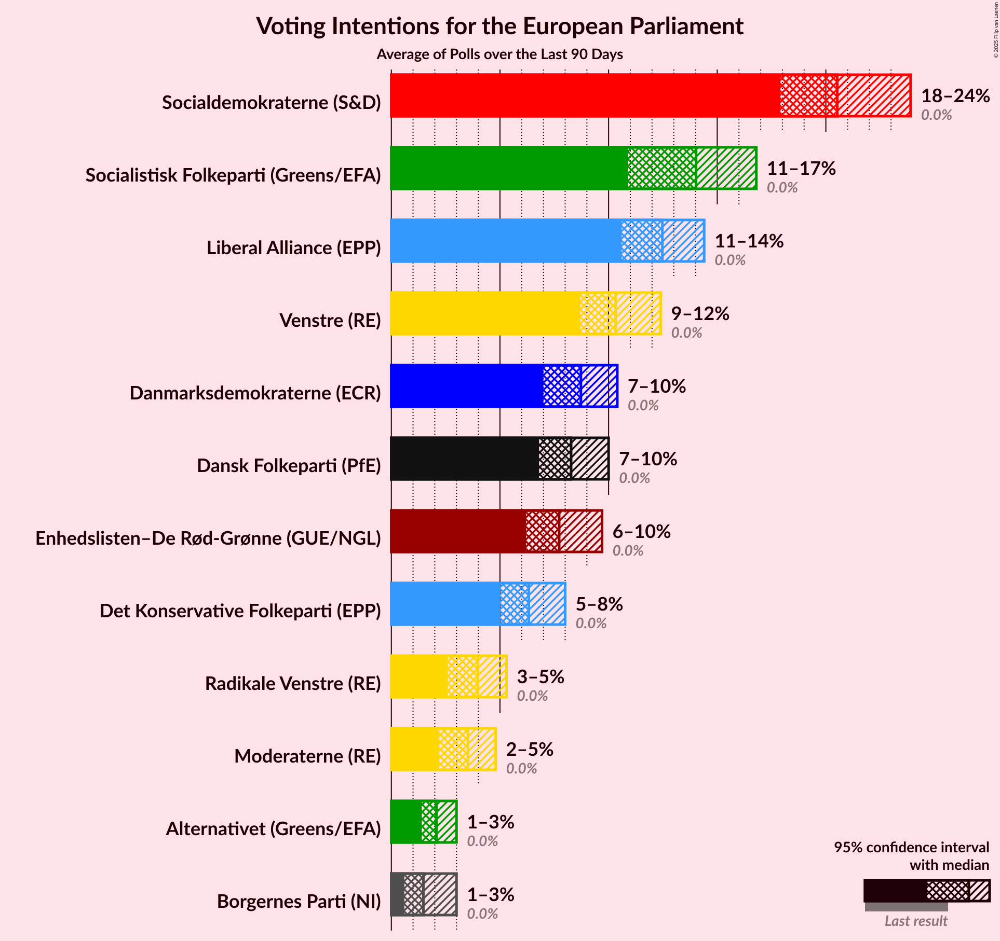

# Overview

The table below lists the most recent polls (less than 90 days old) registered and analyzed so far.

| Period     | Polling firm/Commissioner(s) | O | A | V | F | C | B | I | Å | Ø | K | D | E | P | G |
|:----------:|:----------------------------:|:--:|:--:|:--:|:--:|:--:|:--:|:--:|:--:|:--:|:--:|:--:|:--:|:--:|:--:|
| 26 May 2019 | General Election | 26.6%   4 | 19.1%   3 | 16.7%   2 | 10.9%   1 | 9.1%   1 | 6.5%   1 | 2.9%   0 | 0.0%   0 | 0.0%   0 | 0.0%   0 | 0.0%   0 | 0.0%   0 | 0.0%   0 | 0.0%   0 |
| N/A | [Poll Average](average.html) | 4–9%   0–1 | 28–36%   5–6 | 8–19%   1–3 | 6–10%   1 | 10–15%   1–2 | 4–8%   0–1 | 2–4%   0 | 0–2%   0 | 6–10%   1 | 1–3%   0 | 6–13%   0–2 | 0–1%   0 | 0–1%   0 | 0–2%   0 |
| [18–24 January 2021](2021-01-24-Voxmeter.html) | Voxmeter | 4–7%   0–1 | 31–36%   5–6 | 12–16%   2 | 6–9%   1 | 10–14%   1–2 | 5–8%   0–1 | 2–5%   0 | 0–2%   0 | 7–10%   1 | 1–2%   0 | 6–9%   0–1 | N/A   N/A | N/A   N/A | 1–2%   0 |
| [18–21 January 2021](2021-01-21-Megafon.html) | Megafon   Politiken and TV 2 | 4–7%   0–1 | 29–34%   5–6 | 9–13%   1–2 | 7–11%   1 | 11–16%   2 | 5–8%   0–1 | 2–4%   0 | 1–2%   0 | 5–8%   1 | 1–2%   0 | 9–13%   1–2 | N/A   N/A | N/A   N/A | 0–1%   0 |
| [18–21 January 2021](2021-01-21-Epinion.html) | Epinion | 4–6%   N/A | 30–35%   N/A | 12–15%   N/A | 6–9%   N/A | 11–14%   N/A | 5–8%   N/A | 2–3%   N/A | 0–1%   N/A | 6–8%   N/A | 1–2%   N/A | 8–11%   N/A | N/A   N/A | N/A   N/A | 0–1%   N/A |
| [15–18 January 2021](2021-01-18-YouGov.html) | YouGov   B.T. | 7–10%   1 | 31–36%   5–6 | 8–11%   1 | 5–8%   1 | 11–15%   2 | 4–6%   0 | 2–4%   0 | 0–2%   0 | 6–9%   1 | 1–3%   0 | 10–14%   2 | N/A   N/A | N/A   N/A | 0–1%   0 |
| [4–10 December 2020](2020-12-10-Gallup.html) | Gallup | 4–6%   0–1 | 27–32%   5–6 | 16–20%   2–3 | 7–10%   1 | 10–13%   1–2 | 5–8%   0–1 | 2–4%   0 | 0–1%   0 | 6–9%   1 | 1–2%   0 | 7–9%   1 | 0–1%   0 | 0–1%   0 | 0–1%   0 |
| 26 May 2019 | General Election | 26.6%   4 | 19.1%   3 | 16.7%   2 | 10.9%   1 | 9.1%   1 | 6.5%   1 | 2.9%   0 | 0.0%   0 | 0.0%   0 | 0.0%   0 | 0.0%   0 | 0.0%   0 | 0.0%   0 | 0.0%   0 |

Only polls for which at least the sample size has been published are included in the table above.

**Legend:**
+ **Top half of each row:** Voting intentions (95% confidence interval)
+ **Bottom half of each row:** Seat projections for the European Parliament (95% confidence interval)
+ **O:** Dansk Folkeparti (ID)
+ **A:** Socialdemokraterne (S&D)
+ **V:** Venstre (RE)
+ **F:** Socialistisk Folkeparti (Greens/EFA)
+ **C:** Det Konservative Folkeparti (EPP)
+ **B:** Radikale Venstre (RE)
+ **I:** Liberal Alliance (RE)
+ **Å:** Alternativet (Greens/EFA)
+ **Ø:** Enhedslisten–De Rød-Grønne (GUE/NGL)
+ **K:** Kristendemokraterne (EPP)
+ **D:** Nye Borgerlige (*)
+ **E:** Borgerlisten (*)
+ **P:** Stram Kurs (*)
+ **G:** Veganerpartiet (*)
+ **N/A (single party):** Party not included the published results
+ **N/A (entire row):** Calculation for this opinion poll not started yet

