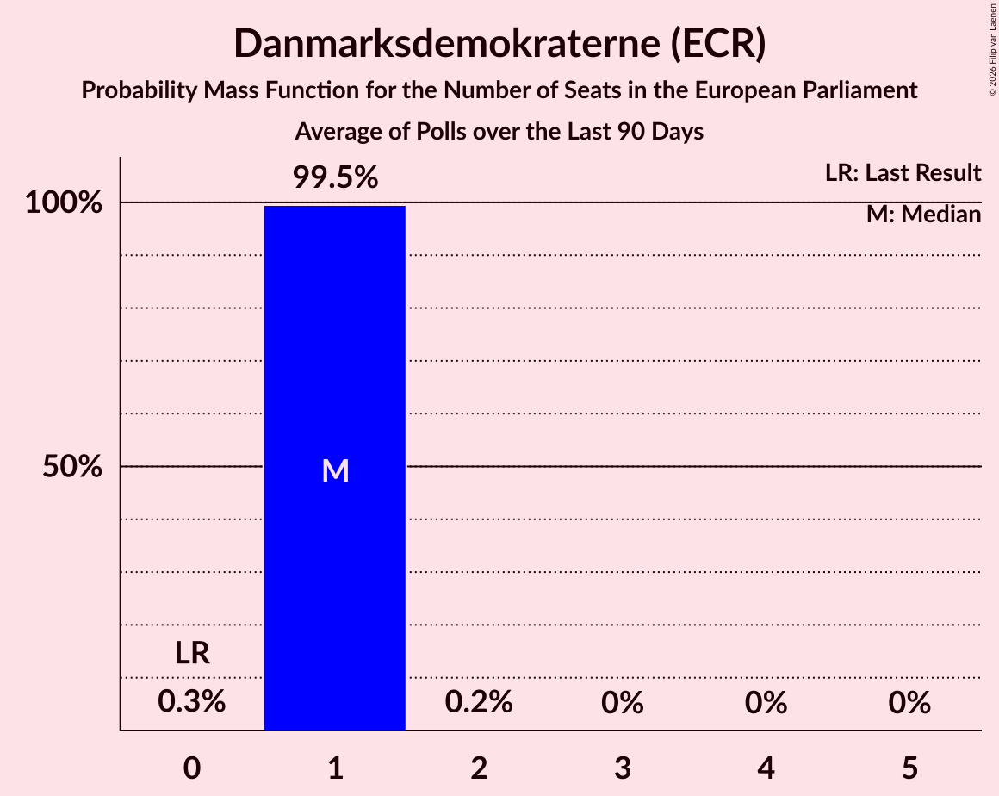

# Danmarksdemokraterne (ECR)

<a href="#voting-intentions">Voting Intentions</a> | <a href="#seats">Seats</a>

## Voting Intentions

Last result: **0.0%** (General Election of 9 June 2024)

### Confidence Intervals

| Period     | Polling firm/Commissioner(s) | Median | 80% Confidence Interval | 90% Confidence Interval | 95% Confidence Interval | 99% Confidence Interval |
|:----------:|:----------------:|:-----------:|:-----------------------:|:-----------------------:|:-----------------------:|:-----------------------:|
| N/A | [Poll Average](average.html) | 10.0% | 8.3–11.5% | 8.0–11.9% | 7.7–12.2% | 7.1–12.9% |
| [17–23 June 2024](2024-06-23-Voxmeter.html) | Voxmeter | 9.0% | 8.0–10.3% | 7.7–10.7% | 7.4–11.0% | 6.9–11.6% |
| [10–16 June 2024](2024-06-16-Voxmeter.html) | Voxmeter | 9.4% | N/A | N/A | N/A | N/A |
| [9–14 June 2024](2024-06-14-Verian.html) | Verian   Berlingske | 10.7% | 9.7–11.9% | 9.4–12.2% | 9.1–12.5% | 8.7–13.1% |

### Probability Mass Function

The following table shows the probability mass function per percentage block of voting intentions for the [poll average](average.html) for Danmarksdemokraterne (ECR).

| Voting Intentions | Probability | Accumulated | Special Marks |
|:-----------------:|:-----------:|:-----------:|:-------------:|
| 0.0–0.5% | 0% | 100% | Last Result |
| 0.5–1.5% | 0% | 100% |  |
| 1.5–2.5% | 0% | 100% |  |
| 2.5–3.5% | 0% | 100% |  |
| 3.5–4.5% | 0% | 100% |  |
| 4.5–5.5% | 0% | 100% |  |
| 5.5–6.5% | 0.1% | 100% |  |
| 6.5–7.5% | 2% | 99.9% |  |
| 7.5–8.5% | 12% | 98% |  |
| 8.5–9.5% | 25% | 86% |  |
| 9.5–10.5% | 29% | 62% | Median |
| 10.5–11.5% | 23% | 33% |  |
| 11.5–12.5% | 8% | 9% |  |
| 12.5–13.5% | 1.1% | 1.2% |  |
| 13.5–14.5% | 0.1% | 0.1% |  |
| 14.5–15.5% | 0% | 0% |  |

## Seats

Last result: **0** seats (General Election of 9 June 2024)

### Confidence Intervals

| Period     | Polling firm/Commissioner(s) | Median | 80% Confidence Interval | 90% Confidence Interval | 95% Confidence Interval | 99% Confidence Interval |
|:----------:|:----------------:|:------:|:-----------------------:|:-----------------------:|:-----------------------:|:-----------------------:|
| N/A | [Poll Average](average.html) | 1 | 1–2 | 1–2 | 1–2 | 1–2 |
| [17–23 June 2024](2024-06-23-Voxmeter.html) | Voxmeter | 1 | 1 | 1–2 | 1–2 | 1–2 |
| [10–16 June 2024](2024-06-16-Voxmeter.html) | Voxmeter |  |  |  |  |  |
| [9–14 June 2024](2024-06-14-Verian.html) | Verian   Berlingske | 2 | 1–2 | 1–2 | 1–2 | 1–2 |

### Probability Mass Function

The following table shows the probability mass function per seat for the [poll average](average.html) for Danmarksdemokraterne (ECR).

| Number of Seats | Probability | Accumulated | Special Marks |
|:---------------:|:-----------:|:-----------:|:-------------:|
| 0 | 0% | 100% | Last Result |
| 1 | 55% | 100% | Median |
| 2 | 45% | 45% |  |
| 3 | 0% | 0% |  |

