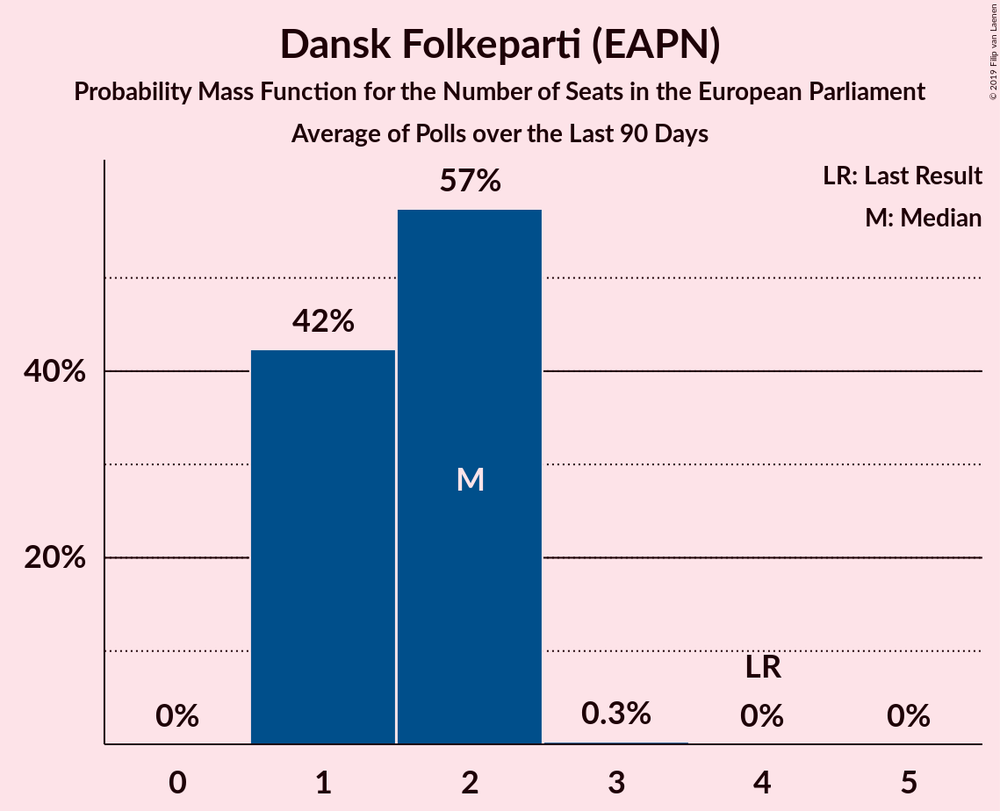

# Dansk Folkeparti (EAPN)

<a href="#voting-intentions">Voting Intentions</a> | <a href="#seats">Seats</a>

## Voting Intentions

Last result: **26.6%** (General Election of 26 May 2019)

### Confidence Intervals

| Period     | Polling firm/Commissioner(s) | Median | 80% Confidence Interval | 90% Confidence Interval | 95% Confidence Interval | 99% Confidence Interval |
|:----------:|:----------------:|:-----------:|:-----------------------:|:-----------------------:|:-----------------------:|:-----------------------:|
| N/A | [Poll Average](average.html) | 10.5% | 9.3–11.7% | 9.0–12.2% | 8.7–12.5% | 8.3–13.3% |
| [31 May–4 June 2019](2019-06-04-YouGov.html) | YouGov | 11.3% | 10.1–12.6% | 9.8–13.0% | 9.5–13.3% | 9.0–14.0% |
| [4 June 2019](2019-06-04-Gallup.html) | Gallup | 10.6% | 10.0–11.2% | 9.9–11.4% | 9.8–11.5% | 9.5–11.8% |
| [4 June 2019](2019-06-04-Epinion.html) | Epinion   DR | 9.6% | 8.9–10.4% | 8.7–10.7% | 8.5–10.9% | 8.2–11.3% |
| [30 May–3 June 2019](2019-06-03-YouGov.html) | YouGov | 10.5% | 9.3–12.0% | 8.9–12.4% | 8.6–12.8% | 8.1–13.5% |
| [1–3 June 2019](2019-06-03-Voxmeter.html) | Voxmeter   Ritzau | 10.2% | 9.0–11.5% | 8.7–11.9% | 8.4–12.2% | 7.9–12.9% |
| [3 June 2019](2019-06-03-Norstat.html) | Norstat   Altinget and Jyllands-Posten | 10.5% | 9.4–11.7% | 9.1–12.0% | 8.9–12.3% | 8.4–12.9% |
| [3 June 2019](2019-06-03-GreensAnalyseinstitut.html) | Greens Analyseinstitut   Børsen | 10.5% | 9.4–11.7% | 9.1–12.1% | 8.9–12.4% | 8.4–13.0% |
| [29 May–2 June 2019](2019-06-02-YouGov.html) | YouGov | 8.2% | N/A | N/A | N/A | N/A |
| [31 May–2 June 2019](2019-06-02-Voxmeter.html) | Voxmeter   Ritzau | 9.9% | N/A | N/A | N/A | N/A |
| [28 May–1 June 2019](2019-06-01-YouGov.html) | YouGov | 8.5% | N/A | N/A | N/A | N/A |
| [30 May–1 June 2019](2019-06-01-Voxmeter.html) | Voxmeter   Ritzau | 10.7% | N/A | N/A | N/A | N/A |
| [29–31 May 2019](2019-05-31-Voxmeter.html) | Voxmeter   Ritzau | 11.1% | N/A | N/A | N/A | N/A |
| [26–30 May 2019](2019-05-30-YouGov.html) | YouGov | 9.5% | N/A | N/A | N/A | N/A |
| [28–30 May 2019](2019-05-30-Voxmeter.html) | Voxmeter   Ritzau | 11.6% | N/A | N/A | N/A | N/A |
| [28–30 May 2019](2019-05-30-Megafon.html) | Megafon   Politiken and TV 2 | 12.1% | N/A | N/A | N/A | N/A |
| [28–30 May 2019](2019-05-30-Epinion.html) | Epinion   DR | 10.6% | N/A | N/A | N/A | N/A |
| [25–29 May 2019](2019-05-29-YouGov.html) | YouGov | 11.3% | N/A | N/A | N/A | N/A |
| [27–29 May 2019](2019-05-29-Voxmeter.html) | Voxmeter   Ritzau | 11.1% | N/A | N/A | N/A | N/A |
| [24–28 May 2019](2019-05-28-YouGov.html) | YouGov | 12.5% | N/A | N/A | N/A | N/A |
| [26–28 May 2019](2019-05-28-Voxmeter.html) | Voxmeter   Ritzau | 10.4% | N/A | N/A | N/A | N/A |
| [28 May 2019](2019-05-28-Gallup.html) | Gallup | 10.9% | N/A | N/A | N/A | N/A |
| [25–27 May 2019](2019-05-27-Voxmeter.html) | Voxmeter   Ritzau | 10.7% | N/A | N/A | N/A | N/A |

### Probability Mass Function

The following table shows the probability mass function per percentage block of voting intentions for the [poll average](average.html) for Dansk Folkeparti (EAPN).

| Voting Intentions | Probability | Accumulated | Special Marks |
|:-----------------:|:-----------:|:-----------:|:-------------:|
| 6.5–7.5% | 0% | 100% |  |
| 7.5–8.5% | 1.4% | 100% |  |
| 8.5–9.5% | 15% | 98.6% |  |
| 9.5–10.5% | 38% | 84% | Median |
| 10.5–11.5% | 33% | 46% |  |
| 11.5–12.5% | 10% | 13% |  |
| 12.5–13.5% | 2% | 2% |  |
| 13.5–14.5% | 0.3% | 0.3% |  |
| 14.5–15.5% | 0% | 0% |  |
| 15.5–16.5% | 0% | 0% |  |
| 16.5–17.5% | 0% | 0% |  |
| 17.5–18.5% | 0% | 0% |  |
| 18.5–19.5% | 0% | 0% |  |
| 19.5–20.5% | 0% | 0% |  |
| 20.5–21.5% | 0% | 0% |  |
| 21.5–22.5% | 0% | 0% |  |
| 22.5–23.5% | 0% | 0% |  |
| 23.5–24.5% | 0% | 0% |  |
| 24.5–25.5% | 0% | 0% |  |
| 25.5–26.5% | 0% | 0% |  |
| 26.5–27.5% | 0% | 0% | Last Result |

## Seats

Last result: **4** seats (General Election of 26 May 2019)

### Confidence Intervals

| Period     | Polling firm/Commissioner(s) | Median | 80% Confidence Interval | 90% Confidence Interval | 95% Confidence Interval | 99% Confidence Interval |
|:----------:|:----------------:|:------:|:-----------------------:|:-----------------------:|:-----------------------:|:-----------------------:|
| N/A | [Poll Average](average.html) | 2 | 1–2 | 1–2 | 1–2 | 1–2 |
| [31 May–4 June 2019](2019-06-04-YouGov.html) | YouGov | 2 | 2 | 2 | 1–2 | 1–2 |
| [4 June 2019](2019-06-04-Gallup.html) | Gallup | 2 | 1–2 | 1–2 | 1–2 | 1–2 |
| [4 June 2019](2019-06-04-Epinion.html) | Epinion   DR | 1 | 1 | 1 | 1 | 1–2 |
| [30 May–3 June 2019](2019-06-03-YouGov.html) | YouGov | 2 | 1–2 | 1–2 | 1–2 | 1–2 |
| [1–3 June 2019](2019-06-03-Voxmeter.html) | Voxmeter   Ritzau | 2 | 1–2 | 1–2 | 1–2 | 1–2 |
| [3 June 2019](2019-06-03-Norstat.html) | Norstat   Altinget and Jyllands-Posten | 1 | 1–2 | 1–2 | 1–2 | 1–2 |
| [3 June 2019](2019-06-03-GreensAnalyseinstitut.html) | Greens Analyseinstitut   Børsen | 2 | 1–2 | 1–2 | 1–2 | 1–2 |
| [29 May–2 June 2019](2019-06-02-YouGov.html) | YouGov |  |  |  |  |  |
| [31 May–2 June 2019](2019-06-02-Voxmeter.html) | Voxmeter   Ritzau |  |  |  |  |  |
| [28 May–1 June 2019](2019-06-01-YouGov.html) | YouGov |  |  |  |  |  |
| [30 May–1 June 2019](2019-06-01-Voxmeter.html) | Voxmeter   Ritzau |  |  |  |  |  |
| [29–31 May 2019](2019-05-31-Voxmeter.html) | Voxmeter   Ritzau |  |  |  |  |  |
| [26–30 May 2019](2019-05-30-YouGov.html) | YouGov |  |  |  |  |  |
| [28–30 May 2019](2019-05-30-Voxmeter.html) | Voxmeter   Ritzau |  |  |  |  |  |
| [28–30 May 2019](2019-05-30-Megafon.html) | Megafon   Politiken and TV 2 |  |  |  |  |  |
| [28–30 May 2019](2019-05-30-Epinion.html) | Epinion   DR |  |  |  |  |  |
| [25–29 May 2019](2019-05-29-YouGov.html) | YouGov |  |  |  |  |  |
| [27–29 May 2019](2019-05-29-Voxmeter.html) | Voxmeter   Ritzau |  |  |  |  |  |
| [24–28 May 2019](2019-05-28-YouGov.html) | YouGov |  |  |  |  |  |
| [26–28 May 2019](2019-05-28-Voxmeter.html) | Voxmeter   Ritzau |  |  |  |  |  |
| [28 May 2019](2019-05-28-Gallup.html) | Gallup |  |  |  |  |  |
| [25–27 May 2019](2019-05-27-Voxmeter.html) | Voxmeter   Ritzau |  |  |  |  |  |

### Probability Mass Function

The following table shows the probability mass function per seat for the [poll average](average.html) for Dansk Folkeparti (EAPN).

| Number of Seats | Probability | Accumulated | Special Marks |
|:---------------:|:-----------:|:-----------:|:-------------:|
| 1 | 39% | 100% |  |
| 2 | 61% | 61% | Median |
| 3 | 0% | 0% |  |
| 4 | 0% | 0% | Last Result |

