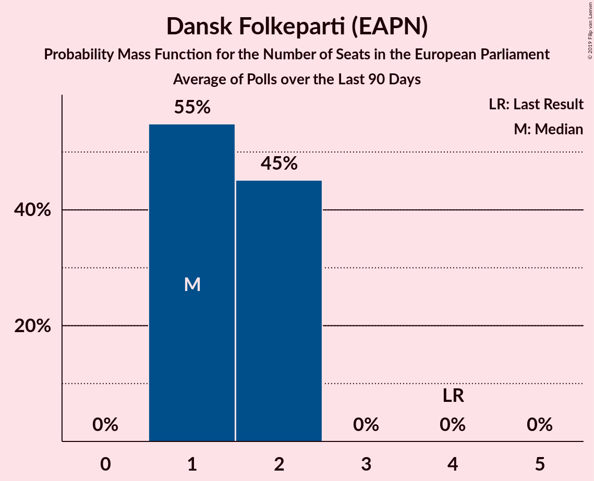

# Dansk Folkeparti (EAPN)

<a href="#voting-intentions">Voting Intentions</a> | <a href="#seats">Seats</a>

## Voting Intentions

Last result: **26.6%** (General Election of 25 May 2014)

### Confidence Intervals

| Period     | Polling firm/Commissioner(s) | Median | 80% Confidence Interval | 90% Confidence Interval | 95% Confidence Interval | 99% Confidence Interval |
|:----------:|:----------------:|:-----------:|:-----------------------:|:-----------------------:|:-----------------------:|:-----------------------:|
| N/A | [Poll Average](average.html) | 11.9% | 10.1–13.7% | 9.6–14.1% | 9.2–14.5% | 8.5–15.2% |
| [14–16 May 2019](2019-05-16-Voxmeter.html) | Voxmeter   Ritzau | 10.1% | 9.0–11.5% | 8.7–11.8% | 8.4–12.2% | 7.9–12.8% |
| [15 May 2019](2019-05-15-YouGov.html) | YouGov | 12.6% | 11.3–14.1% | 10.9–14.5% | 10.6–14.8% | 10.0–15.6% |
| [15 May 2019](2019-05-15-Gallup.html) | Gallup | 13.4% | 12.4–14.6% | 12.1–15.0% | 11.8–15.3% | 11.3–15.8% |
| [12–14 May 2019](2019-05-14-Voxmeter.html) | Voxmeter   Ritzau | 11.5% | 10.3–12.9% | 10.0–13.3% | 9.7–13.6% | 9.1–14.3% |
| [11–13 May 2019](2019-05-13-Voxmeter.html) | Voxmeter   Ritzau | 11.9% | 10.7–13.3% | 10.4–13.7% | 10.1–14.0% | 9.5–14.7% |
| [11–13 May 2019](2019-05-13-Epinion.html) | Epinion | 11.6% | 10.6–12.7% | 10.4–13.0% | 10.1–13.3% | 9.7–13.9% |
| [8–12 May 2019](2019-05-12-YouGov.html) | YouGov | 11.2% | 10.0–12.6% | 9.6–13.0% | 9.4–13.4% | 8.8–14.1% |
| [10–12 May 2019](2019-05-12-Voxmeter.html) | Voxmeter   Ritzau | 11.6% | 10.3–13.0% | 10.0–13.3% | 9.7–13.7% | 9.2–14.4% |
| [7–11 May 2019](2019-05-11-YouGov.html) | YouGov | 11.8% | 10.6–13.2% | 10.3–13.6% | 10.0–13.9% | 9.4–14.6% |
| [9–11 May 2019](2019-05-11-Voxmeter.html) | Voxmeter   Ritzau | 12.0% | 10.7–13.4% | 10.4–13.8% | 10.1–14.1% | 9.5–14.8% |
| [8–10 May 2019](2019-05-10-Voxmeter.html) | Voxmeter   Ritzau | 11.8% | 10.5–13.2% | 10.2–13.5% | 9.9–13.9% | 9.4–14.6% |
| [10 May 2019](2019-05-10-Norstat.html) | Norstat | 11.4% | 10.3–12.7% | 10.0–13.0% | 9.8–13.4% | 9.3–14.0% |
| [8–10 May 2019](2019-05-10-Megafon.html) | Megafon   Politiken and TV 2 | 10.8% | 9.6–12.1% | 9.3–12.5% | 9.0–12.9% | 8.5–13.5% |
| [7–9 May 2019](2019-05-09-Voxmeter.html) | Voxmeter   Ritzau | 11.3% | 10.1–12.7% | 9.8–13.0% | 9.5–13.4% | 8.9–14.1% |
| [5–8 May 2019](2019-05-08-YouGov.html) | YouGov | 10.8% | 9.6–12.2% | 9.3–12.5% | 9.0–12.9% | 8.5–13.6% |
| [2–8 May 2019](2019-05-08-Norstat.html) | Norstat   Altinget and Jyllands-Posten | 12.8% | 11.6–14.1% | 11.3–14.4% | 11.0–14.8% | 10.5–15.4% |
| [8 May 2019](2019-05-08-KantarGallup.html) | Kantar Gallup   Berlingske | 12.5% | 11.6–13.6% | 11.3–13.9% | 11.1–14.2% | 10.6–14.8% |
| [7 May 2019](2019-05-07-Megafon.html) | Megafon   Politiken and TV 2 | 11.6% | 10.4–13.0% | 10.0–13.4% | 9.8–13.7% | 9.2–14.4% |
| [7 May 2019](2019-05-07-GreensAnalyseinstitut.html) | Greens Analyseinstitut   Børsen | 12.2% | 11.0–13.6% | 10.7–14.0% | 10.4–14.3% | 9.9–15.0% |
| [7 May 2019](2019-05-07-Epinion.html) | Epinion   DR | 13.9% | 12.8–15.0% | 12.5–15.3% | 12.3–15.6% | 11.8–16.2% |
| [28 April–5 May 2019](2019-05-05-Voxmeter.html) | Voxmeter   Ritzau | 12.2% | 10.9–13.5% | 10.6–13.9% | 10.3–14.3% | 9.8–15.0% |
| [1–3 May 2019](2019-05-03-YouGov.html) | YouGov | 11.2% | 10.2–12.2% | 10.0–12.5% | 9.7–12.8% | 9.3–13.3% |
| [29 April–2 May 2019](2019-05-02-Megafon.html) | Megafon   Politiken and TV 2 | 12.6% | 11.3–14.0% | 11.0–14.4% | 10.7–14.8% | 10.1–15.5% |
| [26–29 April 2019](2019-04-29-YouGov.html) | YouGov | 12.2% | 11.3–13.2% | 11.0–13.5% | 10.8–13.8% | 10.4–14.3% |
| [22–28 April 2019](2019-04-28-Voxmeter.html) | Voxmeter   Ritzau | 13.6% | 12.3–15.1% | 11.9–15.5% | 11.6–15.9% | 11.1–16.6% |
| [15–21 April 2019](2019-04-21-Voxmeter.html) | Voxmeter   Ritzau | 15.0% | 13.7–16.6% | 13.3–17.0% | 13.0–17.4% | 12.4–18.1% |
| [15–17 April 2019](2019-04-17-Megafon.html) | Megafon   Politiken and TV 2 | 13.6% | 12.3–15.1% | 11.9–15.5% | 11.6–15.9% | 11.0–16.6% |
| [8–13 April 2019](2019-04-13-Voxmeter.html) | Voxmeter   Ritzau | 14.0% | 12.7–15.5% | 12.3–15.9% | 12.0–16.2% | 11.4–17.0% |
| [3–9 April 2019](2019-04-09-Epinion.html) | Epinion   DR | 13.4% | 12.4–14.6% | 12.1–15.0% | 11.8–15.2% | 11.3–15.8% |
| [1–7 April 2019](2019-04-07-Voxmeter.html) | Voxmeter   Ritzau | 14.8% | 13.4–16.3% | 13.0–16.7% | 12.7–17.1% | 12.1–17.8% |
| [1 April 2019](2019-04-01-GreensAnalyseinstitut.html) | Greens Analyseinstitut   Børsen | 14.4% | 13.1–15.8% | 12.7–16.2% | 12.4–16.6% | 11.8–17.3% |
| [25–31 March 2019](2019-03-31-Voxmeter.html) | Voxmeter   Ritzau | 15.4% | 14.1–16.9% | 13.7–17.4% | 13.4–17.7% | 12.8–18.5% |
| [25–28 March 2019](2019-03-28-Megafon.html) | Megafon   Politiken and TV 2 | 12.6% | 11.4–14.1% | 11.0–14.5% | 10.7–14.8% | 10.1–15.5% |
| [21–26 March 2019](2019-03-26-Norstat.html) | Norstat   Altinget and Jyllands-Posten | 14.4% | 13.1–15.7% | 12.8–16.1% | 12.5–16.5% | 11.9–17.1% |
| [18–25 March 2019](2019-03-25-Epinion.html) | Epinion   DR | 15.1% | 14.0–16.4% | 13.7–16.7% | 13.4–17.0% | 12.9–17.6% |
| [18–24 March 2019](2019-03-24-Voxmeter.html) | Voxmeter   Ritzau | 15.1% | 13.8–16.6% | 13.4–17.1% | 13.1–17.5% | 12.5–18.2% |
| [11–17 March 2019](2019-03-17-Voxmeter.html) | Voxmeter   Ritzau | 14.6% | 13.3–16.1% | 12.9–16.5% | 12.6–16.9% | 12.0–17.6% |
| [8–14 March 2019](2019-03-14-KantarGallup.html) | Kantar Gallup   Berlingske | 13.7% | 12.6–14.8% | 12.3–15.2% | 12.1–15.5% | 11.6–16.0% |
| [4–9 March 2019](2019-03-09-Voxmeter.html) | Voxmeter   Ritzau | 14.2% | 12.9–15.7% | 12.5–16.1% | 12.2–16.4% | 11.6–17.2% |
| [25 February–3 March 2019](2019-03-03-Voxmeter.html) | Voxmeter   Ritzau | 14.6% | N/A | N/A | N/A | N/A |
| [25–28 February 2019](2019-02-28-Megafon.html) | Megafon   Politiken and TV 2 | 13.4% | N/A | N/A | N/A | N/A |
| [19–25 February 2019](2019-02-25-Epinion.html) | Epinion   DR | 15.2% | N/A | N/A | N/A | N/A |
| [18–24 February 2019](2019-02-24-Voxmeter.html) | Voxmeter   Ritzau | 14.8% | N/A | N/A | N/A | N/A |
| [11–17 February 2019](2019-02-17-Voxmeter.html) | Voxmeter   Ritzau | 15.4% | N/A | N/A | N/A | N/A |
| [4–9 February 2019](2019-02-09-Voxmeter.html) | Voxmeter   Ritzau | 15.8% | N/A | N/A | N/A | N/A |
| [28 January–3 February 2019](2019-02-03-Voxmeter.html) | Voxmeter   Ritzau | 16.2% | N/A | N/A | N/A | N/A |
| [28–31 January 2019](2019-01-31-Megafon.html) | Megafon   Politiken and TV 2 | 15.8% | N/A | N/A | N/A | N/A |
| [21–27 January 2019](2019-01-27-Voxmeter.html) | Voxmeter   Ritzau | 16.8% | N/A | N/A | N/A | N/A |
| [14–21 January 2019](2019-01-21-Epinion.html) | Epinion   DR | 16.6% | N/A | N/A | N/A | N/A |
| [14–20 January 2019](2019-01-20-Voxmeter.html) | Voxmeter   Ritzau | 17.8% | N/A | N/A | N/A | N/A |
| [11–14 January 2019](2019-01-14-YouGov.html) | YouGov | 15.9% | N/A | N/A | N/A | N/A |
| [7–12 January 2019](2019-01-12-Voxmeter.html) | Voxmeter   Ritzau | 18.2% | N/A | N/A | N/A | N/A |
| [2–6 January 2019](2019-01-06-Voxmeter.html) | Voxmeter   Ritzau | 17.7% | 16.2–19.3% | 15.8–19.7% | 15.5–20.1% | 14.8–20.9% |
| [20 December 2018](2018-12-20-Megafon.html) | Megafon   Politiken and TV 2 | 16.2% | 14.8–17.8% | 14.4–18.2% | 14.0–18.6% | 13.4–19.4% |
| [10–16 December 2018](2018-12-16-Voxmeter.html) | Voxmeter   Ritzau | 18.4% | 16.9–20.1% | 16.5–20.5% | 16.2–20.9% | 15.5–21.7% |
| [13 December 2018](2018-12-13-KantarGallup.html) | Kantar Gallup   Berlingske | 18.3% | 17.1–19.6% | 16.8–20.0% | 16.5–20.3% | 15.9–20.9% |
| [6–11 December 2018](2018-12-11-Norstat.html) | Norstat   Altinget and Jyllands-Posten | 17.6% | N/A | N/A | N/A | N/A |
| [7–9 December 2018](2018-12-09-YouGov.html) | YouGov | 15.8% | N/A | N/A | N/A | N/A |
| [3–8 December 2018](2018-12-08-Voxmeter.html) | Voxmeter   Ritzau | 18.8% | N/A | N/A | N/A | N/A |
| [26 November–2 December 2018](2018-12-02-Voxmeter.html) | Voxmeter   Ritzau | 18.2% | N/A | N/A | N/A | N/A |
| [29 November 2018](2018-11-29-GreensAnalyseinstitut.html) | Greens Analyseinstitut   Børsen | 17.1% | N/A | N/A | N/A | N/A |
| [19–25 November 2018](2018-11-25-Voxmeter.html) | Voxmeter   Ritzau | 17.7% | N/A | N/A | N/A | N/A |
| [12–17 November 2018](2018-11-17-Voxmeter.html) | Voxmeter   Ritzau | 17.9% | N/A | N/A | N/A | N/A |
| [7–15 November 2018](2018-11-15-Epinion.html) | Epinion   DR | 17.5% | N/A | N/A | N/A | N/A |
| [5–10 November 2018](2018-11-10-Voxmeter.html) | Voxmeter   Ritzau | 17.4% | N/A | N/A | N/A | N/A |
| [29 October–5 November 2018](2018-11-05-Voxmeter.html) | Voxmeter   Ritzau | 18.1% | N/A | N/A | N/A | N/A |
| [22–28 October 2018](2018-10-28-Voxmeter.html) | Voxmeter   Ritzau | 17.5% | N/A | N/A | N/A | N/A |
| [22–25 October 2018](2018-10-25-Megafon.html) | Megafon   Politiken and TV 2 | 14.8% | N/A | N/A | N/A | N/A |
| [16–24 October 2018](2018-10-24-Epinion.html) | Epinion   DR | 18.6% | N/A | N/A | N/A | N/A |
| [15–21 October 2018](2018-10-21-Voxmeter.html) | Voxmeter   Ritzau | 18.2% | N/A | N/A | N/A | N/A |
| [8–14 October 2018](2018-10-14-Voxmeter.html) | Voxmeter   Ritzau | 17.7% | N/A | N/A | N/A | N/A |
| [11 October 2018](2018-10-11-KantarGallup.html) | Kantar Gallup   Berlingske | 17.2% | N/A | N/A | N/A | N/A |
| [3–9 October 2018](2018-10-09-Norstat.html) | Norstat   Altinget | 17.7% | N/A | N/A | N/A | N/A |
| [1–6 October 2018](2018-10-06-Voxmeter.html) | Voxmeter   Ritzau | 17.6% | N/A | N/A | N/A | N/A |
| [1 October 2018](2018-10-01-GreensAnalyseinstitut.html) | Greens Analyseinstitut   Børsen | 16.4% | N/A | N/A | N/A | N/A |
| [24–30 September 2018](2018-09-30-Voxmeter.html) | Voxmeter   Ritzau | 18.4% | N/A | N/A | N/A | N/A |
| [27 September 2018](2018-09-27-Megafon.html) | Megafon   Politiken and TV 2 | 15.9% | N/A | N/A | N/A | N/A |
| [17–23 September 2018](2018-09-23-Voxmeter.html) | Voxmeter   Ritzau | 17.7% | N/A | N/A | N/A | N/A |
| [11–18 September 2018](2018-09-18-Epinion.html) | Epinion   DR | 18.2% | N/A | N/A | N/A | N/A |
| [10–16 September 2018](2018-09-16-Voxmeter.html) | Voxmeter   Ritzau | 17.2% | N/A | N/A | N/A | N/A |
| [6–11 September 2018](2018-09-11-Norstat.html) | Norstat   Altinget and Jyllands-Posten | 16.9% | N/A | N/A | N/A | N/A |
| [3–9 September 2018](2018-09-09-Voxmeter.html) | Voxmeter   Ritzau | 17.9% | N/A | N/A | N/A | N/A |
| [27 August–2 September 2018](2018-09-02-Voxmeter.html) | Voxmeter   Ritzau | 17.7% | N/A | N/A | N/A | N/A |
| [27–30 August 2018](2018-08-30-Megafon.html) | Megafon   Politiken and TV 2 | 15.4% | N/A | N/A | N/A | N/A |
| [20–26 August 2018](2018-08-26-Voxmeter.html) | Voxmeter   Ritzau | 18.3% | N/A | N/A | N/A | N/A |
| [13–19 August 2018](2018-08-19-Voxmeter.html) | Voxmeter   Ritzau | 18.9% | N/A | N/A | N/A | N/A |
| [10–17 August 2018](2018-08-17-Epinion.html) | Epinion   DR | 19.7% | N/A | N/A | N/A | N/A |
| [6–11 August 2018](2018-08-11-Voxmeter.html) | Voxmeter   Ritzau | 19.4% | N/A | N/A | N/A | N/A |
| [30 July–5 August 2018](2018-08-05-Voxmeter.html) | Voxmeter   Ritzau | 20.7% | N/A | N/A | N/A | N/A |
| [25 June–1 July 2018](2018-07-01-Voxmeter.html) | Voxmeter   Ritzau | 19.8% | N/A | N/A | N/A | N/A |
| [25–28 June 2018](2018-06-28-Megafon.html) | Megafon   Politiken and TV 2 | 15.6% | N/A | N/A | N/A | N/A |
| [18–24 June 2018](2018-06-24-Voxmeter.html) | Voxmeter   Ritzau | 19.3% | N/A | N/A | N/A | N/A |
| [15–23 June 2018](2018-06-23-Epinion.html) | Epinion   DR | 18.8% | N/A | N/A | N/A | N/A |
| [11–16 June 2018](2018-06-16-Voxmeter.html) | Voxmeter   Ritzau | 18.9% | N/A | N/A | N/A | N/A |
| [11 June 2018](2018-06-11-GreensAnalyseinstitut.html) | Greens Analyseinstitut   Børsen | 17.0% | N/A | N/A | N/A | N/A |
| [4–10 June 2018](2018-06-10-Voxmeter.html) | Voxmeter   Ritzau | 18.7% | N/A | N/A | N/A | N/A |
| [28 May–3 June 2018](2018-06-03-Voxmeter.html) | Voxmeter   Ritzau | 18.8% | N/A | N/A | N/A | N/A |
| [21–27 May 2018](2018-05-27-Voxmeter.html) | Voxmeter   Ritzau | 18.8% | N/A | N/A | N/A | N/A |
| [17–23 May 2018](2018-05-23-Norstat.html) | Norstat   Altinget | 17.0% | N/A | N/A | N/A | N/A |
| [14–19 May 2018](2018-05-19-Voxmeter.html) | Voxmeter   Ritzau | 18.3% | N/A | N/A | N/A | N/A |
| [7–13 May 2018](2018-05-13-Voxmeter.html) | Voxmeter   Ritzau | 17.7% | N/A | N/A | N/A | N/A |
| [30 April–6 May 2018](2018-05-06-Voxmeter.html) | Voxmeter   Ritzau | 17.0% | N/A | N/A | N/A | N/A |
| [23–29 April 2018](2018-04-29-Voxmeter.html) | Voxmeter   Ritzau | 16.4% | N/A | N/A | N/A | N/A |
| [16–22 April 2018](2018-04-22-Voxmeter.html) | Voxmeter   Ritzau | 15.6% | N/A | N/A | N/A | N/A |
| [8–15 April 2018](2018-04-15-Voxmeter.html) | Voxmeter   Ritzau | 16.4% | N/A | N/A | N/A | N/A |
| [2–7 April 2018](2018-04-07-Voxmeter.html) | Voxmeter   Ritzau | 17.4% | N/A | N/A | N/A | N/A |
| [26–31 March 2018](2018-03-31-Voxmeter.html) | Voxmeter   Ritzau | 18.1% | N/A | N/A | N/A | N/A |
| [19–25 March 2018](2018-03-25-Voxmeter.html) | Voxmeter   Ritzau | 18.4% | N/A | N/A | N/A | N/A |
| [14–20 March 2018](2018-03-20-Norstat.html) | Norstat   Altinget | 18.5% | N/A | N/A | N/A | N/A |
| [14–20 March 2018](2018-03-20-Epinion.html) | Epinion   DR | 18.3% | N/A | N/A | N/A | N/A |
| [12–18 March 2018](2018-03-18-Voxmeter.html) | Voxmeter   Ritzau | 18.0% | N/A | N/A | N/A | N/A |
| [5–11 March 2018](2018-03-11-Voxmeter.html) | Voxmeter   Ritzau | 18.0% | 16.6–19.6% | 16.2–20.1% | 15.8–20.5% | 15.1–21.3% |
| [19–25 February 2018](2018-02-25-Voxmeter.html) | Voxmeter   Ritzau | 17.6% | 16.1–19.2% | 15.7–19.6% | 15.4–20.1% | 14.7–20.9% |
| [19–22 February 2018](2018-02-22-Megafon.html) | Megafon   Politiken and TV 2 | 16.9% | 15.5–18.5% | 15.1–19.0% | 14.7–19.4% | 14.1–20.1% |
| [12–18 February 2018](2018-02-18-Voxmeter.html) | Voxmeter   Ritzau | 18.2% | 16.8–19.9% | 16.3–20.3% | 16.0–20.7% | 15.3–21.5% |
| [8–14 February 2018](2018-02-14-Epinion.html) | Epinion   DR | 17.2% | 16.0–18.5% | 15.7–18.9% | 15.4–19.2% | 14.9–19.8% |
| [5–10 February 2018](2018-02-10-Voxmeter.html) | Voxmeter   Ritzau | 18.8% | 17.3–20.4% | 16.9–20.9% | 16.5–21.3% | 15.9–22.1% |
| [2–8 February 2018](2018-02-08-KantarGallup.html) | Kantar Gallup   Berlingske | 15.5% | 14.3–16.7% | 14.0–17.1% | 13.7–17.4% | 13.2–18.0% |
| [2–8 February 2018](2018-02-08-GreensAnalyseinstitut.html) | Greens Analyseinstitut   Børsen | 16.5% | 15.1–18.0% | 14.7–18.4% | 14.4–18.7% | 13.8–19.5% |
| [29 January–4 February 2018](2018-02-04-Voxmeter.html) | Voxmeter   Ritzau | 18.2% | N/A | N/A | N/A | N/A |
| [24–29 January 2018](2018-01-29-Norstat.html) | Norstat   Altinget | 16.7% | N/A | N/A | N/A | N/A |
| [22–28 January 2018](2018-01-28-Voxmeter.html) | Voxmeter   Ritzau | 17.3% | N/A | N/A | N/A | N/A |
| [22–25 January 2018](2018-01-25-Megafon.html) | Megafon   Politiken and TV 2 | 14.2% | N/A | N/A | N/A | N/A |
| [19–25 January 2018](2018-01-25-Epinion.html) | Epinion   DR | 17.4% | N/A | N/A | N/A | N/A |
| [19–22 January 2018](2018-01-22-YouGov.html) | YouGov | 17.0% | N/A | N/A | N/A | N/A |
| [15–21 January 2018](2018-01-21-Voxmeter.html) | Voxmeter   Ritzau | 16.5% | N/A | N/A | N/A | N/A |
| [8–14 January 2018](2018-01-14-Voxmeter.html) | Voxmeter   Ritzau | 17.3% | N/A | N/A | N/A | N/A |
| [5–11 January 2018](2018-01-11-KantarGallup.html) | Kantar Gallup   Berlingske | 15.9% | N/A | N/A | N/A | N/A |
| [5–7 January 2018](2018-01-07-YouGov.html) | YouGov   Metroxpress | 17.0% | N/A | N/A | N/A | N/A |
| [2–7 January 2018](2018-01-07-Voxmeter.html) | Voxmeter   Ritzau | 17.1% | N/A | N/A | N/A | N/A |

### Probability Mass Function

The following table shows the probability mass function per percentage block of voting intentions for the [poll average](average.html) for Dansk Folkeparti (EAPN).

| Voting Intentions | Probability | Accumulated | Special Marks |
|:-----------------:|:-----------:|:-----------:|:-------------:|
| 6.5–7.5% | 0% | 100% |  |
| 7.5–8.5% | 0.5% | 100% |  |
| 8.5–9.5% | 4% | 99.5% |  |
| 9.5–10.5% | 12% | 96% |  |
| 10.5–11.5% | 23% | 84% |  |
| 11.5–12.5% | 28% | 61% | Median |
| 12.5–13.5% | 21% | 33% |  |
| 13.5–14.5% | 9% | 12% |  |
| 14.5–15.5% | 2% | 2% |  |
| 15.5–16.5% | 0.2% | 0.2% |  |
| 16.5–17.5% | 0% | 0% |  |
| 17.5–18.5% | 0% | 0% |  |
| 18.5–19.5% | 0% | 0% |  |
| 19.5–20.5% | 0% | 0% |  |
| 20.5–21.5% | 0% | 0% |  |
| 21.5–22.5% | 0% | 0% |  |
| 22.5–23.5% | 0% | 0% |  |
| 23.5–24.5% | 0% | 0% |  |
| 24.5–25.5% | 0% | 0% |  |
| 25.5–26.5% | 0% | 0% |  |
| 26.5–27.5% | 0% | 0% | Last Result |

## Seats

Last result: **4** seats (General Election of 25 May 2014)

### Confidence Intervals

| Period     | Polling firm/Commissioner(s) | Median | 80% Confidence Interval | 90% Confidence Interval | 95% Confidence Interval | 99% Confidence Interval |
|:----------:|:----------------:|:------:|:-----------------------:|:-----------------------:|:-----------------------:|:-----------------------:|
| N/A | [Poll Average](average.html) | 2 | 1–2 | 1–2 | 1–2 | 1–3 |
| [14–16 May 2019](2019-05-16-Voxmeter.html) | Voxmeter   Ritzau | 2 | 1–2 | 1–2 | 1–2 | 1–2 |
| [15 May 2019](2019-05-15-YouGov.html) | YouGov | 2 | 2 | 2 | 2 | 1–2 |
| [15 May 2019](2019-05-15-Gallup.html) | Gallup | 2 | 2 | 2 | 2 | 2 |
| [12–14 May 2019](2019-05-14-Voxmeter.html) | Voxmeter   Ritzau | 1 | 1–2 | 1–2 | 1–2 | 1–2 |
| [11–13 May 2019](2019-05-13-Voxmeter.html) | Voxmeter   Ritzau | 2 | 2 | 1–2 | 1–2 | 1–2 |
| [11–13 May 2019](2019-05-13-Epinion.html) | Epinion | 2 | 2 | 2 | 1–2 | 1–2 |
| [8–12 May 2019](2019-05-12-YouGov.html) | YouGov | 1 | 1–2 | 1–2 | 1–2 | 1–2 |
| [10–12 May 2019](2019-05-12-Voxmeter.html) | Voxmeter   Ritzau | 2 | 2 | 1–2 | 1–2 | 1–2 |
| [7–11 May 2019](2019-05-11-YouGov.html) | YouGov | 2 | 1–2 | 1–2 | 1–2 | 1–2 |
| [9–11 May 2019](2019-05-11-Voxmeter.html) | Voxmeter   Ritzau | 2 | 2 | 2 | 2 | 1–2 |
| [8–10 May 2019](2019-05-10-Voxmeter.html) | Voxmeter   Ritzau | 2 | 2 | 2 | 1–2 | 1–2 |
| [10 May 2019](2019-05-10-Norstat.html) | Norstat | 2 | 1–2 | 1–2 | 1–2 | 1–2 |
| [8–10 May 2019](2019-05-10-Megafon.html) | Megafon   Politiken and TV 2 | 2 | 1–2 | 1–2 | 1–2 | 1–2 |
| [7–9 May 2019](2019-05-09-Voxmeter.html) | Voxmeter   Ritzau | 2 | 1–2 | 1–2 | 1–2 | 1–2 |
| [5–8 May 2019](2019-05-08-YouGov.html) | YouGov | 1 | 1–2 | 1–2 | 1–2 | 1–2 |
| [2–8 May 2019](2019-05-08-Norstat.html) | Norstat   Altinget and Jyllands-Posten | 2 | 2 | 2 | 2 | 2 |
| [8 May 2019](2019-05-08-KantarGallup.html) | Kantar Gallup   Berlingske | 2 | 2–3 | 2–3 | 2–3 | 2–3 |
| [7 May 2019](2019-05-07-Megafon.html) | Megafon   Politiken and TV 2 | 2 | 2 | 2 | 1–2 | 1–2 |
| [7 May 2019](2019-05-07-GreensAnalyseinstitut.html) | Greens Analyseinstitut   Børsen | 1 | 1–2 | 1–2 | 1–2 | 1–2 |
| [7 May 2019](2019-05-07-Epinion.html) | Epinion   DR | 2 | 2 | 2 | 2 | 2 |
| [28 April–5 May 2019](2019-05-05-Voxmeter.html) | Voxmeter   Ritzau | 2 | 2 | 2 | 2 | 1–2 |
| [1–3 May 2019](2019-05-03-YouGov.html) | YouGov | 2 | 1–2 | 1–2 | 1–2 | 1–2 |
| [29 April–2 May 2019](2019-05-02-Megafon.html) | Megafon   Politiken and TV 2 | 2 | 2 | 2 | 2 | 2 |
| [26–29 April 2019](2019-04-29-YouGov.html) | YouGov | 2 | 2 | 2 | 2 | 1–2 |
| [22–28 April 2019](2019-04-28-Voxmeter.html) | Voxmeter   Ritzau | 2 | 2 | 2 | 2 | 2–3 |
| [15–21 April 2019](2019-04-21-Voxmeter.html) | Voxmeter   Ritzau | 2 | 2 | 2–3 | 2–3 | 2–3 |
| [15–17 April 2019](2019-04-17-Megafon.html) | Megafon   Politiken and TV 2 | 2 | 2–3 | 2–3 | 2–3 | 2–3 |
| [8–13 April 2019](2019-04-13-Voxmeter.html) | Voxmeter   Ritzau | 2 | 2 | 2 | 2–3 | 2–3 |
| [3–9 April 2019](2019-04-09-Epinion.html) | Epinion   DR | 2 | 2 | 2 | 2 | 2 |
| [1–7 April 2019](2019-04-07-Voxmeter.html) | Voxmeter   Ritzau | 2 | 2 | 2 | 2 | 2–3 |
| [1 April 2019](2019-04-01-GreensAnalyseinstitut.html) | Greens Analyseinstitut   Børsen | 2 | 2 | 2–3 | 2–3 | 2–3 |
| [25–31 March 2019](2019-03-31-Voxmeter.html) | Voxmeter   Ritzau | 2 | 2–3 | 2–3 | 2–3 | 2–3 |
| [25–28 March 2019](2019-03-28-Megafon.html) | Megafon   Politiken and TV 2 | 2 | 2 | 2 | 2 | 1–3 |
| [21–26 March 2019](2019-03-26-Norstat.html) | Norstat   Altinget and Jyllands-Posten | 2 | 2–3 | 2–3 | 2–3 | 2–3 |
| [18–25 March 2019](2019-03-25-Epinion.html) | Epinion   DR | 2 | 2–3 | 2–3 | 2–3 | 2–3 |
| [18–24 March 2019](2019-03-24-Voxmeter.html) | Voxmeter   Ritzau | 2 | 2 | 2–3 | 2–3 | 2–3 |
| [11–17 March 2019](2019-03-17-Voxmeter.html) | Voxmeter   Ritzau | 2 | 2–3 | 2–3 | 2–3 | 2–3 |
| [8–14 March 2019](2019-03-14-KantarGallup.html) | Kantar Gallup   Berlingske | 2 | 2 | 1–2 | 1–2 | 1–2 |
| [4–9 March 2019](2019-03-09-Voxmeter.html) | Voxmeter   Ritzau | 2 | 2 | 2–3 | 2–3 | 2–3 |
| [25 February–3 March 2019](2019-03-03-Voxmeter.html) | Voxmeter   Ritzau |  |  |  |  |  |
| [25–28 February 2019](2019-02-28-Megafon.html) | Megafon   Politiken and TV 2 |  |  |  |  |  |
| [19–25 February 2019](2019-02-25-Epinion.html) | Epinion   DR |  |  |  |  |  |
| [18–24 February 2019](2019-02-24-Voxmeter.html) | Voxmeter   Ritzau |  |  |  |  |  |
| [11–17 February 2019](2019-02-17-Voxmeter.html) | Voxmeter   Ritzau |  |  |  |  |  |
| [4–9 February 2019](2019-02-09-Voxmeter.html) | Voxmeter   Ritzau |  |  |  |  |  |
| [28 January–3 February 2019](2019-02-03-Voxmeter.html) | Voxmeter   Ritzau |  |  |  |  |  |
| [28–31 January 2019](2019-01-31-Megafon.html) | Megafon   Politiken and TV 2 |  |  |  |  |  |
| [21–27 January 2019](2019-01-27-Voxmeter.html) | Voxmeter   Ritzau |  |  |  |  |  |
| [14–21 January 2019](2019-01-21-Epinion.html) | Epinion   DR |  |  |  |  |  |
| [14–20 January 2019](2019-01-20-Voxmeter.html) | Voxmeter   Ritzau |  |  |  |  |  |
| [11–14 January 2019](2019-01-14-YouGov.html) | YouGov |  |  |  |  |  |
| [7–12 January 2019](2019-01-12-Voxmeter.html) | Voxmeter   Ritzau |  |  |  |  |  |
| [2–6 January 2019](2019-01-06-Voxmeter.html) | Voxmeter   Ritzau | 3 | 2–3 | 2–3 | 2–3 | 2–3 |
| [20 December 2018](2018-12-20-Megafon.html) | Megafon   Politiken and TV 2 | 3 | 2–3 | 2–3 | 2–3 | 2–3 |
| [10–16 December 2018](2018-12-16-Voxmeter.html) | Voxmeter   Ritzau | 3 | 3 | 3 | 3 | 3 |
| [13 December 2018](2018-12-13-KantarGallup.html) | Kantar Gallup   Berlingske | 3 | 3 | 3 | 3 | 3 |
| [6–11 December 2018](2018-12-11-Norstat.html) | Norstat   Altinget and Jyllands-Posten |  |  |  |  |  |
| [7–9 December 2018](2018-12-09-YouGov.html) | YouGov |  |  |  |  |  |
| [3–8 December 2018](2018-12-08-Voxmeter.html) | Voxmeter   Ritzau |  |  |  |  |  |
| [26 November–2 December 2018](2018-12-02-Voxmeter.html) | Voxmeter   Ritzau |  |  |  |  |  |
| [29 November 2018](2018-11-29-GreensAnalyseinstitut.html) | Greens Analyseinstitut   Børsen |  |  |  |  |  |
| [19–25 November 2018](2018-11-25-Voxmeter.html) | Voxmeter   Ritzau |  |  |  |  |  |
| [12–17 November 2018](2018-11-17-Voxmeter.html) | Voxmeter   Ritzau |  |  |  |  |  |
| [7–15 November 2018](2018-11-15-Epinion.html) | Epinion   DR |  |  |  |  |  |
| [5–10 November 2018](2018-11-10-Voxmeter.html) | Voxmeter   Ritzau |  |  |  |  |  |
| [29 October–5 November 2018](2018-11-05-Voxmeter.html) | Voxmeter   Ritzau |  |  |  |  |  |
| [22–28 October 2018](2018-10-28-Voxmeter.html) | Voxmeter   Ritzau |  |  |  |  |  |
| [22–25 October 2018](2018-10-25-Megafon.html) | Megafon   Politiken and TV 2 |  |  |  |  |  |
| [16–24 October 2018](2018-10-24-Epinion.html) | Epinion   DR |  |  |  |  |  |
| [15–21 October 2018](2018-10-21-Voxmeter.html) | Voxmeter   Ritzau |  |  |  |  |  |
| [8–14 October 2018](2018-10-14-Voxmeter.html) | Voxmeter   Ritzau |  |  |  |  |  |
| [11 October 2018](2018-10-11-KantarGallup.html) | Kantar Gallup   Berlingske |  |  |  |  |  |
| [3–9 October 2018](2018-10-09-Norstat.html) | Norstat   Altinget |  |  |  |  |  |
| [1–6 October 2018](2018-10-06-Voxmeter.html) | Voxmeter   Ritzau |  |  |  |  |  |
| [1 October 2018](2018-10-01-GreensAnalyseinstitut.html) | Greens Analyseinstitut   Børsen |  |  |  |  |  |
| [24–30 September 2018](2018-09-30-Voxmeter.html) | Voxmeter   Ritzau |  |  |  |  |  |
| [27 September 2018](2018-09-27-Megafon.html) | Megafon   Politiken and TV 2 |  |  |  |  |  |
| [17–23 September 2018](2018-09-23-Voxmeter.html) | Voxmeter   Ritzau |  |  |  |  |  |
| [11–18 September 2018](2018-09-18-Epinion.html) | Epinion   DR |  |  |  |  |  |
| [10–16 September 2018](2018-09-16-Voxmeter.html) | Voxmeter   Ritzau |  |  |  |  |  |
| [6–11 September 2018](2018-09-11-Norstat.html) | Norstat   Altinget and Jyllands-Posten |  |  |  |  |  |
| [3–9 September 2018](2018-09-09-Voxmeter.html) | Voxmeter   Ritzau |  |  |  |  |  |
| [27 August–2 September 2018](2018-09-02-Voxmeter.html) | Voxmeter   Ritzau |  |  |  |  |  |
| [27–30 August 2018](2018-08-30-Megafon.html) | Megafon   Politiken and TV 2 |  |  |  |  |  |
| [20–26 August 2018](2018-08-26-Voxmeter.html) | Voxmeter   Ritzau |  |  |  |  |  |
| [13–19 August 2018](2018-08-19-Voxmeter.html) | Voxmeter   Ritzau |  |  |  |  |  |
| [10–17 August 2018](2018-08-17-Epinion.html) | Epinion   DR |  |  |  |  |  |
| [6–11 August 2018](2018-08-11-Voxmeter.html) | Voxmeter   Ritzau |  |  |  |  |  |
| [30 July–5 August 2018](2018-08-05-Voxmeter.html) | Voxmeter   Ritzau |  |  |  |  |  |
| [25 June–1 July 2018](2018-07-01-Voxmeter.html) | Voxmeter   Ritzau |  |  |  |  |  |
| [25–28 June 2018](2018-06-28-Megafon.html) | Megafon   Politiken and TV 2 |  |  |  |  |  |
| [18–24 June 2018](2018-06-24-Voxmeter.html) | Voxmeter   Ritzau |  |  |  |  |  |
| [15–23 June 2018](2018-06-23-Epinion.html) | Epinion   DR |  |  |  |  |  |
| [11–16 June 2018](2018-06-16-Voxmeter.html) | Voxmeter   Ritzau |  |  |  |  |  |
| [11 June 2018](2018-06-11-GreensAnalyseinstitut.html) | Greens Analyseinstitut   Børsen |  |  |  |  |  |
| [4–10 June 2018](2018-06-10-Voxmeter.html) | Voxmeter   Ritzau |  |  |  |  |  |
| [28 May–3 June 2018](2018-06-03-Voxmeter.html) | Voxmeter   Ritzau |  |  |  |  |  |
| [21–27 May 2018](2018-05-27-Voxmeter.html) | Voxmeter   Ritzau |  |  |  |  |  |
| [17–23 May 2018](2018-05-23-Norstat.html) | Norstat   Altinget |  |  |  |  |  |
| [14–19 May 2018](2018-05-19-Voxmeter.html) | Voxmeter   Ritzau |  |  |  |  |  |
| [7–13 May 2018](2018-05-13-Voxmeter.html) | Voxmeter   Ritzau |  |  |  |  |  |
| [30 April–6 May 2018](2018-05-06-Voxmeter.html) | Voxmeter   Ritzau |  |  |  |  |  |
| [23–29 April 2018](2018-04-29-Voxmeter.html) | Voxmeter   Ritzau |  |  |  |  |  |
| [16–22 April 2018](2018-04-22-Voxmeter.html) | Voxmeter   Ritzau |  |  |  |  |  |
| [8–15 April 2018](2018-04-15-Voxmeter.html) | Voxmeter   Ritzau |  |  |  |  |  |
| [2–7 April 2018](2018-04-07-Voxmeter.html) | Voxmeter   Ritzau |  |  |  |  |  |
| [26–31 March 2018](2018-03-31-Voxmeter.html) | Voxmeter   Ritzau |  |  |  |  |  |
| [19–25 March 2018](2018-03-25-Voxmeter.html) | Voxmeter   Ritzau |  |  |  |  |  |
| [14–20 March 2018](2018-03-20-Norstat.html) | Norstat   Altinget |  |  |  |  |  |
| [14–20 March 2018](2018-03-20-Epinion.html) | Epinion   DR |  |  |  |  |  |
| [12–18 March 2018](2018-03-18-Voxmeter.html) | Voxmeter   Ritzau |  |  |  |  |  |
| [5–11 March 2018](2018-03-11-Voxmeter.html) | Voxmeter   Ritzau | 3 | 2–3 | 2–3 | 2–3 | 2–3 |
| [19–25 February 2018](2018-02-25-Voxmeter.html) | Voxmeter   Ritzau | 3 | 3–4 | 3–4 | 3–4 | 3–4 |
| [19–22 February 2018](2018-02-22-Megafon.html) | Megafon   Politiken and TV 2 | 3 | 3 | 3 | 3 | 3 |
| [12–18 February 2018](2018-02-18-Voxmeter.html) | Voxmeter   Ritzau | 3 | 3 | 3 | 3 | 3 |
| [8–14 February 2018](2018-02-14-Epinion.html) | Epinion   DR | 3 | 3 | 3 | 3 | 2–3 |
| [5–10 February 2018](2018-02-10-Voxmeter.html) | Voxmeter   Ritzau | 3 | 3 | 3 | 3 | 3 |
| [2–8 February 2018](2018-02-08-KantarGallup.html) | Kantar Gallup   Berlingske | 2 | 2 | 2 | 2 | 2–3 |
| [2–8 February 2018](2018-02-08-GreensAnalyseinstitut.html) | Greens Analyseinstitut   Børsen | 3 | 3 | 2–3 | 2–3 | 2–3 |
| [29 January–4 February 2018](2018-02-04-Voxmeter.html) | Voxmeter   Ritzau |  |  |  |  |  |
| [24–29 January 2018](2018-01-29-Norstat.html) | Norstat   Altinget |  |  |  |  |  |
| [22–28 January 2018](2018-01-28-Voxmeter.html) | Voxmeter   Ritzau |  |  |  |  |  |
| [22–25 January 2018](2018-01-25-Megafon.html) | Megafon   Politiken and TV 2 |  |  |  |  |  |
| [19–25 January 2018](2018-01-25-Epinion.html) | Epinion   DR |  |  |  |  |  |
| [19–22 January 2018](2018-01-22-YouGov.html) | YouGov |  |  |  |  |  |
| [15–21 January 2018](2018-01-21-Voxmeter.html) | Voxmeter   Ritzau |  |  |  |  |  |
| [8–14 January 2018](2018-01-14-Voxmeter.html) | Voxmeter   Ritzau |  |  |  |  |  |
| [5–11 January 2018](2018-01-11-KantarGallup.html) | Kantar Gallup   Berlingske |  |  |  |  |  |
| [5–7 January 2018](2018-01-07-YouGov.html) | YouGov   Metroxpress |  |  |  |  |  |
| [2–7 January 2018](2018-01-07-Voxmeter.html) | Voxmeter   Ritzau |  |  |  |  |  |

### Probability Mass Function

The following table shows the probability mass function per seat for the [poll average](average.html) for Dansk Folkeparti (EAPN).

| Number of Seats | Probability | Accumulated | Special Marks |
|:---------------:|:-----------:|:-----------:|:-------------:|
| 1 | 17% | 100% |  |
| 2 | 82% | 83% | Median |
| 3 | 2% | 2% |  |
| 4 | 0% | 0% | Last Result |

