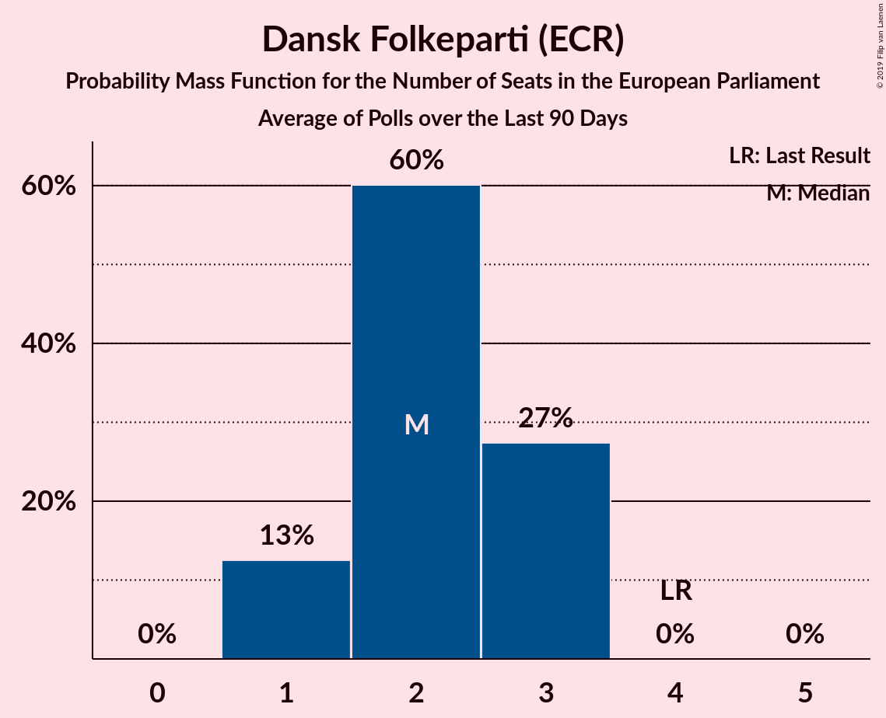

# Dansk Folkeparti (ECR)

<a href="#voting-intentions">Voting Intentions</a> | <a href="#seats">Seats</a>

## Voting Intentions

Last result: **26.6%** (General Election of 25 May 2014)

### Confidence Intervals

| Period     | Polling firm/Commissioner(s) | Median | 80% Confidence Interval | 90% Confidence Interval | 95% Confidence Interval | 99% Confidence Interval |
|:----------:|:----------------:|:-----------:|:-----------------------:|:-----------------------:|:-----------------------:|:-----------------------:|
| N/A | [Poll Average](average.html) | 17.5% | 15.8–19.2% | 15.4–19.7% | 15.0–20.1% | 14.3–21.0% |
| [5–11 March 2018](2018-03-11-Voxmeter.html) | Voxmeter   Ritzau | 18.0% | 16.6–19.6% | 16.2–20.1% | 15.8–20.5% | 15.1–21.3% |
| [19–25 February 2018](2018-02-25-Voxmeter.html) | Voxmeter   Ritzau | 17.6% | 16.1–19.2% | 15.7–19.6% | 15.4–20.1% | 14.7–20.9% |
| [19–22 February 2018](2018-02-22-Megafon.html) | Megafon   Politiken and TV 2 | 16.9% | 15.5–18.5% | 15.0–19.0% | 14.7–19.4% | 14.0–20.2% |
| [12–18 February 2018](2018-02-18-Voxmeter.html) | Voxmeter   Ritzau | 18.2% | N/A | N/A | N/A | N/A |
| [8–14 February 2018](2018-02-14-Epinion.html) | Epinion   DR | 17.2% | N/A | N/A | N/A | N/A |
| [5–10 February 2018](2018-02-10-Voxmeter.html) | Voxmeter   Ritzau | 18.8% | N/A | N/A | N/A | N/A |
| [2–8 February 2018](2018-02-08-KantarGallup.html) | Kantar Gallup   Berlingske | 15.5% | N/A | N/A | N/A | N/A |
| [2–8 February 2018](2018-02-08-GreensAnalyseinstitut.html) | Greens Analyseinstitut   Børsen | 16.5% | N/A | N/A | N/A | N/A |

### Probability Mass Function

The following table shows the probability mass function per percentage block of voting intentions for the [poll average](average.html) for Dansk Folkeparti (ECR).

| Voting Intentions | Probability | Accumulated | Special Marks |
|:-----------------:|:-----------:|:-----------:|:-------------:|
| 12.5–13.5% | 0.1% | 100% |  |
| 13.5–14.5% | 0.8% | 99.9% |  |
| 14.5–15.5% | 5% | 99.1% |  |
| 15.5–16.5% | 17% | 94% |  |
| 16.5–17.5% | 28% | 77% |  |
| 17.5–18.5% | 27% | 49% | Median |
| 18.5–19.5% | 15% | 22% |  |
| 19.5–20.5% | 5% | 6% |  |
| 20.5–21.5% | 1.1% | 1.2% |  |
| 21.5–22.5% | 0.1% | 0.1% |  |
| 22.5–23.5% | 0% | 0% |  |
| 23.5–24.5% | 0% | 0% |  |
| 24.5–25.5% | 0% | 0% |  |
| 25.5–26.5% | 0% | 0% |  |
| 26.5–27.5% | 0% | 0% | Last Result |

## Seats

Last result: **4** seats (General Election of 25 May 2014)

### Confidence Intervals

| Period     | Polling firm/Commissioner(s) | Median | 80% Confidence Interval | 90% Confidence Interval | 95% Confidence Interval | 99% Confidence Interval |
|:----------:|:----------------:|:------:|:-----------------------:|:-----------------------:|:-----------------------:|:-----------------------:|
| N/A | [Poll Average](average.html) | 3 | 2–3 | 2–3 | 2–3 | 2–3 |
| [5–11 March 2018](2018-03-11-Voxmeter.html) | Voxmeter   Ritzau | 3 | 2–3 | 2–3 | 2–3 | 2–3 |
| [19–25 February 2018](2018-02-25-Voxmeter.html) | Voxmeter   Ritzau | 3 | 3–4 | 3–4 | 3–4 | 3–4 |
| [19–22 February 2018](2018-02-22-Megafon.html) | Megafon   Politiken and TV 2 |  |  |  |  |  |
| [12–18 February 2018](2018-02-18-Voxmeter.html) | Voxmeter   Ritzau |  |  |  |  |  |
| [8–14 February 2018](2018-02-14-Epinion.html) | Epinion   DR |  |  |  |  |  |
| [5–10 February 2018](2018-02-10-Voxmeter.html) | Voxmeter   Ritzau |  |  |  |  |  |
| [2–8 February 2018](2018-02-08-KantarGallup.html) | Kantar Gallup   Berlingske |  |  |  |  |  |
| [2–8 February 2018](2018-02-08-GreensAnalyseinstitut.html) | Greens Analyseinstitut   Børsen |  |  |  |  |  |

### Probability Mass Function

The following table shows the probability mass function per seat for the [poll average](average.html) for Dansk Folkeparti (ECR).

| Number of Seats | Probability | Accumulated | Special Marks |
|:---------------:|:-----------:|:-----------:|:-------------:|
| 2 | 32% | 100% |  |
| 3 | 68% | 68% | Median |
| 4 | 0% | 0% | Last Result |

