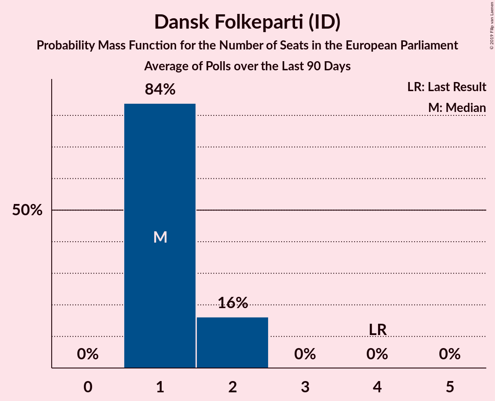

# Dansk Folkeparti (ID)

<a href="#voting-intentions">Voting Intentions</a> | <a href="#seats">Seats</a>

## Voting Intentions

Last result: **26.6%** (General Election of 26 May 2019)

### Confidence Intervals

| Period     | Polling firm/Commissioner(s) | Median | 80% Confidence Interval | 90% Confidence Interval | 95% Confidence Interval | 99% Confidence Interval |
|:----------:|:----------------:|:-----------:|:-----------------------:|:-----------------------:|:-----------------------:|:-----------------------:|
| N/A | [Poll Average](average.html) | 9.8% | 8.0–11.8% | 7.7–12.3% | 7.4–12.6% | 6.9–13.4% |
| [11–17 November 2019](2019-11-17-Voxmeter.html) | Voxmeter   Ritzau | 8.7% | 7.7–9.9% | 7.4–10.3% | 7.1–10.6% | 6.7–11.2% |
| [4–10 November 2019](2019-11-10-Voxmeter.html) | Voxmeter   Ritzau | 9.0% | 7.9–10.2% | 7.7–10.6% | 7.4–10.9% | 6.9–11.5% |
| [27 October–4 November 2019](2019-11-04-Voxmeter.html) | Voxmeter   Ritzau | 9.6% | 8.5–10.9% | 8.2–11.2% | 7.9–11.5% | 7.5–12.2% |
| [21–27 October 2019](2019-10-27-Voxmeter.html) | Voxmeter   Ritzau | 9.1% | 8.1–10.4% | 7.8–10.7% | 7.5–11.1% | 7.0–11.7% |
| [14–20 October 2019](2019-10-20-Voxmeter.html) | Voxmeter   Ritzau | 8.5% | 7.5–9.7% | 7.2–10.1% | 7.0–10.4% | 6.5–11.0% |
| [7–12 October 2019](2019-10-12-Voxmeter.html) | Voxmeter   Ritzau | 9.2% | 8.1–10.4% | 7.8–10.8% | 7.5–11.1% | 7.1–11.7% |
| [30 September–7 October 2019](2019-10-07-Voxmeter.html) | Voxmeter   2019-10-07 | 8.6% | 7.5–9.8% | 7.3–10.1% | 7.0–10.4% | 6.6–11.0% |
| [16–22 September 2019](2019-09-22-Voxmeter.html) | Voxmeter   Ritzau | 9.4% | 8.3–10.7% | 8.0–11.0% | 7.8–11.4% | 7.3–12.0% |
| [19 September 2019](2019-09-19-Norstat.html) | Norstat   Altinget and Jyllands-Posten | 10.9% | 9.7–12.3% | 9.4–12.7% | 9.1–13.0% | 8.6–13.7% |
| [9–14 September 2019](2019-09-14-Voxmeter.html) | Voxmeter   Ritzau | 8.9% | 7.9–10.2% | 7.6–10.5% | 7.3–10.8% | 6.9–11.4% |
| [2–9 September 2019](2019-09-09-Voxmeter.html) | Voxmeter   Ritzau | 8.1% | 7.1–9.2% | 6.8–9.6% | 6.6–9.9% | 6.1–10.5% |
| [26 August–1 September 2019](2019-09-01-Voxmeter.html) | Voxmeter   Ritzau | 7.9% | 6.9–9.1% | 6.6–9.4% | 6.4–9.7% | 6.0–10.3% |
| [18–25 August 2019](2019-08-25-Voxmeter.html) | Voxmeter   Ritzau | 8.4% | 7.4–9.6% | 7.1–10.0% | 6.9–10.3% | 6.4–10.9% |
| [12–18 August 2019](2019-08-18-Voxmeter.html) | Voxmeter   Ritzau | 8.3% | 7.3–9.5% | 7.0–9.8% | 6.8–10.1% | 6.3–10.7% |
| [5–10 August 2019](2019-08-10-Voxmeter.html) | Voxmeter   Ritzau | 8.3% | 7.2–9.5% | 7.0–9.8% | 6.7–10.1% | 6.2–10.7% |
| [8 August 2019](2019-08-08-Gallup.html) | Gallup | 9.5% | 8.6–10.5% | 8.4–10.8% | 8.1–11.1% | 7.7–11.6% |
| [24–30 June 2019](2019-06-30-Voxmeter.html) | Voxmeter   Ritzau | 8.4% | 7.4–9.6% | 7.1–10.0% | 6.9–10.3% | 6.4–10.9% |
| [17–23 June 2019](2019-06-23-Voxmeter.html) | Voxmeter   Ritzau | 8.3% | 7.3–9.5% | 7.0–9.8% | 6.8–10.1% | 6.3–10.7% |
| [10–15 June 2019](2019-06-15-Voxmeter.html) | Voxmeter   Ritzau | 7.3% | 6.4–8.5% | 6.1–8.8% | 5.9–9.1% | 5.5–9.7% |
| [31 May–4 June 2019](2019-06-04-YouGov.html) | YouGov | 11.3% | 10.1–12.6% | 9.8–13.0% | 9.5–13.3% | 9.0–14.0% |
| [4 June 2019](2019-06-04-Gallup.html) | Gallup | 10.6% | 10.0–11.2% | 9.9–11.4% | 9.8–11.5% | 9.5–11.8% |
| [4 June 2019](2019-06-04-Epinion.html) | Epinion   DR | 9.6% | 8.9–10.4% | 8.7–10.7% | 8.5–10.9% | 8.2–11.3% |
| [30 May–3 June 2019](2019-06-03-YouGov.html) | YouGov | 10.5% | 9.3–12.0% | 8.9–12.4% | 8.6–12.8% | 8.1–13.5% |
| [1–3 June 2019](2019-06-03-Voxmeter.html) | Voxmeter   Ritzau | 10.2% | 9.0–11.5% | 8.7–11.9% | 8.4–12.2% | 7.9–12.9% |
| [3 June 2019](2019-06-03-Norstat.html) | Norstat   Altinget and Jyllands-Posten | 10.5% | 9.4–11.7% | 9.1–12.0% | 8.9–12.3% | 8.4–12.9% |
| [3 June 2019](2019-06-03-GreensAnalyseinstitut.html) | Greens Analyseinstitut   Børsen | 10.5% | 9.4–11.7% | 9.1–12.1% | 8.9–12.4% | 8.4–13.0% |
| [29 May–2 June 2019](2019-06-02-YouGov.html) | YouGov | 8.2% | 7.1–9.6% | 6.8–10.0% | 6.5–10.4% | 6.0–11.1% |
| [31 May–2 June 2019](2019-06-02-Voxmeter.html) | Voxmeter   Ritzau | 9.9% | 8.8–11.2% | 8.5–11.6% | 8.2–11.9% | 7.7–12.6% |
| [28 May–1 June 2019](2019-06-01-YouGov.html) | YouGov | 8.5% | 7.4–9.8% | 7.1–10.2% | 6.8–10.6% | 6.3–11.2% |
| [30 May–1 June 2019](2019-06-01-Voxmeter.html) | Voxmeter   Ritzau | 10.7% | 9.6–12.1% | 9.2–12.5% | 9.0–12.8% | 8.4–13.5% |
| [29–31 May 2019](2019-05-31-Voxmeter.html) | Voxmeter   Ritzau | 11.1% | 10.0–12.5% | 9.6–12.9% | 9.3–13.2% | 8.8–13.9% |
| [26–30 May 2019](2019-05-30-YouGov.html) | YouGov | 9.5% | 8.4–10.8% | 8.1–11.2% | 7.8–11.5% | 7.3–12.2% |
| [28–30 May 2019](2019-05-30-Voxmeter.html) | Voxmeter   Ritzau | 11.6% | 10.4–13.0% | 10.0–13.4% | 9.8–13.7% | 9.2–14.4% |
| [28–30 May 2019](2019-05-30-Megafon.html) | Megafon   Politiken and TV 2 | 12.1% | 10.9–13.5% | 10.6–14.0% | 10.3–14.3% | 9.7–15.0% |
| [28–30 May 2019](2019-05-30-Epinion.html) | Epinion   DR | 10.6% | 9.7–11.6% | 9.4–11.9% | 9.2–12.1% | 8.8–12.6% |
| [25–29 May 2019](2019-05-29-YouGov.html) | YouGov | 11.3% | 10.1–12.7% | 9.8–13.1% | 9.5–13.5% | 8.9–14.2% |
| [27–29 May 2019](2019-05-29-Voxmeter.html) | Voxmeter   Ritzau | 11.1% | 9.9–12.5% | 9.6–12.8% | 9.3–13.2% | 8.7–13.9% |
| [24–28 May 2019](2019-05-28-YouGov.html) | YouGov | 12.5% | 11.2–13.9% | 10.9–14.3% | 10.5–14.7% | 10.0–15.4% |
| [26–28 May 2019](2019-05-28-Voxmeter.html) | Voxmeter   Ritzau | 10.4% | 9.2–11.7% | 8.9–12.1% | 8.6–12.4% | 8.1–13.1% |
| [28 May 2019](2019-05-28-Gallup.html) | Gallup | 10.9% | 9.9–12.0% | 9.6–12.3% | 9.4–12.6% | 9.0–13.2% |
| [25–27 May 2019](2019-05-27-Voxmeter.html) | Voxmeter   Ritzau | 10.7% | 9.6–12.1% | 9.2–12.5% | 9.0–12.8% | 8.4–13.5% |

### Probability Mass Function

The following table shows the probability mass function per percentage block of voting intentions for the [poll average](average.html) for Dansk Folkeparti (ID).

| Voting Intentions | Probability | Accumulated | Special Marks |
|:-----------------:|:-----------:|:-----------:|:-------------:|
| 4.5–5.5% | 0% | 100% |  |
| 5.5–6.5% | 0.2% | 100% |  |
| 6.5–7.5% | 4% | 99.8% |  |
| 7.5–8.5% | 17% | 96% |  |
| 8.5–9.5% | 24% | 80% |  |
| 9.5–10.5% | 22% | 56% | Median |
| 10.5–11.5% | 21% | 34% |  |
| 11.5–12.5% | 11% | 14% |  |
| 12.5–13.5% | 3% | 3% |  |
| 13.5–14.5% | 0.3% | 0.3% |  |
| 14.5–15.5% | 0% | 0% |  |
| 15.5–16.5% | 0% | 0% |  |
| 16.5–17.5% | 0% | 0% |  |
| 17.5–18.5% | 0% | 0% |  |
| 18.5–19.5% | 0% | 0% |  |
| 19.5–20.5% | 0% | 0% |  |
| 20.5–21.5% | 0% | 0% |  |
| 21.5–22.5% | 0% | 0% |  |
| 22.5–23.5% | 0% | 0% |  |
| 23.5–24.5% | 0% | 0% |  |
| 24.5–25.5% | 0% | 0% |  |
| 25.5–26.5% | 0% | 0% |  |
| 26.5–27.5% | 0% | 0% | Last Result |

## Seats

Last result: **4** seats (General Election of 26 May 2019)

### Confidence Intervals

| Period     | Polling firm/Commissioner(s) | Median | 80% Confidence Interval | 90% Confidence Interval | 95% Confidence Interval | 99% Confidence Interval |
|:----------:|:----------------:|:------:|:-----------------------:|:-----------------------:|:-----------------------:|:-----------------------:|
| N/A | [Poll Average](average.html) | 1 | 1–2 | 1–2 | 1–2 | 1–2 |
| [11–17 November 2019](2019-11-17-Voxmeter.html) | Voxmeter   Ritzau | 1 | 1 | 1 | 1 | 1 |
| [4–10 November 2019](2019-11-10-Voxmeter.html) | Voxmeter   Ritzau | 1 | 1 | 1 | 1 | 1 |
| [27 October–4 November 2019](2019-11-04-Voxmeter.html) | Voxmeter   Ritzau | 1 | 1 | 1–2 | 1–2 | 1–2 |
| [21–27 October 2019](2019-10-27-Voxmeter.html) | Voxmeter   Ritzau | 1 | 1 | 1 | 1 | 1 |
| [14–20 October 2019](2019-10-20-Voxmeter.html) | Voxmeter   Ritzau | 1 | 1 | 1 | 1 | 1 |
| [7–12 October 2019](2019-10-12-Voxmeter.html) | Voxmeter   Ritzau | 1 | 1 | 1 | 1 | 1 |
| [30 September–7 October 2019](2019-10-07-Voxmeter.html) | Voxmeter   2019-10-07 | 1 | 1 | 1 | 1 | 1 |
| [16–22 September 2019](2019-09-22-Voxmeter.html) | Voxmeter   Ritzau | 1 | 1 | 1 | 1 | 1–2 |
| [19 September 2019](2019-09-19-Norstat.html) | Norstat   Altinget and Jyllands-Posten | 1 | 1–2 | 1–2 | 1–2 | 1–2 |
| [9–14 September 2019](2019-09-14-Voxmeter.html) | Voxmeter   Ritzau | 1 | 1 | 1–2 | 1–2 | 1–2 |
| [2–9 September 2019](2019-09-09-Voxmeter.html) | Voxmeter   Ritzau | 1 | 1 | 1 | 1 | 1 |
| [26 August–1 September 2019](2019-09-01-Voxmeter.html) | Voxmeter   Ritzau | 1 | 1 | 1 | 1 | 1 |
| [18–25 August 2019](2019-08-25-Voxmeter.html) | Voxmeter   Ritzau | 1 | 1 | 1 | 1 | 1 |
| [12–18 August 2019](2019-08-18-Voxmeter.html) | Voxmeter   Ritzau | 1 | 1 | 1 | 1 | 1 |
| [5–10 August 2019](2019-08-10-Voxmeter.html) | Voxmeter   Ritzau | 1 | 1 | 1 | 1 | 1 |
| [8 August 2019](2019-08-08-Gallup.html) | Gallup | 1 | 1 | 1 | 1 | 1–2 |
| [24–30 June 2019](2019-06-30-Voxmeter.html) | Voxmeter   Ritzau | 1 | 1 | 1 | 1 | 1 |
| [17–23 June 2019](2019-06-23-Voxmeter.html) | Voxmeter   Ritzau | 1 | 1 | 1 | 1 | 1 |
| [10–15 June 2019](2019-06-15-Voxmeter.html) | Voxmeter   Ritzau | 1 | 1 | 1 | 1 | 0–1 |
| [31 May–4 June 2019](2019-06-04-YouGov.html) | YouGov | 2 | 2 | 2 | 1–2 | 1–2 |
| [4 June 2019](2019-06-04-Gallup.html) | Gallup | 1 | 1–2 | 1–2 | 1–2 | 1–2 |
| [4 June 2019](2019-06-04-Epinion.html) | Epinion   DR | 1 | 1 | 1 | 1–2 | 1–2 |
| [30 May–3 June 2019](2019-06-03-YouGov.html) | YouGov | 2 | 1–2 | 1–2 | 1–2 | 1–2 |
| [1–3 June 2019](2019-06-03-Voxmeter.html) | Voxmeter   Ritzau | 2 | 1–2 | 1–2 | 1–2 | 1–2 |
| [3 June 2019](2019-06-03-Norstat.html) | Norstat   Altinget and Jyllands-Posten | 1 | 1–2 | 1–2 | 1–2 | 1–2 |
| [3 June 2019](2019-06-03-GreensAnalyseinstitut.html) | Greens Analyseinstitut   Børsen | 2 | 1–2 | 1–2 | 1–2 | 1–2 |
| [29 May–2 June 2019](2019-06-02-YouGov.html) | YouGov | 1 | 1 | 1 | 1–2 | 1–2 |
| [31 May–2 June 2019](2019-06-02-Voxmeter.html) | Voxmeter   Ritzau | 1 | 1–2 | 1–2 | 1–2 | 1–2 |
| [28 May–1 June 2019](2019-06-01-YouGov.html) | YouGov | 1 | 1 | 1 | 1 | 1–2 |
| [30 May–1 June 2019](2019-06-01-Voxmeter.html) | Voxmeter   Ritzau | 2 | 1–2 | 1–2 | 1–2 | 1–2 |
| [29–31 May 2019](2019-05-31-Voxmeter.html) | Voxmeter   Ritzau | 2 | 1–2 | 1–2 | 1–2 | 1–2 |
| [26–30 May 2019](2019-05-30-YouGov.html) | YouGov | 1 | 1–2 | 1–2 | 1–2 | 1–2 |
| [28–30 May 2019](2019-05-30-Voxmeter.html) | Voxmeter   Ritzau | 2 | 2 | 1–2 | 1–2 | 1–2 |
| [28–30 May 2019](2019-05-30-Megafon.html) | Megafon   Politiken and TV 2 | 2 | 2 | 2 | 2 | 1–2 |
| [28–30 May 2019](2019-05-30-Epinion.html) | Epinion   DR | 2 | 1–2 | 1–2 | 1–2 | 1–2 |
| [25–29 May 2019](2019-05-29-YouGov.html) | YouGov | 2 | 2 | 1–2 | 1–2 | 1–2 |
| [27–29 May 2019](2019-05-29-Voxmeter.html) | Voxmeter   Ritzau | 2 | 1–2 | 1–2 | 1–2 | 1–2 |
| [24–28 May 2019](2019-05-28-YouGov.html) | YouGov | 2 | 2 | 1–2 | 1–2 | 1–2 |
| [26–28 May 2019](2019-05-28-Voxmeter.html) | Voxmeter   Ritzau | 1 | 1–2 | 1–2 | 1–2 | 1–2 |
| [28 May 2019](2019-05-28-Gallup.html) | Gallup | 1 | 1–2 | 1–2 | 1–2 | 1–2 |
| [25–27 May 2019](2019-05-27-Voxmeter.html) | Voxmeter   Ritzau | 2 | 1–2 | 1–2 | 1–2 | 1–2 |

### Probability Mass Function

The following table shows the probability mass function per seat for the [poll average](average.html) for Dansk Folkeparti (ID).

| Number of Seats | Probability | Accumulated | Special Marks |
|:---------------:|:-----------:|:-----------:|:-------------:|
| 1 | 78% | 100% | Median |
| 2 | 22% | 22% |  |
| 3 | 0% | 0% |  |
| 4 | 0% | 0% | Last Result |

