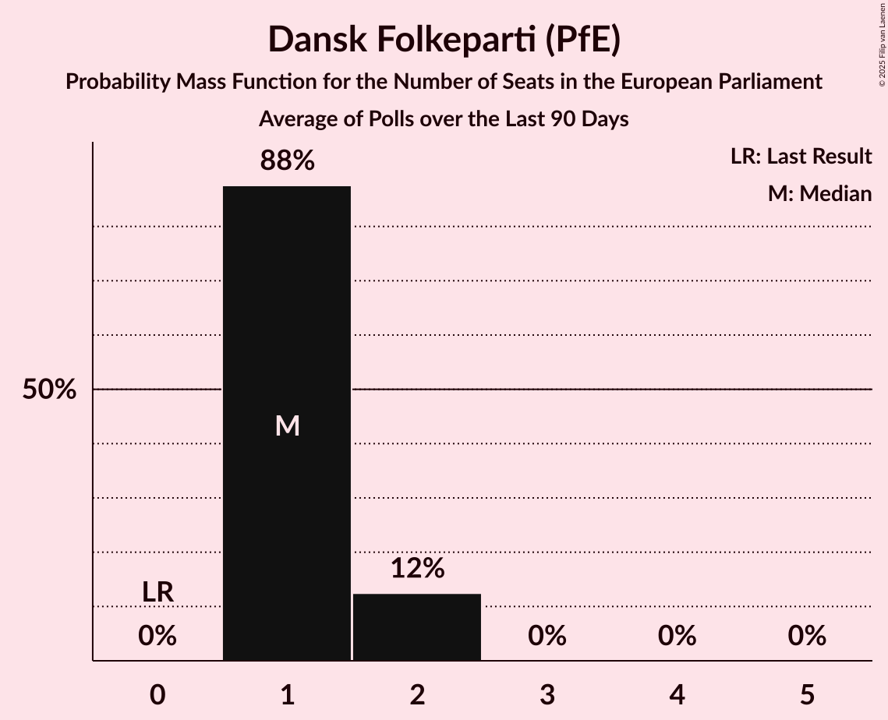

# Dansk Folkeparti (PfE)

<a href="#voting-intentions">Voting Intentions</a> | <a href="#seats">Seats</a>

## Voting Intentions

Last result: **0.0%** (General Election of 9 June 2024)

### Confidence Intervals

| Period     | Polling firm/Commissioner(s) | Median | 80% Confidence Interval | 90% Confidence Interval | 95% Confidence Interval | 99% Confidence Interval |
|:----------:|:----------------:|:-----------:|:-----------------------:|:-----------------------:|:-----------------------:|:-----------------------:|
| N/A | [Poll Average](average.html) | 4.5% | 3.8–5.4% | 3.6–5.7% | 3.4–5.9% | 3.1–6.4% |
| [17–23 June 2024](2024-06-23-Voxmeter.html) | Voxmeter | 4.6% | 3.8–5.5% | 3.6–5.8% | 3.4–6.1% | 3.1–6.5% |
| [10–16 June 2024](2024-06-16-Voxmeter.html) | Voxmeter | 3.5% | N/A | N/A | N/A | N/A |
| [9–14 June 2024](2024-06-14-Verian.html) | Verian   Berlingske | 4.4% | 3.8–5.3% | 3.6–5.5% | 3.4–5.7% | 3.1–6.1% |

### Probability Mass Function

The following table shows the probability mass function per percentage block of voting intentions for the [poll average](average.html) for Dansk Folkeparti (PfE).

| Voting Intentions | Probability | Accumulated | Special Marks |
|:-----------------:|:-----------:|:-----------:|:-------------:|
| 0.0–0.5% | 0% | 100% | Last Result |
| 0.5–1.5% | 0% | 100% |  |
| 1.5–2.5% | 0% | 100% |  |
| 2.5–3.5% | 4% | 100% |  |
| 3.5–4.5% | 47% | 96% |  |
| 4.5–5.5% | 42% | 49% | Median |
| 5.5–6.5% | 6% | 7% |  |
| 6.5–7.5% | 0.3% | 0.3% |  |
| 7.5–8.5% | 0% | 0% |  |

## Seats

Last result: **0** seats (General Election of 9 June 2024)

### Confidence Intervals

| Period     | Polling firm/Commissioner(s) | Median | 80% Confidence Interval | 90% Confidence Interval | 95% Confidence Interval | 99% Confidence Interval |
|:----------:|:----------------:|:------:|:-----------------------:|:-----------------------:|:-----------------------:|:-----------------------:|
| N/A | [Poll Average](average.html) | 0 | 0–1 | 0–1 | 0–1 | 0–1 |
| [17–23 June 2024](2024-06-23-Voxmeter.html) | Voxmeter | 0 | 0–1 | 0–1 | 0–1 | 0–1 |
| [10–16 June 2024](2024-06-16-Voxmeter.html) | Voxmeter |  |  |  |  |  |
| [9–14 June 2024](2024-06-14-Verian.html) | Verian   Berlingske | 0 | 0–1 | 0–1 | 0–1 | 0–1 |

### Probability Mass Function

The following table shows the probability mass function per seat for the [poll average](average.html) for Dansk Folkeparti (PfE).

| Number of Seats | Probability | Accumulated | Special Marks |
|:---------------:|:-----------:|:-----------:|:-------------:|
| 0 | 74% | 100% | Last Result, Median |
| 1 | 26% | 26% |  |
| 2 | 0% | 0% |  |

