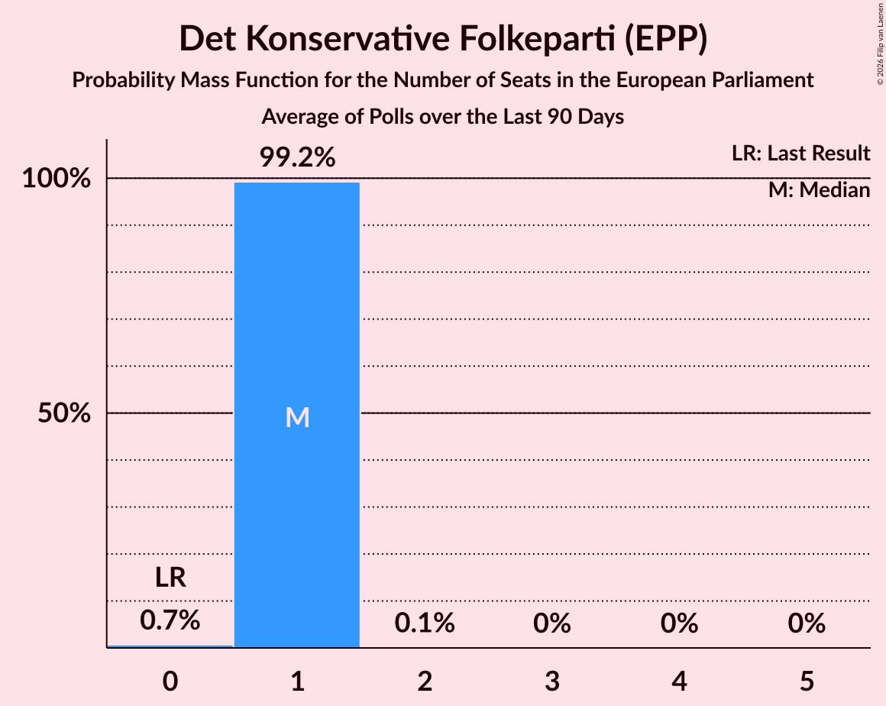

# Det Konservative Folkeparti (EPP)

<a href="#voting-intentions">Voting Intentions</a> | <a href="#seats">Seats</a>

## Voting Intentions

Last result: **9.1%** (General Election of 26 May 2019)

### Confidence Intervals

| Period     | Polling firm/Commissioner(s) | Median | 80% Confidence Interval | 90% Confidence Interval | 95% Confidence Interval | 99% Confidence Interval |
|:----------:|:----------------:|:-----------:|:-----------------------:|:-----------------------:|:-----------------------:|:-----------------------:|
| N/A | [Poll Average](average.html) | 6.8% | 5.8–7.9% | 5.5–8.2% | 5.3–8.5% | 4.9–9.0% |
| [7–12 October 2019](2019-10-12-Voxmeter.html) | Voxmeter   Ritzau | 7.5% | 6.6–8.7% | 6.3–9.0% | 6.1–9.3% | 5.6–9.9% |
| [30 September–7 October 2019](2019-10-07-Voxmeter.html) | Voxmeter   2019-10-07 | 6.9% | 5.9–8.0% | 5.7–8.3% | 5.5–8.6% | 5.1–9.1% |
| [16–22 September 2019](2019-09-22-Voxmeter.html) | Voxmeter   Ritzau | 6.9% | 6.0–8.0% | 5.7–8.4% | 5.5–8.6% | 5.1–9.2% |
| [19 September 2019](2019-09-19-Norstat.html) | Norstat   Altinget and Jyllands-Posten | 6.5% | 5.6–7.6% | 5.3–7.9% | 5.1–8.2% | 4.7–8.8% |
| [9–14 September 2019](2019-09-14-Voxmeter.html) | Voxmeter   Ritzau | 7.1% | 6.2–8.2% | 5.9–8.5% | 5.7–8.8% | 5.3–9.4% |
| [2–9 September 2019](2019-09-09-Voxmeter.html) | Voxmeter   Ritzau | 7.6% | 6.6–8.7% | 6.3–9.1% | 6.1–9.3% | 5.7–9.9% |
| [26 August–1 September 2019](2019-09-01-Voxmeter.html) | Voxmeter   Ritzau | 6.9% | 5.9–8.0% | 5.7–8.3% | 5.5–8.6% | 5.1–9.1% |
| [18–25 August 2019](2019-08-25-Voxmeter.html) | Voxmeter   Ritzau | 7.0% | 6.0–8.1% | 5.8–8.4% | 5.6–8.7% | 5.2–9.3% |
| [12–18 August 2019](2019-08-18-Voxmeter.html) | Voxmeter   Ritzau | 7.4% | 6.5–8.6% | 6.2–8.9% | 6.0–9.2% | 5.6–9.7% |
| [5–10 August 2019](2019-08-10-Voxmeter.html) | Voxmeter   Ritzau | 7.3% | 6.3–8.4% | 6.0–8.7% | 5.8–9.0% | 5.4–9.6% |
| [8 August 2019](2019-08-08-Gallup.html) | Gallup | 7.0% | 6.2–7.9% | 6.0–8.1% | 5.8–8.4% | 5.4–8.8% |
| [24–30 June 2019](2019-06-30-Voxmeter.html) | Voxmeter   Ritzau | 7.2% | 6.3–8.3% | 6.0–8.6% | 5.8–8.9% | 5.4–9.5% |
| [17–23 June 2019](2019-06-23-Voxmeter.html) | Voxmeter   Ritzau | 6.9% | 6.0–8.1% | 5.8–8.4% | 5.5–8.7% | 5.1–9.2% |
| [10–15 June 2019](2019-06-15-Voxmeter.html) | Voxmeter   Ritzau | 7.3% | 6.4–8.5% | 6.1–8.8% | 5.9–9.1% | 5.5–9.7% |
| [31 May–4 June 2019](2019-06-04-YouGov.html) | YouGov | 4.6% | 3.8–5.5% | 3.6–5.7% | 3.5–6.0% | 3.1–6.5% |
| [4 June 2019](2019-06-04-Gallup.html) | Gallup | 6.1% | 5.7–6.6% | 5.5–6.7% | 5.4–6.8% | 5.3–7.0% |
| [4 June 2019](2019-06-04-Epinion.html) | Epinion   DR | 6.2% | 5.6–6.9% | 5.5–7.1% | 5.3–7.3% | 5.0–7.6% |
| [30 May–3 June 2019](2019-06-03-YouGov.html) | YouGov | 4.8% | 4.0–5.9% | 3.7–6.2% | 3.6–6.4% | 3.2–7.0% |
| [1–3 June 2019](2019-06-03-Voxmeter.html) | Voxmeter   Ritzau | 4.5% | 3.7–5.4% | 3.5–5.7% | 3.4–6.0% | 3.0–6.4% |
| [3 June 2019](2019-06-03-Norstat.html) | Norstat   Altinget and Jyllands-Posten | 4.5% | 3.8–5.3% | 3.6–5.6% | 3.4–5.8% | 3.2–6.2% |
| [3 June 2019](2019-06-03-GreensAnalyseinstitut.html) | Greens Analyseinstitut   Børsen | 5.2% | 4.4–6.1% | 4.2–6.4% | 4.0–6.6% | 3.7–7.1% |
| [29 May–2 June 2019](2019-06-02-YouGov.html) | YouGov | 5.2% | 4.3–6.3% | 4.0–6.7% | 3.8–7.0% | 3.4–7.5% |
| [31 May–2 June 2019](2019-06-02-Voxmeter.html) | Voxmeter   Ritzau | 4.6% | 3.8–5.5% | 3.6–5.8% | 3.4–6.1% | 3.1–6.6% |
| [28 May–1 June 2019](2019-06-01-YouGov.html) | YouGov | 5.4% | 4.5–6.5% | 4.3–6.8% | 4.1–7.1% | 3.7–7.7% |
| [30 May–1 June 2019](2019-06-01-Voxmeter.html) | Voxmeter   Ritzau | 5.0% | 4.2–6.0% | 4.0–6.2% | 3.8–6.5% | 3.4–7.0% |
| [29–31 May 2019](2019-05-31-Voxmeter.html) | Voxmeter   Ritzau | 5.2% | 4.4–6.2% | 4.1–6.5% | 4.0–6.7% | 3.6–7.2% |
| [26–30 May 2019](2019-05-30-YouGov.html) | YouGov | 5.3% | 4.5–6.4% | 4.3–6.6% | 4.1–6.9% | 3.7–7.4% |
| [28–30 May 2019](2019-05-30-Voxmeter.html) | Voxmeter   Ritzau | 5.5% | 4.6–6.5% | 4.4–6.8% | 4.2–7.0% | 3.8–7.6% |
| [28–30 May 2019](2019-05-30-Megafon.html) | Megafon   Politiken and TV 2 | 5.3% | 4.5–6.4% | 4.3–6.6% | 4.1–6.9% | 3.7–7.4% |
| [28–30 May 2019](2019-05-30-Epinion.html) | Epinion   DR | 5.1% | 4.5–5.9% | 4.3–6.1% | 4.2–6.3% | 3.9–6.6% |
| [25–29 May 2019](2019-05-29-YouGov.html) | YouGov | 5.7% | 4.9–6.8% | 4.6–7.1% | 4.4–7.3% | 4.0–7.9% |
| [27–29 May 2019](2019-05-29-Voxmeter.html) | Voxmeter   Ritzau | 5.6% | 4.8–6.7% | 4.6–7.0% | 4.4–7.2% | 4.0–7.8% |
| [24–28 May 2019](2019-05-28-YouGov.html) | YouGov | 6.2% | 5.3–7.3% | 5.1–7.7% | 4.9–7.9% | 4.5–8.5% |
| [26–28 May 2019](2019-05-28-Voxmeter.html) | Voxmeter   Ritzau | 5.6% | 4.8–6.7% | 4.6–7.0% | 4.4–7.2% | 4.0–7.8% |
| [28 May 2019](2019-05-28-Gallup.html) | Gallup | 6.8% | 6.1–7.8% | 5.8–8.0% | 5.7–8.3% | 5.3–8.7% |
| [25–27 May 2019](2019-05-27-Voxmeter.html) | Voxmeter   Ritzau | 5.2% | 4.4–6.2% | 4.1–6.5% | 4.0–6.7% | 3.6–7.2% |

### Probability Mass Function

The following table shows the probability mass function per percentage block of voting intentions for the [poll average](average.html) for Det Konservative Folkeparti (EPP).

| Voting Intentions | Probability | Accumulated | Special Marks |
|:-----------------:|:-----------:|:-----------:|:-------------:|
| 2.5–3.5% | 0% | 100% |  |
| 3.5–4.5% | 0.1% | 100% |  |
| 4.5–5.5% | 6% | 99.9% |  |
| 5.5–6.5% | 34% | 94% |  |
| 6.5–7.5% | 43% | 60% | Median |
| 7.5–8.5% | 16% | 18% |  |
| 8.5–9.5% | 2% | 2% | Last Result |
| 9.5–10.5% | 0.1% | 0.1% |  |
| 10.5–11.5% | 0% | 0% |  |

## Seats

Last result: **1** seats (General Election of 26 May 2019)

### Confidence Intervals

| Period     | Polling firm/Commissioner(s) | Median | 80% Confidence Interval | 90% Confidence Interval | 95% Confidence Interval | 99% Confidence Interval |
|:----------:|:----------------:|:------:|:-----------------------:|:-----------------------:|:-----------------------:|:-----------------------:|
| N/A | [Poll Average](average.html) | 1 | 1 | 1 | 1 | 0–1 |
| [7–12 October 2019](2019-10-12-Voxmeter.html) | Voxmeter   Ritzau | 1 | 1 | 1 | 1 | 1–2 |
| [30 September–7 October 2019](2019-10-07-Voxmeter.html) | Voxmeter   2019-10-07 | 1 | 1 | 1 | 1 | 1 |
| [16–22 September 2019](2019-09-22-Voxmeter.html) | Voxmeter   Ritzau | 1 | 1 | 1 | 1 | 0–1 |
| [19 September 2019](2019-09-19-Norstat.html) | Norstat   Altinget and Jyllands-Posten | 1 | 1 | 1 | 0–1 | 0–1 |
| [9–14 September 2019](2019-09-14-Voxmeter.html) | Voxmeter   Ritzau | 1 | 1 | 1 | 1 | 0–1 |
| [2–9 September 2019](2019-09-09-Voxmeter.html) | Voxmeter   Ritzau | 1 | 1 | 1 | 1 | 1 |
| [26 August–1 September 2019](2019-09-01-Voxmeter.html) | Voxmeter   Ritzau | 1 | 1 | 1 | 1 | 0–1 |
| [18–25 August 2019](2019-08-25-Voxmeter.html) | Voxmeter   Ritzau | 1 | 1 | 1 | 0–1 | 0–1 |
| [12–18 August 2019](2019-08-18-Voxmeter.html) | Voxmeter   Ritzau | 1 | 1 | 1 | 1 | 1 |
| [5–10 August 2019](2019-08-10-Voxmeter.html) | Voxmeter   Ritzau | 1 | 1 | 1 | 1 | 1 |
| [8 August 2019](2019-08-08-Gallup.html) | Gallup | 1 | 1 | 1 | 1 | 1 |
| [24–30 June 2019](2019-06-30-Voxmeter.html) | Voxmeter   Ritzau | 1 | 1 | 1 | 1 | 1 |
| [17–23 June 2019](2019-06-23-Voxmeter.html) | Voxmeter   Ritzau | 1 | 1 | 1 | 1 | 0–1 |
| [10–15 June 2019](2019-06-15-Voxmeter.html) | Voxmeter   Ritzau | 1 | 1 | 1 | 1 | 1 |
| [31 May–4 June 2019](2019-06-04-YouGov.html) | YouGov | 0 | 0 | 0–1 | 0–1 | 0–1 |
| [4 June 2019](2019-06-04-Gallup.html) | Gallup | 1 | 1 | 1 | 0–1 | 0–1 |
| [4 June 2019](2019-06-04-Epinion.html) | Epinion   DR | 1 | 1 | 1 | 1 | 0–1 |
| [30 May–3 June 2019](2019-06-03-YouGov.html) | YouGov | 1 | 0–1 | 0–1 | 0–1 | 0–1 |
| [1–3 June 2019](2019-06-03-Voxmeter.html) | Voxmeter   Ritzau | 0 | 0 | 0 | 0–1 | 0–1 |
| [3 June 2019](2019-06-03-Norstat.html) | Norstat   Altinget and Jyllands-Posten | 1 | 0–1 | 0–1 | 0–1 | 0–1 |
| [3 June 2019](2019-06-03-GreensAnalyseinstitut.html) | Greens Analyseinstitut   Børsen | 0 | 0–1 | 0–1 | 0–1 | 0–1 |
| [29 May–2 June 2019](2019-06-02-YouGov.html) | YouGov | 1 | 0–1 | 0–1 | 0–1 | 0–1 |
| [31 May–2 June 2019](2019-06-02-Voxmeter.html) | Voxmeter   Ritzau | 0 | 0–1 | 0–1 | 0–1 | 0–1 |
| [28 May–1 June 2019](2019-06-01-YouGov.html) | YouGov | 1 | 0–1 | 0–1 | 0–1 | 0–1 |
| [30 May–1 June 2019](2019-06-01-Voxmeter.html) | Voxmeter   Ritzau | 0 | 0 | 0–1 | 0–1 | 0–1 |
| [29–31 May 2019](2019-05-31-Voxmeter.html) | Voxmeter   Ritzau | 0 | 0–1 | 0–1 | 0–1 | 0–1 |
| [26–30 May 2019](2019-05-30-YouGov.html) | YouGov | 0 | 0–1 | 0–1 | 0–1 | 0–1 |
| [28–30 May 2019](2019-05-30-Voxmeter.html) | Voxmeter   Ritzau | 1 | 0–1 | 0–1 | 0–1 | 0–1 |
| [28–30 May 2019](2019-05-30-Megafon.html) | Megafon   Politiken and TV 2 | 0 | 0–1 | 0–1 | 0–1 | 0–1 |
| [28–30 May 2019](2019-05-30-Epinion.html) | Epinion   DR | 0 | 0–1 | 0–1 | 0–1 | 0–1 |
| [25–29 May 2019](2019-05-29-YouGov.html) | YouGov | 1 | 0–1 | 0–1 | 0–1 | 0–1 |
| [27–29 May 2019](2019-05-29-Voxmeter.html) | Voxmeter   Ritzau | 1 | 1 | 0–1 | 0–1 | 0–1 |
| [24–28 May 2019](2019-05-28-YouGov.html) | YouGov | 1 | 0–1 | 0–1 | 0–1 | 0–1 |
| [26–28 May 2019](2019-05-28-Voxmeter.html) | Voxmeter   Ritzau | 1 | 0–1 | 0–1 | 0–1 | 0–1 |
| [28 May 2019](2019-05-28-Gallup.html) | Gallup | 1 | 1 | 1 | 1 | 1 |
| [25–27 May 2019](2019-05-27-Voxmeter.html) | Voxmeter   Ritzau | 0 | 0–1 | 0–1 | 0–1 | 0–1 |

### Probability Mass Function

The following table shows the probability mass function per seat for the [poll average](average.html) for Det Konservative Folkeparti (EPP).

| Number of Seats | Probability | Accumulated | Special Marks |
|:---------------:|:-----------:|:-----------:|:-------------:|
| 0 | 2% | 100% |  |
| 1 | 98% | 98% | Last Result, Median |
| 2 | 0% | 0% |  |

