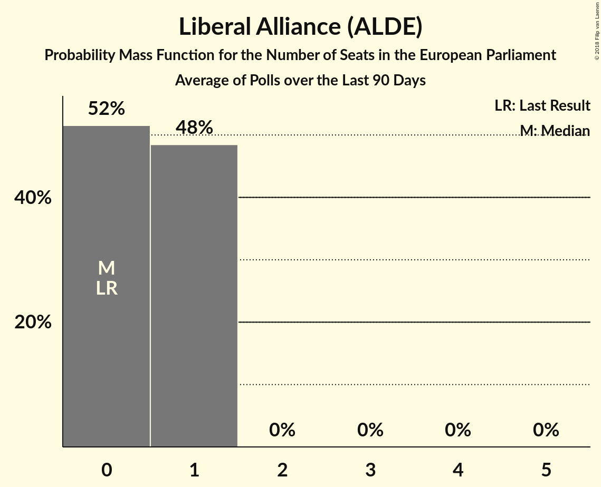

# Liberal Alliance (ALDE)

<a href="#voting-intentions">Voting Intentions</a> | <a href="#seats">Seats</a>

## Voting Intentions

Last result: **2.9%** (General Election of 25 May 2014)

### Confidence Intervals

| Period     | Polling firm/Commissioner(s) | Median | 80% Confidence Interval | 90% Confidence Interval | 95% Confidence Interval | 99% Confidence Interval |
|:----------:|:----------------:|:-----------:|:-----------------------:|:-----------------------:|:-----------------------:|:-----------------------:|
| N/A | [Poll Average](average.html) | 5.2% | 4.0–6.1% | 3.7–6.4% | 3.4–6.7% | 3.0–7.2% |
| [5–11 March 2018](2018-03-11-Voxmeter.html) | Voxmeter   Ritzau | 5.6% | 4.7–6.6% | 4.5–6.9% | 4.3–7.1% | 4.0–7.7% |
| [19–25 February 2018](2018-02-25-Voxmeter.html) | Voxmeter   Ritzau | 5.8% | 5.0–6.8% | 4.7–7.1% | 4.5–7.4% | 4.1–7.9% |
| [19–22 February 2018](2018-02-22-Megafon.html) | Megafon   Politiken and TV 2 | 4.1% | 3.4–5.0% | 3.2–5.2% | 3.0–5.5% | 2.7–5.9% |
| [12–18 February 2018](2018-02-18-Voxmeter.html) | Voxmeter   Ritzau | 4.8% | 4.0–5.7% | 3.8–6.0% | 3.6–6.3% | 3.3–6.8% |
| [8–14 February 2018](2018-02-14-Epinion.html) | Epinion   DR | 5.3% | 4.6–6.1% | 4.4–6.3% | 4.3–6.5% | 4.0–6.9% |
| [5–10 February 2018](2018-02-10-Voxmeter.html) | Voxmeter   Ritzau | 4.3% | 3.6–5.3% | 3.4–5.5% | 3.3–5.8% | 2.9–6.2% |
| [2–8 February 2018](2018-02-08-KantarGallup.html) | Kantar Gallup   Berlingske | 5.2% | 4.5–6.0% | 4.3–6.2% | 4.2–6.4% | 3.9–6.9% |
| [2–8 February 2018](2018-02-08-GreensAnalyseinstitut.html) | Greens Analyseinstitut   Børsen | 5.2% | 4.4–6.1% | 4.2–6.4% | 4.0–6.7% | 3.7–7.1% |

### Probability Mass Function

The following table shows the probability mass function per percentage block of voting intentions for the [poll average](average.html) for Liberal Alliance (ALDE).

| Voting Intentions | Probability | Accumulated | Special Marks |
|:-----------------:|:-----------:|:-----------:|:-------------:|
| 1.5–2.5% | 0% | 100% |  |
| 2.5–3.5% | 3% | 100% | Last Result |
| 3.5–4.5% | 19% | 97% |  |
| 4.5–5.5% | 47% | 77% | Median |
| 5.5–6.5% | 27% | 31% |  |
| 6.5–7.5% | 3% | 4% |  |
| 7.5–8.5% | 0.2% | 0.2% |  |
| 8.5–9.5% | 0% | 0% |  |

## Seats

Last result: **0** seats (General Election of 25 May 2014)

### Confidence Intervals

| Period     | Polling firm/Commissioner(s) | Median | 80% Confidence Interval | 90% Confidence Interval | 95% Confidence Interval | 99% Confidence Interval |
|:----------:|:----------------:|:------:|:-----------------------:|:-----------------------:|:-----------------------:|:-----------------------:|
| N/A | [Poll Average](average.html) | 1 | 0–1 | 0–1 | 0–1 | 0–1 |
| [5–11 March 2018](2018-03-11-Voxmeter.html) | Voxmeter   Ritzau | 0 | 0–1 | 0–1 | 0–1 | 0–1 |
| [19–25 February 2018](2018-02-25-Voxmeter.html) | Voxmeter   Ritzau | 1 | 1 | 0–1 | 0–1 | 0–1 |
| [19–22 February 2018](2018-02-22-Megafon.html) | Megafon   Politiken and TV 2 | 0 | 0 | 0 | 0 | 0 |
| [12–18 February 2018](2018-02-18-Voxmeter.html) | Voxmeter   Ritzau | 0 | 0–1 | 0–1 | 0–1 | 0–1 |
| [8–14 February 2018](2018-02-14-Epinion.html) | Epinion   DR | 1 | 0–1 | 0–1 | 0–1 | 0–1 |
| [5–10 February 2018](2018-02-10-Voxmeter.html) | Voxmeter   Ritzau | 0 | 0–1 | 0–1 | 0–1 | 0–1 |
| [2–8 February 2018](2018-02-08-KantarGallup.html) | Kantar Gallup   Berlingske | 1 | 0–1 | 0–1 | 0–1 | 0–1 |
| [2–8 February 2018](2018-02-08-GreensAnalyseinstitut.html) | Greens Analyseinstitut   Børsen | 1 | 0–1 | 0–1 | 0–1 | 0–1 |

### Probability Mass Function

The following table shows the probability mass function per seat for the [poll average](average.html) for Liberal Alliance (ALDE).

| Number of Seats | Probability | Accumulated | Special Marks |
|:---------------:|:-----------:|:-----------:|:-------------:|
| 0 | 49% | 100% | Last Result |
| 1 | 51% | 51% | Median |
| 2 | 0% | 0% |  |

