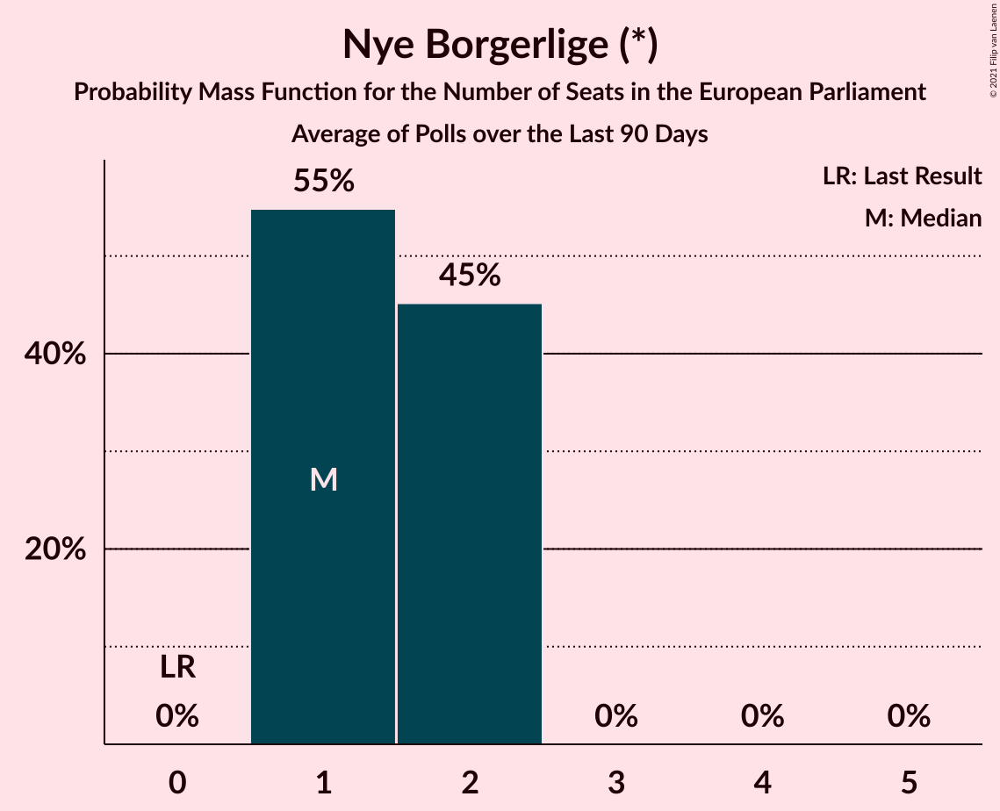

# Nye Borgerlige (*)

<a href="#voting-intentions">Voting Intentions</a> | <a href="#seats">Seats</a>

## Voting Intentions

Last result: **0.0%** (General Election of 26 May 2019)

### Confidence Intervals

| Period     | Polling firm/Commissioner(s) | Median | 80% Confidence Interval | 90% Confidence Interval | 95% Confidence Interval | 99% Confidence Interval |
|:----------:|:----------------:|:-----------:|:-----------------------:|:-----------------------:|:-----------------------:|:-----------------------:|
| N/A | [Poll Average](average.html) | 2.7% | 2.1–3.4% | 2.0–3.5% | 1.8–3.7% | 1.6–4.1% |
| [27 October–4 November 2019](2019-11-04-Voxmeter.html) | Voxmeter   Ritzau | 1.0% | N/A | N/A | N/A | N/A |
| [21–27 October 2019](2019-10-27-Voxmeter.html) | Voxmeter   Ritzau | 1.2% | N/A | N/A | N/A | N/A |
| [14–20 October 2019](2019-10-20-Voxmeter.html) | Voxmeter   Ritzau | 1.2% | 0.9–1.8% | 0.8–2.0% | 0.7–2.1% | 0.6–2.4% |
| [7–12 October 2019](2019-10-12-Voxmeter.html) | Voxmeter   Ritzau | 0.7% | 0.4–1.2% | 0.4–1.3% | 0.3–1.4% | 0.2–1.7% |
| [30 September–7 October 2019](2019-10-07-Voxmeter.html) | Voxmeter   2019-10-07 | 1.2% | 0.9–1.8% | 0.8–2.0% | 0.7–2.1% | 0.6–2.4% |
| [16–22 September 2019](2019-09-22-Voxmeter.html) | Voxmeter   Ritzau | 1.4% | 1.1–2.0% | 1.0–2.2% | 0.9–2.4% | 0.7–2.7% |
| [19 September 2019](2019-09-19-Norstat.html) | Norstat   Altinget and Jyllands-Posten | 2.5% | 2.0–3.3% | 1.8–3.5% | 1.7–3.7% | 1.5–4.1% |
| [9–14 September 2019](2019-09-14-Voxmeter.html) | Voxmeter   Ritzau | 1.0% | 0.7–1.5% | 0.6–1.6% | 0.5–1.8% | 0.4–2.0% |
| [2–9 September 2019](2019-09-09-Voxmeter.html) | Voxmeter   Ritzau | 1.2% | 0.9–1.8% | 0.8–2.0% | 0.7–2.1% | 0.6–2.4% |
| [26 August–1 September 2019](2019-09-01-Voxmeter.html) | Voxmeter   Ritzau | 1.9% | 1.5–2.6% | 1.3–2.8% | 1.2–2.9% | 1.1–3.3% |
| [18–25 August 2019](2019-08-25-Voxmeter.html) | Voxmeter   Ritzau | 1.6% | 1.2–2.3% | 1.1–2.5% | 1.0–2.6% | 0.9–3.0% |
| [12–18 August 2019](2019-08-18-Voxmeter.html) | Voxmeter   Ritzau | 1.3% | 1.0–1.9% | 0.9–2.1% | 0.8–2.2% | 0.6–2.5% |
| [5–10 August 2019](2019-08-10-Voxmeter.html) | Voxmeter   Ritzau | 0.8% | 0.5–1.3% | 0.5–1.4% | 0.4–1.6% | 0.3–1.8% |
| [8 August 2019](2019-08-08-Gallup.html) | Gallup | 2.8% | 2.3–3.4% | 2.2–3.6% | 2.1–3.8% | 1.9–4.1% |
| [24–30 June 2019](2019-06-30-Voxmeter.html) | Voxmeter   Ritzau | 2.5% | 2.0–3.3% | 1.9–3.5% | 1.7–3.7% | 1.5–4.0% |
| [17–23 June 2019](2019-06-23-Voxmeter.html) | Voxmeter   Ritzau | 2.2% | 1.7–2.9% | 1.6–3.1% | 1.5–3.3% | 1.3–3.7% |
| [10–15 June 2019](2019-06-15-Voxmeter.html) | Voxmeter   Ritzau | 2.8% | 2.2–3.6% | 2.1–3.8% | 1.9–4.0% | 1.7–4.4% |
| [31 May–4 June 2019](2019-06-04-YouGov.html) | YouGov | 4.7% | 4.0–5.7% | 3.8–6.0% | 3.6–6.2% | 3.3–6.7% |
| [4 June 2019](2019-06-04-Gallup.html) | Gallup | 2.6% | 2.3–2.9% | 2.3–3.0% | 2.2–3.1% | 2.1–3.3% |
| [4 June 2019](2019-06-04-Epinion.html) | Epinion   DR | 2.7% | 2.3–3.2% | 2.2–3.3% | 2.1–3.4% | 2.0–3.7% |
| [30 May–3 June 2019](2019-06-03-YouGov.html) | YouGov | 4.0% | 3.2–5.0% | 3.0–5.3% | 2.9–5.5% | 2.5–6.0% |
| [1–3 June 2019](2019-06-03-Voxmeter.html) | Voxmeter   Ritzau | 1.8% | 1.4–2.5% | 1.2–2.7% | 1.1–2.8% | 1.0–3.2% |
| [3 June 2019](2019-06-03-Norstat.html) | Norstat   Altinget and Jyllands-Posten | 4.1% | 3.4–4.9% | 3.2–5.1% | 3.1–5.3% | 2.8–5.8% |
| [3 June 2019](2019-06-03-GreensAnalyseinstitut.html) | Greens Analyseinstitut   Børsen | 3.3% | 2.7–4.1% | 2.5–4.3% | 2.4–4.5% | 2.1–4.9% |
| [29 May–2 June 2019](2019-06-02-YouGov.html) | YouGov | 4.1% | 3.3–5.2% | 3.1–5.5% | 2.9–5.8% | 2.6–6.3% |
| [31 May–2 June 2019](2019-06-02-Voxmeter.html) | Voxmeter   Ritzau | 2.1% | 1.6–2.8% | 1.5–3.0% | 1.4–3.2% | 1.2–3.6% |
| [28 May–1 June 2019](2019-06-01-YouGov.html) | YouGov | 4.3% | 3.5–5.3% | 3.3–5.6% | 3.1–5.8% | 2.8–6.3% |
| [30 May–1 June 2019](2019-06-01-Voxmeter.html) | Voxmeter   Ritzau | 2.5% | 2.0–3.2% | 1.8–3.5% | 1.7–3.7% | 1.5–4.0% |
| [29–31 May 2019](2019-05-31-Voxmeter.html) | Voxmeter   Ritzau | 2.5% | 2.0–3.2% | 1.8–3.5% | 1.7–3.7% | 1.5–4.1% |
| [26–30 May 2019](2019-05-30-YouGov.html) | YouGov | 3.5% | 2.8–4.4% | 2.7–4.6% | 2.5–4.8% | 2.2–5.3% |
| [28–30 May 2019](2019-05-30-Voxmeter.html) | Voxmeter   Ritzau | 2.2% | 1.7–2.9% | 1.6–3.1% | 1.4–3.3% | 1.2–3.7% |
| [28–30 May 2019](2019-05-30-Megafon.html) | Megafon   Politiken and TV 2 | 2.2% | 1.7–2.9% | 1.6–3.1% | 1.4–3.3% | 1.2–3.6% |
| [28–30 May 2019](2019-05-30-Epinion.html) | Epinion   DR | 3.1% | 2.6–3.7% | 2.5–3.9% | 2.4–4.0% | 2.1–4.3% |
| [25–29 May 2019](2019-05-29-YouGov.html) | YouGov | 4.3% | 3.6–5.2% | 3.4–5.5% | 3.2–5.7% | 2.9–6.2% |
| [27–29 May 2019](2019-05-29-Voxmeter.html) | Voxmeter   Ritzau | 1.7% | 1.3–2.3% | 1.1–2.5% | 1.1–2.7% | 0.9–3.0% |
| [24–28 May 2019](2019-05-28-YouGov.html) | YouGov | 3.9% | 3.2–4.8% | 3.0–5.1% | 2.8–5.3% | 2.5–5.8% |
| [26–28 May 2019](2019-05-28-Voxmeter.html) | Voxmeter   Ritzau | 1.4% | 1.0–2.0% | 0.9–2.2% | 0.8–2.3% | 0.7–2.6% |
| [28 May 2019](2019-05-28-Gallup.html) | Gallup | 2.9% | 2.4–3.6% | 2.3–3.7% | 2.2–3.9% | 2.0–4.2% |
| [25–27 May 2019](2019-05-27-Voxmeter.html) | Voxmeter   Ritzau | 1.5% | 1.1–2.1% | 1.0–2.3% | 0.9–2.5% | 0.7–2.8% |

### Probability Mass Function

The following table shows the probability mass function per percentage block of voting intentions for the [poll average](average.html) for Nye Borgerlige (*).

| Voting Intentions | Probability | Accumulated | Special Marks |
|:-----------------:|:-----------:|:-----------:|:-------------:|
| 0.0–0.5% | 0% | 100% | Last Result |
| 0.5–1.5% | 0.5% | 100% |  |
| 1.5–2.5% | 36% | 99.5% |  |
| 2.5–3.5% | 59% | 64% | Median |
| 3.5–4.5% | 5% | 5% |  |
| 4.5–5.5% | 0% | 0% |  |
| 5.5–6.5% | 0% | 0% |  |

## Seats

Last result: **0** seats (General Election of 26 May 2019)

### Confidence Intervals

| Period     | Polling firm/Commissioner(s) | Median | 80% Confidence Interval | 90% Confidence Interval | 95% Confidence Interval | 99% Confidence Interval |
|:----------:|:----------------:|:------:|:-----------------------:|:-----------------------:|:-----------------------:|:-----------------------:|
| N/A | [Poll Average](average.html) | 0 | 0 | 0 | 0 | 0 |
| [27 October–4 November 2019](2019-11-04-Voxmeter.html) | Voxmeter   Ritzau |  |  |  |  |  |
| [21–27 October 2019](2019-10-27-Voxmeter.html) | Voxmeter   Ritzau |  |  |  |  |  |
| [14–20 October 2019](2019-10-20-Voxmeter.html) | Voxmeter   Ritzau | 0 | 0 | 0 | 0 | 0 |
| [7–12 October 2019](2019-10-12-Voxmeter.html) | Voxmeter   Ritzau | 0 | 0 | 0 | 0 | 0 |
| [30 September–7 October 2019](2019-10-07-Voxmeter.html) | Voxmeter   2019-10-07 | 0 | 0 | 0 | 0 | 0 |
| [16–22 September 2019](2019-09-22-Voxmeter.html) | Voxmeter   Ritzau | 0 | 0 | 0 | 0 | 0 |
| [19 September 2019](2019-09-19-Norstat.html) | Norstat   Altinget and Jyllands-Posten | 0 | 0 | 0 | 0 | 0 |
| [9–14 September 2019](2019-09-14-Voxmeter.html) | Voxmeter   Ritzau | 0 | 0 | 0 | 0 | 0 |
| [2–9 September 2019](2019-09-09-Voxmeter.html) | Voxmeter   Ritzau | 0 | 0 | 0 | 0 | 0 |
| [26 August–1 September 2019](2019-09-01-Voxmeter.html) | Voxmeter   Ritzau | 0 | 0 | 0 | 0 | 0 |
| [18–25 August 2019](2019-08-25-Voxmeter.html) | Voxmeter   Ritzau | 0 | 0 | 0 | 0 | 0 |
| [12–18 August 2019](2019-08-18-Voxmeter.html) | Voxmeter   Ritzau | 0 | 0 | 0 | 0 | 0 |
| [5–10 August 2019](2019-08-10-Voxmeter.html) | Voxmeter   Ritzau | 0 | 0 | 0 | 0 | 0 |
| [8 August 2019](2019-08-08-Gallup.html) | Gallup | 0 | 0 | 0 | 0 | 0 |
| [24–30 June 2019](2019-06-30-Voxmeter.html) | Voxmeter   Ritzau | 0 | 0 | 0 | 0 | 0 |
| [17–23 June 2019](2019-06-23-Voxmeter.html) | Voxmeter   Ritzau | 0 | 0 | 0 | 0 | 0 |
| [10–15 June 2019](2019-06-15-Voxmeter.html) | Voxmeter   Ritzau | 0 | 0 | 0 | 0 | 0 |
| [31 May–4 June 2019](2019-06-04-YouGov.html) | YouGov | 0 | 0–1 | 0–1 | 0–1 | 0–1 |
| [4 June 2019](2019-06-04-Gallup.html) | Gallup | 0 | 0 | 0 | 0 | 0 |
| [4 June 2019](2019-06-04-Epinion.html) | Epinion   DR | 0 | 0 | 0 | 0 | 0 |
| [30 May–3 June 2019](2019-06-03-YouGov.html) | YouGov | 0 | 0 | 0 | 0–1 | 0–1 |
| [1–3 June 2019](2019-06-03-Voxmeter.html) | Voxmeter   Ritzau | 0 | 0 | 0 | 0 | 0 |
| [3 June 2019](2019-06-03-Norstat.html) | Norstat   Altinget and Jyllands-Posten | 0 | 0 | 0 | 0–1 | 0–1 |
| [3 June 2019](2019-06-03-GreensAnalyseinstitut.html) | Greens Analyseinstitut   Børsen | 0 | 0 | 0 | 0 | 0–1 |
| [29 May–2 June 2019](2019-06-02-YouGov.html) | YouGov | 0 | 0 | 0 | 0 | 0–1 |
| [31 May–2 June 2019](2019-06-02-Voxmeter.html) | Voxmeter   Ritzau | 0 | 0 | 0 | 0 | 0 |
| [28 May–1 June 2019](2019-06-01-YouGov.html) | YouGov | 0 | 0–1 | 0–1 | 0–1 | 0–1 |
| [30 May–1 June 2019](2019-06-01-Voxmeter.html) | Voxmeter   Ritzau | 0 | 0 | 0 | 0 | 0 |
| [29–31 May 2019](2019-05-31-Voxmeter.html) | Voxmeter   Ritzau | 0 | 0 | 0 | 0 | 0 |
| [26–30 May 2019](2019-05-30-YouGov.html) | YouGov | 0 | 0 | 0 | 0 | 0 |
| [28–30 May 2019](2019-05-30-Voxmeter.html) | Voxmeter   Ritzau | 0 | 0 | 0 | 0 | 0 |
| [28–30 May 2019](2019-05-30-Megafon.html) | Megafon   Politiken and TV 2 | 0 | 0 | 0 | 0 | 0 |
| [28–30 May 2019](2019-05-30-Epinion.html) | Epinion   DR | 0 | 0 | 0 | 0 | 0 |
| [25–29 May 2019](2019-05-29-YouGov.html) | YouGov | 0 | 0–1 | 0–1 | 0–1 | 0–1 |
| [27–29 May 2019](2019-05-29-Voxmeter.html) | Voxmeter   Ritzau | 0 | 0 | 0 | 0 | 0 |
| [24–28 May 2019](2019-05-28-YouGov.html) | YouGov | 0 | 0 | 0 | 0 | 0–1 |
| [26–28 May 2019](2019-05-28-Voxmeter.html) | Voxmeter   Ritzau | 0 | 0 | 0 | 0 | 0 |
| [28 May 2019](2019-05-28-Gallup.html) | Gallup | 0 | 0 | 0 | 0 | 0 |
| [25–27 May 2019](2019-05-27-Voxmeter.html) | Voxmeter   Ritzau | 0 | 0 | 0 | 0 | 0 |

### Probability Mass Function

The following table shows the probability mass function per seat for the [poll average](average.html) for Nye Borgerlige (*).

| Number of Seats | Probability | Accumulated | Special Marks |
|:---------------:|:-----------:|:-----------:|:-------------:|
| 0 | 100% | 100% | Last Result, Median |

