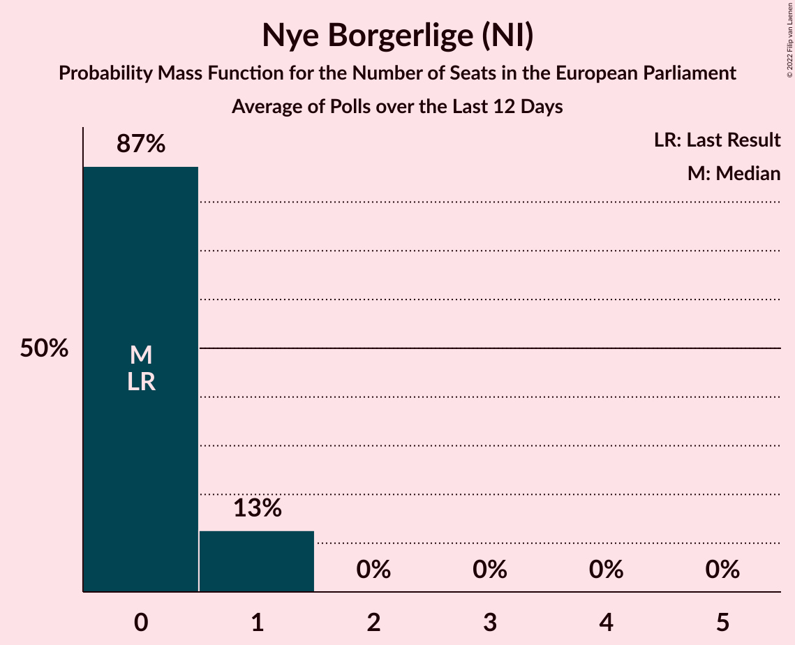

# Nye Borgerlige (NI)

<a href="#voting-intentions">Voting Intentions</a> | <a href="#seats">Seats</a>

## Voting Intentions

Last result: **0.0%** (General Election of 9 June 2024)

### Confidence Intervals

| Period     | Polling firm/Commissioner(s) | Median | 80% Confidence Interval | 90% Confidence Interval | 95% Confidence Interval | 99% Confidence Interval |
|:----------:|:----------------:|:-----------:|:-----------------------:|:-----------------------:|:-----------------------:|:-----------------------:|
| N/A | [Poll Average](average.html) | 0.5% | 0.3–0.8% | 0.3–0.9% | 0.2–1.0% | 0.2–1.2% |
| [18–24 November 2024](2024-11-24-Voxmeter.html) | Voxmeter | 0.0% | N/A | N/A | N/A | N/A |
| [11–17 November 2024](2024-11-17-Voxmeter.html) | Voxmeter | 0.0% | N/A | N/A | N/A | N/A |
| [4–10 November 2024](2024-11-10-Voxmeter.html) | Voxmeter | 0.0% | N/A | N/A | N/A | N/A |
| [30 October–6 November 2024](2024-11-06-Epinion.html) | Epinion   DR | 0.0% | N/A | N/A | N/A | N/A |
| [28 October–3 November 2024](2024-11-03-Voxmeter.html) | Voxmeter | 0.0% | N/A | N/A | N/A | N/A |
| [21–27 October 2024](2024-10-27-Voxmeter.html) | Voxmeter | 0.0% | N/A | N/A | N/A | N/A |
| [14–21 October 2024](2024-10-21-Voxmeter.html) | Voxmeter | 0.0% | N/A | N/A | N/A | N/A |
| [7–13 October 2024](2024-10-13-Voxmeter.html) | Voxmeter | 0.0% | N/A | N/A | N/A | N/A |
| [23–30 September 2024](2024-09-30-Voxmeter.html) | Voxmeter | 0.0% | N/A | N/A | N/A | N/A |
| [20–27 September 2024](2024-09-27-Epinion.html) | Epinion   DR | 0.0% | N/A | N/A | N/A | N/A |
| [16–22 September 2024](2024-09-22-Voxmeter.html) | Voxmeter | 0.0% | N/A | N/A | N/A | N/A |
| [9–15 September 2024](2024-09-15-Voxmeter.html) | Voxmeter | 0.0% | N/A | N/A | N/A | N/A |
| [4–10 September 2024](2024-09-10-Verian.html) | Verian   Berlingske | 0.5% | 0.3–0.8% | 0.3–0.9% | 0.2–1.0% | 0.2–1.2% |
| [2–8 September 2024](2024-09-08-Voxmeter.html) | Voxmeter | 0.0% | N/A | N/A | N/A | N/A |
| [26 August–1 September 2024](2024-09-01-Voxmeter.html) | Voxmeter | 0.0% | N/A | N/A | N/A | N/A |
| [19–25 August 2024](2024-08-25-Voxmeter.html) | Voxmeter | 0.0% | N/A | N/A | N/A | N/A |
| [12–18 August 2024](2024-08-18-Voxmeter.html) | Voxmeter | 0.0% | N/A | N/A | N/A | N/A |
| [7–14 August 2024](2024-08-14-Epinion.html) | Epinion   DR | 0.0% | N/A | N/A | N/A | N/A |
| [5–11 August 2024](2024-08-11-Voxmeter.html) | Voxmeter | 0.0% | N/A | N/A | N/A | N/A |
| [17–23 June 2024](2024-06-23-Voxmeter.html) | Voxmeter | 0.0% | N/A | N/A | N/A | N/A |
| [10–16 June 2024](2024-06-16-Voxmeter.html) | Voxmeter | 0.0% | N/A | N/A | N/A | N/A |
| [10–12 June 2024](2024-06-12-Verian.html) | Verian   Berlingske | 0.4% | 0.2–0.7% | 0.2–0.8% | 0.2–0.9% | 0.1–1.1% |

### Probability Mass Function

The following table shows the probability mass function per percentage block of voting intentions for the [poll average](average.html) for Nye Borgerlige (NI).

| Voting Intentions | Probability | Accumulated | Special Marks |
|:-----------------:|:-----------:|:-----------:|:-------------:|
| 0.0–0.5% | 56% | 100% | Last Result |
| 0.5–1.5% | 44% | 44% | Median |
| 1.5–2.5% | 0% | 0% |  |

## Seats

Last result: **0** seats (General Election of 9 June 2024)

### Confidence Intervals

| Period     | Polling firm/Commissioner(s) | Median | 80% Confidence Interval | 90% Confidence Interval | 95% Confidence Interval | 99% Confidence Interval |
|:----------:|:----------------:|:------:|:-----------------------:|:-----------------------:|:-----------------------:|:-----------------------:|
| N/A | [Poll Average](average.html) | 0 | 0 | 0 | 0 | 0 |
| [18–24 November 2024](2024-11-24-Voxmeter.html) | Voxmeter |  |  |  |  |  |
| [11–17 November 2024](2024-11-17-Voxmeter.html) | Voxmeter |  |  |  |  |  |
| [4–10 November 2024](2024-11-10-Voxmeter.html) | Voxmeter |  |  |  |  |  |
| [30 October–6 November 2024](2024-11-06-Epinion.html) | Epinion   DR |  |  |  |  |  |
| [28 October–3 November 2024](2024-11-03-Voxmeter.html) | Voxmeter |  |  |  |  |  |
| [21–27 October 2024](2024-10-27-Voxmeter.html) | Voxmeter |  |  |  |  |  |
| [14–21 October 2024](2024-10-21-Voxmeter.html) | Voxmeter |  |  |  |  |  |
| [7–13 October 2024](2024-10-13-Voxmeter.html) | Voxmeter |  |  |  |  |  |
| [23–30 September 2024](2024-09-30-Voxmeter.html) | Voxmeter |  |  |  |  |  |
| [20–27 September 2024](2024-09-27-Epinion.html) | Epinion   DR |  |  |  |  |  |
| [16–22 September 2024](2024-09-22-Voxmeter.html) | Voxmeter |  |  |  |  |  |
| [9–15 September 2024](2024-09-15-Voxmeter.html) | Voxmeter |  |  |  |  |  |
| [4–10 September 2024](2024-09-10-Verian.html) | Verian   Berlingske | 0 | 0 | 0 | 0 | 0 |
| [2–8 September 2024](2024-09-08-Voxmeter.html) | Voxmeter |  |  |  |  |  |
| [26 August–1 September 2024](2024-09-01-Voxmeter.html) | Voxmeter |  |  |  |  |  |
| [19–25 August 2024](2024-08-25-Voxmeter.html) | Voxmeter |  |  |  |  |  |
| [12–18 August 2024](2024-08-18-Voxmeter.html) | Voxmeter |  |  |  |  |  |
| [7–14 August 2024](2024-08-14-Epinion.html) | Epinion   DR |  |  |  |  |  |
| [5–11 August 2024](2024-08-11-Voxmeter.html) | Voxmeter |  |  |  |  |  |
| [17–23 June 2024](2024-06-23-Voxmeter.html) | Voxmeter |  |  |  |  |  |
| [10–16 June 2024](2024-06-16-Voxmeter.html) | Voxmeter |  |  |  |  |  |
| [10–12 June 2024](2024-06-12-Verian.html) | Verian   Berlingske | 0 | 0 | 0 | 0 | 0 |

### Probability Mass Function

The following table shows the probability mass function per seat for the [poll average](average.html) for Nye Borgerlige (NI).

| Number of Seats | Probability | Accumulated | Special Marks |
|:---------------:|:-----------:|:-----------:|:-------------:|
| 0 | 100% | 100% | Last Result, Median |

