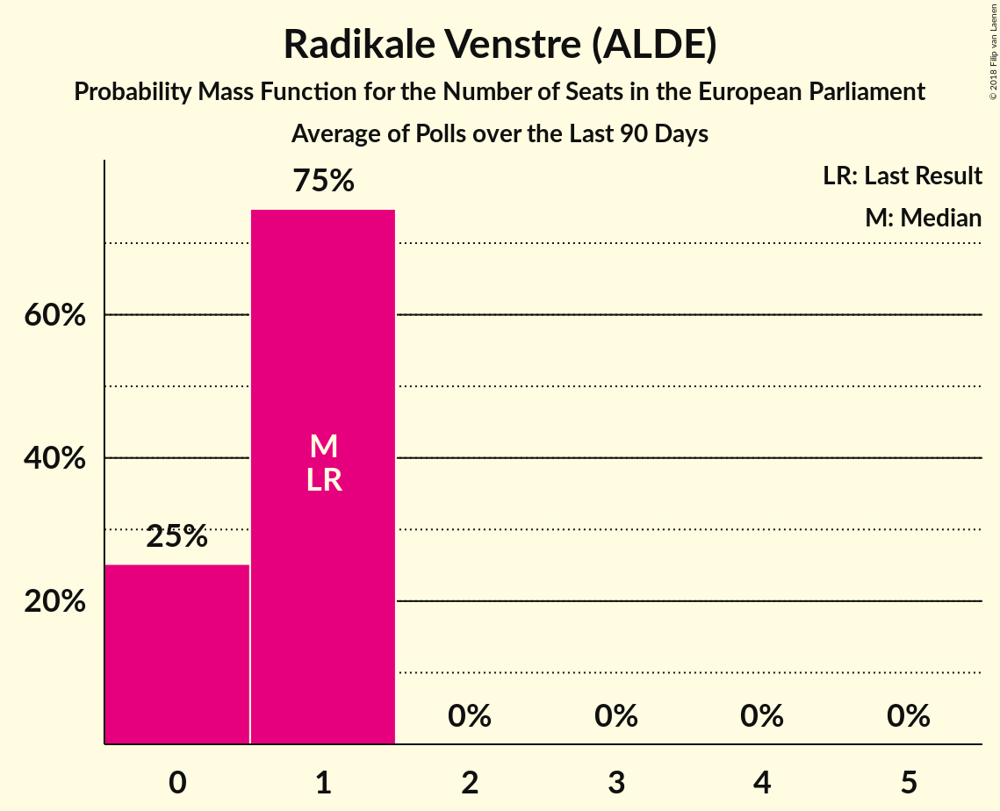

# Radikale Venstre (ALDE)

<a href="#voting-intentions">Voting Intentions</a> | <a href="#seats">Seats</a>

## Voting Intentions

Last result: **6.5%** (General Election of 25 May 2014)

### Confidence Intervals

| Period     | Polling firm/Commissioner(s) | Median | 80% Confidence Interval | 90% Confidence Interval | 95% Confidence Interval | 99% Confidence Interval |
|:----------:|:----------------:|:-----------:|:-----------------------:|:-----------------------:|:-----------------------:|:-----------------------:|
| N/A | [Poll Average](average.html) | 5.6% | 4.4–6.7% | 4.1–7.0% | 3.9–7.3% | 3.5–7.7% |
| [18–24 June 2018](2018-06-24-Voxmeter.html) | Voxmeter   Ritzau | 5.7% | 4.9–6.8% | 4.6–7.1% | 4.5–7.3% | 4.1–7.8% |
| [15–23 June 2018](2018-06-23-Epinion.html) | Epinion   DR | 6.2% | 5.5–7.0% | 5.3–7.3% | 5.1–7.5% | 4.8–7.9% |
| [11–16 June 2018](2018-06-16-Voxmeter.html) | Voxmeter   Ritzau | 6.1% | 5.3–7.2% | 5.0–7.5% | 4.8–7.8% | 4.4–8.3% |
| [4–10 June 2018](2018-06-10-Voxmeter.html) | Voxmeter   Ritzau | 6.3% | 5.4–7.4% | 5.2–7.7% | 5.0–8.0% | 4.6–8.5% |
| [28 May–3 June 2018](2018-06-03-Voxmeter.html) | Voxmeter   Ritzau | 6.3% | 5.4–7.4% | 5.2–7.7% | 5.0–8.0% | 4.6–8.5% |
| [21–27 May 2018](2018-05-27-Voxmeter.html) | Voxmeter   Ritzau | 5.3% | 4.5–6.3% | 4.3–6.6% | 4.1–6.8% | 3.7–7.3% |
| [17–23 May 2018](2018-05-23-Norstat.html) | Norstat   Altinget | 4.7% | 4.0–5.6% | 3.8–5.8% | 3.6–6.1% | 3.3–6.5% |
| [14–19 May 2018](2018-05-19-Voxmeter.html) | Voxmeter   Ritzau | 6.0% | 5.2–7.1% | 4.9–7.4% | 4.7–7.6% | 4.3–8.2% |
| [7–13 May 2018](2018-05-13-Voxmeter.html) | Voxmeter   Ritzau | 5.4% | 4.6–6.4% | 4.4–6.7% | 4.2–6.9% | 3.8–7.5% |
| [30 April–6 May 2018](2018-05-06-Voxmeter.html) | Voxmeter   Ritzau | 5.4% | 4.6–6.4% | 4.3–6.7% | 4.1–7.0% | 3.8–7.5% |
| [23–29 April 2018](2018-04-29-Voxmeter.html) | Voxmeter   Ritzau | 4.6% | 3.9–5.6% | 3.7–5.9% | 3.5–6.1% | 3.2–6.6% |
| [16–22 April 2018](2018-04-22-Voxmeter.html) | Voxmeter   Ritzau | 5.2% | 4.4–6.2% | 4.2–6.5% | 4.0–6.7% | 3.6–7.2% |
| [8–15 April 2018](2018-04-15-Voxmeter.html) | Voxmeter   Ritzau | 5.2% | 4.4–6.2% | 4.2–6.5% | 4.0–6.7% | 3.6–7.2% |
| [2–7 April 2018](2018-04-07-Voxmeter.html) | Voxmeter   Ritzau | 5.6% | 4.8–6.7% | 4.6–7.0% | 4.4–7.2% | 4.0–7.7% |
| [26–31 March 2018](2018-03-31-Voxmeter.html) | Voxmeter   Ritzau | 5.6% | 4.8–6.6% | 4.6–6.9% | 4.4–7.2% | 4.0–7.7% |
| [19–25 March 2018](2018-03-25-Voxmeter.html) | Voxmeter   Ritzau | 4.9% | 4.1–5.9% | 3.9–6.2% | 3.7–6.4% | 3.4–6.9% |
| [14–20 March 2018](2018-03-20-Norstat.html) | Norstat   Altinget | 5.7% | 5.0–6.6% | 4.8–6.8% | 4.7–7.0% | 4.3–7.5% |
| [14–20 March 2018](2018-03-20-Epinion.html) | Epinion   DR | 4.8% | 4.2–5.6% | 4.0–5.8% | 3.9–6.0% | 3.6–6.3% |
| [12–18 March 2018](2018-03-18-Voxmeter.html) | Voxmeter   Ritzau | 4.4% | 3.7–5.3% | 3.5–5.6% | 3.3–5.8% | 3.0–6.3% |
| [5–11 March 2018](2018-03-11-Voxmeter.html) | Voxmeter   Ritzau | 4.9% | 4.1–5.9% | 3.9–6.1% | 3.7–6.4% | 3.4–6.9% |
| [19–25 February 2018](2018-02-25-Voxmeter.html) | Voxmeter   Ritzau | 4.5% | 3.8–5.5% | 3.6–5.7% | 3.4–6.0% | 3.1–6.5% |
| [19–22 February 2018](2018-02-22-Megafon.html) | Megafon   Politiken and TV 2 | 6.9% | 6.0–8.1% | 5.7–8.4% | 5.5–8.7% | 5.1–9.2% |
| [12–18 February 2018](2018-02-18-Voxmeter.html) | Voxmeter   Ritzau | 5.0% | 4.2–6.0% | 4.0–6.2% | 3.8–6.5% | 3.5–7.0% |
| [8–14 February 2018](2018-02-14-Epinion.html) | Epinion   DR | 5.1% | 4.4–5.9% | 4.3–6.1% | 4.1–6.3% | 3.8–6.7% |
| [5–10 February 2018](2018-02-10-Voxmeter.html) | Voxmeter   Ritzau | 5.1% | 4.3–6.1% | 4.1–6.4% | 3.9–6.6% | 3.6–7.1% |
| [2–8 February 2018](2018-02-08-KantarGallup.html) | Kantar Gallup   Berlingske | 5.2% | 4.5–6.0% | 4.3–6.2% | 4.2–6.4% | 3.9–6.9% |
| [2–8 February 2018](2018-02-08-GreensAnalyseinstitut.html) | Greens Analyseinstitut   Børsen | 5.1% | 4.3–6.1% | 4.1–6.3% | 3.9–6.6% | 3.6–7.0% |

### Probability Mass Function

The following table shows the probability mass function per percentage block of voting intentions for the [poll average](average.html) for Radikale Venstre (ALDE).

| Voting Intentions | Probability | Accumulated | Special Marks |
|:-----------------:|:-----------:|:-----------:|:-------------:|
| 1.5–2.5% | 0% | 100% |  |
| 2.5–3.5% | 0.5% | 100% |  |
| 3.5–4.5% | 13% | 99.5% |  |
| 4.5–5.5% | 33% | 87% |  |
| 5.5–6.5% | 39% | 54% | Median |
| 6.5–7.5% | 14% | 15% | Last Result |
| 7.5–8.5% | 1.0% | 1.0% |  |
| 8.5–9.5% | 0% | 0% |  |

## Seats

Last result: **1** seats (General Election of 25 May 2014)

### Confidence Intervals

| Period     | Polling firm/Commissioner(s) | Median | 80% Confidence Interval | 90% Confidence Interval | 95% Confidence Interval | 99% Confidence Interval |
|:----------:|:----------------:|:------:|:-----------------------:|:-----------------------:|:-----------------------:|:-----------------------:|
| N/A | [Poll Average](average.html) | 1 | 0–1 | 0–1 | 0–1 | 0–1 |
| [18–24 June 2018](2018-06-24-Voxmeter.html) | Voxmeter   Ritzau | 1 | 0–1 | 0–1 | 0–1 | 0–1 |
| [15–23 June 2018](2018-06-23-Epinion.html) | Epinion   DR | 1 | 1 | 1 | 1 | 0–1 |
| [11–16 June 2018](2018-06-16-Voxmeter.html) | Voxmeter   Ritzau | 1 | 1 | 1 | 0–1 | 0–1 |
| [4–10 June 2018](2018-06-10-Voxmeter.html) | Voxmeter   Ritzau | 1 | 1 | 0–1 | 0–1 | 0–1 |
| [28 May–3 June 2018](2018-06-03-Voxmeter.html) | Voxmeter   Ritzau | 1 | 1 | 1 | 0–1 | 0–1 |
| [21–27 May 2018](2018-05-27-Voxmeter.html) | Voxmeter   Ritzau | 1 | 0–1 | 0–1 | 0–1 | 0–1 |
| [17–23 May 2018](2018-05-23-Norstat.html) | Norstat   Altinget | 0 | 0–1 | 0–1 | 0–1 | 0–1 |
| [14–19 May 2018](2018-05-19-Voxmeter.html) | Voxmeter   Ritzau | 1 | 1 | 0–1 | 0–1 | 0–1 |
| [7–13 May 2018](2018-05-13-Voxmeter.html) | Voxmeter   Ritzau | 0 | 0–1 | 0–1 | 0–1 | 0–1 |
| [30 April–6 May 2018](2018-05-06-Voxmeter.html) | Voxmeter   Ritzau | 1 | 0–1 | 0–1 | 0–1 | 0–1 |
| [23–29 April 2018](2018-04-29-Voxmeter.html) | Voxmeter   Ritzau | 0 | 0–1 | 0–1 | 0–1 | 0–1 |
| [16–22 April 2018](2018-04-22-Voxmeter.html) | Voxmeter   Ritzau | 1 | 0–1 | 0–1 | 0–1 | 0–1 |
| [8–15 April 2018](2018-04-15-Voxmeter.html) | Voxmeter   Ritzau | 0 | 0–1 | 0–1 | 0–1 | 0–1 |
| [2–7 April 2018](2018-04-07-Voxmeter.html) | Voxmeter   Ritzau | 1 | 0–1 | 0–1 | 0–1 | 0–1 |
| [26–31 March 2018](2018-03-31-Voxmeter.html) | Voxmeter   Ritzau | 1 | 1 | 0–1 | 0–1 | 0–1 |
| [19–25 March 2018](2018-03-25-Voxmeter.html) | Voxmeter   Ritzau | 0 | 0–1 | 0–1 | 0–1 | 0–1 |
| [14–20 March 2018](2018-03-20-Norstat.html) | Norstat   Altinget | 1 | 1 | 0–1 | 0–1 | 0–1 |
| [14–20 March 2018](2018-03-20-Epinion.html) | Epinion   DR | 1 | 0–1 | 0–1 | 0–1 | 0–1 |
| [12–18 March 2018](2018-03-18-Voxmeter.html) | Voxmeter   Ritzau | 0 | 0 | 0 | 0–1 | 0–1 |
| [5–11 March 2018](2018-03-11-Voxmeter.html) | Voxmeter   Ritzau | 0 | 0–1 | 0–1 | 0–1 | 0–1 |
| [19–25 February 2018](2018-02-25-Voxmeter.html) | Voxmeter   Ritzau | 0 | 0 | 0 | 0–1 | 0–1 |
| [19–22 February 2018](2018-02-22-Megafon.html) | Megafon   Politiken and TV 2 | 1 | 1 | 1 | 0–1 | 0–1 |
| [12–18 February 2018](2018-02-18-Voxmeter.html) | Voxmeter   Ritzau | 1 | 0–1 | 0–1 | 0–1 | 0–1 |
| [8–14 February 2018](2018-02-14-Epinion.html) | Epinion   DR | 0 | 0–1 | 0–1 | 0–1 | 0–1 |
| [5–10 February 2018](2018-02-10-Voxmeter.html) | Voxmeter   Ritzau | 0 | 0–1 | 0–1 | 0–1 | 0–1 |
| [2–8 February 2018](2018-02-08-KantarGallup.html) | Kantar Gallup   Berlingske | 1 | 0–1 | 0–1 | 0–1 | 0–1 |
| [2–8 February 2018](2018-02-08-GreensAnalyseinstitut.html) | Greens Analyseinstitut   Børsen | 0 | 0–1 | 0–1 | 0–1 | 0–1 |

### Probability Mass Function

The following table shows the probability mass function per seat for the [poll average](average.html) for Radikale Venstre (ALDE).

| Number of Seats | Probability | Accumulated | Special Marks |
|:---------------:|:-----------:|:-----------:|:-------------:|
| 0 | 33% | 100% |  |
| 1 | 67% | 67% | Last Result, Median |
| 2 | 0% | 0% |  |

