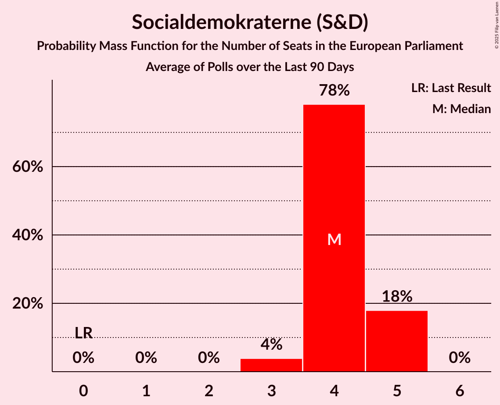

# Socialdemokraterne (S&D)

<a href="#voting-intentions">Voting Intentions</a> | <a href="#seats">Seats</a>

## Voting Intentions

Last result: **0.0%** (General Election of 9 June 2024)

### Confidence Intervals

| Period     | Polling firm/Commissioner(s) | Median | 80% Confidence Interval | 90% Confidence Interval | 95% Confidence Interval | 99% Confidence Interval |
|:----------:|:----------------:|:-----------:|:-----------------------:|:-----------------------:|:-----------------------:|:-----------------------:|
| N/A | [Poll Average](average.html) | 19.5% | 17.0–23.4% | 16.5–23.9% | 16.2–24.3% | 15.6–25.0% |
| [24–30 November 2025](2025-11-30-Voxmeter.html) | Voxmeter   Ritzau | 19.4% | 17.8–21.0% | 17.4–21.5% | 17.0–21.9% | 16.3–22.8% |
| [19–25 November 2025](2025-11-25-Epinion.html) | Epinion   Altinget and DR | 17.5% | 16.3–18.7% | 16.0–19.1% | 15.8–19.4% | 15.2–20.0% |
| [17–23 November 2025](2025-11-23-Voxmeter.html) | Voxmeter   Ritzau | 19.3% | 17.8–21.0% | 17.4–21.5% | 17.0–21.9% | 16.3–22.7% |
| [10–16 November 2025](2025-11-16-Voxmeter.html) | Voxmeter   Ritzau | 19.9% | 18.4–21.6% | 17.9–22.1% | 17.5–22.5% | 16.8–23.3% |
| [3–9 November 2025](2025-11-09-Voxmeter.html) | Voxmeter   Ritzau | 21.1% | 19.5–22.8% | 19.1–23.3% | 18.7–23.7% | 17.9–24.6% |
| [29 October–4 November 2025](2025-11-04-Verian.html) | Verian   Berlingske | 22.8% | 21.6–24.1% | 21.2–24.5% | 20.9–24.8% | 20.3–25.5% |
| [27 October–2 November 2025](2025-11-02-Voxmeter.html) | Voxmeter   Ritzau | 21.1% | 19.5–22.8% | 19.1–23.3% | 18.7–23.7% | 17.9–24.6% |
| [20–26 October 2025](2025-10-26-Voxmeter.html) | Voxmeter   Ritzau | 21.2% | 19.6–22.9% | 19.1–23.4% | 18.7–23.8% | 18.0–24.6% |
| [13–19 October 2025](2025-10-19-Voxmeter.html) | Voxmeter   Ritzau | 20.0% | 18.4–21.7% | 18.0–22.1% | 17.6–22.6% | 16.9–23.4% |
| [6–12 October 2025](2025-10-12-Voxmeter.html) | Voxmeter   Ritzau | 20.3% | 18.8–22.0% | 18.3–22.5% | 17.9–22.9% | 17.2–23.8% |
| [23 September–5 October 2025](2025-10-05-Voxmeter.html) | Voxmeter   Ritzau | 19.2% | 17.7–20.9% | 17.3–21.3% | 16.9–21.7% | 16.2–22.5% |
| [26 September–2 October 2025](2025-10-02-Epinion.html) | Epinion   Altinget and DR | 20.9% | 19.6–22.2% | 19.3–22.6% | 19.0–22.9% | 18.4–23.6% |
| [24–30 September 2025](2025-09-30-Verian.html) | Verian   Berlingske | 22.1% | 20.8–23.5% | 20.5–23.9% | 20.1–24.2% | 19.6–24.8% |
| [22–28 September 2025](2025-09-28-Voxmeter.html) | Voxmeter   Ritzau | 20.4% | 18.8–22.1% | 18.4–22.6% | 18.0–23.0% | 17.3–23.8% |
| [15–21 September 2025](2025-09-21-Voxmeter.html) | Voxmeter   Ritzau | 21.7% | 20.1–23.4% | 19.6–23.9% | 19.3–24.3% | 18.5–25.2% |
| [8–14 September 2025](2025-09-14-Voxmeter.html) | Voxmeter   Ritzau | 22.0% | 20.4–23.7% | 19.9–24.2% | 19.5–24.6% | 18.8–25.5% |
| [1–7 September 2025](2025-09-07-Voxmeter.html) | Voxmeter   Ritzau | 21.4% | 19.8–23.1% | 19.4–23.6% | 19.0–24.1% | 18.2–24.9% |
| [25–31 August 2025](2025-08-31-Voxmeter.html) | Voxmeter   Ritzau | 19.5% | 17.9–21.2% | 17.5–21.6% | 17.1–22.1% | 16.4–22.9% |
| [18–24 August 2025](2025-08-24-Voxmeter.html) | Voxmeter   Ritzau | 20.3% | 18.8–22.0% | 18.3–22.5% | 17.9–22.9% | 17.2–23.8% |
| [13–20 August 2025](2025-08-20-Epinion.html) | Epinion   Altinget and DR | 19.5% | 18.3–20.9% | 17.9–21.2% | 17.6–21.6% | 17.0–22.2% |
| [11–17 August 2025](2025-08-17-Voxmeter.html) | Voxmeter   Ritzau | 21.6% | 20.0–23.3% | 19.6–23.8% | 19.2–24.2% | 18.5–25.0% |
| [23–29 June 2025](2025-06-29-Voxmeter.html) | Voxmeter | 22.4% | 20.7–24.1% | 20.3–24.6% | 19.9–25.0% | 19.1–25.9% |
| [16–22 June 2025](2025-06-22-Voxmeter.html) | Voxmeter | 21.6% | 20.0–23.3% | 19.6–23.8% | 19.2–24.2% | 18.5–25.0% |
| [9–15 June 2025](2025-06-15-Voxmeter.html) | Voxmeter | 22.7% | 21.1–24.5% | 20.7–25.0% | 20.3–25.4% | 19.5–26.3% |
| [2–8 June 2025](2025-06-08-Voxmeter.html) | Voxmeter | 23.8% | N/A | N/A | N/A | N/A |
| [26 May–2 June 2025](2025-06-02-Epinion.html) | Epinion   Altinget and DR | 21.1% | 19.8–22.5% | 19.5–22.9% | 19.2–23.2% | 18.6–23.9% |
| [25 May–1 June 2025](2025-06-01-Voxmeter.html) | Voxmeter | 22.8% | 21.2–24.6% | 20.7–25.1% | 20.3–25.5% | 19.6–26.4% |
| [19–25 May 2025](2025-05-25-Voxmeter.html) | Voxmeter | 23.8% | 22.2–25.6% | 21.7–26.1% | 21.3–26.6% | 20.5–27.5% |
| [12–18 May 2025](2025-05-18-Voxmeter.html) | Voxmeter | 24.0% | 22.3–25.8% | 21.8–26.3% | 21.4–26.7% | 20.7–27.6% |
| [5–11 May 2025](2025-05-11-Voxmeter.html) | Voxmeter | 23.4% | 21.8–25.2% | 21.3–25.7% | 20.9–26.2% | 20.1–27.0% |
| [9 May 2025](2025-05-09-Verian.html) | Verian   Berlingske | 22.9% | 21.6–24.2% | 21.3–24.6% | 21.0–24.9% | 20.4–25.6% |
| [28 April–4 May 2025](2025-05-04-Voxmeter.html) | Voxmeter | 22.9% | 21.3–24.7% | 20.8–25.2% | 20.4–25.6% | 19.7–26.5% |
| [22–29 April 2025](2025-04-29-Epinion.html) | Epinion   Altinget and DR | 22.9% | 21.6–24.4% | 21.2–24.8% | 20.9–25.1% | 20.2–25.8% |
| [21–27 April 2025](2025-04-27-Voxmeter.html) | Voxmeter | 22.4% | 20.8–24.1% | 20.3–24.6% | 19.9–25.1% | 19.2–25.9% |
| [14–20 April 2025](2025-04-20-Voxmeter.html) | Voxmeter | 23.5% | 21.8–25.2% | 21.3–25.7% | 20.9–26.2% | 20.1–27.1% |
| [7–13 April 2025](2025-04-13-Voxmeter.html) | Voxmeter | 22.6% | 21.0–24.4% | 20.5–24.9% | 20.2–25.3% | 19.4–26.2% |
| [31 March–6 April 2025](2025-04-06-Voxmeter.html) | Voxmeter | 22.8% | 21.2–24.6% | 20.7–25.1% | 20.3–25.5% | 19.6–26.4% |
| [26 March–1 April 2025](2025-04-01-Verian.html) | Verian   Berlingske | 22.5% | 21.2–23.9% | 20.8–24.2% | 20.5–24.6% | 19.9–25.2% |
| [24–30 March 2025](2025-03-30-Voxmeter.html) | Voxmeter | 22.6% | 21.0–24.3% | 20.6–24.8% | 20.2–25.2% | 19.4–26.0% |
| [19–26 March 2025](2025-03-26-Epinion.html) | Epinion   Altinget and DR | 23.2% | 21.9–24.6% | 21.5–24.9% | 21.2–25.3% | 20.6–26.0% |
| [17–23 March 2025](2025-03-23-Voxmeter.html) | Voxmeter | 23.8% | 22.1–25.5% | 21.6–26.0% | 21.2–26.5% | 20.4–27.4% |
| [10–16 March 2025](2025-03-16-Voxmeter.html) | Voxmeter | 23.4% | 21.7–25.2% | 21.3–25.7% | 20.9–26.1% | 20.1–27.0% |
| [3–9 March 2025](2025-03-09-Voxmeter.html) | Voxmeter | 23.2% | 21.5–24.9% | 21.0–25.4% | 20.6–25.9% | 19.9–26.7% |
| [26 February–4 March 2025](2025-03-04-Verian.html) | Verian   Berlingske | 21.9% | 20.7–23.2% | 20.4–23.6% | 20.1–23.9% | 19.5–24.5% |
| [24 February–2 March 2025](2025-03-02-Voxmeter.html) | Voxmeter | 22.6% | 21.0–24.4% | 20.5–24.9% | 20.1–25.3% | 19.4–26.2% |
| [17–23 February 2025](2025-02-23-Voxmeter.html) | Voxmeter | 21.8% | 20.2–23.5% | 19.8–24.0% | 19.4–24.5% | 18.6–25.3% |
| [10–16 February 2025](2025-02-16-Voxmeter.html) | Voxmeter | 21.0% | 19.4–22.7% | 18.9–23.2% | 18.5–23.6% | 17.8–24.4% |
| [3–9 February 2025](2025-02-09-Voxmeter.html) | Voxmeter | 19.9% | 18.4–21.6% | 18.0–22.1% | 17.6–22.5% | 16.9–23.3% |
| [29 January–4 February 2025](2025-02-04-Verian.html) | Verian   Berlingske | 23.0% | 21.8–24.3% | 21.4–24.6% | 21.1–24.9% | 20.6–25.6% |
| [27 January–2 February 2025](2025-02-02-Voxmeter.html) | Voxmeter | 20.4% | 18.8–22.1% | 18.4–22.6% | 18.0–23.0% | 17.3–23.8% |
| [20–26 January 2025](2025-01-26-Voxmeter.html) | Voxmeter | 20.4% | 18.8–22.1% | 18.4–22.6% | 18.0–23.0% | 17.3–23.8% |
| [15–22 January 2025](2025-01-22-Epinion.html) | Epinion   DR | 19.7% | 18.5–21.0% | 18.1–21.4% | 17.8–21.7% | 17.3–22.3% |
| [13–19 January 2025](2025-01-19-Voxmeter.html) | Voxmeter | 19.1% | N/A | N/A | N/A | N/A |
| [6–12 January 2025](2025-01-12-Voxmeter.html) | Voxmeter | 19.2% | N/A | N/A | N/A | N/A |
| [16–23 December 2024](2024-12-23-Voxmeter.html) | Voxmeter | 20.0% | N/A | N/A | N/A | N/A |
| [9–15 December 2024](2024-12-15-Voxmeter.html) | Voxmeter | 20.4% | N/A | N/A | N/A | N/A |
| [4–10 December 2024](2024-12-10-Verian.html) | Verian   Berlingske | 19.6% | 18.4–20.9% | 18.1–21.2% | 17.8–21.5% | 17.2–22.1% |
| [4 November–10 December 2024](2024-12-10-Epinion.html) | Epinion   DR | 19.6% | N/A | N/A | N/A | N/A |
| [2–8 December 2024](2024-12-08-Voxmeter.html) | Voxmeter | 19.2% | N/A | N/A | N/A | N/A |
| [25 November–1 December 2024](2024-12-01-Voxmeter.html) | Voxmeter | 20.2% | N/A | N/A | N/A | N/A |
| [18–24 November 2024](2024-11-24-Voxmeter.html) | Voxmeter | 18.5% | N/A | N/A | N/A | N/A |
| [11–17 November 2024](2024-11-17-Voxmeter.html) | Voxmeter | 18.7% | N/A | N/A | N/A | N/A |
| [6–13 November 2024](2024-11-13-Verian.html) | Verian   Berlingske | 20.9% | N/A | N/A | N/A | N/A |
| [4–10 November 2024](2024-11-10-Voxmeter.html) | Voxmeter | 19.2% | N/A | N/A | N/A | N/A |
| [30 October–6 November 2024](2024-11-06-Epinion.html) | Epinion   DR | 19.3% | N/A | N/A | N/A | N/A |
| [28 October–3 November 2024](2024-11-03-Voxmeter.html) | Voxmeter | 20.4% | N/A | N/A | N/A | N/A |
| [21–27 October 2024](2024-10-27-Voxmeter.html) | Voxmeter | 20.8% | N/A | N/A | N/A | N/A |
| [14–21 October 2024](2024-10-21-Voxmeter.html) | Voxmeter | 19.6% | N/A | N/A | N/A | N/A |
| [7–13 October 2024](2024-10-13-Voxmeter.html) | Voxmeter | 20.1% | N/A | N/A | N/A | N/A |
| [23–30 September 2024](2024-09-30-Voxmeter.html) | Voxmeter | 21.7% | N/A | N/A | N/A | N/A |
| [20–27 September 2024](2024-09-27-Epinion.html) | Epinion   DR | 19.9% | N/A | N/A | N/A | N/A |
| [16–22 September 2024](2024-09-22-Voxmeter.html) | Voxmeter | 20.5% | N/A | N/A | N/A | N/A |
| [9–15 September 2024](2024-09-15-Voxmeter.html) | Voxmeter | 19.1% | N/A | N/A | N/A | N/A |
| [4–10 September 2024](2024-09-10-Verian.html) | Verian   Berlingske | 18.9% | N/A | N/A | N/A | N/A |
| [2–8 September 2024](2024-09-08-Voxmeter.html) | Voxmeter | 20.3% | N/A | N/A | N/A | N/A |
| [26 August–1 September 2024](2024-09-01-Voxmeter.html) | Voxmeter | 21.7% | N/A | N/A | N/A | N/A |
| [19–25 August 2024](2024-08-25-Voxmeter.html) | Voxmeter | 22.2% | N/A | N/A | N/A | N/A |
| [12–18 August 2024](2024-08-18-Voxmeter.html) | Voxmeter | 21.8% | N/A | N/A | N/A | N/A |
| [7–14 August 2024](2024-08-14-Epinion.html) | Epinion   DR | 19.2% | N/A | N/A | N/A | N/A |
| [5–11 August 2024](2024-08-11-Voxmeter.html) | Voxmeter | 21.3% | N/A | N/A | N/A | N/A |
| [17–23 June 2024](2024-06-23-Voxmeter.html) | Voxmeter | 18.4% | N/A | N/A | N/A | N/A |
| [10–16 June 2024](2024-06-16-Voxmeter.html) | Voxmeter | 19.4% | N/A | N/A | N/A | N/A |
| [10–12 June 2024](2024-06-12-Verian.html) | Verian   Berlingske | 16.9% | N/A | N/A | N/A | N/A |

### Probability Mass Function

The following table shows the probability mass function per percentage block of voting intentions for the [poll average](average.html) for Socialdemokraterne (S&D).

| Voting Intentions | Probability | Accumulated | Special Marks |
|:-----------------:|:-----------:|:-----------:|:-------------:|
| 0.0–0.5% | 0% | 100% | Last Result |
| 0.5–1.5% | 0% | 100% |  |
| 1.5–2.5% | 0% | 100% |  |
| 2.5–3.5% | 0% | 100% |  |
| 3.5–4.5% | 0% | 100% |  |
| 4.5–5.5% | 0% | 100% |  |
| 5.5–6.5% | 0% | 100% |  |
| 6.5–7.5% | 0% | 100% |  |
| 7.5–8.5% | 0% | 100% |  |
| 8.5–9.5% | 0% | 100% |  |
| 9.5–10.5% | 0% | 100% |  |
| 10.5–11.5% | 0% | 100% |  |
| 11.5–12.5% | 0% | 100% |  |
| 12.5–13.5% | 0% | 100% |  |
| 13.5–14.5% | 0% | 100% |  |
| 14.5–15.5% | 0.5% | 100% |  |
| 15.5–16.5% | 5% | 99.5% |  |
| 16.5–17.5% | 14% | 95% |  |
| 17.5–18.5% | 18% | 81% |  |
| 18.5–19.5% | 14% | 63% | Median |
| 19.5–20.5% | 10% | 49% |  |
| 20.5–21.5% | 7% | 39% |  |
| 21.5–22.5% | 11% | 32% |  |
| 22.5–23.5% | 13% | 21% |  |
| 23.5–24.5% | 6% | 8% |  |
| 24.5–25.5% | 1.3% | 1.5% |  |
| 25.5–26.5% | 0.1% | 0.1% |  |
| 26.5–27.5% | 0% | 0% |  |

## Seats

Last result: **0** seats (General Election of 9 June 2024)

### Confidence Intervals

| Period     | Polling firm/Commissioner(s) | Median | 80% Confidence Interval | 90% Confidence Interval | 95% Confidence Interval | 99% Confidence Interval |
|:----------:|:----------------:|:------:|:-----------------------:|:-----------------------:|:-----------------------:|:-----------------------:|
| N/A | [Poll Average](average.html) | 4 | 3–5 | 3–5 | 3–5 | 3–5 |
| [24–30 November 2025](2025-11-30-Voxmeter.html) | Voxmeter   Ritzau | 4 | 3–4 | 3–4 | 3–4 | 3–4 |
| [19–25 November 2025](2025-11-25-Epinion.html) | Epinion   Altinget and DR | 3 | 3 | 3 | 3–4 | 3–4 |
| [17–23 November 2025](2025-11-23-Voxmeter.html) | Voxmeter   Ritzau | 4 | 3–4 | 3–4 | 3–4 | 3–4 |
| [10–16 November 2025](2025-11-16-Voxmeter.html) | Voxmeter   Ritzau | 4 | 3–4 | 3–4 | 3–4 | 3–5 |
| [3–9 November 2025](2025-11-09-Voxmeter.html) | Voxmeter   Ritzau | 4 | 4 | 3–4 | 3–5 | 3–5 |
| [29 October–4 November 2025](2025-11-04-Verian.html) | Verian   Berlingske | 4 | 4–5 | 4–5 | 4–5 | 4–5 |
| [27 October–2 November 2025](2025-11-02-Voxmeter.html) | Voxmeter   Ritzau | 4 | 3–4 | 3–4 | 3–4 | 3–5 |
| [20–26 October 2025](2025-10-26-Voxmeter.html) | Voxmeter   Ritzau | 4 | 4 | 4–5 | 3–5 | 3–5 |
| [13–19 October 2025](2025-10-19-Voxmeter.html) | Voxmeter   Ritzau | 4 | 4 | 3–4 | 3–4 | 3–5 |
| [6–12 October 2025](2025-10-12-Voxmeter.html) | Voxmeter   Ritzau | 4 | 3–4 | 3–4 | 3–4 | 3–5 |
| [23 September–5 October 2025](2025-10-05-Voxmeter.html) | Voxmeter   Ritzau | 4 | 3–4 | 3–4 | 3–4 | 3–4 |
| [26 September–2 October 2025](2025-10-02-Epinion.html) | Epinion   Altinget and DR | 4 | 4 | 4 | 4 | 3–4 |
| [24–30 September 2025](2025-09-30-Verian.html) | Verian   Berlingske | 4 | 3–4 | 3–5 | 3–5 | 3–5 |
| [22–28 September 2025](2025-09-28-Voxmeter.html) | Voxmeter   Ritzau | 4 | 4 | 4 | 3–4 | 3–5 |
| [15–21 September 2025](2025-09-21-Voxmeter.html) | Voxmeter   Ritzau | 4 | 4–5 | 4–5 | 4–5 | 4–5 |
| [8–14 September 2025](2025-09-14-Voxmeter.html) | Voxmeter   Ritzau | 4 | 4 | 4–5 | 4–5 | 4–5 |
| [1–7 September 2025](2025-09-07-Voxmeter.html) | Voxmeter   Ritzau | 4 | 4 | 4 | 3–5 | 3–5 |
| [25–31 August 2025](2025-08-31-Voxmeter.html) | Voxmeter   Ritzau | 4 | 3–4 | 3–4 | 3–4 | 3–4 |
| [18–24 August 2025](2025-08-24-Voxmeter.html) | Voxmeter   Ritzau | 3 | 3–4 | 3–4 | 3–4 | 3–4 |
| [13–20 August 2025](2025-08-20-Epinion.html) | Epinion   Altinget and DR | 4 | 4 | 3–4 | 3–4 | 3–4 |
| [11–17 August 2025](2025-08-17-Voxmeter.html) | Voxmeter   Ritzau | 4 | 4–5 | 4–5 | 4–5 | 3–5 |
| [23–29 June 2025](2025-06-29-Voxmeter.html) | Voxmeter | 4 | 4–5 | 4–5 | 4–5 | 3–5 |
| [16–22 June 2025](2025-06-22-Voxmeter.html) | Voxmeter | 4 | 4 | 4 | 4–5 | 3–5 |
| [9–15 June 2025](2025-06-15-Voxmeter.html) | Voxmeter | 4 | 4–5 | 4–5 | 4–5 | 4–5 |
| [2–8 June 2025](2025-06-08-Voxmeter.html) | Voxmeter |  |  |  |  |  |
| [26 May–2 June 2025](2025-06-02-Epinion.html) | Epinion   Altinget and DR | 4 | 4 | 4–5 | 3–5 | 3–5 |
| [25 May–1 June 2025](2025-06-01-Voxmeter.html) | Voxmeter | 5 | 4–5 | 4–5 | 4–5 | 4–5 |
| [19–25 May 2025](2025-05-25-Voxmeter.html) | Voxmeter | 4 | 4–5 | 4–5 | 4–5 | 4–5 |
| [12–18 May 2025](2025-05-18-Voxmeter.html) | Voxmeter | 5 | 4–5 | 4–5 | 4–5 | 4–5 |
| [5–11 May 2025](2025-05-11-Voxmeter.html) | Voxmeter | 4 | 4–5 | 4–5 | 4–5 | 4–5 |
| [9 May 2025](2025-05-09-Verian.html) | Verian   Berlingske | 4 | 4 | 4 | 4–5 | 4–5 |
| [28 April–4 May 2025](2025-05-04-Voxmeter.html) | Voxmeter | 4 | 4–5 | 4–5 | 4–5 | 4–5 |
| [22–29 April 2025](2025-04-29-Epinion.html) | Epinion   Altinget and DR | 5 | 4–5 | 4–5 | 4–5 | 4–5 |
| [21–27 April 2025](2025-04-27-Voxmeter.html) | Voxmeter | 4 | 4–5 | 4–5 | 4–5 | 4–5 |
| [14–20 April 2025](2025-04-20-Voxmeter.html) | Voxmeter | 4 | 4–5 | 4–5 | 4–5 | 4–5 |
| [7–13 April 2025](2025-04-13-Voxmeter.html) | Voxmeter | 4 | 4–5 | 4–5 | 4–5 | 4–5 |
| [31 March–6 April 2025](2025-04-06-Voxmeter.html) | Voxmeter | 4 | 4–5 | 4–5 | 4–5 | 3–5 |
| [26 March–1 April 2025](2025-04-01-Verian.html) | Verian   Berlingske | 4 | 4–5 | 4–5 | 4–5 | 4–5 |
| [24–30 March 2025](2025-03-30-Voxmeter.html) | Voxmeter | 4 | 4 | 4–5 | 4–5 | 3–5 |
| [19–26 March 2025](2025-03-26-Epinion.html) | Epinion   Altinget and DR | 5 | 4–5 | 4–5 | 4–5 | 4–5 |
| [17–23 March 2025](2025-03-23-Voxmeter.html) | Voxmeter | 4 | 4–5 | 4–5 | 4–5 | 4–5 |
| [10–16 March 2025](2025-03-16-Voxmeter.html) | Voxmeter | 4 | 4–5 | 4–5 | 4–5 | 4–5 |
| [3–9 March 2025](2025-03-09-Voxmeter.html) | Voxmeter | 4 | 4–5 | 4–5 | 4–5 | 3–5 |
| [26 February–4 March 2025](2025-03-04-Verian.html) | Verian   Berlingske | 4 | 4 | 4–5 | 3–5 | 3–5 |
| [24 February–2 March 2025](2025-03-02-Voxmeter.html) | Voxmeter | 4 | 4–5 | 4–5 | 4–5 | 3–5 |
| [17–23 February 2025](2025-02-23-Voxmeter.html) | Voxmeter | 4 | 4 | 4–5 | 4–5 | 3–5 |
| [10–16 February 2025](2025-02-16-Voxmeter.html) | Voxmeter | 4 | 3–4 | 3–4 | 3–5 | 3–5 |
| [3–9 February 2025](2025-02-09-Voxmeter.html) | Voxmeter | 4 | 4 | 3–4 | 3–4 | 3–4 |
| [29 January–4 February 2025](2025-02-04-Verian.html) | Verian   Berlingske | 4 | 4 | 4 | 4 | 4–5 |
| [27 January–2 February 2025](2025-02-02-Voxmeter.html) | Voxmeter | 4 | 4 | 3–4 | 3–5 | 3–5 |
| [20–26 January 2025](2025-01-26-Voxmeter.html) | Voxmeter | 4 | 3–4 | 3–4 | 3–4 | 3–5 |
| [15–22 January 2025](2025-01-22-Epinion.html) | Epinion   DR | 4 | 3–4 | 3–4 | 3–4 | 3–4 |
| [13–19 January 2025](2025-01-19-Voxmeter.html) | Voxmeter |  |  |  |  |  |
| [6–12 January 2025](2025-01-12-Voxmeter.html) | Voxmeter |  |  |  |  |  |
| [16–23 December 2024](2024-12-23-Voxmeter.html) | Voxmeter |  |  |  |  |  |
| [9–15 December 2024](2024-12-15-Voxmeter.html) | Voxmeter |  |  |  |  |  |
| [4–10 December 2024](2024-12-10-Verian.html) | Verian   Berlingske | 4 | 3–4 | 3–4 | 3–4 | 3–4 |
| [4 November–10 December 2024](2024-12-10-Epinion.html) | Epinion   DR |  |  |  |  |  |
| [2–8 December 2024](2024-12-08-Voxmeter.html) | Voxmeter |  |  |  |  |  |
| [25 November–1 December 2024](2024-12-01-Voxmeter.html) | Voxmeter |  |  |  |  |  |
| [18–24 November 2024](2024-11-24-Voxmeter.html) | Voxmeter |  |  |  |  |  |
| [11–17 November 2024](2024-11-17-Voxmeter.html) | Voxmeter |  |  |  |  |  |
| [6–13 November 2024](2024-11-13-Verian.html) | Verian   Berlingske |  |  |  |  |  |
| [4–10 November 2024](2024-11-10-Voxmeter.html) | Voxmeter |  |  |  |  |  |
| [30 October–6 November 2024](2024-11-06-Epinion.html) | Epinion   DR |  |  |  |  |  |
| [28 October–3 November 2024](2024-11-03-Voxmeter.html) | Voxmeter |  |  |  |  |  |
| [21–27 October 2024](2024-10-27-Voxmeter.html) | Voxmeter |  |  |  |  |  |
| [14–21 October 2024](2024-10-21-Voxmeter.html) | Voxmeter |  |  |  |  |  |
| [7–13 October 2024](2024-10-13-Voxmeter.html) | Voxmeter |  |  |  |  |  |
| [23–30 September 2024](2024-09-30-Voxmeter.html) | Voxmeter |  |  |  |  |  |
| [20–27 September 2024](2024-09-27-Epinion.html) | Epinion   DR |  |  |  |  |  |
| [16–22 September 2024](2024-09-22-Voxmeter.html) | Voxmeter |  |  |  |  |  |
| [9–15 September 2024](2024-09-15-Voxmeter.html) | Voxmeter |  |  |  |  |  |
| [4–10 September 2024](2024-09-10-Verian.html) | Verian   Berlingske |  |  |  |  |  |
| [2–8 September 2024](2024-09-08-Voxmeter.html) | Voxmeter |  |  |  |  |  |
| [26 August–1 September 2024](2024-09-01-Voxmeter.html) | Voxmeter |  |  |  |  |  |
| [19–25 August 2024](2024-08-25-Voxmeter.html) | Voxmeter |  |  |  |  |  |
| [12–18 August 2024](2024-08-18-Voxmeter.html) | Voxmeter |  |  |  |  |  |
| [7–14 August 2024](2024-08-14-Epinion.html) | Epinion   DR |  |  |  |  |  |
| [5–11 August 2024](2024-08-11-Voxmeter.html) | Voxmeter |  |  |  |  |  |
| [17–23 June 2024](2024-06-23-Voxmeter.html) | Voxmeter |  |  |  |  |  |
| [10–16 June 2024](2024-06-16-Voxmeter.html) | Voxmeter |  |  |  |  |  |
| [10–12 June 2024](2024-06-12-Verian.html) | Verian   Berlingske |  |  |  |  |  |

### Probability Mass Function

The following table shows the probability mass function per seat for the [poll average](average.html) for Socialdemokraterne (S&D).

| Number of Seats | Probability | Accumulated | Special Marks |
|:---------------:|:-----------:|:-----------:|:-------------:|
| 0 | 0% | 100% | Last Result |
| 1 | 0% | 100% |  |
| 2 | 0% | 100% |  |
| 3 | 46% | 100% |  |
| 4 | 43% | 54% | Median |
| 5 | 11% | 11% |  |
| 6 | 0% | 0% |  |

