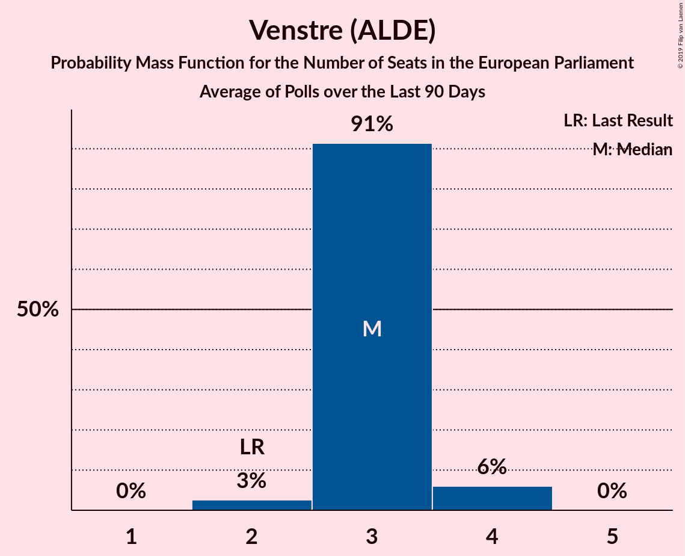

# Venstre (ALDE)

<a href="#voting-intentions">Voting Intentions</a> | <a href="#seats">Seats</a>

## Voting Intentions

Last result: **16.7%** (General Election of 25 May 2014)

### Confidence Intervals

| Period     | Polling firm/Commissioner(s) | Median | 80% Confidence Interval | 90% Confidence Interval | 95% Confidence Interval | 99% Confidence Interval |
|:----------:|:----------------:|:-----------:|:-----------------------:|:-----------------------:|:-----------------------:|:-----------------------:|
| N/A | [Poll Average](average.html) | 18.7% | 17.1–20.4% | 16.7–20.9% | 16.3–21.3% | 15.7–22.2% |
| [22–28 October 2018](2018-10-28-Voxmeter.html) | Voxmeter   Ritzau | 18.2% | 16.7–19.8% | 16.3–20.3% | 16.0–20.7% | 15.3–21.5% |
| [22–25 October 2018](2018-10-25-Megafon.html) | Megafon   Politiken and TV 2 | 19.0% | 17.3–20.8% | 16.9–21.3% | 16.5–21.7% | 15.7–22.6% |
| [16–24 October 2018](2018-10-24-Epinion.html) | Epinion   DR | 17.8% | 16.6–19.1% | 16.3–19.5% | 16.0–19.8% | 15.4–20.5% |
| [15–21 October 2018](2018-10-21-Voxmeter.html) | Voxmeter   Ritzau | 17.3% | 15.9–18.9% | 15.5–19.4% | 15.2–19.8% | 14.5–20.6% |
| [8–14 October 2018](2018-10-14-Voxmeter.html) | Voxmeter   Ritzau | 18.0% | 16.5–19.6% | 16.1–20.1% | 15.8–20.5% | 15.1–21.3% |
| [11 October 2018](2018-10-11-KantarGallup.html) | Kantar Gallup   Berlingske | 18.8% | 17.6–20.1% | 17.3–20.5% | 17.0–20.8% | 16.5–21.4% |
| [3–9 October 2018](2018-10-09-Norstat.html) | Norstat   Altinget | 18.7% | 17.3–20.2% | 16.9–20.6% | 16.6–21.0% | 15.9–21.7% |
| [1–6 October 2018](2018-10-06-Voxmeter.html) | Voxmeter   Ritzau | 18.3% | 16.9–20.0% | 16.4–20.4% | 16.1–20.8% | 15.4–21.6% |
| [1 October 2018](2018-10-01-GreensAnalyseinstitut.html) | Greens Analyseinstitut   Børsen | 19.6% | 18.2–21.2% | 17.8–21.6% | 17.4–22.0% | 16.8–22.8% |
| [24–30 September 2018](2018-09-30-Voxmeter.html) | Voxmeter   Ritzau | 18.1% | 16.6–19.7% | 16.2–20.1% | 15.8–20.5% | 15.2–21.4% |
| [27 September 2018](2018-09-27-Megafon.html) | Megafon   Politiken and TV 2 | 17.6% | 16.0–19.3% | 15.6–19.8% | 15.2–20.3% | 14.5–21.1% |
| [17–23 September 2018](2018-09-23-Voxmeter.html) | Voxmeter   Ritzau | 19.1% | 17.6–20.8% | 17.2–21.2% | 16.8–21.6% | 16.2–22.4% |
| [11–18 September 2018](2018-09-18-Epinion.html) | Epinion   DR | 19.1% | 17.9–20.5% | 17.5–20.9% | 17.2–21.2% | 16.7–21.8% |
| [10–16 September 2018](2018-09-16-Voxmeter.html) | Voxmeter   Ritzau | 19.2% | 17.6–20.8% | 17.2–21.3% | 16.9–21.7% | 16.2–22.5% |
| [6–11 September 2018](2018-09-11-Norstat.html) | Norstat   Altinget and Jyllands-Posten | 17.4% | 16.0–18.8% | 15.7–19.3% | 15.3–19.6% | 14.7–20.3% |
| [3–9 September 2018](2018-09-09-Voxmeter.html) | Voxmeter   Ritzau | 18.2% | 16.8–19.8% | 16.3–20.3% | 16.0–20.7% | 15.3–21.5% |
| [27 August–2 September 2018](2018-09-02-Voxmeter.html) | Voxmeter   Ritzau | 18.7% | 17.2–20.3% | 16.8–20.8% | 16.4–21.2% | 15.8–22.0% |
| [27–30 August 2018](2018-08-30-Megafon.html) | Megafon   Politiken and TV 2 | 19.4% | 17.9–21.0% | 17.4–21.5% | 17.1–21.9% | 16.4–22.7% |
| [20–26 August 2018](2018-08-26-Voxmeter.html) | Voxmeter   Ritzau | 19.3% | 17.8–21.0% | 17.4–21.4% | 17.0–21.8% | 16.3–22.6% |
| [13–19 August 2018](2018-08-19-Voxmeter.html) | Voxmeter   Ritzau | 20.4% | 18.8–22.1% | 18.4–22.5% | 18.0–22.9% | 17.3–23.8% |
| [10–17 August 2018](2018-08-17-Epinion.html) | Epinion   DR | 18.4% | 17.2–19.7% | 16.9–20.1% | 16.6–20.4% | 16.0–21.1% |
| [6–11 August 2018](2018-08-11-Voxmeter.html) | Voxmeter   Ritzau | 19.8% | 18.3–21.5% | 17.9–22.0% | 17.5–22.4% | 16.8–23.2% |
| [30 July–5 August 2018](2018-08-05-Voxmeter.html) | Voxmeter   Ritzau | 19.9% | 18.4–21.6% | 18.0–22.1% | 17.6–22.5% | 16.9–23.3% |
| [25 June–1 July 2018](2018-07-01-Voxmeter.html) | Voxmeter   Ritzau | 19.3% | 17.8–21.0% | 17.4–21.4% | 17.0–21.8% | 16.3–22.6% |
| [25–28 June 2018](2018-06-28-Megafon.html) | Megafon   Politiken and TV 2 | 18.3% | 16.8–19.9% | 16.4–20.4% | 16.0–20.8% | 15.4–21.6% |
| [18–24 June 2018](2018-06-24-Voxmeter.html) | Voxmeter   Ritzau | 19.4% | 17.9–21.0% | 17.4–21.5% | 17.1–21.9% | 16.4–22.7% |
| [15–23 June 2018](2018-06-23-Epinion.html) | Epinion   DR | 18.1% | 16.9–19.4% | 16.6–19.7% | 16.3–20.0% | 15.8–20.6% |
| [11–16 June 2018](2018-06-16-Voxmeter.html) | Voxmeter   Ritzau | 19.9% | 18.4–21.6% | 17.9–22.0% | 17.5–22.5% | 16.8–23.3% |
| [4–10 June 2018](2018-06-10-Voxmeter.html) | Voxmeter   Ritzau | 19.7% | 18.2–21.4% | 17.7–21.8% | 17.4–22.2% | 16.7–23.0% |
| [28 May–3 June 2018](2018-06-03-Voxmeter.html) | Voxmeter   Ritzau | 20.2% | 18.7–21.9% | 18.2–22.4% | 17.9–22.8% | 17.1–23.6% |
| [21–27 May 2018](2018-05-27-Voxmeter.html) | Voxmeter   Ritzau | 20.8% | 19.2–22.5% | 18.8–23.0% | 18.4–23.4% | 17.7–24.2% |
| [17–23 May 2018](2018-05-23-Norstat.html) | Norstat   Altinget | 19.2% | 17.8–20.7% | 17.4–21.1% | 17.1–21.5% | 16.4–22.2% |
| [14–19 May 2018](2018-05-19-Voxmeter.html) | Voxmeter   Ritzau | 20.0% | 18.4–21.7% | 18.0–22.1% | 17.6–22.5% | 16.9–23.4% |
| [7–13 May 2018](2018-05-13-Voxmeter.html) | Voxmeter   Ritzau | 19.8% | 18.3–21.5% | 17.9–21.9% | 17.5–22.3% | 16.8–23.2% |
| [30 April–6 May 2018](2018-05-06-Voxmeter.html) | Voxmeter   Ritzau | 18.8% | 17.3–20.4% | 16.8–20.9% | 16.5–21.3% | 15.8–22.1% |
| [23–29 April 2018](2018-04-29-Voxmeter.html) | Voxmeter   Ritzau | 19.1% | 17.6–20.8% | 17.2–21.2% | 16.8–21.6% | 16.1–22.4% |
| [16–22 April 2018](2018-04-22-Voxmeter.html) | Voxmeter   Ritzau | 20.0% | 18.5–21.7% | 18.0–22.1% | 17.7–22.5% | 17.0–23.4% |
| [8–15 April 2018](2018-04-15-Voxmeter.html) | Voxmeter   Ritzau | 19.3% | 17.8–21.0% | 17.4–21.5% | 17.0–21.9% | 16.3–22.7% |
| [2–7 April 2018](2018-04-07-Voxmeter.html) | Voxmeter   Ritzau | 19.5% | 18.0–21.2% | 17.6–21.6% | 17.2–22.1% | 16.5–22.9% |
| [26–31 March 2018](2018-03-31-Voxmeter.html) | Voxmeter   Ritzau | 19.1% | 17.6–20.7% | 17.1–21.2% | 16.8–21.6% | 16.1–22.4% |
| [19–25 March 2018](2018-03-25-Voxmeter.html) | Voxmeter   Ritzau | 18.5% | 17.0–20.1% | 16.6–20.6% | 16.2–21.0% | 15.5–21.8% |
| [14–20 March 2018](2018-03-20-Norstat.html) | Norstat   Altinget | 19.3% | 18.1–20.7% | 17.7–21.1% | 17.4–21.4% | 16.8–22.1% |
| [14–20 March 2018](2018-03-20-Epinion.html) | Epinion   DR | 19.9% | 18.7–21.2% | 18.4–21.6% | 18.1–21.9% | 17.5–22.5% |
| [12–18 March 2018](2018-03-18-Voxmeter.html) | Voxmeter   Ritzau | 18.9% | 17.4–20.5% | 17.0–21.0% | 16.7–21.4% | 16.0–22.2% |
| [5–11 March 2018](2018-03-11-Voxmeter.html) | Voxmeter   Ritzau | 19.5% | 18.0–21.1% | 17.5–21.6% | 17.2–22.0% | 16.5–22.8% |
| [19–25 February 2018](2018-02-25-Voxmeter.html) | Voxmeter   Ritzau | 20.1% | 18.6–21.8% | 18.2–22.3% | 17.8–22.7% | 17.1–23.5% |
| [19–22 February 2018](2018-02-22-Megafon.html) | Megafon   Politiken and TV 2 | 18.5% | 17.0–20.1% | 16.6–20.6% | 16.2–21.0% | 15.5–21.8% |
| [12–18 February 2018](2018-02-18-Voxmeter.html) | Voxmeter   Ritzau | 20.0% | 18.4–21.7% | 18.0–22.1% | 17.6–22.5% | 16.9–23.4% |
| [8–14 February 2018](2018-02-14-Epinion.html) | Epinion   DR | 18.7% | 17.5–20.0% | 17.1–20.4% | 16.8–20.7% | 16.3–21.3% |
| [5–10 February 2018](2018-02-10-Voxmeter.html) | Voxmeter   Ritzau | 19.1% | 17.6–20.7% | 17.2–21.2% | 16.8–21.6% | 16.1–22.4% |
| [2–8 February 2018](2018-02-08-KantarGallup.html) | Kantar Gallup   Berlingske | 19.4% | 18.1–20.7% | 17.8–21.1% | 17.5–21.4% | 16.9–22.1% |
| [2–8 February 2018](2018-02-08-GreensAnalyseinstitut.html) | Greens Analyseinstitut   Børsen | 19.8% | 18.3–21.4% | 17.9–21.8% | 17.5–22.2% | 16.9–23.0% |

### Probability Mass Function

The following table shows the probability mass function per percentage block of voting intentions for the [poll average](average.html) for Venstre (ALDE).

| Voting Intentions | Probability | Accumulated | Special Marks |
|:-----------------:|:-----------:|:-----------:|:-------------:|
| 13.5–14.5% | 0% | 100% |  |
| 14.5–15.5% | 0.3% | 100% |  |
| 15.5–16.5% | 3% | 99.6% |  |
| 16.5–17.5% | 14% | 96% | Last Result |
| 17.5–18.5% | 28% | 83% |  |
| 18.5–19.5% | 29% | 55% | Median |
| 19.5–20.5% | 17% | 25% |  |
| 20.5–21.5% | 6% | 8% |  |
| 21.5–22.5% | 1.5% | 2% |  |
| 22.5–23.5% | 0.2% | 0.2% |  |
| 23.5–24.5% | 0% | 0% |  |

## Seats

Last result: **2** seats (General Election of 25 May 2014)

### Confidence Intervals

| Period     | Polling firm/Commissioner(s) | Median | 80% Confidence Interval | 90% Confidence Interval | 95% Confidence Interval | 99% Confidence Interval |
|:----------:|:----------------:|:------:|:-----------------------:|:-----------------------:|:-----------------------:|:-----------------------:|
| N/A | [Poll Average](average.html) | 3 | 3–4 | 3–4 | 3–4 | 3–4 |
| [22–28 October 2018](2018-10-28-Voxmeter.html) | Voxmeter   Ritzau | 3 | 3 | 3 | 3 | 3 |
| [22–25 October 2018](2018-10-25-Megafon.html) | Megafon   Politiken and TV 2 | 3 | 3 | 3–4 | 3–4 | 3–4 |
| [16–24 October 2018](2018-10-24-Epinion.html) | Epinion   DR | 3 | 3 | 3 | 3–4 | 2–4 |
| [15–21 October 2018](2018-10-21-Voxmeter.html) | Voxmeter   Ritzau | 3 | 2–3 | 2–3 | 2–3 | 2–4 |
| [8–14 October 2018](2018-10-14-Voxmeter.html) | Voxmeter   Ritzau | 3 | 3 | 3 | 2–3 | 2–4 |
| [11 October 2018](2018-10-11-KantarGallup.html) | Kantar Gallup   Berlingske | 3 | 3 | 3 | 3–4 | 3–4 |
| [3–9 October 2018](2018-10-09-Norstat.html) | Norstat   Altinget | 3 | 3 | 3 | 3 | 3–4 |
| [1–6 October 2018](2018-10-06-Voxmeter.html) | Voxmeter   Ritzau | 3 | 3 | 3–4 | 3–4 | 2–4 |
| [1 October 2018](2018-10-01-GreensAnalyseinstitut.html) | Greens Analyseinstitut   Børsen | 3 | 3–4 | 3–4 | 3–4 | 3–4 |
| [24–30 September 2018](2018-09-30-Voxmeter.html) | Voxmeter   Ritzau | 3 | 3 | 3–4 | 3–4 | 2–4 |
| [27 September 2018](2018-09-27-Megafon.html) | Megafon   Politiken and TV 2 | 3 | 3 | 2–3 | 2–4 | 2–4 |
| [17–23 September 2018](2018-09-23-Voxmeter.html) | Voxmeter   Ritzau | 3 | 3–4 | 3–4 | 3–4 | 3–4 |
| [11–18 September 2018](2018-09-18-Epinion.html) | Epinion   DR | 3 | 3 | 3 | 3–4 | 3–4 |
| [10–16 September 2018](2018-09-16-Voxmeter.html) | Voxmeter   Ritzau | 3 | 3–4 | 3–4 | 3–4 | 3–4 |
| [6–11 September 2018](2018-09-11-Norstat.html) | Norstat   Altinget and Jyllands-Posten | 3 | 3 | 3 | 3 | 2–4 |
| [3–9 September 2018](2018-09-09-Voxmeter.html) | Voxmeter   Ritzau | 3 | 3 | 3 | 3–4 | 2–4 |
| [27 August–2 September 2018](2018-09-02-Voxmeter.html) | Voxmeter   Ritzau | 3 | 3 | 3–4 | 3–4 | 2–4 |
| [27–30 August 2018](2018-08-30-Megafon.html) | Megafon   Politiken and TV 2 | 3 | 3 | 3–4 | 3–4 | 2–4 |
| [20–26 August 2018](2018-08-26-Voxmeter.html) | Voxmeter   Ritzau | 3 | 3–4 | 3–4 | 3–4 | 3–4 |
| [13–19 August 2018](2018-08-19-Voxmeter.html) | Voxmeter   Ritzau | 3 | 3–4 | 3–4 | 3–4 | 3–4 |
| [10–17 August 2018](2018-08-17-Epinion.html) | Epinion   DR | 3 | 3 | 3 | 3 | 3–4 |
| [6–11 August 2018](2018-08-11-Voxmeter.html) | Voxmeter   Ritzau | 4 | 3–4 | 3–4 | 3–4 | 3–4 |
| [30 July–5 August 2018](2018-08-05-Voxmeter.html) | Voxmeter   Ritzau | 3 | 3–4 | 3–4 | 3–4 | 3–4 |
| [25 June–1 July 2018](2018-07-01-Voxmeter.html) | Voxmeter   Ritzau | 3 | 3–4 | 3–4 | 3–4 | 3–4 |
| [25–28 June 2018](2018-06-28-Megafon.html) | Megafon   Politiken and TV 2 | 3 | 3 | 3 | 3–4 | 2–4 |
| [18–24 June 2018](2018-06-24-Voxmeter.html) | Voxmeter   Ritzau | 3 | 3–4 | 3–4 | 3–4 | 3–4 |
| [15–23 June 2018](2018-06-23-Epinion.html) | Epinion   DR | 3 | 3 | 3 | 3 | 2–4 |
| [11–16 June 2018](2018-06-16-Voxmeter.html) | Voxmeter   Ritzau | 3 | 3–4 | 3–4 | 3–4 | 3–4 |
| [4–10 June 2018](2018-06-10-Voxmeter.html) | Voxmeter   Ritzau | 3 | 3–4 | 3–4 | 3–4 | 3–4 |
| [28 May–3 June 2018](2018-06-03-Voxmeter.html) | Voxmeter   Ritzau | 3 | 3–4 | 3–4 | 3–4 | 3–4 |
| [21–27 May 2018](2018-05-27-Voxmeter.html) | Voxmeter   Ritzau | 4 | 3–4 | 3–4 | 3–4 | 3–4 |
| [17–23 May 2018](2018-05-23-Norstat.html) | Norstat   Altinget | 3 | 3–4 | 3–4 | 3–4 | 3–4 |
| [14–19 May 2018](2018-05-19-Voxmeter.html) | Voxmeter   Ritzau | 3 | 3 | 3–4 | 3–4 | 3–4 |
| [7–13 May 2018](2018-05-13-Voxmeter.html) | Voxmeter   Ritzau | 3 | 3 | 3–4 | 3–4 | 3–4 |
| [30 April–6 May 2018](2018-05-06-Voxmeter.html) | Voxmeter   Ritzau | 3 | 3 | 3 | 3 | 2–4 |
| [23–29 April 2018](2018-04-29-Voxmeter.html) | Voxmeter   Ritzau | 3 | 3–4 | 3–4 | 3–4 | 3–4 |
| [16–22 April 2018](2018-04-22-Voxmeter.html) | Voxmeter   Ritzau | 3 | 3–4 | 3–4 | 3–4 | 3–4 |
| [8–15 April 2018](2018-04-15-Voxmeter.html) | Voxmeter   Ritzau | 3 | 3 | 3–4 | 3–4 | 3–4 |
| [2–7 April 2018](2018-04-07-Voxmeter.html) | Voxmeter   Ritzau | 3 | 3–4 | 3–4 | 3–4 | 3–4 |
| [26–31 March 2018](2018-03-31-Voxmeter.html) | Voxmeter   Ritzau | 3 | 3 | 3 | 3–4 | 3–4 |
| [19–25 March 2018](2018-03-25-Voxmeter.html) | Voxmeter   Ritzau | 3 | 3 | 3 | 3 | 2–4 |
| [14–20 March 2018](2018-03-20-Norstat.html) | Norstat   Altinget | 3 | 3 | 3–4 | 3–4 | 3–4 |
| [14–20 March 2018](2018-03-20-Epinion.html) | Epinion   DR | 3 | 3–4 | 3–4 | 3–4 | 3–4 |
| [12–18 March 2018](2018-03-18-Voxmeter.html) | Voxmeter   Ritzau | 3 | 3 | 3 | 3–4 | 3–4 |
| [5–11 March 2018](2018-03-11-Voxmeter.html) | Voxmeter   Ritzau | 3 | 3 | 3–4 | 3–4 | 3–4 |
| [19–25 February 2018](2018-02-25-Voxmeter.html) | Voxmeter   Ritzau | 3 | 3–4 | 3–4 | 3–4 | 3–4 |
| [19–22 February 2018](2018-02-22-Megafon.html) | Megafon   Politiken and TV 2 | 3 | 3 | 2–3 | 2–4 | 2–4 |
| [12–18 February 2018](2018-02-18-Voxmeter.html) | Voxmeter   Ritzau | 3 | 3–4 | 3–4 | 3–4 | 3–4 |
| [8–14 February 2018](2018-02-14-Epinion.html) | Epinion   DR | 3 | 3 | 3 | 3–4 | 3–4 |
| [5–10 February 2018](2018-02-10-Voxmeter.html) | Voxmeter   Ritzau | 3 | 3–4 | 3–4 | 3–4 | 3–4 |
| [2–8 February 2018](2018-02-08-KantarGallup.html) | Kantar Gallup   Berlingske | 3 | 3–4 | 3–4 | 3–4 | 3–4 |
| [2–8 February 2018](2018-02-08-GreensAnalyseinstitut.html) | Greens Analyseinstitut   Børsen | 3 | 3–4 | 3–4 | 3–4 | 3–4 |

### Probability Mass Function

The following table shows the probability mass function per seat for the [poll average](average.html) for Venstre (ALDE).

| Number of Seats | Probability | Accumulated | Special Marks |
|:---------------:|:-----------:|:-----------:|:-------------:|
| 2 | 0.4% | 100% | Last Result |
| 3 | 89% | 99.6% | Median |
| 4 | 10% | 10% |  |
| 5 | 0% | 0% |  |

