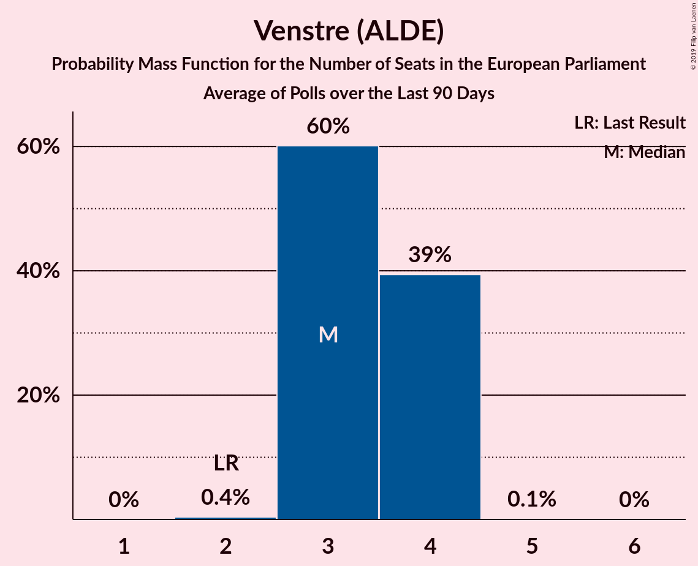

# Venstre (ALDE)

<a href="#voting-intentions">Voting Intentions</a> | <a href="#seats">Seats</a>

## Voting Intentions

Last result: **16.7%** (General Election of 26 May 2019)

### Confidence Intervals

| Period     | Polling firm/Commissioner(s) | Median | 80% Confidence Interval | 90% Confidence Interval | 95% Confidence Interval | 99% Confidence Interval |
|:----------:|:----------------:|:-----------:|:-----------------------:|:-----------------------:|:-----------------------:|:-----------------------:|
| N/A | [Poll Average](average.html) | 20.0% | 17.5–23.6% | 17.0–24.8% | 16.6–25.5% | 15.8–26.8% |
| [10–15 June 2019](2019-06-15-Voxmeter.html) | Voxmeter   Ritzau | 24.2% | 22.6–26.0% | 22.1–26.5% | 21.7–27.0% | 20.9–27.9% |
| [31 May–4 June 2019](2019-06-04-YouGov.html) | YouGov | 18.6% | 17.1–20.2% | 16.7–20.7% | 16.4–21.0% | 15.7–21.8% |
| [4 June 2019](2019-06-04-Gallup.html) | Gallup | 22.3% | 21.6–23.1% | 21.3–23.3% | 21.2–23.5% | 20.8–23.9% |
| [4 June 2019](2019-06-04-Epinion.html) | Epinion   DR | 20.7% | 19.7–21.8% | 19.4–22.1% | 19.1–22.4% | 18.7–22.9% |
| [30 May–3 June 2019](2019-06-03-YouGov.html) | YouGov | 19.3% | 17.6–21.1% | 17.2–21.6% | 16.8–22.1% | 16.0–23.0% |
| [1–3 June 2019](2019-06-03-Voxmeter.html) | Voxmeter   Ritzau | 18.2% | 16.8–19.9% | 16.3–20.4% | 16.0–20.8% | 15.3–21.6% |
| [3 June 2019](2019-06-03-Norstat.html) | Norstat   Altinget and Jyllands-Posten | 17.9% | 16.6–19.4% | 16.2–19.8% | 15.9–20.2% | 15.2–20.9% |
| [3 June 2019](2019-06-03-GreensAnalyseinstitut.html) | Greens Analyseinstitut   Børsen | 18.7% | 17.3–20.2% | 16.9–20.7% | 16.5–21.0% | 15.9–21.8% |
| [29 May–2 June 2019](2019-06-02-YouGov.html) | YouGov | 20.7% | 19.0–22.7% | 18.5–23.3% | 18.0–23.7% | 17.2–24.7% |
| [31 May–2 June 2019](2019-06-02-Voxmeter.html) | Voxmeter   Ritzau | 17.7% | 16.2–19.3% | 15.8–19.8% | 15.5–20.2% | 14.8–21.0% |
| [28 May–1 June 2019](2019-06-01-YouGov.html) | YouGov | 20.9% | 19.2–22.8% | 18.7–23.3% | 18.3–23.8% | 17.6–24.7% |
| [30 May–1 June 2019](2019-06-01-Voxmeter.html) | Voxmeter   Ritzau | 17.4% | 15.9–19.0% | 15.5–19.5% | 15.2–19.9% | 14.5–20.7% |
| [29–31 May 2019](2019-05-31-Voxmeter.html) | Voxmeter   Ritzau | 17.8% | 16.3–19.4% | 15.9–19.9% | 15.6–20.3% | 14.9–21.1% |
| [26–30 May 2019](2019-05-30-YouGov.html) | YouGov | 18.3% | 16.8–20.0% | 16.4–20.4% | 16.0–20.9% | 15.3–21.7% |
| [28–30 May 2019](2019-05-30-Voxmeter.html) | Voxmeter   Ritzau | 17.9% | 16.5–19.6% | 16.0–20.0% | 15.7–20.4% | 15.0–21.2% |
| [28–30 May 2019](2019-05-30-Megafon.html) | Megafon   Politiken and TV 2 | 19.5% | 18.0–21.2% | 17.6–21.7% | 17.2–22.1% | 16.5–22.9% |
| [28–30 May 2019](2019-05-30-Epinion.html) | Epinion   DR | 20.4% | 19.2–21.7% | 18.9–22.1% | 18.6–22.4% | 18.0–23.0% |
| [25–29 May 2019](2019-05-29-YouGov.html) | YouGov | 17.2% | 15.8–18.9% | 15.3–19.3% | 15.0–19.7% | 14.3–20.5% |
| [27–29 May 2019](2019-05-29-Voxmeter.html) | Voxmeter   Ritzau | 17.5% | 16.0–19.1% | 15.6–19.6% | 15.3–20.0% | 14.6–20.8% |
| [24–28 May 2019](2019-05-28-YouGov.html) | YouGov | 16.2% | 14.7–17.8% | 14.3–18.2% | 14.0–18.6% | 13.3–19.4% |
| [26–28 May 2019](2019-05-28-Voxmeter.html) | Voxmeter   Ritzau | 17.7% | 16.2–19.3% | 15.8–19.8% | 15.5–20.2% | 14.8–21.0% |
| [28 May 2019](2019-05-28-Gallup.html) | Gallup | 20.3% | 19.0–21.7% | 18.6–22.1% | 18.3–22.4% | 17.7–23.1% |
| [25–27 May 2019](2019-05-27-Voxmeter.html) | Voxmeter   Ritzau | 18.2% | 16.7–19.8% | 16.3–20.3% | 15.9–20.7% | 15.2–21.5% |

### Probability Mass Function

The following table shows the probability mass function per percentage block of voting intentions for the [poll average](average.html) for Venstre (ALDE).

| Voting Intentions | Probability | Accumulated | Special Marks |
|:-----------------:|:-----------:|:-----------:|:-------------:|
| 13.5–14.5% | 0% | 100% |  |
| 14.5–15.5% | 0.2% | 100% |  |
| 15.5–16.5% | 2% | 99.8% |  |
| 16.5–17.5% | 8% | 98% | Last Result |
| 17.5–18.5% | 16% | 90% |  |
| 18.5–19.5% | 17% | 74% |  |
| 19.5–20.5% | 15% | 57% | Median |
| 20.5–21.5% | 12% | 42% |  |
| 21.5–22.5% | 12% | 30% |  |
| 22.5–23.5% | 8% | 18% |  |
| 23.5–24.5% | 4% | 10% |  |
| 24.5–25.5% | 3% | 6% |  |
| 25.5–26.5% | 2% | 2% |  |
| 26.5–27.5% | 0.6% | 0.7% |  |
| 27.5–28.5% | 0.1% | 0.1% |  |
| 28.5–29.5% | 0% | 0% |  |

## Seats

Last result: **2** seats (General Election of 26 May 2019)

### Confidence Intervals

| Period     | Polling firm/Commissioner(s) | Median | 80% Confidence Interval | 90% Confidence Interval | 95% Confidence Interval | 99% Confidence Interval |
|:----------:|:----------------:|:------:|:-----------------------:|:-----------------------:|:-----------------------:|:-----------------------:|
| N/A | [Poll Average](average.html) | 3 | 3–4 | 3–4 | 3–4 | 3–4 |
| [10–15 June 2019](2019-06-15-Voxmeter.html) | Voxmeter   Ritzau | 4 | 4 | 4 | 4 | 3–4 |
| [31 May–4 June 2019](2019-06-04-YouGov.html) | YouGov | 3 | 3 | 3 | 3 | 3–4 |
| [4 June 2019](2019-06-04-Gallup.html) | Gallup | 4 | 3–4 | 3–4 | 3–4 | 3–4 |
| [4 June 2019](2019-06-04-Epinion.html) | Epinion   DR | 4 | 3–4 | 3–4 | 3–4 | 3–4 |
| [30 May–3 June 2019](2019-06-03-YouGov.html) | YouGov | 3 | 3 | 3 | 3–4 | 3–4 |
| [1–3 June 2019](2019-06-03-Voxmeter.html) | Voxmeter   Ritzau | 3 | 3 | 3 | 3 | 3–4 |
| [3 June 2019](2019-06-03-Norstat.html) | Norstat   Altinget and Jyllands-Posten | 3 | 3 | 3 | 3 | 3–4 |
| [3 June 2019](2019-06-03-GreensAnalyseinstitut.html) | Greens Analyseinstitut   Børsen | 3 | 3–4 | 3–4 | 3–4 | 2–4 |
| [29 May–2 June 2019](2019-06-02-YouGov.html) | YouGov | 4 | 3–4 | 3–4 | 3–4 | 3–4 |
| [31 May–2 June 2019](2019-06-02-Voxmeter.html) | Voxmeter   Ritzau | 3 | 3 | 2–3 | 2–3 | 2–4 |
| [28 May–1 June 2019](2019-06-01-YouGov.html) | YouGov | 3 | 3–4 | 3–4 | 3–4 | 3–4 |
| [30 May–1 June 2019](2019-06-01-Voxmeter.html) | Voxmeter   Ritzau | 3 | 3 | 2–3 | 2–3 | 2–3 |
| [29–31 May 2019](2019-05-31-Voxmeter.html) | Voxmeter   Ritzau | 3 | 3 | 3 | 2–3 | 2–3 |
| [26–30 May 2019](2019-05-30-YouGov.html) | YouGov | 3 | 3–4 | 3–4 | 3–4 | 3–4 |
| [28–30 May 2019](2019-05-30-Voxmeter.html) | Voxmeter   Ritzau | 3 | 3 | 2–3 | 2–3 | 2–4 |
| [28–30 May 2019](2019-05-30-Megafon.html) | Megafon   Politiken and TV 2 | 3 | 3 | 3–4 | 3–4 | 3–4 |
| [28–30 May 2019](2019-05-30-Epinion.html) | Epinion   DR | 3 | 3–4 | 3–4 | 3–4 | 3–4 |
| [25–29 May 2019](2019-05-29-YouGov.html) | YouGov | 3 | 2–3 | 2–3 | 2–3 | 2–3 |
| [27–29 May 2019](2019-05-29-Voxmeter.html) | Voxmeter   Ritzau | 2 | 2–3 | 2–3 | 2–3 | 2–3 |
| [24–28 May 2019](2019-05-28-YouGov.html) | YouGov | 3 | 2–3 | 2–3 | 2–3 | 2–3 |
| [26–28 May 2019](2019-05-28-Voxmeter.html) | Voxmeter   Ritzau | 3 | 3 | 3 | 3 | 2–3 |
| [28 May 2019](2019-05-28-Gallup.html) | Gallup | 3 | 3–4 | 3–4 | 3–4 | 3–4 |
| [25–27 May 2019](2019-05-27-Voxmeter.html) | Voxmeter   Ritzau | 3 | 3 | 3 | 3 | 3–4 |

### Probability Mass Function

The following table shows the probability mass function per seat for the [poll average](average.html) for Venstre (ALDE).

| Number of Seats | Probability | Accumulated | Special Marks |
|:---------------:|:-----------:|:-----------:|:-------------:|
| 2 | 0.4% | 100% | Last Result |
| 3 | 60% | 99.6% | Median |
| 4 | 39% | 39% |  |
| 5 | 0.1% | 0.1% |  |
| 6 | 0% | 0% |  |

