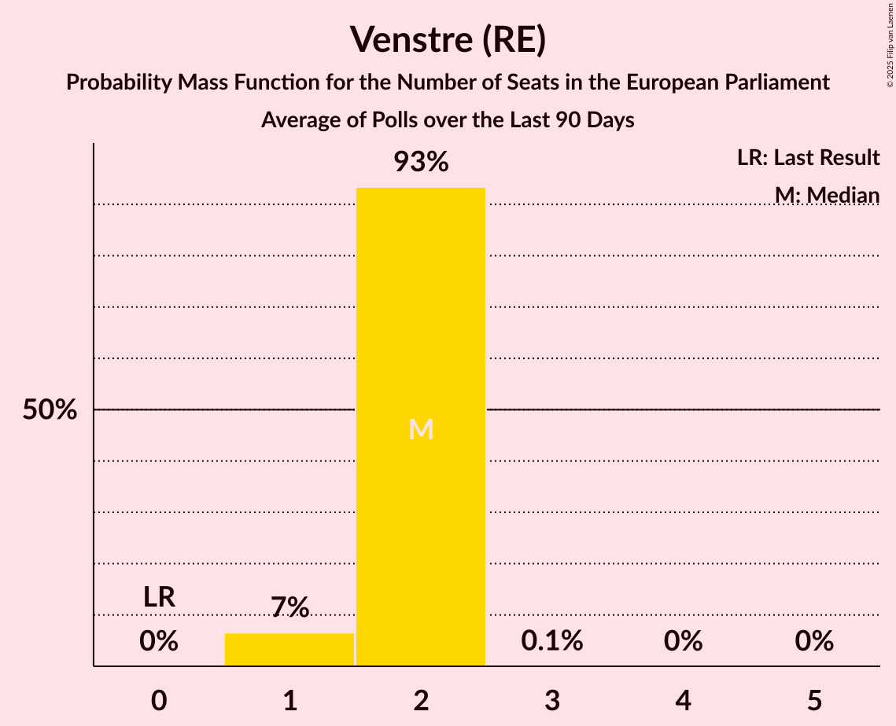

# Venstre (RE)

<a href="#voting-intentions">Voting Intentions</a> | <a href="#seats">Seats</a>

## Voting Intentions

Last result: **16.7%** (General Election of 26 May 2019)

### Confidence Intervals

| Period     | Polling firm/Commissioner(s) | Median | 80% Confidence Interval | 90% Confidence Interval | 95% Confidence Interval | 99% Confidence Interval |
|:----------:|:----------------:|:-----------:|:-----------------------:|:-----------------------:|:-----------------------:|:-----------------------:|
| N/A | [Poll Average](average.html) | 21.1% | 19.3–22.7% | 18.7–23.2% | 18.3–23.6% | 17.4–24.4% |
| [1–30 April 2020](2020-04-30-Voxmeter.html) | Voxmeter | 21.2% | 19.6–22.9% | 19.2–23.4% | 18.8–23.8% | 18.0–24.6% |
| [27–30 April 2020](2020-04-30-Megafon.html) | Megafon   Politiken and TV 2 | 19.9% | 18.3–21.6% | 17.9–22.0% | 17.5–22.5% | 16.8–23.3% |
| [20–26 April 2020](2020-04-26-Voxmeter.html) | Voxmeter | 21.2% | 19.6–22.9% | 19.2–23.4% | 18.8–23.8% | 18.1–24.6% |
| [6–19 April 2020](2020-04-19-Voxmeter.html) | Voxmeter | 21.5% | 19.9–23.2% | 19.5–23.7% | 19.1–24.1% | 18.4–24.9% |
| [10–16 April 2020](2020-04-16-Epinion.html) | Epinion | 21.0% | 19.8–22.4% | 19.4–22.7% | 19.1–23.1% | 18.5–23.7% |
| [30 March–11 April 2020](2020-04-11-Voxmeter.html) | Voxmeter   Ritzau | 22.0% | 20.4–23.7% | 19.9–24.1% | 19.6–24.6% | 18.8–25.4% |
| [23 March–5 April 2020](2020-04-05-Voxmeter.html) | Voxmeter   Ritzau | 21.8% | 20.2–23.5% | 19.8–24.0% | 19.4–24.4% | 18.7–25.2% |
| [27 March–3 April 2020](2020-04-03-Gallup.html) | Gallup | 21.9% | 20.5–23.3% | 20.2–23.7% | 19.8–24.0% | 19.2–24.7% |
| [23–29 March 2020](2020-03-29-Voxmeter.html) | Voxmeter   Ritzau | 22.2% | 20.7–23.9% | 20.2–24.4% | 19.8–24.8% | 19.1–25.7% |
| [16–22 March 2020](2020-03-22-Voxmeter.html) | Voxmeter   Ritzau | 23.3% | 21.7–25.1% | 21.2–25.5% | 20.9–26.0% | 20.1–26.8% |
| [9–15 March 2020](2020-03-15-Voxmeter.html) | Voxmeter   Ritzau | 24.0% | 22.4–25.8% | 21.9–26.3% | 21.5–26.7% | 20.7–27.6% |
| [2–7 March 2020](2020-03-07-Voxmeter.html) | Voxmeter   Ritzau | 23.3% | 21.7–25.1% | 21.2–25.5% | 20.9–26.0% | 20.1–26.8% |
| [25 February–2 March 2020](2020-03-02-Epinion.html) | Epinion   DR | 22.3% | 21.0–23.7% | 20.6–24.1% | 20.3–24.4% | 19.7–25.1% |
| [24 February–1 March 2020](2020-03-01-Voxmeter.html) | Voxmeter   Ritzau | 23.6% | 22.0–25.4% | 21.5–25.8% | 21.1–26.3% | 20.3–27.1% |
| [24–27 February 2020](2020-02-27-Megafon.html) | Megafon   TV2 | 21.7% | 20.1–23.4% | 19.7–23.9% | 19.3–24.3% | 18.6–25.1% |
| [17–23 February 2020](2020-02-23-Voxmeter.html) | Voxmeter   Ritzau | 23.8% | 22.2–25.6% | 21.7–26.1% | 21.4–26.5% | 20.6–27.4% |
| [10–16 February 2020](2020-02-16-Voxmeter.html) | Voxmeter   Ritzau | 24.4% | 22.7–26.2% | 22.3–26.7% | 21.9–27.2% | 21.1–28.1% |
| [7–13 February 2020](2020-02-13-Gallup.html) | Gallup | 22.4% | 21.1–23.8% | 20.7–24.2% | 20.4–24.6% | 19.7–25.3% |
| [3–8 February 2020](2020-02-08-Voxmeter.html) | Voxmeter   Ritzau | 23.9% | 22.2–25.6% | 21.8–26.1% | 21.4–26.5% | 20.6–27.4% |
| [27 January–2 February 2020](2020-02-02-Voxmeter.html) | Voxmeter   Ritzau | 22.1% | 20.5–23.9% | 20.1–24.4% | 19.7–24.8% | 19.0–25.7% |
| [20–26 January 2020](2020-01-26-Voxmeter.html) | Voxmeter   Ritzau | 22.6% | 21.0–24.3% | 20.5–24.8% | 20.1–25.3% | 19.4–26.1% |
| [13–19 January 2020](2020-01-19-Voxmeter.html) | Voxmeter   Ritzau | 22.3% | 20.7–24.0% | 20.2–24.5% | 19.8–24.9% | 19.1–25.8% |
| [6–11 January 2020](2020-01-11-Voxmeter.html) | Voxmeter   Ritzau | 22.8% | 21.2–24.6% | 20.7–25.1% | 20.3–25.5% | 19.6–26.3% |
| [30 December 2019–5 January 2020](2020-01-05-Voxmeter.html) | Voxmeter   Ritzau | 23.8% | 22.2–25.6% | 21.7–26.1% | 21.3–26.5% | 20.5–27.4% |
| [16–22 December 2019](2019-12-22-Voxmeter.html) | Voxmeter   Ritzau | 23.8% | 22.2–25.6% | 21.7–26.1% | 21.3–26.5% | 20.6–27.4% |
| [9–15 December 2019](2019-12-15-Voxmeter.html) | Voxmeter   Ritzau | 23.2% | 21.5–24.9% | 21.1–25.4% | 20.7–25.8% | 19.9–26.7% |
| [12 December 2019](2019-12-12-Gallup.html) | Gallup | 23.3% | 21.9–24.8% | 21.6–25.2% | 21.2–25.5% | 20.6–26.2% |
| [2–8 December 2019](2019-12-08-Voxmeter.html) | Voxmeter   Ritzau | 23.9% | 22.2–25.7% | 21.7–26.2% | 21.3–26.6% | 20.5–27.5% |
| [25 November–2 December 2019](2019-12-02-Voxmeter.html) | Voxmeter   Ritzau | 22.9% | 21.3–24.6% | 20.9–25.1% | 20.5–25.6% | 19.7–26.4% |
| [26–28 November 2019](2019-11-28-Megafon.html) | Megafon   Politiken and TV 2 | 21.8% | 20.2–23.6% | 19.8–24.1% | 19.4–24.5% | 18.6–25.3% |
| [18–25 November 2019](2019-11-25-Voxmeter.html) | Voxmeter   Ritzau | 23.7% | 22.0–25.4% | 21.5–25.9% | 21.1–26.4% | 20.3–27.3% |
| [20 November 2019](2019-11-20-Epinion.html) | Epinion   DR | 23.2% | 21.9–24.6% | 21.6–25.0% | 21.2–25.4% | 20.6–26.0% |
| [11–18 November 2019](2019-11-18-Voxmeter.html) | Voxmeter   Ritzau | 24.3% | 22.6–26.1% | 22.2–26.6% | 21.8–27.0% | 21.0–27.9% |
| [4–10 November 2019](2019-11-10-Voxmeter.html) | Voxmeter   Ritzau | 23.7% | 22.1–25.5% | 21.6–26.0% | 21.2–26.4% | 20.4–27.3% |
| [8 November 2019](2019-11-08-Gallup.html) | Gallup | 22.9% | 21.5–24.3% | 21.2–24.7% | 20.8–25.1% | 20.2–25.8% |
| [27 October–4 November 2019](2019-11-04-Voxmeter.html) | Voxmeter   Ritzau | 22.9% | 21.3–24.6% | 20.9–25.1% | 20.5–25.6% | 19.7–26.4% |
| [21–27 October 2019](2019-10-27-Voxmeter.html) | Voxmeter   Ritzau | 23.4% | 21.8–25.2% | 21.3–25.7% | 20.9–26.1% | 20.1–26.9% |
| [23 October 2019](2019-10-23-Epinion.html) | Epinion   DR | 23.8% | 22.4–25.2% | 22.1–25.6% | 21.7–26.0% | 21.1–26.7% |
| [14–20 October 2019](2019-10-20-Voxmeter.html) | Voxmeter   Ritzau | 24.2% | 22.6–26.0% | 22.1–26.5% | 21.7–26.9% | 20.9–27.8% |
| [7–12 October 2019](2019-10-12-Voxmeter.html) | Voxmeter   Ritzau | 23.5% | 21.9–25.3% | 21.4–25.8% | 21.0–26.2% | 20.2–27.1% |
| [30 September–7 October 2019](2019-10-07-Voxmeter.html) | Voxmeter   2019-10-07 | 24.5% | 22.8–26.2% | 22.4–26.7% | 22.0–27.2% | 21.2–28.0% |
| [23–29 September 2019](2019-09-29-Voxmeter.html) | Voxmeter   Ritzau | 23.8% | 22.2–25.6% | 21.7–26.1% | 21.3–26.5% | 20.6–27.4% |
| [29 September 2019](2019-09-29-Gallup.html) | Gallup | 23.1% | 21.7–24.5% | 21.3–24.9% | 21.0–25.3% | 20.4–26.0% |
| [16–22 September 2019](2019-09-22-Voxmeter.html) | Voxmeter   Ritzau | 22.8% | 21.2–24.5% | 20.7–25.0% | 20.3–25.4% | 19.6–26.3% |
| [19 September 2019](2019-09-19-Norstat.html) | Norstat   Altinget and Jyllands-Posten | 22.5% | 20.9–24.3% | 20.4–24.8% | 20.0–25.2% | 19.3–26.1% |
| [9–15 September 2019](2019-09-15-Voxmeter.html) | Voxmeter   Ritzau | 21.9% | 20.3–23.6% | 19.8–24.1% | 19.4–24.5% | 18.7–25.3% |
| [12 September 2019](2019-09-12-Gallup.html) | Gallup | 22.4% | 21.2–23.8% | 20.8–24.2% | 20.5–24.5% | 19.9–25.2% |
| [9 September 2019](2019-09-09-YouGov.html) | YouGov | 20.7% | 19.1–22.4% | 18.7–22.9% | 18.3–23.3% | 17.5–24.1% |
| [2–9 September 2019](2019-09-09-Voxmeter.html) | Voxmeter   Ritzau | 22.6% | 21.0–24.4% | 20.6–24.8% | 20.2–25.3% | 19.4–26.1% |
| [26 August–1 September 2019](2019-09-01-Voxmeter.html) | Voxmeter   Ritzau | 23.4% | 21.8–25.2% | 21.4–25.7% | 21.0–26.1% | 20.2–26.9% |
| [18–26 August 2019](2019-08-26-Voxmeter.html) | Voxmeter   Ritzau | 23.2% | 21.6–25.0% | 21.1–25.5% | 20.7–25.9% | 20.0–26.7% |
| [16–20 August 2019](2019-08-20-Megafon.html) | Megafon   Politiken and TV 2 | 21.3% | 19.7–23.0% | 19.3–23.5% | 18.9–23.9% | 18.1–24.8% |
| [12–18 August 2019](2019-08-18-Voxmeter.html) | Voxmeter   Ritzau | 23.8% | 22.2–25.5% | 21.7–26.0% | 21.3–26.5% | 20.6–27.3% |
| [5–10 August 2019](2019-08-10-Voxmeter.html) | Voxmeter   Ritzau | 25.4% | 23.7–27.3% | 23.3–27.8% | 22.8–28.2% | 22.1–29.1% |
| [8 August 2019](2019-08-08-Gallup.html) | Gallup | 23.5% | 22.2–25.0% | 21.8–25.4% | 21.5–25.7% | 20.8–26.4% |
| [24–30 June 2019](2019-06-30-Voxmeter.html) | Voxmeter   Ritzau | 24.5% | 22.9–26.3% | 22.4–26.8% | 22.0–27.2% | 21.3–28.1% |
| [17–23 June 2019](2019-06-23-Voxmeter.html) | Voxmeter   Ritzau | 25.1% | 23.4–26.9% | 22.9–27.4% | 22.5–27.8% | 21.7–28.7% |
| [10–15 June 2019](2019-06-15-Voxmeter.html) | Voxmeter   Ritzau | 24.2% | 22.6–26.0% | 22.1–26.5% | 21.7–27.0% | 20.9–27.9% |
| [31 May–4 June 2019](2019-06-04-YouGov.html) | YouGov | 18.6% | 17.1–20.2% | 16.7–20.7% | 16.4–21.0% | 15.7–21.8% |
| [4 June 2019](2019-06-04-Gallup.html) | Gallup | 22.3% | 21.6–23.1% | 21.3–23.3% | 21.2–23.5% | 20.8–23.9% |
| [4 June 2019](2019-06-04-Epinion.html) | Epinion   DR | 20.7% | 19.7–21.8% | 19.4–22.1% | 19.1–22.4% | 18.7–22.9% |
| [30 May–3 June 2019](2019-06-03-YouGov.html) | YouGov | 19.3% | 17.6–21.1% | 17.2–21.6% | 16.8–22.1% | 16.0–23.0% |
| [1–3 June 2019](2019-06-03-Voxmeter.html) | Voxmeter   Ritzau | 18.2% | 16.8–19.9% | 16.3–20.4% | 16.0–20.8% | 15.3–21.6% |
| [3 June 2019](2019-06-03-Norstat.html) | Norstat   Altinget and Jyllands-Posten | 17.9% | 16.6–19.4% | 16.2–19.8% | 15.9–20.2% | 15.2–20.9% |
| [3 June 2019](2019-06-03-GreensAnalyseinstitut.html) | Greens Analyseinstitut   Børsen | 18.7% | 17.3–20.2% | 16.9–20.7% | 16.5–21.0% | 15.9–21.8% |
| [29 May–2 June 2019](2019-06-02-YouGov.html) | YouGov | 20.7% | 19.0–22.7% | 18.5–23.3% | 18.0–23.7% | 17.2–24.7% |
| [31 May–2 June 2019](2019-06-02-Voxmeter.html) | Voxmeter   Ritzau | 17.7% | 16.2–19.3% | 15.8–19.8% | 15.5–20.2% | 14.8–21.0% |
| [28 May–1 June 2019](2019-06-01-YouGov.html) | YouGov | 20.9% | 19.2–22.8% | 18.7–23.3% | 18.3–23.8% | 17.6–24.7% |
| [30 May–1 June 2019](2019-06-01-Voxmeter.html) | Voxmeter   Ritzau | 17.4% | 15.9–19.0% | 15.5–19.5% | 15.2–19.9% | 14.5–20.7% |
| [29–31 May 2019](2019-05-31-Voxmeter.html) | Voxmeter   Ritzau | 17.8% | 16.3–19.4% | 15.9–19.9% | 15.6–20.3% | 14.9–21.1% |
| [26–30 May 2019](2019-05-30-YouGov.html) | YouGov | 18.3% | 16.8–20.0% | 16.4–20.4% | 16.0–20.9% | 15.3–21.7% |
| [28–30 May 2019](2019-05-30-Voxmeter.html) | Voxmeter   Ritzau | 17.9% | 16.5–19.6% | 16.0–20.0% | 15.7–20.4% | 15.0–21.2% |
| [28–30 May 2019](2019-05-30-Megafon.html) | Megafon   Politiken and TV 2 | 19.5% | 18.0–21.2% | 17.6–21.7% | 17.2–22.1% | 16.5–22.9% |
| [28–30 May 2019](2019-05-30-Epinion.html) | Epinion   DR | 20.4% | 19.2–21.7% | 18.9–22.1% | 18.6–22.4% | 18.0–23.0% |
| [25–29 May 2019](2019-05-29-YouGov.html) | YouGov | 17.2% | 15.8–18.9% | 15.3–19.3% | 15.0–19.7% | 14.3–20.5% |
| [27–29 May 2019](2019-05-29-Voxmeter.html) | Voxmeter   Ritzau | 17.5% | 16.0–19.1% | 15.6–19.6% | 15.3–20.0% | 14.6–20.8% |
| [24–28 May 2019](2019-05-28-YouGov.html) | YouGov | 16.2% | 14.7–17.8% | 14.3–18.2% | 14.0–18.6% | 13.3–19.4% |
| [26–28 May 2019](2019-05-28-Voxmeter.html) | Voxmeter   Ritzau | 17.7% | 16.2–19.3% | 15.8–19.8% | 15.5–20.2% | 14.8–21.0% |
| [28 May 2019](2019-05-28-Gallup.html) | Gallup | 20.3% | 19.0–21.7% | 18.6–22.1% | 18.3–22.4% | 17.7–23.1% |
| [25–27 May 2019](2019-05-27-Voxmeter.html) | Voxmeter   Ritzau | 18.2% | 16.7–19.8% | 16.3–20.3% | 15.9–20.7% | 15.2–21.5% |

### Probability Mass Function

The following table shows the probability mass function per percentage block of voting intentions for the [poll average](average.html) for Venstre (RE).

| Voting Intentions | Probability | Accumulated | Special Marks |
|:-----------------:|:-----------:|:-----------:|:-------------:|
| 14.5–15.5% | 0% | 100% |  |
| 15.5–16.5% | 0.1% | 100% |  |
| 16.5–17.5% | 0.6% | 99.9% | Last Result |
| 17.5–18.5% | 3% | 99.3% |  |
| 18.5–19.5% | 10% | 96% |  |
| 19.5–20.5% | 21% | 86% |  |
| 20.5–21.5% | 29% | 65% | Median |
| 21.5–22.5% | 23% | 36% |  |
| 22.5–23.5% | 10% | 13% |  |
| 23.5–24.5% | 2% | 3% |  |
| 24.5–25.5% | 0.3% | 0.3% |  |
| 25.5–26.5% | 0% | 0% |  |

## Seats

Last result: **2** seats (General Election of 26 May 2019)

### Confidence Intervals

| Period     | Polling firm/Commissioner(s) | Median | 80% Confidence Interval | 90% Confidence Interval | 95% Confidence Interval | 99% Confidence Interval |
|:----------:|:----------------:|:------:|:-----------------------:|:-----------------------:|:-----------------------:|:-----------------------:|
| N/A | [Poll Average](average.html) | 3 | 3–4 | 3–4 | 3–4 | 3–4 |
| [1–30 April 2020](2020-04-30-Voxmeter.html) | Voxmeter | 3 | 3–4 | 3–4 | 3–4 | 3–4 |
| [27–30 April 2020](2020-04-30-Megafon.html) | Megafon   Politiken and TV 2 | 3 | 3 | 3–4 | 3–4 | 3–4 |
| [20–26 April 2020](2020-04-26-Voxmeter.html) | Voxmeter | 3 | 3–4 | 3–4 | 3–4 | 3–4 |
| [6–19 April 2020](2020-04-19-Voxmeter.html) | Voxmeter | 3 | 3–4 | 3–4 | 3–4 | 3–4 |
| [10–16 April 2020](2020-04-16-Epinion.html) | Epinion | 3 | 3–4 | 3–4 | 3–4 | 3–4 |
| [30 March–11 April 2020](2020-04-11-Voxmeter.html) | Voxmeter   Ritzau | 3 | 3–4 | 3–4 | 3–4 | 3–4 |
| [23 March–5 April 2020](2020-04-05-Voxmeter.html) | Voxmeter   Ritzau | 3 | 3–4 | 3–4 | 3–4 | 3–4 |
| [27 March–3 April 2020](2020-04-03-Gallup.html) | Gallup | 4 | 4 | 3–4 | 3–4 | 3–4 |
| [23–29 March 2020](2020-03-29-Voxmeter.html) | Voxmeter   Ritzau | 4 | 3–4 | 3–4 | 3–4 | 3–4 |
| [16–22 March 2020](2020-03-22-Voxmeter.html) | Voxmeter   Ritzau | 4 | 4 | 3–4 | 3–5 | 3–5 |
| [9–15 March 2020](2020-03-15-Voxmeter.html) | Voxmeter   Ritzau | 4 | 4 | 4 | 4–5 | 3–5 |
| [2–7 March 2020](2020-03-07-Voxmeter.html) | Voxmeter   Ritzau | 4 | 4 | 4 | 4 | 3–5 |
| [25 February–2 March 2020](2020-03-02-Epinion.html) | Epinion   DR | 4 | 4 | 4 | 4 | 3–4 |
| [24 February–1 March 2020](2020-03-01-Voxmeter.html) | Voxmeter   Ritzau | 4 | 4 | 4 | 4–5 | 3–5 |
| [24–27 February 2020](2020-02-27-Megafon.html) | Megafon   TV2 | 4 | 3–4 | 3–4 | 3–4 | 3–5 |
| [17–23 February 2020](2020-02-23-Voxmeter.html) | Voxmeter   Ritzau | 4 | 4 | 4–5 | 4–5 | 3–5 |
| [10–16 February 2020](2020-02-16-Voxmeter.html) | Voxmeter   Ritzau | 4 | 4 | 4 | 4–5 | 4–5 |
| [7–13 February 2020](2020-02-13-Gallup.html) | Gallup | 4 | 4 | 4 | 4 | 3–4 |
| [3–8 February 2020](2020-02-08-Voxmeter.html) | Voxmeter   Ritzau | 4 | 4 | 4 | 4 | 4–5 |
| [27 January–2 February 2020](2020-02-02-Voxmeter.html) | Voxmeter   Ritzau | 4 | 3–4 | 3–4 | 3–4 | 3–4 |
| [20–26 January 2020](2020-01-26-Voxmeter.html) | Voxmeter   Ritzau | 4 | 4 | 4 | 4 | 4 |
| [13–19 January 2020](2020-01-19-Voxmeter.html) | Voxmeter   Ritzau | 4 | 4 | 4 | 4 | 3–4 |
| [6–11 January 2020](2020-01-11-Voxmeter.html) | Voxmeter   Ritzau | 4 | 4 | 4 | 4 | 3–5 |
| [30 December 2019–5 January 2020](2020-01-05-Voxmeter.html) | Voxmeter   Ritzau | 4 | 4–5 | 4–5 | 4–5 | 3–5 |
| [16–22 December 2019](2019-12-22-Voxmeter.html) | Voxmeter   Ritzau | 4 | 4–5 | 4–5 | 4–5 | 4–5 |
| [9–15 December 2019](2019-12-15-Voxmeter.html) | Voxmeter   Ritzau | 4 | 4 | 4–5 | 4–5 | 3–5 |
| [12 December 2019](2019-12-12-Gallup.html) | Gallup | 4 | 4 | 4 | 4 | 4–5 |
| [2–8 December 2019](2019-12-08-Voxmeter.html) | Voxmeter   Ritzau | 4 | 4–5 | 4–5 | 4–5 | 3–5 |
| [25 November–2 December 2019](2019-12-02-Voxmeter.html) | Voxmeter   Ritzau | 4 | 4 | 3–4 | 3–4 | 3–5 |
| [26–28 November 2019](2019-11-28-Megafon.html) | Megafon   Politiken and TV 2 | 4 | 4 | 4 | 3–4 | 3–5 |
| [18–25 November 2019](2019-11-25-Voxmeter.html) | Voxmeter   Ritzau | 4 | 4 | 4 | 4 | 3–5 |
| [20 November 2019](2019-11-20-Epinion.html) | Epinion   DR | 4 | 4 | 4 | 4 | 3–4 |
| [11–18 November 2019](2019-11-18-Voxmeter.html) | Voxmeter   Ritzau | 4 | 4–5 | 4–5 | 4–5 | 3–5 |
| [4–10 November 2019](2019-11-10-Voxmeter.html) | Voxmeter   Ritzau | 4 | 4 | 3–5 | 3–5 | 3–5 |
| [8 November 2019](2019-11-08-Gallup.html) | Gallup | 4 | 4 | 4 | 4–5 | 4–5 |
| [27 October–4 November 2019](2019-11-04-Voxmeter.html) | Voxmeter   Ritzau | 4 | 4–5 | 4–5 | 4–5 | 3–5 |
| [21–27 October 2019](2019-10-27-Voxmeter.html) | Voxmeter   Ritzau | 4 | 4 | 4 | 4 | 3–5 |
| [23 October 2019](2019-10-23-Epinion.html) | Epinion   DR | 4 | 4 | 4 | 4–5 | 4–5 |
| [14–20 October 2019](2019-10-20-Voxmeter.html) | Voxmeter   Ritzau | 4 | 4 | 4–5 | 4–5 | 3–5 |
| [7–12 October 2019](2019-10-12-Voxmeter.html) | Voxmeter   Ritzau | 4 | 4 | 4 | 4 | 3–4 |
| [30 September–7 October 2019](2019-10-07-Voxmeter.html) | Voxmeter   2019-10-07 | 4 | 4 | 4 | 4 | 4 |
| [23–29 September 2019](2019-09-29-Voxmeter.html) | Voxmeter   Ritzau | 4 | 4 | 4 | 4–5 | 4–5 |
| [29 September 2019](2019-09-29-Gallup.html) | Gallup | 4 | 4 | 4 | 4 | 4 |
| [16–22 September 2019](2019-09-22-Voxmeter.html) | Voxmeter   Ritzau | 4 | 4 | 4 | 3–4 | 3–5 |
| [19 September 2019](2019-09-19-Norstat.html) | Norstat   Altinget and Jyllands-Posten | 4 | 3–4 | 3–4 | 3–4 | 3–4 |
| [9–15 September 2019](2019-09-15-Voxmeter.html) | Voxmeter   Ritzau | 3 | 3–4 | 3–4 | 3–4 | 3–4 |
| [12 September 2019](2019-09-12-Gallup.html) | Gallup | 4 | 4 | 4 | 4 | 4 |
| [9 September 2019](2019-09-09-YouGov.html) | YouGov | 4 | 4 | 3–4 | 3–4 | 3–4 |
| [2–9 September 2019](2019-09-09-Voxmeter.html) | Voxmeter   Ritzau | 4 | 3–4 | 3–4 | 3–4 | 3–5 |
| [26 August–1 September 2019](2019-09-01-Voxmeter.html) | Voxmeter   Ritzau | 4 | 4 | 4 | 4 | 4–5 |
| [18–26 August 2019](2019-08-26-Voxmeter.html) | Voxmeter   Ritzau | 4 | 4 | 4 | 4 | 3–5 |
| [16–20 August 2019](2019-08-20-Megafon.html) | Megafon   Politiken and TV 2 | 3 | 3–4 | 3–4 | 3–4 | 3–4 |
| [12–18 August 2019](2019-08-18-Voxmeter.html) | Voxmeter   Ritzau | 4 | 4 | 4 | 4 | 4–5 |
| [5–10 August 2019](2019-08-10-Voxmeter.html) | Voxmeter   Ritzau | 4 | 4–5 | 4–5 | 4–5 | 4–5 |
| [8 August 2019](2019-08-08-Gallup.html) | Gallup | 4 | 4 | 4–5 | 4–5 | 4–5 |
| [24–30 June 2019](2019-06-30-Voxmeter.html) | Voxmeter   Ritzau | 4 | 4–5 | 4–5 | 4–5 | 4–5 |
| [17–23 June 2019](2019-06-23-Voxmeter.html) | Voxmeter   Ritzau | 4 | 4–5 | 4–5 | 4–5 | 4–5 |
| [10–15 June 2019](2019-06-15-Voxmeter.html) | Voxmeter   Ritzau | 4 | 4–5 | 4–5 | 4–5 | 4–5 |
| [31 May–4 June 2019](2019-06-04-YouGov.html) | YouGov | 3 | 3 | 3 | 3 | 3–4 |
| [4 June 2019](2019-06-04-Gallup.html) | Gallup | 4 | 4 | 4 | 4 | 4 |
| [4 June 2019](2019-06-04-Epinion.html) | Epinion   DR | 4 | 4 | 4 | 3–4 | 3–4 |
| [30 May–3 June 2019](2019-06-03-YouGov.html) | YouGov | 3 | 3 | 3–4 | 3–4 | 3–4 |
| [1–3 June 2019](2019-06-03-Voxmeter.html) | Voxmeter   Ritzau | 3 | 3 | 3 | 3 | 3–4 |
| [3 June 2019](2019-06-03-Norstat.html) | Norstat   Altinget and Jyllands-Posten | 3 | 3 | 3–4 | 3–4 | 3–4 |
| [3 June 2019](2019-06-03-GreensAnalyseinstitut.html) | Greens Analyseinstitut   Børsen | 3 | 3 | 3 | 3 | 3–4 |
| [29 May–2 June 2019](2019-06-02-YouGov.html) | YouGov | 4 | 3–4 | 3–4 | 3–4 | 3–4 |
| [31 May–2 June 2019](2019-06-02-Voxmeter.html) | Voxmeter   Ritzau | 3 | 3–4 | 3–4 | 2–4 | 2–4 |
| [28 May–1 June 2019](2019-06-01-YouGov.html) | YouGov | 4 | 3–4 | 3–4 | 3–4 | 3–4 |
| [30 May–1 June 2019](2019-06-01-Voxmeter.html) | Voxmeter   Ritzau | 4 | 3–4 | 3–4 | 3–4 | 3–4 |
| [29–31 May 2019](2019-05-31-Voxmeter.html) | Voxmeter   Ritzau | 3 | 3 | 3 | 3 | 2–4 |
| [26–30 May 2019](2019-05-30-YouGov.html) | YouGov | 3 | 3–4 | 3–4 | 3–4 | 3–4 |
| [28–30 May 2019](2019-05-30-Voxmeter.html) | Voxmeter   Ritzau | 3 | 3 | 3 | 3 | 3 |
| [28–30 May 2019](2019-05-30-Megafon.html) | Megafon   Politiken and TV 2 | 3 | 3–4 | 3–4 | 3–4 | 3–4 |
| [28–30 May 2019](2019-05-30-Epinion.html) | Epinion   DR | 3 | 3 | 3–4 | 3–4 | 3–4 |
| [25–29 May 2019](2019-05-29-YouGov.html) | YouGov | 3 | 3 | 3 | 3–4 | 2–4 |
| [27–29 May 2019](2019-05-29-Voxmeter.html) | Voxmeter   Ritzau | 3 | 3 | 3 | 3 | 3–4 |
| [24–28 May 2019](2019-05-28-YouGov.html) | YouGov | 3 | 3 | 2–3 | 2–3 | 2–3 |
| [26–28 May 2019](2019-05-28-Voxmeter.html) | Voxmeter   Ritzau | 3 | 3 | 3 | 3 | 2–4 |
| [28 May 2019](2019-05-28-Gallup.html) | Gallup | 4 | 3–4 | 3–4 | 3–4 | 3–4 |
| [25–27 May 2019](2019-05-27-Voxmeter.html) | Voxmeter   Ritzau | 3 | 3 | 3 | 3–4 | 3–4 |

### Probability Mass Function

The following table shows the probability mass function per seat for the [poll average](average.html) for Venstre (RE).

| Number of Seats | Probability | Accumulated | Special Marks |
|:---------------:|:-----------:|:-----------:|:-------------:|
| 2 | 0% | 100% | Last Result |
| 3 | 55% | 100% | Median |
| 4 | 45% | 45% |  |
| 5 | 0% | 0% |  |

